# DDUP（AI个人成长平台）产品原型设计（V0.1）

> 目标：基于“自研项目.mm”的模块构想，完成可直接用于原型工具（Axure/Figma/墨刀）落地的页面框架与关键交互说明；先不写代码。

## 1. 产品定位

- 一句话：把“资讯获取 → 学习沉淀 → 习惯执行 → 资料管理 → 产出写作”串成闭环的个人成长工作台。
- 核心价值：
  - 用“信息源聚合 + AI加工”降低信息噪声
  - 用“学习卡片化 + 间隔复习”提升吸收效率
  - 用“打卡/计划/灵感”促进持续行动
  - 用“本地文件/论文库智能检索”提升资料可用性
  - 用“模板化产出（汇报/申请/论文）”提升输出效率
  - 用“知识图谱 + 自学习智能体”把零散信息沉淀为可复用的个人/团队知识网络

## 2. 目标用户（初版）

- U1：信息密度高的职场人（需要快速了解AI/科技动态、做学习计划、形成输出）
- U2：研究生/工程师（需要论文阅读、资料库、引用管理、写作与图表生成）
- U3：自我提升用户（英语学习、习惯养成、灵感管理）

## 3. 模块拆分与竞品设计借鉴（高层）

说明：不同模块可以借鉴不同产品的“信息架构/交互模式/视觉节奏”，不要求复刻UI皮肤，但要复刻成熟的结构与习惯。

| 模块 | 主要参考产品（排名靠前/常用范式） | 借鉴点（落到结构与交互） |
|---|---|---|
| AI资讯聚合（咨询收集汇总） | Feedly / Inoreader / Google News | 信息流 + 分类（Folder/Topic）；收藏/稍后读；关键词高亮；规则过滤；摘要阅读模式 |
| 学习（术语/课程/理论） | Duolingo（节奏与激励）/ Anki（卡片与复习）/ Coursera（课程结构） | 课程树/路径；每日小目标；卡片化知识点；复习队列；学习记录与成就 |
| 英语学习 | 扇贝/百词斩/多邻国 | 单词/短语卡片；听说读写任务拆分；每日计划与提醒；错题本/收藏 |
| 每日助手（打卡/计划） | TickTick（清单+日历）/ Habitica（游戏化可选） | 日历视图 + 待办列表；习惯环/连续打卡链；提醒；统计与复盘 |
| 灵感收集 | flomo / Notion（Inbox） | “快速记录入口”置顶；标签/双链（可选）；统一收件箱；全文检索 |
| 文件管家（AI版Everything） | Everything（极速检索）/ Spotlight / Alfred | 单一强搜索框；即时联想；过滤器（类型/时间/路径）；结果列表+预览 |
| 论文助手（库+阅读+笔记） | Zotero / Mendeley | 文献库分组；PDF阅读+标注；注释提取到笔记；引用与导出（后续） |
| 知识图谱管理 | Obsidian（关系网络）/ Neo4j Browser（图谱视图） | 图谱视图+筛选；实体/关系编辑；从内容“一键入图”；多视图（时间线/关系/主题） |
| 权限管理（空间与共享） | Notion / Confluence | Workspace/Space；成员与角色；对象级权限（读/写/分享/导出）；审计日志 |
| 智能体中心（Hermess Agent，自学习） | ChatGPT / Claude / Notion AI（交互） | 统一对话入口；任务型工具调用卡片；可解释的引用/来源；反馈闭环（有用/无用/纠错）与学习控制面板 |
| 外部集成（飞书/微信/多维表格） | 飞书 / 微信 | OAuth登录/授权；消息通知与卡片推送；飞书多维表格读写作为数据源/存储；分享/导出能力 |
| 产出（汇报/申请/论文写作） | Notion / Google Docs | 模板中心；材料自动挂载；版本管理；导出PDF/Word（后续） |
| 图表（原理图/流程图） | draw.io / Excalidraw | 画布+组件；一键生成流程图；与文档/笔记互链 |

## 4. 原型原则（统一体验）

- 全局导航：移动端优先（同时可扩展到PC），采用底部 5 Tab + 顶部强搜索
- 三层结构：
  - L1：Tab（模块域）
  - L2：列表/看板（信息组织）
  - L3：详情（阅读/编辑/执行）
- “强搜索”贯穿：资讯、笔记、文件、论文同一入口，但默认按Tab聚焦
- “收件箱”思想：资讯稍后读、灵感速记、学习待复习、文件待归档都进入统一的待处理队列
- “Hermess Agent”贯穿：所有内容详情页提供“让智能体处理”入口；AI输出必须可回溯来源（来自哪条资讯/哪份PDF/哪个文件/哪段笔记）
- “自学习可控”：默认开启轻量学习（偏好/标签/过滤规则）；允许用户在设置中查看、撤销与关闭学习范围
- “集成优先”：对话结果/统计复盘/模板产出优先支持发到飞书（消息/文档/多维表格），并支持微信分享卡片

## 5. 信息架构（IA）

### 5.1 底部 Tab（建议）

1. 首页
2. 学习
3. 助手
4. 资源
5. 我的

### 5.2 页面清单（按Tab）

#### A. 首页

- A1 首页对话（Hermess Agent，对话即入口）
- A2 首页工作台（概览/快捷卡，可选入口）
- A3 今日待办/待处理（聚合：稍后读/待复习/待归档/待写作）
- A4 快速入口（添加资讯源、快速记录、扫描导入PDF、创建计划）
- A5 统计仪表盘（原首页仪表盘，不作为默认首页）

#### B. 学习

- B1 学习路径（路线图：术语/理论/公开课/英语）
- B2 今日学习任务（可拖拽排序）
- B3 术语库（列表/卡片）
- B4 术语学习（卡片模式：中英+音标+解释+例句）
- B5 复习队列（间隔复习）
- B6 课程/公开课（目录+进度）
- B7 学习笔记（与术语/论文/灵感互通）

#### C. 助手

- C1 日历+清单（时间块 + 待办）
- C2 习惯打卡（学习/早起/运动等）
- C3 灵感收件箱（快速记录列表）
- C4 灵感详情（编辑、标签、关联资料）
- C5 工作备忘录（项目/会议记录）

#### D. 资源

- D1 资讯（信息流）
- D2 资讯源管理（文件夹/话题/关键词规则）
- D3 稍后读/收藏
- D4 文件检索（AI版Everything）
- D5 文件详情（预览/摘要/关联）
- D6 论文库（文献列表/分组）
- D7 PDF阅读器（标注/高亮/注释）
- D8 注释提取/论文笔记（结构化）
- D9 知识图谱（图谱视图：主题/实体/关系）
- D10 实体/关系详情（来源、证据、关联内容）
- D11 待入图队列（从资讯/文件/论文/灵感抽取的候选实体）
- D12 智能体对话（Hermess Agent：任务编排与工具卡片）

#### E. 我的

- E1 个人档案与偏好（学习目标、提醒）
- E2 统计与复盘（学习/习惯/阅读）
- E3 模板中心（汇报/申请/论文）
- E4 同步与存储（本地/云盘/导入导出/飞书多维表格）
- E5 权限与隐私（本地索引范围、敏感内容）
- E6 权限管理（空间/成员/角色/共享）
- E7 审计日志（谁在何时访问/导出/分享）
- E8 智能体中心（Hermess Agent：能力、工具、记忆与学习）
- E9 自学习控制台（反馈数据、偏好学习、知识图谱写入策略）
- E10 集成与连接（飞书/微信）
- E11 飞书多维表格联动（数据源/表结构/同步策略）

## 6. 原型框架图（Mermaid）

将以下 Mermaid 直接复制到支持 Mermaid 的编辑器/原型文档中即可渲染。

```mermaid
flowchart TB
  App[DDUP 应用]
  App --> Nav[底部导航 5 Tab]
  Nav --> Home[首页]
  Nav --> Learn[学习]
  Nav --> Assist[助手]
  Nav --> Resource[资源]
  Nav --> Me[我的]

  Home --> H1[对话首页（Hermess Agent）]
  Home --> H2[快捷指令/技能面板]
  Home --> H3[工作台（概览卡，可选）]
  Home --> H4[今日待处理聚合]
  Home --> H5[统计仪表盘（原首页）]

  Learn --> L1[学习路径/路线图]
  Learn --> L2[今日学习任务]
  Learn --> L3[术语库]
  Learn --> L4[卡片学习]
  Learn --> L5[复习队列]
  Learn --> L6[课程/公开课]
  Learn --> L7[学习笔记]

  Assist --> A1[日历+清单]
  Assist --> A2[习惯打卡]
  Assist --> A3[灵感收件箱]
  Assist --> A4[灵感详情]
  Assist --> A5[工作备忘录]

  Resource --> R1[资讯信息流]
  Resource --> R2[资讯源/规则管理]
  Resource --> R3[稍后读/收藏]
  Resource --> R4[文件检索]
  Resource --> R5[文件详情/预览]
  Resource --> R6[论文库]
  Resource --> R7[PDF阅读器/标注]
  Resource --> R8[注释提取/论文笔记]
  Resource --> R9[知识图谱]
  Resource --> R10[待入图队列]
  Resource --> R11[Hermess Agent 对话]

  Me --> M1[个人偏好/目标/提醒]
  Me --> M2[统计与复盘]
  Me --> M3[模板中心]
  Me --> M4[同步与存储]
  Me --> M5[隐私与权限]
  Me --> M6[权限管理/审计]
  Me --> M7[智能体中心/自学习]
```



## 7. 关键页面低保真原型（Markdown 线框）

说明：以下为“结构/组件/交互点”，用于快速做成可点击原型。

### 7.1 A1 首页对话（最简聊天界面，类似 ChatGPT/豆包）

```
┌──────────────────────────────┐
│ 顶部栏：☰  DDUP（空间▼）  ⋯   │
├──────────────────────────────┤
│ 对话区                         │
│ 你：帮我汇总今天AI资讯，并提炼3个术语 │
│ AI：                           │
│ [简报卡] 今日AI资讯要点（可展开）    │
│ [术语卡] Transformer / RAG / ... │
│ 操作：加入学习｜写入图谱｜稍后读     │
│ 引用：来源（可展开）                │
│                                │
│ 你：把我本周学习/打卡/阅读数据做个分析 │
│ AI：                             │
│ [分析卡] 本周概览（学习/习惯/阅读）   │
│ - 学习：完成 4/7 天，术语掌握率 68%   │
│ - 习惯：早起 5 天，运动 3 次          │
│ - 阅读：论文 2 篇，标注 37 条          │
│ 操作：生成复盘｜生成下周计划｜转待办   │
├──────────────────────────────┤
│ 快捷指令（横滑）                │
│ 简报｜查文件｜读论文｜入知识图谱｜今日待处理 │
│ 统计｜学习计划｜复盘｜新建模板产出｜权限/审计 │
├──────────────────────────────┤
│ 输入框：给我……    🎙️  📎  发送   │
│ 提示：本页对话可直接调用各模块能力，无需进入具体模块 │
└──────────────────────────────┘
底部Tab： 首页 | 学习 | 助手 | 资源 | 我的
```

交互要点：
- 首页即“统一入口”：通过对话直接调用资讯/学习/助手/文件/论文/图谱/权限等能力，返回结果卡（简报卡/分析卡/术语卡/引用卡/工具卡）
- 结果必须可落地：每个结果卡提供操作（转待办/加入学习/写入知识图谱/加入模板材料区/分享或导出等），并显示可展开的“来源引用”
- 空间绑定：顶部“空间▼”决定可读写范围（个人/项目/团队），并影响智能体权限与审计
- 快捷指令：作为“无脑入口”，避免用户必须记忆提示词；可自定义排序与可见性

### 7.1.1 A2 首页工作台（可选入口）

```
┌──────────────────────────────┐
│ 工作台   🔍（可选）      ⋯     │
├──────────────────────────────┤
│ 今日待处理（聚合）             │
│ - 资讯未读 12  | 待复习 20      │
│ - 待归档 3    | 待写作 1        │
├──────────────────────────────┤
│ 今日计划（可勾选）              │
│ [ ] 术语学习 5 条               │
│ [ ] 英语单词 10 个              │
│ [ ] 阅读 1 篇论文（30min）       │
├──────────────────────────────┤
│ 快速入口                        │
│ + 快速记录  + 导入PDF  + 新待办  │
│ + 添加资讯源  + 新建模板产出      │
└──────────────────────────────┘
```

交互要点：
- 默认首页为对话（A1）；工作台（A2）通过顶部菜单/快捷指令进入
- 工作台上的每张卡片都提供“让 Hermess Agent 解释/分析/生成计划”的入口

### 7.1.2 A5 统计仪表盘（原首页仪表盘）

```
┌──────────────────────────────┐
│ 统计仪表盘  空间▼   时间：本周▼ │
├──────────────────────────────┤
│ 概览                           │
│ - 学习：4/7 天｜掌握率 68%       │
│ - 习惯：早起 5｜运动 3           │
│ - 阅读：论文 2｜标注 37           │
├──────────────────────────────┤
│ 图表区（占位）                  │
│ [学习趋势折线]  [习惯热力图]      │
│ [阅读时长柱状]  [产出统计]         │
├──────────────────────────────┤
│ 智能分析（可选）                 │
│ - 本周最大瓶颈：复习队列堆积      │
│ - 建议：把每日术语从5降到3并补复习 │
│ 操作：生成复盘｜生成下周计划｜发到飞书 │
└──────────────────────────────┘
```

交互要点：
- 不作为默认首页：入口来自首页对话快捷指令“统计”、我的-统计与复盘（E2）或对话指令“打开统计仪表盘”
- 所有指标默认按“空间”隔离，可切换个人/项目/团队
- 支持一键同步/推送：生成复盘后可发到飞书群/飞书文档；也可生成分享卡片用于微信分享

### 7.2 D1 资讯信息流（参考 RSS/新闻聚合范式）

```
┌──────────────────────────────┐
│ 资讯   [文件夹▼]   🔍   ⋯      │
├──────────────────────────────┤
│ 筛选：全部 | 未读 | 关键词⚙     │
├──────────────────────────────┤
│ ◻ 标题（来源 · 时间）          │
│   摘要两行……                   │
│   ☆收藏  ⏰稍后读  🏷标签       │
├──────────────────────────────┤
│ ◻ 标题（来源 · 时间）          │
│   摘要两行……                   │
└──────────────────────────────┘
```

交互要点：
- 信息密度：支持三种布局（标题列表 / 摘要列表 / 图文卡片）
- 操作：左滑“稍后读/已读”，右滑“收藏/屏蔽来源”
- AI加工（后续）：点击“⋯”出现“生成要点/生成简报/提炼术语/加入学习”

### 7.3 B4 术语学习（卡片）

```
┌──────────────────────────────┐
│ 术语学习  今日 5/5            │
├──────────────────────────────┤
│ Term：Transformer             │
│ /trænsˈfɔːrmər/                │
│ 中文：变换器                   │
│ 解释：……（1-3行）              │
│ 例句：……                       │
├──────────────────────────────┤
│ 操作：👍懂了  🤔再来  📌收藏     │
│       ✍加入笔记  🔗关联资料     │
└──────────────────────────────┘
```

交互要点：
- “再来”进入复习队列（B5），间隔复习逻辑后续配置
- “关联资料”可链接到：资讯条目、论文、文件、灵感

### 7.4 C1 日历+清单（参考 TickTick 范式）

```
┌──────────────────────────────┐
│ 助手  日历   今日▼   ＋        │
├──────────────────────────────┤
│ 周视图（可横滑）               │
│ 日  一  二  三  四  五  六      │
│ 13 14 15 16 17 18 19           │
├──────────────────────────────┤
│ 今日待办（分组）               │
│ ▸ 工作（3）                    │
│   [ ] 会议纪要整理             │
│ ▸ 学习（2）                    │
│   [ ] 术语 5 条                │
│ ▸ 生活（1）                    │
└──────────────────────────────┘
```

交互要点：
- 待办支持“时间块”（拖入日程）与“番茄钟”（可选）
- 与习惯、学习任务互通：学习任务可一键转为待办

### 7.5 D4 文件检索（AI版Everything，强搜索）

```
┌──────────────────────────────┐
│ 文件检索  🔍 输入文件名/关键词  │
├──────────────────────────────┤
│ 过滤：类型▼ 时间▼ 路径▼ 标签▼  │
├──────────────────────────────┤
│ 结果列表（即时刷新）            │
│ - 报告_2026Q1.docx  路径…  时间 │
│ - 会议纪要_0418.md   路径…  时间 │
│ - paper_transformer.pdf 路径…   │
├──────────────────────────────┤
│ 右侧/下方预览（移动端弹层）     │
│ - 摘要（可选）/最近打开/关联笔记 │
└──────────────────────────────┘
```

交互要点：
- 默认“即时搜索”，输入即出结果；支持“只搜索文件名/搜索内容（慢）”切换
- 结果条目“⋯”：加入资料库/关联项目/标记待归档/生成材料清单（后续）

### 7.6 D7 PDF阅读器（论文阅读）

```
┌──────────────────────────────┐
│ PDF：Attention...    🔍  ⋯     │
├──────────────────────────────┤
│      [ PDF 阅读区域 ]          │
│  高亮/下划线/批注/截图          │
├──────────────────────────────┤
│ 底栏：标注  | 目录 | 笔记 | 引用 │
└──────────────────────────────┘
```

交互要点：
- 标注列表可“一键提取到论文笔记（D8）”，按章节/页码归档
- 论文笔记采用结构化模板：问题/方法/实验/结论/可复现要点/可引用句
- “让 Hermess Agent 处理”：可生成论文要点、术语卡、复现实验清单，并可选择“写入知识图谱”

### 7.7 D9 知识图谱（图谱视图）

```
┌──────────────────────────────┐
│ 知识图谱   🔍 搜实体/主题  ⋯     │
├──────────────────────────────┤
│ 视图：关系网 | 主题看板 | 时间线 │
├──────────────────────────────┤
│ [关系网画布]                   │
│  (实体节点)──(关系)──(实体节点) │
│   点击节点：侧边栏/底部弹层     │
├──────────────────────────────┤
│ 底栏：+新增实体  +新增关系  待入图│
└──────────────────────────────┘
```

交互要点：
- 节点支持类型：人物/组织/概念/方法/项目/文件/论文/术语/任务
- 关系支持：引用、支持、反驳、属于、相关、应用于、产出自
- 所有节点/关系必须可追溯“证据来源”（资讯条目、PDF页码、文件片段、笔记段落）

### 7.8 D12 智能体对话（Hermess Agent）

```
┌──────────────────────────────┐
│ Hermess Agent   选择空间▼  ⋯   │
├──────────────────────────────┤
│ 对话区                         │
│ - 任务卡：生成简报 / 抽取术语    │
│ - 工具卡：搜索资讯 / 查文件 / 读论文│
│ - 引用卡：来源链接（可展开）     │
├──────────────────────────────┤
│ 快捷指令：简报 | 入图 | 转待办   │
├──────────────────────────────┤
│ 输入框：给我本周AI资讯简报…     │
└──────────────────────────────┘
```

交互要点：
- 对话必须绑定“空间”（个人空间/项目空间/团队空间），决定可读写的数据范围
- 每条AI结论提供“来源”与“反馈”：👍有用 / 👎无用 / ✍纠错 / 禁止记忆
- 输出可一键落地：加入稍后读、生成学习卡、转为待办、写入知识图谱、写入模板材料区

### 7.9 E6 权限管理（空间/成员/角色）

```
┌──────────────────────────────┐
│ 权限管理  空间：项目A ▼   ＋    │
├──────────────────────────────┤
│ 成员                         │
│ - 张三  角色：管理员  权限：读写 │
│ - 李四  角色：成员    权限：读   │
│ - 访客  角色：访客    权限：只读  │
├──────────────────────────────┤
│ 资源权限（对象级）             │
│ 资讯源：读/写/分享/导出         │
│ 文件索引：读/写/排除目录         │
│ 论文库：读/写/标注/导出          │
│ 知识图谱：读/写/删改关系          │
│ 智能体：允许读取/允许写入/允许学习│
├──────────────────────────────┤
│ 开关：启用审计日志  共享链接管理  │
└──────────────────────────────┘
```

交互要点：
- 支持“空间”概念：个人空间（默认）/ 项目空间 / 团队空间
- 权限最小化：默认仅个人；开启共享时，按对象授予最小权限
- 与智能体联动：可限制智能体在某空间“只读/可写/禁止写入知识图谱/禁止自学习”

### 7.10 E10 集成与连接（飞书/微信）

```
┌──────────────────────────────┐
│ 集成与连接                    │
├──────────────────────────────┤
│ 飞书                           │
│ - 状态：未连接/已连接           │
│ - 按钮：连接飞书（授权）/解除连接 │
│ - 能力：发送消息｜写入文档｜写入多维表格 │
├──────────────────────────────┤
│ 微信                           │
│ - 状态：未连接/已连接（可选）    │
│ - 能力：分享卡片｜通知（可选）    │
├──────────────────────────────┤
│ 默认动作                        │
│ - 复盘/简报：默认发送到飞书群▼     │
│ - 模板产出：默认写入飞书文档▼      │
│ - 数据沉淀：默认写入多维表格▼      │
└──────────────────────────────┘
```

交互要点：
- 连接即授权：展示授权范围与用途，按最小权限申请；可随时解除
- 与权限联动：按“空间”设置集成策略（例如项目空间才允许写入飞书）

### 7.11 E11 飞书多维表格联动（数据源/表结构/同步策略）

```
┌──────────────────────────────┐
│ 多维表格联动  空间：项目A ▼      │
├──────────────────────────────┤
│ 绑定的多维表格                  │
│ - Base：DDUP-知识库             │
│ - 表：学习记录｜习惯打卡｜阅读笔记 │
│ 按钮：选择Base/表｜新建表结构模板  │
├──────────────────────────────┤
│ 写入策略（默认安全）             │
│ - 写入范围：仅结构化字段（不含原文） │
│ - 写入触发：手动确认/自动（关闭）  │
│ - 冲突策略：以多维为准/以DDUP为准  │
├──────────────────────────────┤
│ 字段映射（示例）                 │
│ - 学习记录：日期/任务/时长/完成度/来源 │
│ - 阅读笔记：论文ID/要点/引用/页码/标签 │
└──────────────────────────────┘
```

交互要点：
- “多维表格”既可作为同步目标，也可作为团队协作的数据底座
- 默认只写入结构化摘要与引用，不默认写入原始内容；需要更高权限时在空间权限中显式开启

## 8. 关键用户流程（MVP优先）

说明：以下流程既可以从对应模块页进入，也可以直接从首页对话（A1）发起，由 Hermess Agent 通过“工具卡/结果卡”带你跳转或直接完成操作。

### 8.1 流程1：资讯 → 学习卡片 → 复习

1. 首页对话（A1）输入：汇总某主题资讯，并提炼术语（或在资源-资讯 D1 看到文章）
2. AI 输出“简报卡/术语卡”，选择：提炼术语/加入学习（生成若干术语卡片草稿）
3. 学习-术语库（B3）审核/编辑术语（可批量）
4. 学习-卡片学习（B4）完成每日 5 条
5. 学习-复习队列（B5）按间隔复习推送

### 8.2 流程2：论文导入 → 阅读标注 → 注释提取 → 写作模板

1. 首页对话（A1）或首页快速入口（A4）：导入PDF
2. 资源-论文库（D6）自动识别标题/作者（识别失败可手动）
3. 资源-PDF阅读器（D7）高亮/批注
4. 资源-注释提取（D8）生成结构化论文笔记
5. 我的-模板中心（E3）选择“论文综述/项目汇报”模板，引用已生成的论文笔记作为材料

### 8.3 流程3：灵感快速记录 → 关联资料 → 进入待办

1. 首页对话（A1）输入：记录一个灵感（或首页“快速记录”/助手-灵感收件箱 C3 新增）
2. 灵感详情（C4）打标签/关联资讯/文件/论文
3. 一键“生成行动项”进入日历清单（C1）

### 8.4 流程4：任意内容 → 知识图谱沉淀 → 智能体自学习（可控）

1. 在资讯/文件/论文/灵感详情页点击“让 Hermess Agent 处理”
2. 智能体输出：要点/术语/关系，并展示“来源引用卡”
3. 用户选择：写入知识图谱（D9）或进入“待入图队列（D11）”人工确认
4. 用户对输出进行反馈：有用/无用/纠错/禁止记忆
5. 自学习控制台（E9）记录本次学习信号（偏好、标签、过滤规则、图谱写入策略），并支持撤销

### 8.5 流程5：空间共享与权限 → 智能体安全边界

1. 我的-权限管理（E6）创建“项目空间”，邀请成员并分配角色
2. 设置该空间的内容范围（论文库/文件索引目录/知识图谱）
3. 设置智能体权限：只读/可写；是否允许写入知识图谱；是否允许自学习
4. 审计日志（E7）可查看：访问、导出、共享链接、智能体写入行为

### 8.6 流程6：统计/产出 → 飞书联动 → 微信分享

1. 首页对话（A1）输入：生成本周复盘，并同步到飞书多维表格
2. AI 输出“复盘卡/数据卡”，用户选择：写入飞书多维表格（E11配置的数据表）
3. 可选：把复盘摘要发送到飞书群（消息卡片），并附带来源引用与跳转链接
4. 可选：生成“分享卡片”用于微信分享（仅分享摘要，不默认包含原始资料）

## 9. MVP范围建议（第一阶段只做“能闭环”的最小集合）

- 必做：
  - 资讯源管理 + 信息流 + 稍后读（D2/D1/D3）
  - 术语库 + 卡片学习 + 复习队列（B3/B4/B5）
  - 日历清单 + 习惯打卡（C1/C2）
  - 灵感收件箱 + 详情（C3/C4）
  - 文件检索（D4）与基础预览（D5）
  - 首页对话入口（A1）+ 今日待处理（A3）+ 快捷指令（内嵌于A1）
  - 首页工作台（A2，可选，用于偏“看板式”用户）
  - 知识图谱（D9）最小能力：实体/关系/来源证据；待入图队列（D11）用于人工确认
  - Hermess Agent（D12）最小能力：对话+任务卡；输出可落地（入图/转待办/生成学习卡）
  - 权限管理（E6）最小能力：个人/空间隔离；对象级共享权限（读/写/导出）；智能体只读/可写开关
  - 自学习闭环（E9）最小能力：反馈（有用/无用/纠错/禁止记忆）+ 学习记录可撤销
  - 外部集成（E10/E11）最小能力：飞书授权与连接；飞书多维表格读写联动；飞书消息推送（可选）；微信分享卡片
- 暂缓：
  - 复杂自动化规则（高级过滤/触发器）
  - 深度引用与格式化导出
  - 图表画布（可先用模板/外链替代）
  - 多租户企业级SSO/细粒度字段级脱敏（后续做B端再加）

## 10. 统计与激励（避免过度游戏化，先以“可见进度”驱动）

- 学习：连续学习天数、术语掌握率、复习完成率
- 习惯：连续打卡链、周/月完成热力图
- 阅读：阅读时长、论文标注数量、笔记产出数

## 11. 隐私与权限（原型层面要预留的设置）

- 本地文件索引范围（可选盘符/目录、排除敏感目录）
- 搜索是否允许“内容检索”（提示性能与隐私）
- 数据同步策略（仅元数据/含内容/不云同步）
- 权限模型：空间隔离 + 对象级权限（读/写/分享/导出）；共享链接可控与可撤销
- 智能体边界：允许读取的空间与对象；允许写入的目标（笔记/待办/知识图谱）；默认禁止自动外发数据
- 自学习范围：允许学习的信号类型（偏好/标签/过滤/写入策略）；学习记录可查看、撤销与清空
- 外部集成授权：飞书/微信按最小权限授权；可随时解除；同步/推送有明确开关与可审计记录
