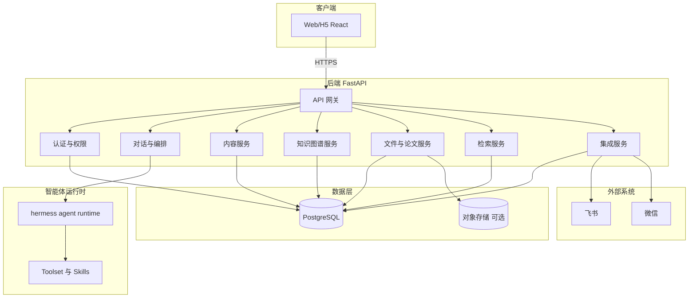
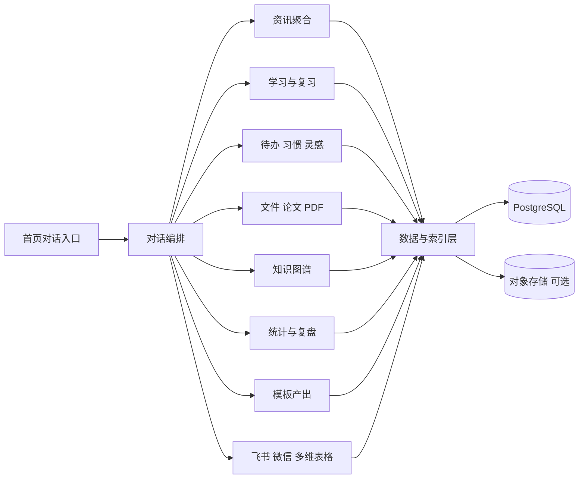
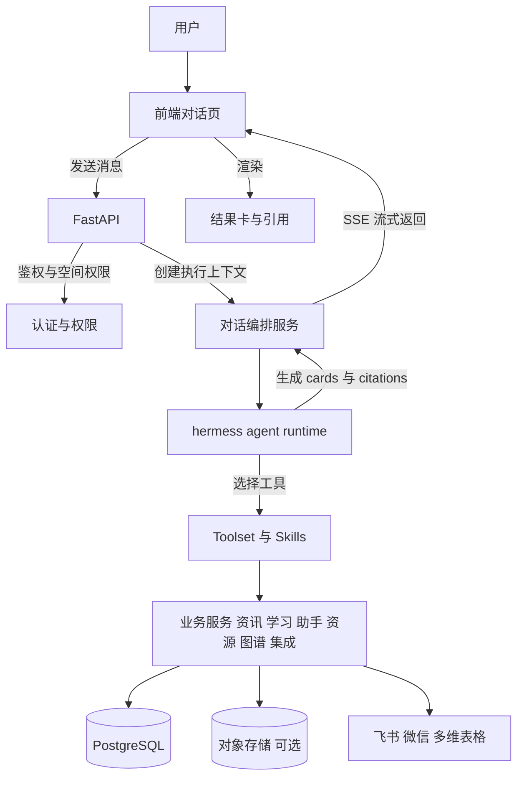
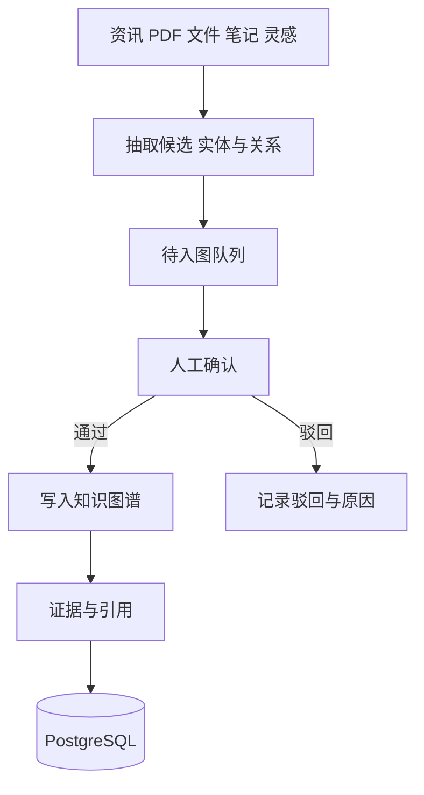
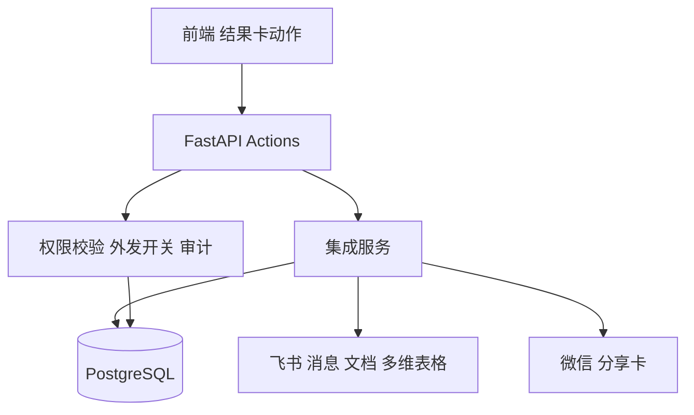

# DDUP（AI个人成长平台）技术方案（V0.1）

> 范围：基于当前产品原型 [DDUP产品原型设计.md](file:///e:/BaiduSyncdisk/%E6%B6%A6%E7%94%B5/2026.04/DDUP/DDUP%E4%BA%A7%E5%93%81%E5%8E%9F%E5%9E%8B%E8%AE%BE%E8%AE%A1.md) 设计系统技术方案；先不写代码。  
> 技术栈约束：后端 Python FastAPI；前端 React（Ant 风格，需适配移动端）；关系数据库 PostgreSQL；智能体以 hermess agent 为基础。  
> 参考：复用 [power-agent-技术方案(其他项目方案供参考).md](file:///e:/BaiduSyncdisk/%E6%B6%A6%E7%94%B5/2026.04/DDUP/power-agent-%E6%8A%80%E6%9C%AF%E6%96%B9%E6%A1%88(%E5%85%B6%E4%BB%96%E9%A1%B9%E7%9B%AE%E6%96%B9%E6%A1%88%E4%BE%9B%E5%8F%82%E8%80%83).md) 中“配置驱动/技能化/可回溯/权限与审计/可观测/弹性与隔离”等适配本项目的部分。

## 1. 目标与非目标

### 1.1 目标

- 首页以“对话”为默认入口：用户在对话中直接调用资讯/学习/助手/文件/论文/知识图谱/统计/集成能力，返回可落地的结果卡。
- 全链路可追溯：智能体输出必须带来源引用（资讯条目、PDF页码、文件片段、笔记段落等）。
- 权限与空间：个人/项目/团队空间隔离；对象级权限（读/写/分享/导出）；智能体权限边界与审计。
- 知识图谱：实体/关系/证据来源；待入图队列与人工确认；支持从对话/内容一键入图。
- 外部集成：对接飞书与微信；数据沉淀可与飞书多维表格联动（读写/同步策略/字段映射）。
- 前端适配移动端：同一 React 代码基，响应式布局（移动端优先的对话交互）。

### 1.2 非目标（V0.1）

- 不落地企业级多租户 SSO、字段级脱敏、复杂触发器编排等偏重企业平台的能力（可在后续里程碑扩展）。
- 不强依赖“K8s 每用户一个 Pod”的重隔离部署模式（保留接口以便未来升级）。

## 2. 总体架构

### 2.1 架构图（兼容版）

#### 2.1.1 逻辑分层架构图

说明（对齐参考方案的可复用思想）：
- 参考方案强调“配置驱动（SOUL/Skills/Wiki）+ 可回溯 + 权限审计 + 可观测”。本项目保留相同的能力结构，但采用“单平台服务 + 受控的 Agent Runtime”实现，先满足 MVP。
- 对话采用 SSE 流式返回；对话输出以“结构化结果卡 + 引用列表”的形式返回，前端渲染为简报卡/分析卡/术语卡/引用卡/工具卡（与原型一致）。

#### 2.1.2 功能架构图（模块视角）

#### 2.1.3 数据流图：对话调用各模块并返回结果卡

#### 2.1.4 数据流图：从内容到知识图谱（含待入图与人工确认）

#### 2.1.5 数据流图：飞书与多维表格联动 + 微信分享

### 2.2 关键技术选型

- 后端：FastAPI + Pydantic v2（接口/Schema）+ SQLAlchemy/SQLModel（任选其一）+ Alembic（迁移）
- 数据库：PostgreSQL（建议启用扩展：pg_trgm、uuid-ossp；可选 pgvector）
- 前端：React + Ant Design（Ant 风格）+ React Router + 请求层（fetch/axios）+ 状态管理（Zustand/Redux 任选其一）
- 实时：SSE（首选）/ WebSocket（可选）
- 智能体：hermess agent（运行时隔离、工具调用、记忆与技能化）
- 任务与调度：FastAPI BackgroundTasks（MVP）→ 后续可引入专用队列与调度器（可选 Redis/Celery/APScheluder）

## 3. 前端方案（React + Ant 风格，适配移动端）

### 3.1 导航与布局

- 默认首页：A1 对话页（移动端优先）
- 底部 Tab：首页/学习/助手/资源/我的
- 移动端适配策略：
  - 使用 Ant Design 的 Grid / Flex / Drawer / Modal 配合响应式断点
  - 关键交互（对话输入、快捷指令、结果卡）采用“单列 + 底部固定输入框”
  - 资源类页面（列表/详情/预览）移动端采用“列表 → 抽屉/全屏详情”模式

### 3.2 页面与组件拆分（对应原型）

- 对话首页
  - ChatThread（消息列表，支持引用展开）
  - Composer（输入框：文本/语音/附件）
  - QuickActions（横滑快捷指令/技能面板）
  - ResultCardRenderer（简报/分析/术语/引用/工具卡）
- 统计仪表盘（A5）与复盘
  - MetricsOverview、TrendCharts、HabitHeatmap
  - “发到飞书/生成分享卡片”动作
- 知识图谱
  - GraphCanvas（关系网）、EntityDrawer（实体详情）
  - PendingGraphQueue（待入图队列）
- 我的-集成与连接
  - FeishuConnect、WeChatConnect、BitableBinding、SyncPolicyEditor

### 3.3 前后端契约：结构化结果卡

对话返回既包含自然语言，也包含可渲染的卡片数据（避免“纯文本无法落地”）。

示例（概念）：
- message.text：用于阅读
- message.cards[]：用于渲染与操作
- message.citations[]：来源与证据
- message.actions[]：落地动作（入图/转待办/写入多维表格/发飞书）

## 4. 后端方案（FastAPI）

### 4.1 服务模块划分

- auth：认证、空间、角色、对象级权限、审计
- chat：会话、消息、SSE 流、结果卡协议、引用协议
- agent_runtime：hermess agent 运行时封装、会话执行锁、工具注册与沙箱
- content：资讯/术语/学习任务/待办/灵感/模板产出等业务对象
- graph：知识图谱（实体/关系/证据/待入图队列）
- files：文件上传、索引任务、预览元数据、与本地索引/全文检索接口（MVP 可只做元数据）
- integrations：飞书/微信、飞书多维表格读写、同步策略、Webhook
- search：统一搜索（结构化查询 + 全文/模糊）

### 4.2 API 设计（核心）

#### 4.2.1 对话与流式

- `POST /api/chat/sessions`：创建会话（绑定空间）
- `GET /api/chat/sessions/{id}`：会话详情
- `POST /api/chat/sessions/{id}/messages`：发送消息（非流式）
- `GET /api/chat/sessions/{id}/stream`：SSE 流式（推荐：前端发送 message_id 后建立流）

#### 4.2.2 工具调用与落地动作

- `POST /api/actions/execute`：执行卡片动作（入图/转待办/写入多维表格/发飞书等）
- `GET /api/tools`：可用工具列表（按空间权限过滤）
- `GET /api/skills`：可用技能列表（按空间、工具集过滤；对齐参考方案“渐进式加载”思想）

#### 4.2.3 内容域

- 资讯：`/api/feeds/*`
- 学习：`/api/learning/*`
- 助手（待办/习惯/灵感）：`/api/assistant/*`
- 资源（文件/论文）：`/api/resources/*`
- 模板：`/api/templates/*`

#### 4.2.4 图谱域

- `GET/POST /api/graph/entities`
- `GET/POST /api/graph/relations`
- `GET/POST /api/graph/evidences`（证据来源）
- `GET/POST /api/graph/pending`（待入图队列）

#### 4.2.5 集成域（飞书/微信/多维表格）

- `POST /api/integrations/feishu/connect`：发起授权
- `POST /api/integrations/feishu/disconnect`
- `GET /api/integrations/feishu/status`
- `POST /api/integrations/feishu/bitable/bind`：绑定 Base/表
- `POST /api/integrations/feishu/bitable/sync`：触发一次同步（手动）
- `POST /api/integrations/feishu/webhook`：接收飞书回调（校验签名）
- 微信：
  - `POST /api/integrations/wechat/share-card`：生成分享卡数据（链接/摘要/封面）
  - `POST /api/integrations/wechat/webhook`：接收回调（可选）

### 4.3 SSE 返回协议（建议）

SSE event 类型（建议）：
- `message.delta`：模型增量文本
- `card.add` / `card.update`：结构化卡片增量
- `citation.add`：来源引用
- `action.suggest`：可执行动作建议
- `error`：错误信息（可带可重试标记）
- `done`：本轮结束

## 5. 数据设计（PostgreSQL）

### 5.1 核心表概览（按域）

#### 5.1.1 空间与权限

- spaces：空间（个人/项目/团队）
- space_members：空间成员
- roles：角色（管理员/成员/访客…）
- permissions：权限项（读/写/分享/导出/智能体读写/允许学习…）
- role_bindings：角色绑定（RBAC）
- policy_rules：属性规则（ABAC，按空间/对象/敏感级等）
- audit_logs：审计日志（访问、导出、共享、智能体写入）

#### 5.1.2 对话与结果

- chat_sessions、chat_messages
- chat_cards（结构化卡片）
- chat_citations（引用）
- chat_actions（落地动作记录）

#### 5.1.3 内容域（示例）

- feeds_sources、feeds_items、feeds_tags、read_later
- terms、term_reviews（术语学习/复习）
- todos、habits、habit_logs
- ideas（灵感）、work_notes
- papers、paper_annotations、paper_notes
- templates、template_runs、template_materials

#### 5.1.4 知识图谱

- graph_entities（实体：类型/名称/属性 JSONB）
- graph_relations（关系：类型/起点/终点/属性 JSONB）
- graph_evidences（证据：指向来源对象、页码/片段、置信度）
- graph_pending（待入图：候选实体/关系、来源、状态、审核人）

#### 5.1.5 集成与同步

- integration_accounts（飞书/微信账号与授权状态）
- integration_tokens（加密存储 token/refresh token 元数据）
- bitable_bindings（空间 → Base/表）
- bitable_mappings（字段映射）
- sync_jobs（同步任务与结果）

### 5.2 数据库与检索建议

- 全文检索：对笔记/术语/论文注释使用 PostgreSQL FTS（tsvector）
- 模糊搜索：pg_trgm + GIN/GIST 索引（标题/实体名/标签）
- 图谱查询：关系表（起点/终点）建索引；常用查询（1/2 跳邻居）走 SQL
- 可选语义检索：pgvector（用于“对话召回笔记/论文要点/术语解释”）

## 6. Hermess Agent 方案（运行时、工具、技能、自学习）

### 6.1 运行时形态（推荐：受控执行）

- FastAPI 作为“对话编排与权限边界”的唯一入口。
- hermess agent 运行在后端受控运行时中：
  - 同一会话（session_id）同一时间只允许一个执行（避免并发写冲突）
  - 每次执行绑定空间（space_id），运行时只能访问该空间授权的数据与工具

并发控制建议：
- 以 `session_id` 做执行锁（数据库行锁/分布式锁均可，MVP 可用数据库行锁）
- 超时与中断：前端取消时写入 cancel 标记，运行时轮询中断

### 6.2 工具体系（Toolset）

工具按“能力域”注册，所有工具必须：
- 接受 `space_id/user_id` 作为上下文
- 在工具层再次做权限校验（防止越权）
- 返回结构化结果 + 引用证据（可为空，但需声明原因）

工具清单（与原型对齐）：
- feeds.search / feeds.summarize
- learning.create_terms / learning.schedule_review
- assistant.create_todo / assistant.update_habit
- resources.search_files / resources.import_pdf / resources.extract_annotations
- graph.propose_entities_relations / graph.write_pending / graph.commit
- integrations.feishu.send_message / integrations.feishu.write_bitable / integrations.wechat.share_card

### 6.3 Skills（技能）与配置驱动（适配参考方案）

借鉴参考方案的关键点（适配本项目）：
- Skill 以 Markdown/JSON 描述“何时用/步骤/风险/验证”，由平台存储并发布到空间（个人/项目/团队）。
- Skill 渐进式加载：列表只返回元信息，需要时再取全文，避免上下文膨胀。
- Skill 条件激活：按当前空间已授权的工具集决定是否可用（例如未连接飞书时隐藏“同步到多维表格”技能）。

### 6.4 自学习（可控）

学习信号来源：
- 用户反馈：有用/无用/纠错/禁止记忆
- 行为信号：经常使用的快捷指令、常用标签、常用空间、常写入的目标（图谱/多维表格）

学习落点（可回滚）：
- 个性化偏好（排序、默认动作）
- 自动标签建议
- 入图策略（哪些实体类型需要人工确认）
- 过滤规则建议（资讯关键词屏蔽/高亮）

控制面板（对应原型 E9）：
- 查看学习记录、逐条撤销、清空、关闭学习范围
- 严格边界：默认不把原始资料自动写到外部系统；需要显式开启

## 7. 权限与审计

### 7.1 权限模型

- RBAC：空间内角色（管理员/成员/访客）
- ABAC：基于属性的补充约束（空间类型、对象敏感级、是否允许导出、是否允许外发）
- 对象级：对某个“资讯源/论文库/文件索引范围/图谱/模板”授予读写权限

### 7.2 智能体权限边界

- 智能体的“可读范围”= 用户在该空间可读范围
- 智能体的“可写范围”= 用户可写范围 ∩ 空间允许智能体写入的范围
- 外发限制：飞书/微信推送与写入多维表格，必须有空间显式开关与审计记录

### 7.3 审计日志

审计事件（建议）：
- 用户：登录、查看、导出、分享、权限变更
- 智能体：读取对象、写入对象、写入图谱、写入多维表格、发送飞书消息
- 集成：授权/解除、Webhook 回调、同步任务结果

## 8. 飞书/微信/多维表格联动

### 8.1 飞书

能力分层：
- 授权登录/连接（OAuth）
- 消息推送：把“简报/复盘/待办提醒”发到飞书群（卡片消息）
- 文档写入：模板产出写入飞书文档（可选）
- 多维表格：作为“协作数据底座”
  - 写入：复盘摘要、学习记录、阅读笔记结构化字段
  - 读取：团队计划、任务清单、共享术语库（可选）

同步策略（默认安全）：
- 默认只同步“结构化摘要 + 引用”，不默认同步原文、PDF 内容与文件全文
- 冲突策略可配置：以多维为准 / 以 DDUP 为准 / 手动解决

### 8.2 微信

建议 MVP 定位：
- 分享卡片：把“简报/复盘/模板产出摘要”生成可分享卡片（标题、摘要、封面、链接）
- 通知（可选）：若是企业环境，可优先对接企业微信；若是个人环境，可先做“复制链接/二维码”方式

## 9. 部署与运维（MVP → 可扩展）

### 9.1 MVP 部署形态

- 单体后端（FastAPI）+ 单体前端（React）+ PostgreSQL
- 可选对象存储：用于文件/PDF/图片

### 9.2 可扩展（参考方案思想的落地路径）

- Agent Runtime 进程池：将 hermess agent 执行与 API 服务解耦（提升稳定性）
- 任务队列：处理 PDF 解析、文件索引、同步多维表格等长任务
- 观测体系：OpenTelemetry + 指标/日志/链路

## 10. 可观测性与质量

### 10.1 关键指标（建议）

- API：P95/P99 延迟、错误率、SSE 断开率
- 对话：首 token 延迟、每轮耗时、失败率、token 消耗（按空间/用户/技能）
- 工具：工具成功率、平均耗时、越权拦截次数
- 图谱：入图候选通过率、人工确认耗时
- 集成：飞书/多维同步成功率、Webhook 失败率

### 10.2 测试策略（建议）

- API 契约测试（Pydantic schema）
- 权限回归测试（对象级 + 智能体边界）
- 对话回放测试（固定输入，断言卡片/引用结构）

## 11. 里程碑（按可交付拆分）

- M1：对话首页（SSE）+ 工具框架 + 基础内容域（资讯/术语/待办）+ PG 落库
- M2：知识图谱（实体/关系/证据/待入图）+ 权限/审计
- M3：飞书连接 + 多维表格联动（写入为主）+ 微信分享卡片
- M4：文件/论文链路（导入PDF→标注→提取→入图/入模板）+ 更完整的检索
