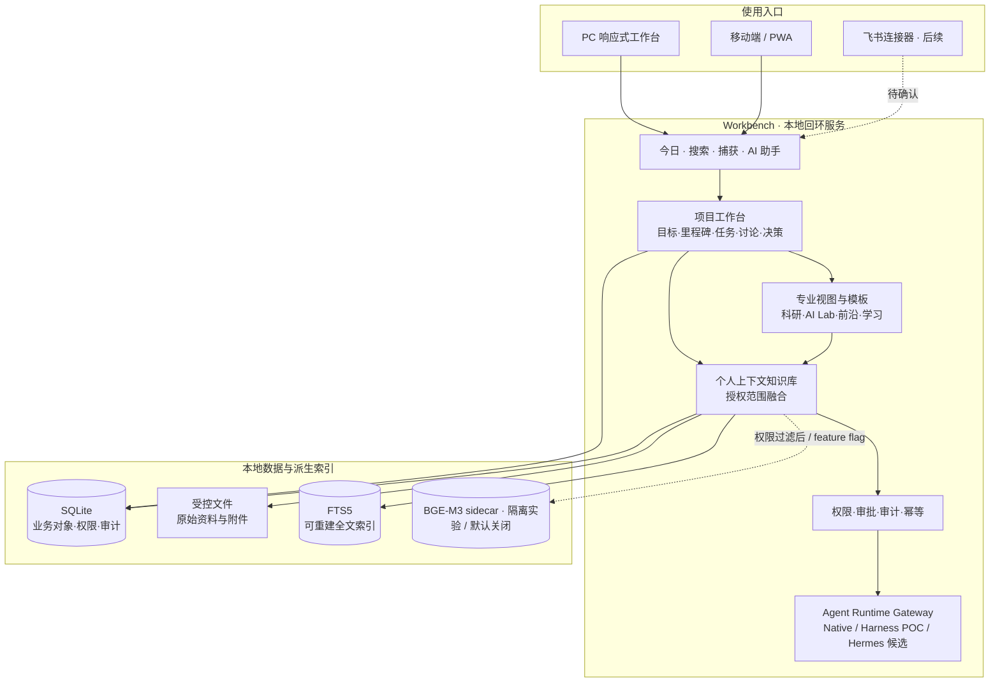
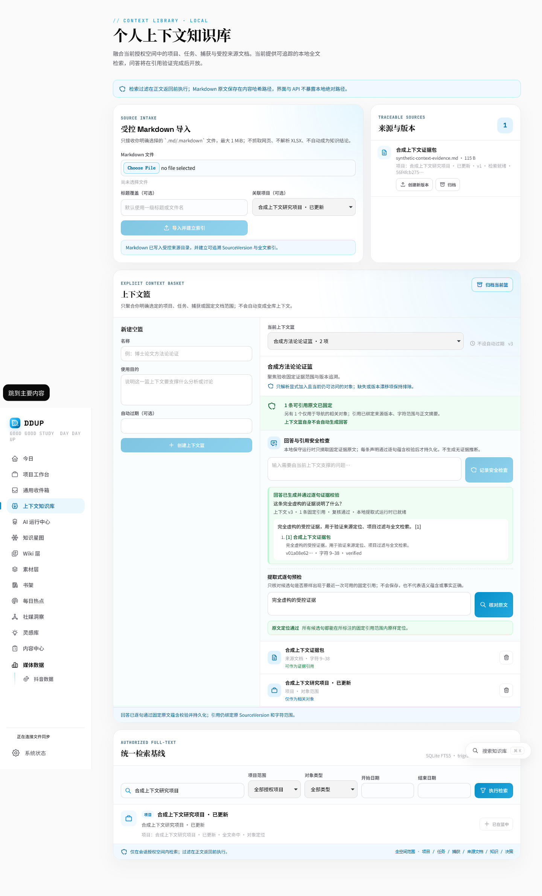
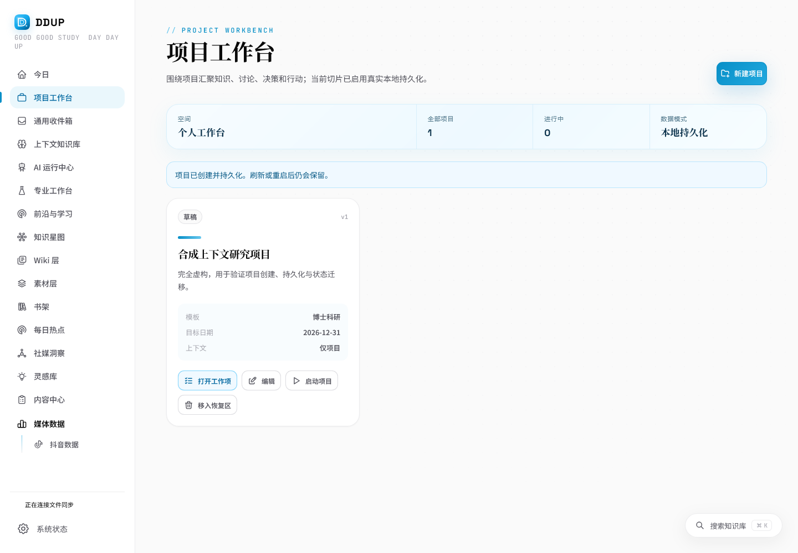
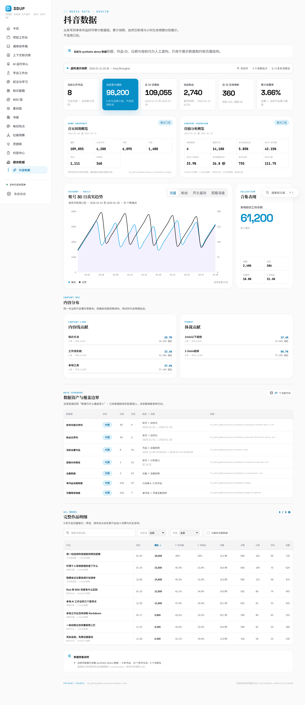

# DDUP · 个人上下文智能工作台

DDUP 是一套本地优先、来源可追溯、权限感知的个人 AI 工作台。系统以“项目”为执行骨架，以“个人上下文知识库”为统一认知层，面向科研、AI 应用探索、科技前沿跟踪、学习提升、计划复盘和个人第二大脑等长期场景。

> 当前阶段：G1–G5b 已确认。核心项目闭环、受控 Markdown、权限优先全文检索，以及 feature flag 下的受保护混合检索与 FTS 自动回退已经实现；独立合成盲测和 SourceVersion 精确 chunk 定位已通过。BGE-M3 仍是仓库外、synthetic-only、CPU 实验 sidecar，默认关闭。重排、引用问答、DeepSeek Harness 与 Hermes 尚未接入，不应视为现有生产能力。

## 一、产品目标

DDUP 重点解决四类问题：

1. 将分散文档、任务、讨论、决策和复盘放到同一项目链路中；
2. 在全部授权项目和专业模块中统一检索，同时保留来源、版本和定位；
3. 让 AI 产物有证据、有范围、有审批，不直接污染长期知识；
4. PC 承担完整工作，移动端和后续飞书连接器承担当日执行、捕获、讨论和复盘。

## 二、总体框架



### 核心数据原则

- Workbench 持有项目、知识、权限、审批和审计真源；
- 项目工作台是通用业务底座，科研、AI 应用和学习提升以模板与专业视图扩展；
- 原始资料由受控文件保存，结构化对象由 SQLite 保存，全文/向量/图谱均为可重建派生数据；
- 个人上下文知识库逻辑访问全部授权内容，但不复制项目真源、不绕过空间权限；
- 一个 Agent Run 只有一个主 Runtime，Runtime 内部记忆只能产生待确认候选；
- 外部发送、发布、删除、权限变更和长期知识写入必须显式确认并审计。

## 三、功能状态

| 领域 | 当前能力 | 状态 |
|---|---|---|
| 项目工作台 | Project、Milestone、Task 持久化；状态机、版本、幂等和审计 | 已实现首版 |
| 讨论与决策 | 人工讨论记录，明确确认后原子转 Decision + Task | 已实现首版 |
| 捕获收件箱 | 虚构文本和 HTTP(S) 链接持久化；不自动抓取、不自动晋升知识 | 已实现安全子集 |
| 今日与复盘 | 最多三项任务聚焦、任务真源同步、日终复盘 | 已实现首版 |
| 受控来源 | 虚构 Markdown 导入、SHA-256 文件真源、SourceVersion、Document | 已实现首版 |
| 上下文检索 | Project/Task/Capture/Document 统一 FTS5，空间/项目/类型/日期过滤 | 已实现首版 |
| 混合与向量检索 | 权限前置、确定性意图拦截、稳定 chunk/字符定位、校准阈值、RRF、sidecar 身份校验与 FTS 回退 | 合成盲测通过，实验切片默认关闭；BGE-M3 不进入生产依赖 |
| 引用问答 | 固定来源版本、逐条 Citation、无依据拒答 | 设计中；生成式回答继续关闭，需后续安全门 |
| 媒体数据 | 可扩展渠道父级；抖音数据作为首个子项和合成演示面板 | 导航与抖音子页已实现 |
| 科研 / AI Lab / 前沿 / 学习 | 产品设计、原型页面与项目模板路线 | 原型/设计方案 |
| DeepSeek Harness | 只读隔离 Runtime POC 候选 | `poc_not_connected` |
| Hermes | 可选 Runtime / 消息网关候选 | `candidate_not_connected` |
| 飞书 / 移动连接器 | 高频捕获、任务、讨论、提醒和复盘 | 后续计划 |

## 四、界面预览

### 个人上下文知识库



### 项目工作台



### 媒体数据 / 抖音



更多 PC 与移动端截图见 [`research/screenshots/workbench-mvp/`](research/screenshots/workbench-mvp/)。

## 五、本地运行

### 环境要求

- Node.js `>=24.15.0 <25`；
- npm；
- Windows 或 Linux；
- 默认只允许本机回环访问，不应改为局域网或公网监听。

### 启动

```bash
cd person_dashboard-main/Workbench
npm install
npm run dev
```

默认地址：

- 首页：<http://127.0.0.1:5173/>
- 项目工作台：<http://127.0.0.1:5173/projects>
- 今日与复盘：<http://127.0.0.1:5173/today>
- 上下文知识库：<http://127.0.0.1:5173/context>
- 产品原型：<http://127.0.0.1:5173/prototype>

### 发布门

```bash
cd person_dashboard-main/Workbench
npm test
npm run build
npm run privacy:scan
```

当前验证快照：Node 24.19，完整测试 203/203、独立生产构建和隐私扫描通过；最近一次 UI E2E 为 Playwright Chromium 1/1。受保护混合检索另有仓库外 BGE-M3 回环冒烟及独立合成盲测证据。构建存在主包大于 500 kB 的非阻塞提示，后续需要路由拆包和字体裁剪。

## 六、仓库结构

```text
DDUP/
├─ person_dashboard-main/
│  ├─ Workbench/              # 可运行 React/Vite/Fastify 应用、测试与契约
│  └─ 个人知识库/             # 明确标记的虚构演示知识库
├─ product/                   # 产品、架构、Spec、ADR、计划与确认记录
├─ research/                  # 项目分析、竞品调研和最终截图证据
├─ .github/workflows/         # Windows/Linux CI
├─ AGENTS.md                  # 仓库级开发、安全和验证规则
└─ README.md                  # 项目总览与文档入口
```

## 七、文档中心

### 产品与路线

- [需求分析与产品设计](product/个人上下文智能工作台_需求分析与产品设计.md)
- [UI 原型与功能 Spec](product/个人上下文智能工作台_UI原型与功能Spec.md)
- [实施任务计划](product/个人上下文智能工作台_实施任务计划.md)
- [MVP 范围与验收标准](product/MVP范围与验收标准.md)
- [需求追溯矩阵](product/需求追溯矩阵.md)
- [MVP 垂直切片验收报告](product/MVP垂直切片验收报告.md)

### 架构、数据与安全

- [系统架构与技术选型](product/系统架构与技术选型.md)
- [领域模型与数据字典](product/领域模型与数据字典.md)
- [API 与事件契约](product/API与事件契约.md)
- [权限、安全与审计设计](product/权限安全与审计设计.md)
- [Agent Runtime 与工具契约](product/AgentRuntime与工具契约.md)
- [知识库检索与引用设计](product/知识库检索与引用设计.md)
- [检索评测基线报告](product/检索评测基线报告.md)
- [架构决策记录 ADR 索引](product/ADR/README.md)

### Runtime 与专项评估

- [DeepSeek Harness 与 Hermes 融合方案](product/Agent运行时融合方案_DeepSeek_Harness与Hermes.md)
- [DeepSeek Harness 项目适用性评估](research/DeepSeek_Harness_项目适用性评估.md)
- [Hermes Agent 项目适用性评估](research/Hermes_Agent_项目适用性评估.md)
- [个人 AI 助手与知识库调研报告](research/个人AI助手与知识库调研报告.md)

### 工程证据与待确认项

- [工程现状与基线报告](product/工程现状与基线报告.md)
- [Node SQLite 可靠性 Spike](product/Node_SQLite可靠性Spike报告.md)
- [Fastify 与 Playwright 依赖审查](product/Fastify与Playwright依赖审查.md)
- [旧版 XLSX 导入依赖处置（待确认）](product/旧版XLSX导入依赖处置_待确认.md)
- [模型与推理运行时依赖审查（G5a-D 已确认）](product/模型与推理运行时依赖审查.md)
- [FlagEmbedding 依赖元数据解析报告](product/FlagEmbedding依赖元数据解析报告.md)
- [模型 POC 实际下载授权（G5a-DL 已确认）](product/模型POC实际下载授权.md)
- [BGE-M3 隔离 POC 运行报告](product/BGE-M3隔离POC运行报告.md)
- [BGE-M3 独立合成盲测与阈值校准报告](product/BGE-M3独立合成盲测与阈值校准报告.md)
- [AI 评测方案与检索评测报告（G5b 已确认）](product/AI评测方案与检索评测报告.md)

文档中的能力状态统一使用“已实现、原型演示、设计方案、POC 候选、后续计划”。没有代码、测试和运行证据的能力不得描述为已集成或生产可用。

## 八、后续路线

1. 受保护 Hybrid SearchProvider 已按 G5b 落地但默认关闭；正式检索继续以 FTS 为稳定基线；
2. 扩展长文档、噪声和边界合成集，验证窄阈值间隔与持续运行资源，不下载 reranker；
3. 通过更强提示注入、引用、泄漏、回退和资源门后，再单独确认生成式引用问答；
4. 随后进入 Native Runtime、Tool Gateway、Harness/Hermes POC 和移动连接器阶段。

## 九、隐私与发布边界

- 仓库只允许明确标记的虚构演示数据；
- 不得提交真实账号、公司资料、消息、浏览记录、凭据、密钥、运行数据库和私人本地路径；
- 浏览器 Profile、依赖目录、构建产物、源 ZIP 和运行状态已由 `.gitignore` 排除；
- 当前版本在许可证和发布门完全统一前，仅用于本地开发、研究与内部演示。
