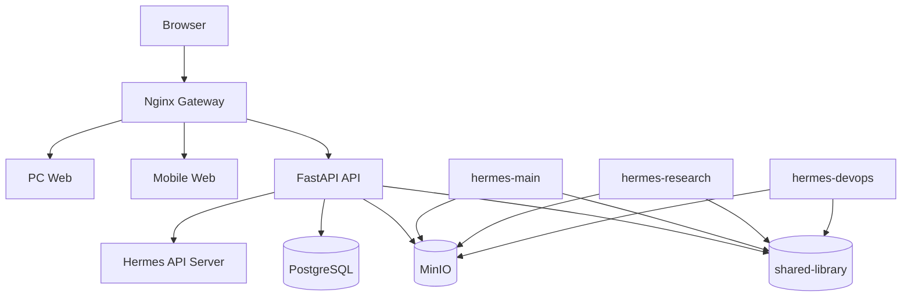

# 当前部署拓扑

## 1. 适用范围

本文描述当前 DDUP 与 Hermes 多实例协同的推荐部署拓扑，重点覆盖：

- 前端网关与双端分流
- API 与 shared-library 的连接关系
- Hermes 实例、MinIO、数据库之间的数据通路
- 当前实现与目标态之间的关键差距

## 2. 当前目标拓扑图

## 3. 服务说明

| 服务 | 当前文件 | 端口 / 路径 | 作用 |
| --- | --- | --- | --- |
| `gateway` | `infra/docker-compose.prod.yml` + `infra/nginx/nginx.conf` | `80` | 统一入口，按 User-Agent 分流 PC / Mobile，并代理 `/api/*` |
| `pc` | `apps/pc` | 容器内 `80` | PC 前端站点 |
| `mobile` | `apps/mobile` | 容器内 `80` | 移动端前端站点 |
| `api` | `apps/api` | `8000` | DDUP 后端与 Hermes 治理接口 |
| `minio` | `infra/docker-compose.prod.yml` | `9000` / `9001` | 对象存储与控制台 |
| Hermes 实例 | 外部 Docker / Server / LXC | 依实例而定 | 负责多实例任务执行、共享技能、共享记忆 |
| `shared-library` | 仓库目录 | 文件挂载 | 注册表、memory-ext、输出索引、wiki 原始区 |

## 4. 关键数据流

### 4.1 前端访问流

1. 浏览器进入 `gateway`
2. 网关按 `User-Agent` 选择 `pc` 或 `mobile`
3. 所有 `/api/*` 请求转发到 `api`
4. Hermes 管理台通过 `/api/hermes/*` 读取共享库状态

### 4.2 Hermes 协同流

1. Hermes 实例通过 `DDUP_PATH` 访问同一份 `shared-library`
2. 小型文本、注册表、memory-ext 走 Git 目录
3. 大文件与归档附件走 MinIO
4. API 负责将共享库状态聚合成产品可消费数据

### 4.3 Wiki / 归档流

1. 原始知识先进入 `shared-library/wiki/_raw/{instance-id}`
2. 编译器再将内容合并到 `wiki/compiled`
3. Cron 归档写入 `shared-library/outputs/{instance-id}/cron-archives/`
4. 全局索引更新到 `shared-library/outputs/.index.json`

## 5. 当前实现差距

| 编号 | 当前问题 | 影响 | 建议 |
| --- | --- | --- | --- |
| D1 | `apps/api/Dockerfile` 只复制 `app/`，没有把 `shared-library` 带进镜像 | 容器内 Hermes 治理 API 可能读不到共享库 | 将 API 镜像构建上下文切到仓库根，或通过卷挂载提供 `shared-library` |
| D2 | `infra/docker-compose.prod.yml` 没给 `api` 配置 `DDUP_PATH` | 后端只能回退到默认路径，容器内高概率失效 | 为 `api` 明确传入 `DDUP_PATH=/opt/ddup` 等值 |
| D3 | `api` 服务没有挂载仓库内 `shared-library` | `/api/hermes/*` 的运行基础不完整 | 在 Compose 中为 `api` 增加 shared-library 只读挂载 |
| D4 | GitHub Actions 只构建和重启 `pc/mobile/gateway` | API 与共享库升级无法依赖同一条流水线 | 将 `api` 与必要配置同步纳入发布流程 |
| D5 | GitHub Actions 监听 `main`，而当前仓库主分支是 `master` | 自动发布不会触发 | 统一分支命名或修正 workflow |

## 6. 推荐部署收口

### 6.1 Compose 层

建议在 `api` 服务增加：

- `DDUP_PATH`
- `shared-library` 挂载
- 如有需要，`wiki-vault` 与对象存储凭证统一由 `.env` 驱动

### 6.2 镜像层

建议二选一：

- 方案 A：API 镜像只保留应用代码，运行时挂载 `shared-library`
- 方案 B：API 镜像基于仓库根构建，同时复制 `shared-library` 只读内容

优先推荐方案 A，因为共享库属于运行时状态，不宜频繁烘焙入镜像。

### 6.3 发布层

建议将流水线拆成两段：

- 前端与网关发布：`pc`、`mobile`、`gateway`
- API 与共享治理发布：`api`、`infra`、必要文档与 shared-library 配置

## 7. 验证清单

- `gateway` 能访问 `pc`、`mobile` 与 `/api/healthz`
- `api` 容器内可以读取 `DDUP_PATH/shared-library/registry/instances.json`
- `/api/hermes/overview`、`/api/hermes/instances` 返回 200
- MinIO 存活探针正常
- Hermes 实例能访问同一份 `shared-library`
- `outputs/.index.json` 与 `wiki/_raw` 至少存在可读目录结构