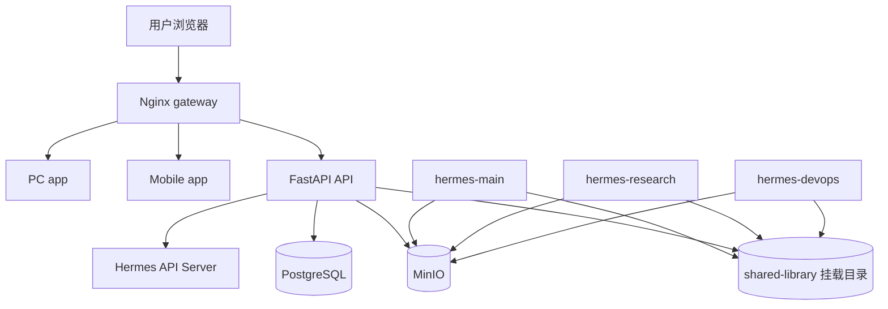

# Hermes 多实例协同审计

## 1. 审计范围

本报告基于以下两份方案文档与当前仓库实现进行交叉审计：

- `docs/hermes-instance-setup.md`
- `docs/hermes-shared-library-implementation.md`

本次审计覆盖四层：

- 前端渲染层：`apps/web`、`apps/pc`、`apps/mobile`
- 共享前端层：`packages/shared`
- 后端服务层：`apps/api`
- 共享库与自动化层：`shared-library`、`tools`

## 2. 方案基线

### 2.1 多实例协同核心原则

| 原则 | 方案要求 | 当前结论 |
| --- | --- | --- |
| 实例身份优先 | 每个 Hermes 必须先声明 `HERMES_INSTANCE_ID`，再接入 shared-library、MinIO 与共享技能 | 已在注册表与脚本层体现，产品层未完全校验 |
| shared-library 为事实源 | Git 保存注册表、技能、小文件和 memory-ext；对象存储保存大文件与归档 | 部分实现，产品层只读能力多于写能力 |
| 三层记忆模型 | 内置 Memory、实例私有 `memory-ext`、共享 `memory-ext/shared` 协同工作 | 脚本层已实现，API/UI 只做了展示与搜索 |
| 生命周期闭环 | Bootstrap -> Operate -> Archive -> Evolve | 页面与 API 只覆盖 Bootstrap/Operate 的只读巡检 |
| 脚本能力产品化 | `memory-ext`、`cron-archive`、`storage-client`、`wiki-write`、`cross-instance-query` 应转成正式 API 与 UI | 尚未完成，是当前主缺口 |

### 2.2 共享库接口规范

| 接口 | 方案职责 | 当前状态 |
| --- | --- | --- |
| `memory-ext-client` | `save/query/migrate/status`，支持 `self/shared/all` 检索 | 脚本已实现，后端未包装正式写接口 |
| `cron-archive` | 归档 Cron 产出并更新 `shared-library/outputs/.index.json` | 技能已登记，业务链路未打通 |
| `storage-client` | 统一对象存储上传、下载、列举、预签名 | 技能已登记，产品端未接入 |
| `wiki-write` | 将原始知识写入 `wiki/_raw/{instance-id}` | 方案与技能已存在，UI/API 未接入 |
| `cross-instance-query` | 统一搜索 `outputs/memory/wiki/cron` | 脚本已实现，后端搜索能力不完整 |
| `register_instance` | 自动更新 `instances.json` 并创建目录、`SOUL.md`、初始记忆 | 工具已实现，未纳入后台管理动作 |

### 2.3 生命周期管理策略

| 阶段 | 方案要求 | 当前状态 |
| --- | --- | --- |
| Bootstrap | 检查 `DDUP_PATH`、`HERMES_INSTANCE_ID`、存储连接、技能安装 | 后端和脚本层部分支持，部署层仍有缺口 |
| Operate | 统一查询共享库，按规则写入记忆、Wiki、归档 | 只读巡检已实现，写入编排未实现 |
| Archive | 结构化产出归档至 `outputs` / MinIO 并维护索引 | 索引目录存在，但当前 `.index.json` 基本为空 |
| Evolve | 新实例自动注册，创建目录与共享技能安装入口 | CLI 工具已实现，管理台没有动作入口 |

## 3. 当前落地总览

### 3.1 已完成

| 模块 | 当前实现 |
| --- | --- |
| 统一 Hermes 管理入口 | 三端已挂载 `/me/hermes`，并复用 `packages/shared` 页面 |
| 统一管理 UI | `packages/shared/src/pages/HermesAdminPage.tsx` 已实现只读治理台 |
| 只读治理 API | `apps/api/app/api/hermes.py` 已提供 overview、blueprint、instances、skills、search |
| shared-library 读取 | `apps/api/app/services/hermes_registry.py` 已读取注册表、技能清单、memory-ext、outputs |
| 共享技能与脚本 | `memory-ext-client`、`cross-instance-query`、`register_instance` 等已存在 |

### 3.2 未完成

| 模块 | 缺口 |
| --- | --- |
| 正式写接口 | 没有把 `memory-ext`、`wiki-write`、`cron-archive`、`register_instance` 暴露成后台 API |
| 数据契约统一 | `status`、`capabilities` 在注册表、后端、前端之间不一致 |
| 归档链路 | `outputs/.index.json` 未形成稳定业务数据 |
| 权限与脱敏 | 后端搜索未完整执行只读摘要和更细粒度裁剪 |
| 运维闭环 | 生产 Compose、Dockerfile、GitHub Actions 与 Hermes 方案仍存在漂移 |

## 4. 对照清单与冲突点

### 4.1 前端渲染层

| 方案要求 | 当前文件 | 结论 | 冲突或缺失 |
| --- | --- | --- | --- |
| 统一 Hermes 管理页 | `packages/shared/src/pages/HermesAdminPage.tsx` | 已完成第一版 | 当前仍是只读治理台，没有注册实例、写记忆、写 Wiki、归档任务等动作 |
| 三端统一入口 | `apps/web|pc|mobile/src/App.tsx`、`apps/*/src/pages/HermesPage.tsx` | 已完成 | 页面复用正确，但功能覆盖面仍不足 |
| 精简美观、便于展示与轻操作 | `packages/shared/src/pages/HermesAdminPage.tsx`、`MeWorkspacePage.tsx` | 部分完成 | 已具备 MD3 风格和统一入口，但缺少真正的轻操作能力 |
| 契约一致展示实例能力 | `packages/shared/src/lib/hermes.ts`、`HermesAdminPage.tsx` | 未完成 | 前端把 `capabilities` 定义为 `string[]`，而注册表实际是对象结构 |

### 4.2 后端服务层

| 方案要求 | 当前文件 | 结论 | 冲突或缺失 |
| --- | --- | --- | --- |
| 用正式 API 包装脚本能力 | `apps/api/app/api/hermes.py` | 未完成 | 当前只有只读接口，没有写入型动作接口 |
| 统一读取 shared-library | `apps/api/app/services/hermes_registry.py` | 部分完成 | 已读取 registry、skills、memory-ext、outputs，但未整合 wiki/cron 正式查询契约 |
| 生命周期校验 | `apps/api/app/core/config.py`、`hermes_registry.py` | 部分完成 | 读取了 `DDUP_PATH`，但部署侧没有保证容器能访问 shared-library |
| 脱敏与权限控制 | `hermes_registry.py` | 未完成 | 部署字段有基础裁剪，但搜索结果未按隔离策略做统一摘要控制 |

### 4.3 共享库与脚本层

| 方案要求 | 当前文件 | 结论 | 冲突或缺失 |
| --- | --- | --- | --- |
| `memory-ext-client` 支持分层检索 | `shared-library/registry/published/memory-ext-client/scripts/memory_ext.py` | 已完成 | 未通过后端 API/前端 UI 暴露 |
| `cross-instance-query` 支持 `outputs/memory/wiki/cron` | `shared-library/registry/published/cross-instance-query/scripts/cross_query.py` | 已完成 | 后端 `/api/hermes/search` 仍是降级版搜索 |
| 自动注册新实例 | `tools/register_instance.py` | 已完成 | 仍是 CLI，不在产品操作链路中 |
| 归档索引持续维护 | `shared-library/outputs/.index.json` | 未完成 | 当前目录在，但业务数据空，说明归档链路未稳定运行 |

### 4.4 关键冲突清单

| 编号 | 冲突点 | 影响 | 优先级 |
| --- | --- | --- | --- |
| C1 | 注册表 `status` 为 `active`，前端色值和后端统计以 `online` 为主 | 在线实例统计和状态展示不准确 | P0 |
| C2 | 注册表 `capabilities` 是对象，前端 SDK 定义为 `string[]` | 实例能力无法正确渲染与扩展 | P0 |
| C3 | `cross-instance-query` 脚本支持 wiki/cron，但 `/api/hermes/search` 没有完整覆盖 | UI 看到的搜索结果不完整 | P0 |
| C4 | `apps/web/src/lib/api.ts` 与 `packages/shared/src/lib/api.ts` 重复 | 前端基础 API 层分叉，后续维护风险高 | P1 |
| C5 | `apps/api/Dockerfile` 只复制 `app/`，生产 `compose` 也没有给 API 挂载 `shared-library` 或设置 `DDUP_PATH` | 容器内 `/api/hermes/*` 很可能拿不到共享库数据 | P0 |
| C6 | `.github/workflows/deploy.yml` 监听 `main`，仓库当前分支为 `master` | 自动部署不会被当前主分支触发 | P0 |
| C7 | GitHub Actions 只部署 `pc/mobile/gateway`，未覆盖 `api` 与 shared-library 变更 | Hermes 后端与共享库升级无法靠同一条流水线完成 | P1 |
| C8 | 归档、Wiki、实例注册等能力停留在脚本层，没有纳入审计日志与权限控制 | 方案要求与产品化能力断裂 | P0 |

## 5. 重构计划

### 5.1 P0：先收口契约与运行时基线

| 动作 | 文件 | 目标 |
| --- | --- | --- |
| 新增 Hermes 统一数据模型 | `apps/api/app/schemas/hermes.py` | 定义实例、能力、状态、搜索结果、管理动作请求体 |
| 规范化注册表读取 | `apps/api/app/services/hermes_registry.py` | 统一 `status`、`capabilities`、权限裁剪、wiki/cron 搜索 |
| 扩展 Hermes API | `apps/api/app/api/hermes.py` | 增加注册实例、写 memory-ext、写 Wiki raw、触发归档等正式动作接口 |
| 统一前端类型 | `packages/shared/src/lib/hermes.ts` | 用对象结构表达 `capabilities`，同步后端模型 |
| 修正管理台展示 | `packages/shared/src/pages/HermesAdminPage.tsx` | 将只读巡检升级为巡检 + 轻操作 |
| 修正容器访问 shared-library | `apps/api/Dockerfile`、`infra/docker-compose.prod.yml` | 确保 API 容器能读取 `shared-library` 与 `DDUP_PATH` |
| 修正 CI 触发分支与部署目标 | `.github/workflows/deploy.yml` | 让 `master` 生效，并覆盖 `api` 相关升级 |

### 5.2 P1：把脚本能力产品化

| 动作 | 文件 | 目标 |
| --- | --- | --- |
| 新增脚本包装服务 | `apps/api/app/services/hermes_actions.py` | 统一调用 `memory_ext.py`、`cross_query.py`、`register_instance.py` |
| 新增动作测试 | `apps/api/tests/test_hermes_actions.py` | 验证注册实例、记忆写入、搜索、归档等动作 |
| 收口重复 API 工具 | 删除或迁移 `apps/web/src/lib/api.ts` | 统一走 `packages/shared/src/lib/api.ts` |
| 补齐 UI 操作面板 | `packages/shared/src/pages/HermesAdminPage.tsx` | 增加实例注册抽屉、记忆写入弹窗、Wiki/归档操作卡片 |

### 5.3 P2：强化治理与生命周期可视化

| 动作 | 文件 | 目标 |
| --- | --- | --- |
| 新增任务状态面板 | `packages/shared/src/pages/HermesAdminPage.tsx` 或 `packages/shared/src/components/hermes/*` | 显示 wiki 编译、归档、存储生命周期任务状态 |
| 增加权限与脱敏规则 | `apps/api/app/services/hermes_registry.py`、`shared-library/config/isolation-rules.json` | 将他实例只读摘要正式落实到 API 层 |
| 增加升级与运维检查页 | `packages/shared/src/pages/MeWorkspacePage.tsx` | 统一展示环境变量、索引完整性、归档状态、升级建议 |

## 6. 与用户任务的对应结论

| 任务项 | 当前结论 |
| --- | --- |
| 1. 建立代码与方案对照清单 | 本文第 4 节已完成 |
| 2. 制定重构计划 | 本文第 5 节已完成 |
| 3. 引入统一 Hermes 管理 UI | 已完成第一版，只读治理台已落地，下一步应升级为轻操作管理台 |
| 4. 前端便捷显示与简单操作 | 展示层已初步完成，操作层未完成 |
| 5. 输出结构图、依赖图、部署拓扑与升级手册 | 本文第 7 节与配套文档已覆盖 |

## 7. 图示输出

### 7.1 优化后的代码结构图

```mermaid
flowchart TD
    A[apps/web | apps/pc | apps/mobile] --> B[packages/shared]
    A --> C[apps/api]
    B --> D[shared UI pages]
    B --> E[shared Hermes SDK]
    C --> F[app/api/hermes.py]
    C --> G[app/services/hermes_registry.py]
    C --> H[future hermes_actions.py]
    G --> I[shared-library/registry]
    G --> J[shared-library/memory-ext]
    G --> K[shared-library/outputs]
    G --> L[shared-library/wiki]
    H --> M[tools/register_instance.py]
    H --> N[published skills scripts]
```

### 7.2 优化后的依赖关系图

```mermaid
flowchart LR
    UI[HermesAdminPage / MeWorkspacePage] --> SDK[packages/shared/src/lib/hermes.ts]
    SDK --> API[/api/hermes/*]
    API --> RegistryService[hermes_registry]
    API --> ActionService[future hermes_actions]
    RegistryService --> Registry[instances.json]
    RegistryService --> Skills[skills-manifest.json]
    RegistryService --> Memory[memory-ext/*]
    RegistryService --> Outputs[outputs/.index.json]
    RegistryService --> Wiki[wiki/_raw + compiled]
    ActionService --> Register[register_instance.py]
    ActionService --> MemorySkill[memory_ext.py]
    ActionService --> QuerySkill[cross_query.py]
    ActionService --> ArchiveSkill[cron-archive]
```

### 7.3 优化后的部署拓扑图



更详细的部署说明见：`docs/architecture/deployment-topology-current.md`

## 8. 审计结论

当前代码已经完成了统一入口 + 只读治理台 + 共享库读取的第一阶段落地，但距离方案定义的多 Hermes 实例协同产品化还有三个关键断点：

1. 数据契约尚未统一，`status` 与 `capabilities` 已形成显式冲突。
2. 脚本能力尚未产品化，写接口、审计、权限与轻操作 UI 还没接上。
3. 部署与流水线仍有运行时缺口，尤其是 API 容器的 `shared-library` 可见性和 CI 触发分支配置。

建议按 P0 -> P1 -> P2 顺序推进，而不是继续堆叠新的只读展示页面。