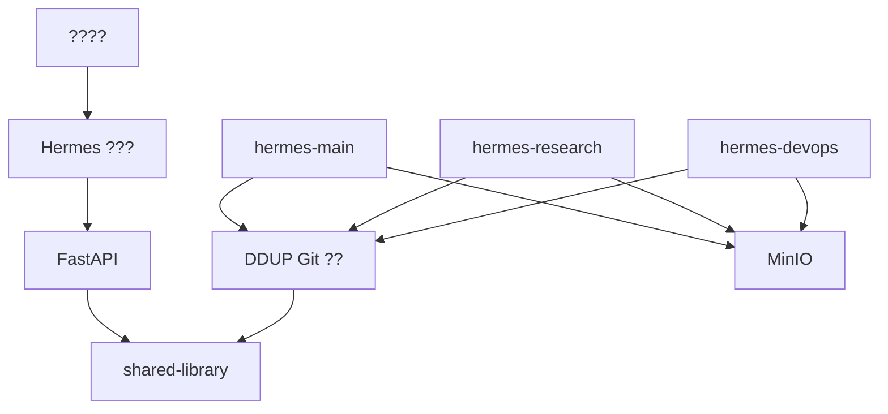

# ? Hermes ???????????

## 1. ??????

### 1.1 ??????

1. ????????? Hermes ??? `HERMES_INSTANCE_ID`?????????MinIO ? shared-library?
2. ????????Git ?????????????????memory-ext?MinIO ???????????
3. ???????Hermes ?? Memory????? `memory-ext/<instance-id>`??? `memory-ext/shared` ?????
4. ????????Bootstrap -> Operate -> Archive -> Evolve?????????????????
5. ???????`memory-ext`?`cron-archive`?`storage-client`?`wiki-write`?`cross-instance-query` ?????????????????
6. ???????????????????????????????????????

### 1.2 ???????

| ?? | ?? | ???? | ???? |
| --- | --- | --- | --- |
| `memory-ext` | ?????? | `save/query/migrate/status`?? `shared` / `self` / `all` ????? | ???? |
| `cron-archive` | Cron ???? | ??????? `outputs/{instance}/cron-archives` ? `.index.json` | ???????? |
| `storage-client` | ????? | ?? `upload/download/list/presign`?????????? | ???????? |
| `wiki-write` | ?????? | ?? `wiki/_raw/{instance-id}`???????? | ???? |
| `cross-instance-query` | ????? | ??? `outputs/memory/wiki/cron`??????? | ???? |
| `register_instance` | ????? | ?? `instances.json`????????? `SOUL.md/README.md` | ???? |

### 1.3 ????????

| ?? | ?? | ??? |
| --- | --- | --- |
| Bootstrap | ??????????? | `DDUP_PATH`?`HERMES_INSTANCE_ID`???? MinIO ?? |
| Operate | ?????? | ??? `git pull`??????????? raw/wiki/memory |
| Archive | ????????? | `outputs/.index.json` ???????????????? |
| Evolve | ???/????? | ????????????????????? |

### 1.4 ?????

- P0?? `memory-ext` / `cross-query` / `register-instance` ????? API?
- P0????? Hermes ????
- P1?? Wiki ???Cron ?????????????????????
- P1?????????????????
- P2?????? UI ?????? `packages/shared`?

## 2. ????????

### 2.1 ?????

| ?? | ?? | ?? |
| --- | --- | --- |
| Wiki Raw ?? | ??? | `wiki.capture_raw` ????????? Vault `_raw` |
| Wiki ???? | ??? | ???? Wiki ??????? |
| ????? | ????? | `shared-library/registry/instances.json` ??? |
| shared-library ?? | ???? | `memory_ext.py`?`cross_query.py`?`register_instance.py` ??? |

### 2.2 ???????

| ?? | ?? | ?? | ?? |
| --- | --- | --- | --- |
| ????? | `apps/api/app/api` | ???? Hermes ???? API | ???????????????? |
| ????? | `apps/api/app/core/config.py` | ??????? `DDUP_PATH` | ?????????????????? |
| ?????? | `shared-library/registry/published/*/scripts` | ???????????? | ??????????? |
| ????? | `apps/web|pc|mobile` | ????? Hermes ??? | ????????????????? |
| ????? | ???? | ???????? | ???? Hermes ????? |
| ?????? | Cron / Storage / Wiki ?? | ???????????????? | ?????????? |

## 3. ??????

### 3.1 ????

| ?? | ?? |
| --- | --- |
| `apps/api/app/services/hermes_registry.py` | ??????????????????????????? |
| `apps/api/app/api/hermes.py` | ?? `/api/hermes/*` ?????? |
| `packages/shared/src/lib/hermes.ts` | ???? Hermes API SDK |
| `packages/shared/src/pages/HermesAdminPage.tsx` | ???? Hermes ??? |
| `apps/*/src/pages/HermesPage.tsx` | ???????? |
| `apps/api/tests/test_hermes_api.py` | Hermes API ?????? |

### 3.2 ????

| ?? | ?? |
| --- | --- |
| `apps/api/app/api/__init__.py` | ?? Hermes ?? |
| `apps/api/app/core/config.py` | ?? `ddup_path` ??? |
| `apps/api/.env.example` | ?? `DDUP_PATH` ?? |
| `.env.prod.example` | ???? `DDUP_PATH` ?? |
| `apps/web/src/App.tsx` / `apps/pc/src/App.tsx` / `apps/mobile/src/App.tsx` | ?? `/me/hermes` ?? |
| `apps/*/src/pages/MePage.tsx` | ?????????? |
| `apps/web/vite.config.ts` | ?? `@ddup/shared` ???? |

### 3.3 ??????/??

- ? `apps/web` ??? `lib/api.ts` ???????????? `packages/shared`?
- ? `memory-ext`?`cross-query` ?????????????????????????????????
- ? `wiki_compiler.py` ???????????????????

## 4. ?????????

```mermaid
flowchart TD
    A[apps/web | apps/pc | apps/mobile] --> B[packages/shared]
    A --> C[apps/api]
    C --> D[app/api/hermes.py]
    D --> E[app/services/hermes_registry.py]
    E --> F[shared-library/registry]
    E --> G[shared-library/memory-ext]
    E --> H[shared-library/outputs]
    E --> I[docs blueprint]
```

## 5. ?????

```mermaid
flowchart LR
    UI[HermesAdminPage] --> SDK[shared lib hermes.ts]
    SDK --> API[/api/hermes/*]
    API --> Service[hermes_registry service]
    Service --> Registry[instances.json / skills-manifest.json]
    Service --> Memory[memory-ext/*]
    Service --> Outputs[outputs/.index.json]
    Service --> Blueprint[??????]
```

## 6. ?????



## 7. ??????

- ?????????? + ?????????????????????
- Hermes ??????????????????????????????
- ?????? `/me/hermes`????????????????????????????
