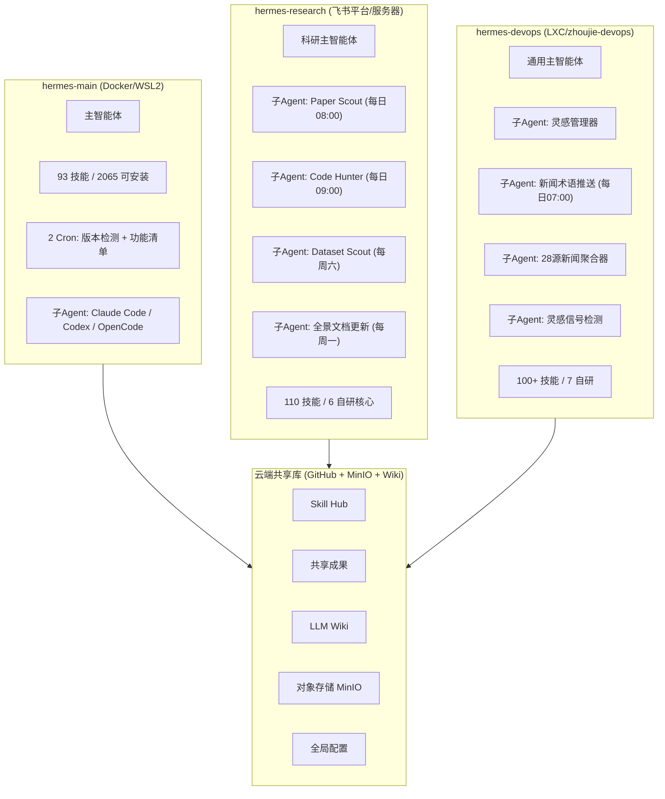
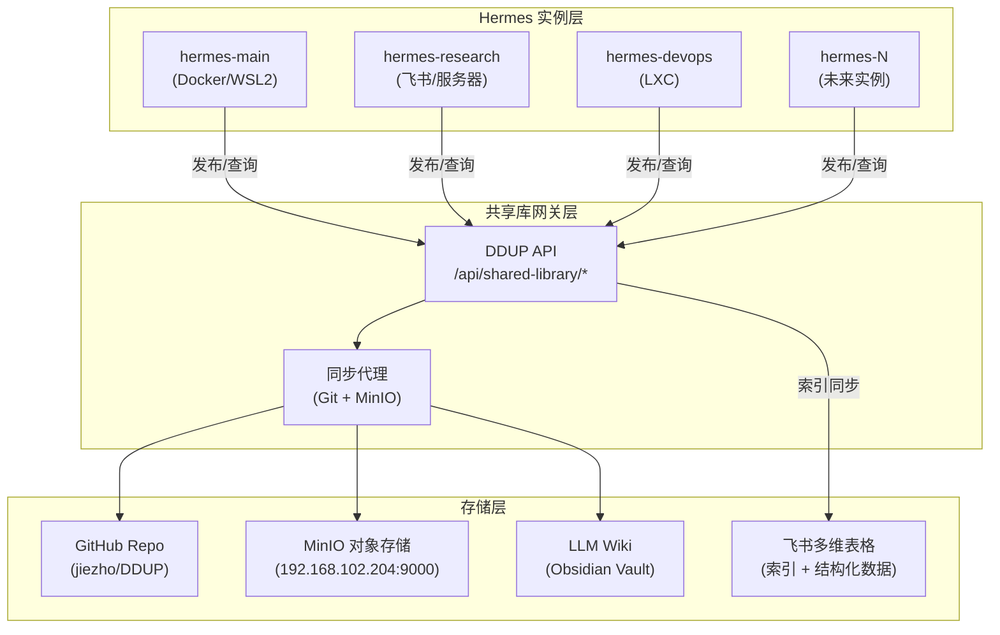

# Hermes 多智能体云端共享库设计方案 V2

> 基于三个实际运行中的 Hermes 实例自我总结，重新设计的云端共享库架构。
> 核心原则：反映真实部署、支持灵活扩展、解决实际痛点。

## 1. 现有智能体实例全景

### 1.1 实例拓扑



### 1.2 三实例对比

| 维度 | hermes-main | hermes-research | hermes-devops |
|------|-------------|-----------------|---------------|
| **部署环境** | Docker/WSL2 (Windows D:盘) | 服务器 (飞书平台) | LXC 容器 (zhoujie-devops) |
| **模型** | GLM-5.1-FP8 (131K ctx) | GLM-5.1-FP8 (Z.AI) | GLM-5.1-FP8 (GPUStack) |
| **主平台** | 飞书+Telegram+Discord | 飞书 | 飞书+微信 |
| **技能数** | 93 (25 分类) | 110 (17 分类) | 100+ |
| **核心定位** | 通用能力+开发+MLOps | 科研全流程+论文+报告 | 新闻/灵感/术语+内容提取 |
| **自研技能** | — | scientific-research-agent, feishu-doc-writer, arxiv-paper-scout, open-source-scout, cr-power-learning-plan | inspiration-manager, news-terminology-push, news-aggregator, inspiration-signal, douyin-video-extract, wechat-article-extract |
| **活跃Cron** | 2 | 5 | 2 |
| **产出类型** | 架构图/代码/部署 | 大型飞书报告(11份/3121 blocks) | 飞书卡片+多维表格记录 |
| **记忆使用** | 89% | 99%（接近饱和） | 高 |
| **数据资产** | LLM Wiki + Obsidian + GitHub | 飞书文档(11份) + 论文库 | 飞书多维表格(3张) + 飞书文档(5份) |

### 1.3 子智能体清单

| 宿主实例 | 子智能体 | 触发方式 | 产出目标 |
|----------|----------|----------|----------|
| hermes-research | Paper Scout | Cron 每日08:00 | 飞书推送 |
| hermes-research | Code Hunter | Cron 每日09:00 | 飞书推送 |
| hermes-research | Dataset Scout | Cron 每周六12:00 | 飞书文档 |
| hermes-research | 全景文档更新 | Cron 每周一11:00 | 飞书文档 |
| hermes-devops | 灵感管理器 | 关键词拦截 "灵感 xxx" | 飞书多维表格 |
| hermes-devops | 新闻术语推送 | Cron 每日07:00 | 飞书卡片+多维表格 |
| hermes-devops | 28源新闻聚合器 | 按需调用 | 飞书卡片+多维表格 |
| hermes-devops | 灵感信号检测 | 按需/Cron | 灵感记录 |
| hermes-main | 编程子Agent | delegate_task | 代码产出 |

---

## 2. 设计目标与核心问题

### 2.1 必须解决的痛点（源自自我总结）

| # | 痛点 | 来源 | 优先级 |
|---|------|------|--------|
| 1 | Memory 容量仅 2200 字符，已饱和 | research 99% / main 89% | P0 |
| 2 | 产出物散落各处（/tmp、飞书、本地），无统一存储 | 所有实例 | P0 |
| 3 | 下载材料无持久化（论文PDF在/tmp消失） | research | P0 |
| 4 | 技能无跨实例共享机制 | 所有实例 | P1 |
| 5 | 无跨实例知识检索（一个实例的发现另一个找不到） | 所有实例 | P1 |
| 6 | Cron 产出只推送不归档 | research + devops | P1 |
| 7 | 缺少多实例协调机制 | 所有实例 | P2 |
| 8 | 网络可达性不一致（各实例能访问的站点不同） | 所有实例 | P2 |

### 2.2 设计原则

1. **实例为一等公民**：共享库以 Hermes 实例（非功能域）为基础单位注册
2. **子智能体透明**：子智能体归属于宿主实例，不单独注册
3. **增量接入**：新 Hermes 实例只需在 `instances.json` 注册即可接入，零改动现有结构
4. **存储分层**：文本/元数据→Git，大文件→MinIO，结构化→飞书多维表格，知识→Wiki
5. **Memory 外溢**：将溢出的记忆沉淀到共享库，解决 2200 字符瓶颈
6. **Cron 归档**：所有定时产出在推送的同时写入共享库存档

---

## 3. 总体架构

### 3.1 分层架构



### 3.2 目录结构设计（支持灵活扩展）

```
DDUP/
├── shared-library/
│   ├── README.md
│   ├── registry/                        # 实例与技能注册中心
│   │   ├── instances.json               # ★ 实例注册表（核心）
│   │   ├── skills-manifest.json         # 已发布技能清单
│   │   ├── cron-registry.json           # 全局 Cron 注册（防冲突）
│   │   └── published/                   # 已发布的共享技能包
│   │       ├── scientific-research-agent/
│   │       ├── feishu-doc-writer/
│   │       ├── inspiration-manager/
│   │       ├── news-terminology-push/
│   │       └── {skill-name}/            # 动态扩展
│   │
│   ├── outputs/                         # 成果归档（按实例+类型）
│   │   ├── .index.json                  # 全局成果索引
│   │   ├── hermes-research/             # 科研实例产出
│   │   │   ├── papers/
│   │   │   ├── reports/
│   │   │   └── cron-archives/
│   │   │       ├── paper-scout/
│   │   │       ├── code-hunter/
│   │   │       └── dataset-scout/
│   │   ├── hermes-devops/               # DevOps实例产出
│   │   │   ├── news/
│   │   │   ├── inspirations/
│   │   │   ├── terms/
│   │   │   └── cron-archives/
│   │   │       └── news-terminology/
│   │   ├── hermes-main/                 # 主实例产出
│   │   │   ├── architecture/
│   │   │   ├── code/
│   │   │   └── deployments/
│   │   └── {instance-id}/               # 新实例自动创建子目录
│   │
│   ├── memory-ext/                      # ★ 记忆扩展层（解决2200字符瓶颈）
│   │   ├── shared/                      # 跨实例共享记忆
│   │   │   ├── user-profile.md
│   │   │   ├── environment-facts.md
│   │   │   ├── api-experience.md
│   │   │   └── network-reachability.md
│   │   ├── hermes-research/             # 科研实例扩展记忆
│   │   │   ├── paper-index.md
│   │   │   ├── feishu-docs-index.md
│   │   │   └── domain-knowledge.md
│   │   ├── hermes-devops/               # DevOps实例扩展记忆
│   │   │   ├── bitable-connections.md
│   │   │   ├── news-sources.md
│   │   │   └── terminology-corpus.md
│   │   ├── hermes-main/
│   │   │   └── project-contexts.md
│   │   └── {instance-id}/              # 新实例自动创建
│   │
│   ├── wiki/                            # LLM Wiki 管理
│   │   ├── _raw/                        # 各实例待编译素材
│   │   │   ├── hermes-research/
│   │   │   ├── hermes-devops/
│   │   │   └── hermes-main/
│   │   └── wiki-config.json
│   │
│   ├── config/                          # 全局配置
│   │   ├── isolation-rules.json
│   │   ├── storage-policy.json
│   │   ├── sync-schedule.json
│   │   └── platform-connections.json
│   │
│   └── schemas/                         # 数据结构定义
│       ├── instance-registration.schema.json
│       ├── output-entry.schema.json
│       └── skill-package.schema.json
│
├── agents/                              # 实例私有空间（严格隔离）
│   ├── hermes-main/
│   │   ├── SOUL.md
│   │   └── private-skills/
│   ├── hermes-research/
│   │   ├── SOUL.md
│   │   └── private-skills/
│   ├── hermes-devops/
│   │   ├── SOUL.md
│   │   └── private-skills/
│   └── {instance-id}/                   # 新实例注册时自动创建
│
└── hermes-summary/                      # 自我总结存档（参考资料）
```

---

## 4. 核心子系统设计

### 4.1 实例注册中心（支持热插拔）

**关键特性**：新增实例只需追加一条 JSON 记录，目录按需自动创建。

注册一个实例的最小信息：
- `id`：唯一标识
- `name`：显示名称
- `deployment`：部署方式和位置
- `capabilities`：模型/平台/工具集
- `specialization`：擅长领域标签
- `status`：active / inactive / maintenance

可选扩展字段：`sub_agents`、`cron_jobs`、`data_assets`、`network_reachability`、`published_skills`

### 4.2 Memory 扩展层（解决 2200 字符瓶颈）

**核心思路**：将 Hermes 内置 Memory 作为"热缓存"，溢出记忆沉淀到 `memory-ext/`，通过共享技能按需检索。

**分层策略**：
- **热记忆**（内置 2200 字符）：最高频事实（当前项目、关键 API 配置、用户偏好）
- **温记忆**（memory-ext/{自身}/）：领域知识、已处理索引、踩坑记录
- **冷记忆**（memory-ext/shared/）：跨实例共享的环境事实、网络可达性

**使用协议**：
- 启动时从 `shared/` 加载共享上下文
- Memory 接近饱和时，低频条目迁移到 `memory-ext/{id}/`
- 跨实例检索通过 `memory-ext-query` 技能，只返回摘要

### 4.3 Skill Hub（技能发布/订阅）

**与 Hermes 原生 Hub 的关系**：
- 原生 Hub (2065 技能)：官方+社区技能源
- 自研 Hub (registry/published/)：三实例间共享自研技能

**发布流程**：实例本地开发 → 验证 → 发布到 `published/` → 其他实例安装

**技能包结构**：
```
published/{skill-name}/
├── SKILL.md              # 标准 Hermes SKILL.md
├── scripts/              # 辅助脚本
├── templates/            # 文档模板
├── package.json          # 元数据（版本/依赖/兼容性）
└── CHANGELOG.md
```

### 4.4 Cron 归档与防冲突

全局 `cron-registry.json` 记录所有 Cron 任务，提供：
- 任务归属（哪个实例拥有）
- 调度配置（防止时间冲突）
- 归档路径配置
- `exclusive` 标记（该任务只允许一个实例执行）

---

## 5. 隔离机制

### 5.1 访问控制矩阵

| 资源 | 本实例 | 其他实例 | DDUP API | 用户 |
|------|--------|----------|----------|------|
| 内置 Memory | ✅ RW | ❌ | ❌ | ❌ |
| memory-ext/{自身}/ | ✅ RW | ❌ | ✅ R | ✅ RW |
| memory-ext/shared/ | ✅ RW | ✅ R | ✅ RW | ✅ RW |
| memory-ext/{其他}/ | ✅ R(摘要) | ❌ | ✅ R | ✅ RW |
| agents/{自身}/private-skills/ | ✅ RW | ❌ | ❌ | ✅ RW |
| registry/published/ | ✅ R+安装 | ✅ R+安装 | ✅ RW | ✅ RW |
| outputs/{自身}/ | ✅ RW | ✅ R | ✅ RW | ✅ RW |
| outputs/{其他}/ | ✅ R | ✅ R | ✅ R | ✅ RW |
| wiki/_raw/{自身}/ | ✅ RW | ❌ | ✅ RW | ✅ RW |
| MinIO {自身namespace}/ | ✅ RW | ✅ R | ✅ RW | ✅ RW |
| 飞书多维表格 | ✅ RW(自身) | ✅ R | ✅ RW | ✅ RW |

### 5.2 MinIO 命名空间

```
ddup-shared-library/
├── hermes-main/          # 主实例
├── hermes-research/      # 科研实例（论文PDF/数据集）
├── hermes-devops/        # DevOps实例（视频/新闻快照）
└── shared/               # 跨实例共享区
```

---

## 6. 扩展性设计

### 6.1 新增实例（零改动现有代码）

1. 在 `registry/instances.json` 追加条目
2. 目录按需自动创建（outputs/、memory-ext/、wiki/_raw/）
3. 安装 `shared-library-client` 技能即可读写

### 6.2 新增子智能体

子智能体归属于宿主实例：
- 更新宿主的 `sub_agents[]`
- Cron 类追加到 `cron-registry.json`
- 产出写入宿主 `outputs/{host}/` 下

### 6.3 新增功能域

可选路径：
- 现有实例的子智能体（轻量，共享宿主资源）
- 独立新实例（重量级，需独立资源/环境）

### 6.4 技能升级路径

```
私有开发 → 实例内测试 → 发布到 published/ → 其他实例安装 → 使用反馈 → 版本迭代
```

---

## 7. 与现有基础设施集成

### 7.1 飞书（主力平台）

- 共享库存储飞书文档/多维表格的**元数据索引**（doc_id/app_token/table_id）
- 不直接操作飞书 API，只做引用追踪
- 飞书作为"展示层"，共享库作为"持久化层"

### 7.2 MinIO（已部署 ✅）

- Endpoint: `http://192.168.102.204:9000`
- Console: `http://192.168.102.204:9001`
- Bucket: `ddup-shared-library`
- 按实例 namespace 隔离

### 7.3 LLM Wiki

- 各实例写入 `wiki/_raw/{instance-id}/`
- 统一编译器提升为正式页面
- 跨实例概念自动合并

---

## 8. 实施路线

| Phase | 内容 | 优先级 | 时间 |
|-------|------|--------|------|
| 0 | 更新注册表+目录为真实三实例 | P0 | 立即 |
| 1 | Memory 外溢机制 + memory-ext 目录 | P0 | 1天 |
| 2 | Cron 产出双写（推送+归档） | P0 | 1-2天 |
| 3 | 材料持久化（PDF/视频→MinIO） | P0 | 1天 |
| 4 | 自研技能发布到 published/ | P1 | 2天 |
| 5 | Wiki 多实例编译 | P1 | 1-2天 |
| 6 | 跨实例查询技能 | P1 | 2天 |
| 7 | 新实例接入自动化 | P2 | 1天 |
