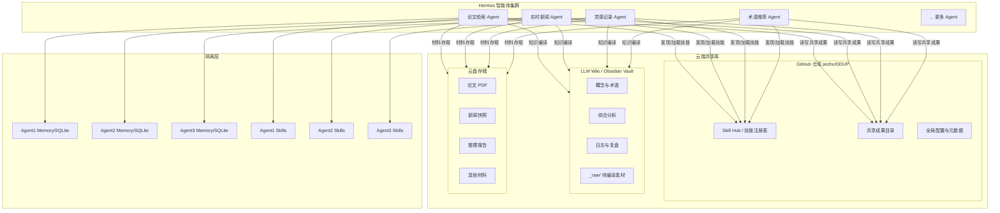
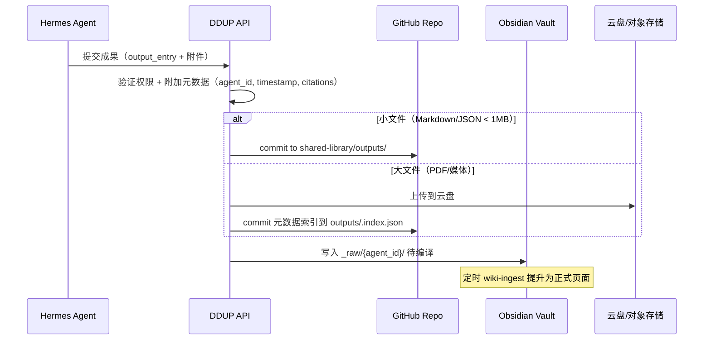
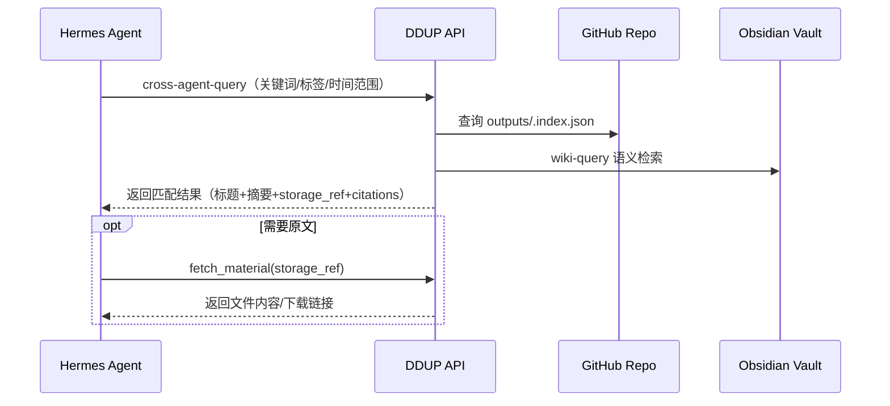
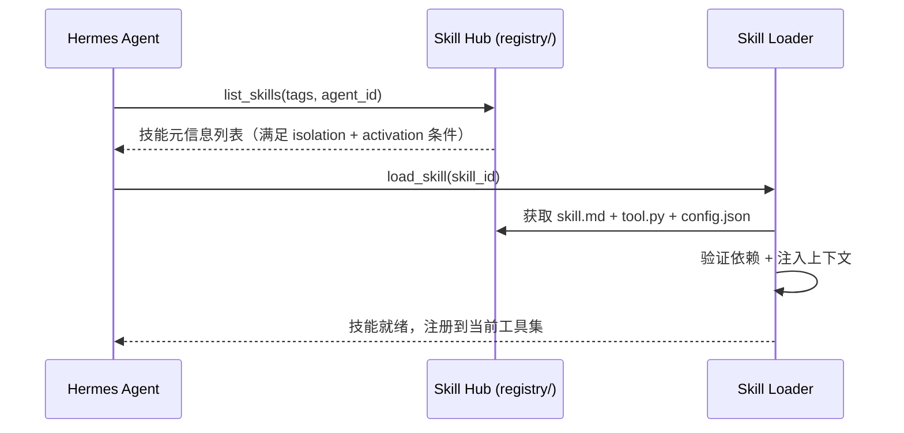

# Hermes 智能体云端共享库设计方案

> 范围：为 DDUP 平台的多个 Hermes 智能体（论文检索、实时新闻、灵感记录、术语推荐等）搭建统一的云端共享库，实现成果共享、材料存储、技能复用，同时保证各智能体的 Skills 与记忆彼此隔离。

## 1. 设计目标

- **成果共享**：每个智能体产出的报告、摘要、推荐结果等可被其他智能体和用户检索使用。
- **技能隔离**：各智能体拥有独立的 Skills 目录和记忆空间，避免互相污染。
- **材料存储**：下载的论文 PDF、新闻快照、参考资料等持久化存储于云盘 + Git LFS。
- **知识沉淀**：通过 LLM Wiki（Obsidian Vault）将非结构化知识持续编译为可浏览、可链接的长期知识层。
- **技能中心**：Skill Hub 提供跨智能体技能注册、发现、版本管理与条件激活。
- **可追溯**：所有写入必须带来源引用（agent_id + session_id + timestamp + source_ref）。

## 2. 总体架构



## 3. 四大子系统设计

### 3.1 GitHub 仓库（中心注册 + 版本管理）

基于现有 `jiezho/DDUP` 仓库扩展，新增 `shared-library/` 顶级目录：

```
DDUP/
├── shared-library/
│   ├── README.md                    # 共享库说明
│   ├── registry/                    # Skill Hub 技能注册表
│   │   ├── manifest.json            # 全局技能清单（元数据索引）
│   │   ├── paper-search/            # 论文检索技能包
│   │   │   ├── skill.md             # 技能描述（何时用/步骤/风险/验证）
│   │   │   ├── tool.py              # 工具实现
│   │   │   └── config.json          # 配置（依赖/权限/激活条件）
│   │   ├── news-collect/
│   │   ├── inspiration-capture/
│   │   ├── term-recommend/
│   │   └── shared/                  # 跨智能体共享的通用技能
│   │       ├── wiki-write/
│   │       ├── storage-upload/
│   │       ├── citation-attach/
│   │       └── cross-agent-query/
│   ├── outputs/                     # 共享成果目录
│   │   ├── .index.json              # 成果索引（标题/类型/agent/时间/tags）
│   │   ├── papers/                  # 论文检索成果
│   │   │   └── YYYY-MM/
│   │   ├── news/                    # 新闻推荐成果
│   │   │   └── YYYY-MM-DD/
│   │   ├── inspirations/            # 灵感整理成果
│   │   ├── terms/                   # 术语推荐成果
│   │   └── reports/                 # 综合报告
│   ├── config/                      # 全局配置
│   │   ├── agents.json              # 智能体注册清单
│   │   ├── storage-policy.json      # 存储策略（什么存 Git/什么存云盘）
│   │   ├── isolation-rules.json     # 隔离规则定义
│   │   └── sync-schedule.json       # 同步调度配置
│   └── schemas/                     # 共享数据结构定义
│       ├── output-entry.schema.json # 成果条目 schema
│       ├── skill-manifest.schema.json
│       └── agent-profile.schema.json
├── agents/                          # 各智能体私有空间（隔离）
│   ├── paper-search/
│   │   ├── .hermes/                 # 私有 memory + session 数据
│   │   ├── skills/                  # 私有技能
│   │   ├── SOUL.md                  # Agent 人格配置
│   │   └── config.yaml              # 运行配置
│   ├── news-collect/
│   ├── inspiration/
│   └── term-recommend/
├── apps/                            # 现有应用代码
├── docs/                            # 现有文档
└── ...
```

### 3.2 LLM Wiki（Obsidian Vault）知识编译层

延续已有的 ObsidianWiki 方案，扩展为多智能体写入模式：

**写入隔离策略**：每个智能体写入 `_raw/{agent_id}/` 子目录，由统一的 `wiki-ingest` 任务提升到正式页面。

```
wiki-vault/
├── _raw/
│   ├── paper-search/      # 论文 Agent 待编译素材
│   ├── news-collect/      # 新闻 Agent 待编译素材
│   ├── inspiration/       # 灵感 Agent 待编译素材
│   └── term-recommend/    # 术语 Agent 待编译素材
├── concepts/              # 编译后的概念页（跨 Agent 去重合并）
├── entities/              # 实体页
├── synthesis/             # 综合分析（跨 Agent 汇总）
├── references/            # 引用与来源
├── journal/               # 日志（按时间）
├── projects/              # 项目沉淀
├── .manifest.json         # 增量追踪
├── index.md               # 全量索引
└── log.md                 # 编译日志
```

**关键规则**：
- 每条写入必须包含 frontmatter：`agent_id`, `source_type`, `source_ref`, `created_at`, `visibility`。
- `wiki-ingest` 执行去重与交叉引用，将同一实体/概念的多 Agent 贡献合并到同一页面。
- `wiki-lint` 检查孤立页面和断裂链接。

### 3.3 云盘存储（大文件持久化）

对于 PDF、图片、音视频等大文件，不适合直接存入 Git，采用分层存储策略：

**存储层选择**：
- **百度网盘同步盘**（现有）：作为本地-云端同步的一级缓存。
- **服务器对象存储**（推荐 MinIO/阿里云 OSS）：作为生产环境持久化存储。
- **Git LFS**（可选）：用于版本化追踪关键 PDF 的元数据。

**目录规范（云盘侧）**：
```
DDUP-Storage/
├── papers/
│   ├── {paper_id}/
│   │   ├── source.pdf
│   │   ├── meta.json        # 元数据（标题/作者/DOI/来源Agent/时间）
│   │   └── annotations/     # 标注与笔记
├── news-snapshots/
│   └── YYYY-MM-DD/
│       └── {article_id}.json  # 新闻快照（含原文+摘要+标签）
├── reports/
│   └── YYYY-MM/
│       └── {report_id}.md
└── assets/
    └── images/ videos/ ...
```

**Git 仓库中只存元数据索引**：
- `shared-library/outputs/` 中的条目包含 `storage_ref` 字段指向云盘路径。
- 元数据轻量化入 Git，大文件走云盘/对象存储。

### 3.4 Skill Hub（技能注册、发现、版本管理）

**设计原则**：
- 每个技能是一个独立目录，包含 `skill.md`（描述）+ `tool.py`（实现）+ `config.json`（配置）。
- `registry/manifest.json` 是全局索引，支持按 Agent 过滤、按能力标签搜索。
- 支持"共享技能"与"私有技能"两级：共享技能在 `registry/shared/`，私有技能在 `agents/{id}/skills/`。

**manifest.json 结构**：
```json
{
  "version": "1.0.0",
  "skills": [
    {
      "id": "paper-search.arxiv-query",
      "name": "ArXiv 论文检索",
      "description": "通过关键词、作者、时间范围检索 ArXiv 论文",
      "owner_agent": "paper-search",
      "visibility": "shared",
      "tags": ["search", "paper", "academic"],
      "dependencies": ["arxiv-api"],
      "activation_conditions": {
        "requires_tools": ["web_search"],
        "requires_config": ["ARXIV_API_KEY"]
      },
      "version": "1.2.0",
      "path": "registry/paper-search/arxiv-query/"
    }
  ]
}
```

## 4. 隔离机制设计

### 4.1 Memory 隔离

每个 Hermes Agent 使用独立的 SQLite 数据库存储对话历史与记忆：

```
agents/{agent_id}/.hermes/
├── memory.db          # 独立 SQLite（WAL 模式）
├── sessions/          # 会话记录
└── learned/           # Agent 自学习产物
```

**规则**：
- Agent 的 Memory 只允许本 Agent 进程读写。
- 跨 Agent 共享信息必须通过"共享成果目录"中转，不允许直接访问其他 Agent 的 memory.db。
- DDUP API 层作为唯一的跨 Agent 查询入口（通过 `cross-agent-query` 共享技能）。

### 4.2 Skills 隔离

```
隔离层级：
┌─────────────────────────────────────────────────────┐
│ 全局共享 Skills（registry/shared/）                  │  ← 所有 Agent 可加载
├─────────────────────────────────────────────────────┤
│ 领域共享 Skills（registry/{domain}/）               │  ← 同域 Agent 可加载
├─────────────────────────────────────────────────────┤
│ 私有 Skills（agents/{id}/skills/）                  │  ← 仅本 Agent 可加载
└─────────────────────────────────────────────────────┘
```

**加载规则**（配置在 `config/isolation-rules.json`）：
- Agent 启动时，按优先级加载：私有 > 领域共享 > 全局共享。
- 同名技能以更高优先级覆盖。
- `activation_conditions` 不满足时自动跳过。

### 4.3 执行隔离

利用 Hermes 的 Subagents 架构：
- 每个 Agent 运行在独立进程/容器中（生产环境用 Docker）。
- 共享库通过 Git 挂载为只读卷（技能加载时），写入通过 API 中转。
- 运行时环境变量隔离：每个 Agent 只能访问自身配置中声明的密钥。

## 5. 数据流设计

### 5.1 智能体产出 → 共享库



### 5.2 智能体检索共享成果



### 5.3 技能发现与加载



## 6. 关键接口定义

### 6.1 成果写入接口

```python
# POST /api/shared-library/outputs
class OutputEntry(BaseModel):
    title: str
    agent_id: str                    # 产出 Agent 标识
    output_type: str                 # paper_summary | news_digest | term_card | report | inspiration
    content: str                     # Markdown 内容
    tags: list[str]
    citations: list[Citation]        # 来源引用
    attachments: list[Attachment]    # 附件（大文件走云盘）
    visibility: str = "internal"     # public | internal | private
    metadata: dict = {}              # 扩展元数据

class Citation(BaseModel):
    source_type: str                 # url | paper_doi | file_id | conversation
    source_ref: str                  # 具体引用标识
    excerpt: str = ""                # 引用片段

class Attachment(BaseModel):
    filename: str
    content_type: str
    storage_ref: str = ""            # 云盘路径（上传后回填）
    size_bytes: int
```

### 6.2 跨智能体查询接口

```python
# GET /api/shared-library/query
class QueryRequest(BaseModel):
    keywords: list[str] = []
    tags: list[str] = []
    agent_ids: list[str] = []        # 为空则查所有
    output_types: list[str] = []
    time_range: tuple[datetime, datetime] | None = None
    limit: int = 20
    include_wiki: bool = True        # 是否同时查 Wiki

class QueryResponse(BaseModel):
    results: list[OutputEntry]
    wiki_matches: list[WikiMatch] = []
    total: int
```

### 6.3 Skill Hub 接口

```python
# GET /api/shared-library/skills
class SkillListRequest(BaseModel):
    agent_id: str                    # 请求方 Agent
    tags: list[str] = []
    include_shared: bool = True

# POST /api/shared-library/skills/register
class SkillRegistration(BaseModel):
    skill_id: str
    name: str
    description: str
    owner_agent: str
    visibility: str                  # shared | domain | private
    tags: list[str]
    dependencies: list[str]
    activation_conditions: dict
    version: str
    files: dict[str, str]            # filename -> content
```

## 7. 同步与调度策略

### 7.1 Git 同步

- **写入频率**：智能体产出后立即 commit（通过 API 触发），避免批量堆积。
- **冲突处理**：outputs/ 按 agent_id + 时间戳命名文件，天然避免冲突。registry/ 修改需通过 PR 审核。
- **分支策略**：
  - `master`：稳定版本，只接受 PR 合并。
  - `shared-library/auto`：智能体自动 commit 分支，定期合并到 master。
  - `skill/{skill-id}`：技能开发分支。

### 7.2 Wiki 编译调度

| 任务 | 频率 | 说明 |
|------|------|------|
| wiki-ingest | 每 30 分钟 | 处理 _raw/ 新素材 |
| wiki-update | 每 1 小时 | 同步项目沉淀（git delta） |
| cross-linker | 每 2 小时 | 自动补充交叉链接 |
| wiki-lint | 每天 02:00 | 健康检查与孤立页面清理 |
| wiki-export | 每天 06:00 | 导出 graph.json 供图谱导入 |

### 7.3 云盘同步

- **上传**：材料下载后立即上传到对象存储，元数据写入 Git。
- **清理**：本地 _tmp/ 缓存 7 天后自动清理（保留云端副本）。
- **备份**：对象存储每日增量备份到百度网盘同步盘。

## 8. 安全与权限

### 8.1 访问控制矩阵

| 操作 | 本 Agent | 其他 Agent | DDUP API | 用户 |
|------|----------|------------|----------|------|
| 读自身 Memory | ✅ | ❌ | ❌ | ❌ |
| 写自身 Memory | ✅ | ❌ | ❌ | ❌ |
| 读共享成果 | ✅ | ✅ | ✅ | ✅ |
| 写共享成果 | ✅（本Agent名下） | ❌ | ✅ | ✅ |
| 读共享 Skills | ✅ | ✅ | ✅ | ✅ |
| 注册/修改 Skills | ✅（本Agent拥有） | ❌ | ✅ | ✅ |
| 读 Wiki | ✅ | ✅ | ✅ | ✅ |
| 写 Wiki _raw/ | ✅（本Agent子目录） | ❌ | ✅ | ✅ |
| 读云盘材料 | ✅ | ✅（需声明引用） | ✅ | ✅ |
| 上传云盘 | ✅ | ❌ | ✅ | ✅ |

### 8.2 密钥管理

- 每个 Agent 的 API Key、第三方服务凭据存储在 `agents/{id}/config.yaml` 中（不入 Git，通过 .gitignore 排除）。
- 生产环境使用环境变量注入或密钥管理服务（如 HashiCorp Vault）。
- 共享库的 Git 操作使用 Deploy Key（已有 `id_ed25519_ddup_deploy`）。

## 9. 实施步骤总览

### Phase 1：基础设施搭建（1-2 天）

1. 在 GitHub 仓库创建 `shared-library/` 目录结构
2. 初始化 `agents/` 各智能体私有目录
3. 编写 `config/` 全局配置文件
4. 编写 `schemas/` JSON Schema 定义

### Phase 2：Skill Hub 实现（2-3 天）

5. 实现 `registry/manifest.json` 与技能包目录
6. 提取现有技能到标准格式
7. 实现 Skill Loader（加载/验证/注册）
8. 编写 `cross-agent-query` 共享技能

### Phase 3：成果共享管道（2-3 天）

9. DDUP API 新增 shared-library 路由
10. 实现成果写入（Git commit + 云盘上传）
11. 实现跨 Agent 查询接口
12. 成果索引自动更新机制

### Phase 4：Wiki 扩展（1-2 天）

13. Wiki Vault 增加多 Agent 写入子目录
14. 扩展 wiki-ingest 支持多来源去重合并
15. 调度任务配置与监控

### Phase 5：集成验证（1-2 天）

16. 端到端测试：Agent 产出 → 共享库 → 其他 Agent 检索
17. 隔离性验证：确认 Memory/Skills 不可越权访问
18. 性能与并发测试
