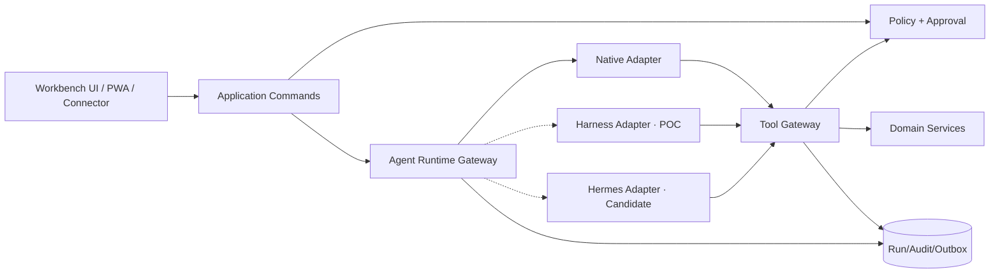

# 个人上下文智能工作台：Agent Runtime 与 Tool Gateway 契约

> 版本：V1.0  
> 日期：2026-08-24  
> 状态：正式设计基线；G2/G3 已确认  
> 范围：Native、DeepSeek Harness 隔离 POC、Hermes 候选运行时的统一边界  
> 重要事实：本文定义契约，不代表 Harness/Hermes 已安装、已集成或生产可用

## 1. 目标与不变量

Workbench 是控制面与业务真源，Runtime 是可替换执行面。

不可违反的不变量：

1. 一个 Run 只有一个主 Runtime；禁止 Harness/Hermes 双主循环、互相嵌套或循环委派。
2. Runtime 不直接连接 SQLite、业务文件目录、凭据存储或连接器令牌。
3. 所有业务读取/写入只经过 Workbench Tool Gateway。
4. Policy、动作等级、Approval、Audit、Idempotency 和长期知识归 Workbench。
5. Runtime 的 session、memory、USER、日志、Cron、skill 不是业务真源。
6. Runtime 输出只能成为消息、Artifact 或 Candidate；不能自行变成长期知识、任务、决策或外部动作。
7. 外部内容和 Runtime 输出均不可信；模型 ToolCall 是请求，不是授权。
8. Runtime 不健康或契约不兼容时降级到 Native/只读/草稿，不能绕过安全门继续执行。

## 2. 组件边界



Runtime Adapter 可以转换第三方协议，但不得重新解释业务权限。Tool Gateway 接收的是 Workbench 颁发的短期 Run principal/capability，而不是外部框架自己的“管理员”身份。

## 3. `AgentRuntime` Port

正式实现使用 ESM JavaScript + Zod/JSDoc；以下 TypeScript 风格仅表达契约：

```ts
interface AgentRuntime {
  descriptor(): Promise<RuntimeDescriptor>;
  health(signal?: AbortSignal): Promise<RuntimeHealth>;
  start(input: StartRunInput, signal?: AbortSignal): Promise<StartRunResult>;
  events(run: RuntimeRunRef, cursor?: RuntimeCursor, signal?: AbortSignal): AsyncIterable<RuntimeEvent>;
  approve(run: RuntimeRunRef, decision: RuntimeApprovalDecision, signal?: AbortSignal): Promise<void>;
  steer(run: RuntimeRunRef, input: SteerRunInput, signal?: AbortSignal): Promise<void>;
  cancel(run: RuntimeRunRef, input: CancelRunInput, signal?: AbortSignal): Promise<void>;
  resume?(input: ResumeRunInput, signal?: AbortSignal): Promise<StartRunResult>;
  dispose?(): Promise<void>;
}
```

### 3.1 RuntimeDescriptor

| 字段 | 类型 | 规则 |
|---|---|---|
| `runtime_key` | string | Workbench 注册键，如 `native-v1`；非第三方可变显示名 |
| `adapter_version` | semver | Adapter 契约版本 |
| `runtime_name/version` | string | 实际执行引擎及锁定版本 |
| `status` | enum | `available`、`poc`、`candidate`、`disabled`、`incompatible` |
| `protocol` | enum | `in_process`、`stdio_jsonrpc`、`http_sse`、`acp` 等 |
| `capabilities` | object | 明确能力集合，不以版本名猜测 |
| `data_residency` | enum | `local_process`、`local_container`、`approved_remote` |
| `supported_profiles` | string[] | 经评审 Profile 白名单 |

Capability 至少声明：`streaming, tool_calls, approvals, steering, cancellation, resume, checkpoints, child_runs, usage, artifacts`。缺失能力不得由 Adapter 伪造成功。

### 3.2 RuntimeHealth

```json
{
  "status": "healthy",
  "checked_at": "2026-08-24T10:00:00.000Z",
  "latency_ms": 12,
  "protocol_compatible": true,
  "runtime_version": "synthetic-native-1",
  "details": []
}
```

`details` 只能含安全错误码；不得返回命令行、环境变量、端口秘密、绝对路径或密钥。

## 4. Run 输入与上下文

### 4.1 StartRunInput

| 字段 | 必填 | 规则 |
|---|---:|---|
| `workbench_run_id` | 是 | UUIDv7，由 Workbench 创建并持久化 |
| `profile_key/version` | 是 | 经过评审且锁版本的 Profile |
| `principal_capability` | 是 | 短期、Run 绑定、不可导出的能力引用 |
| `goal` | 是 | 用户目标；长度和分类受限 |
| `context_package` | 是 | manifest，不是整个知识库 dump |
| `tool_manifest` | 是 | 本 Run 允许工具、版本、动作和预算 |
| `budget` | 是 | 时间、步骤、工具调用、输出、token/成本上限 |
| `checkpoint` | 否 | Workbench 创建的受控恢复点 |
| `parent_run_id` | 否 | 子 Run 时必填；仍使用同一 Runtime key |
| `idempotency_key` | 是 | Runtime start 重放去重 |

Workbench 在调用 Runtime 前完成：主体、Space、AI policy、Profile、ContextPackage、模型目标和 Tool manifest 校验。

### 4.2 ContextPackage

```ts
type ContextPackage = {
  id: string;
  version: number;
  spaceId: string;
  purpose: string;
  expiresAt: string;
  aiPolicy: 'local_only' | 'approved_cloud_metadata' | 'approved_cloud_content';
  objects: Array<{
    objectType: string;
    objectId: string;
    objectVersion: number;
    permittedFields: string[];
    sourceVersionIds?: string[];
  }>;
  omitted: Array<{ reasonCode: string; count?: number }>;
  digest: string;
}
```

规则：

- `deny_ai` 不能生成 ContextPackage。
- 过期、策略收紧、对象版本变化或权限变化使 Package 失效。
- `omitted` 不含越权对象标题/ID；只解释范围原因。
- 正文按 Tool 查询时再次授权，不因 Package 中存在 ID 自动放行。
- Adapter 可以转换格式，但必须保持 object/version/citation provenance。

## 5. 统一 Run 状态与事件

### 5.1 状态机

```text
queued → running ↔ waiting_approval → succeeded
            ↓              ↓
          failed        cancelled
            ↓
       resumable（若存在有效 Workbench checkpoint）
```

- `cancelled/succeeded` 为终态；重复取消返回原结果。
- Runtime 进程退出不直接等于 failed；Gateway 先按最后事件与 checkpoint 判定 `interrupted`，再形成可恢复/失败状态。
- `waiting_approval` 期间不执行待批 Tool，但可发送 keepalive；预算时间是否暂停由 Profile 明确。

### 5.2 RuntimeEvent Envelope

```json
{
  "event_version": 1,
  "runtime_event_id": "opaque-runtime-id",
  "runtime_cursor": "opaque-cursor",
  "type": "tool.requested",
  "occurred_at": "2026-08-24T10:00:00.000Z",
  "payload": {}
}
```

Gateway 将其归一为 Workbench `RunEvent(run_id, seq)`。Runtime Cursor 只属于 Adapter；前端永远不看到第三方 session/cursor。

统一类型与最小 payload 沿用《API 与事件契约》第 10 节。未知事件：

- 非关键扩展记录为 `runtime.extension.observed` 安全摘要；
- 影响状态/工具/审批的未知关键事件使 Adapter `incompatible` 并停止新运行；
- 禁止静默丢弃 Tool/Approval/Terminal 事件。

## 6. Tool Gateway 契约

### 6.1 ToolDefinition

```ts
type ToolDefinition = {
  key: string;
  version: string;
  description: string;
  inputSchema: ZodSchema;
  outputSchema: ZodSchema;
  actionLevel: 'L0' | 'L1' | 'L2' | 'L3' | 'L4';
  idempotency: 'read_only' | 'required' | 'connector_dedupe_required';
  allowedProfiles: string[];
  allowedObjectTypes: string[];
  budgets: { timeoutMs: number; maxItems: number; maxInputBytes: number; maxOutputBytes: number };
  audit: { includeFields: string[]; redactFields: string[] };
  compensation?: string;
}
```

工具描述供模型理解，`actionLevel/allowedProfiles/Schema/Policy` 由代码执行，模型不能覆盖。

### 6.2 ToolCallRequest

| 字段 | 必填 | 说明 |
|---|---:|---|
| `workbench_run_id` | 是 | 绑定 Run |
| `runtime_tool_call_id` | 是 | Adapter 内标识；与 Run 组合唯一 |
| `tool_key/version` | 是 | 必须存在于本 Run tool manifest |
| `arguments` | 是 | 先按大小，再按 Schema，再按业务规则校验 |
| `purpose` | 是 | 与用户目标相关的简短理由；不参与授权替代 |
| `idempotency_key` | 写工具是 | Workbench 作用域键 |
| `expected_versions` | 修改是 | 目标对象版本集合 |
| `source_event_id` | 是 | 运行事件溯源 |

处理顺序：

```text
Run/Runtime binding → Tool manifest/version → Size/Schema
→ Policy(space/object/action/purpose/profile) → Action level
→ Approval(scope digest) → Idempotency/Version → Execute
→ Audit/Outbox → Schema output → Redaction → Runtime
```

任何一步拒绝都返回稳定 `ToolError`，不把内部异常或越权对象存在性发给 Runtime。

### 6.3 ToolResult

```ts
type ToolResult =
  | { status: 'succeeded'; data: unknown; citations?: CitationRef[]; resultDigest: string }
  | { status: 'approval_required'; approvalId: string; actionLevel: string; scopeDigest: string }
  | { status: 'denied'; error: ToolError }
  | { status: 'failed'; error: ToolError; retryable: boolean }
  | { status: 'unknown_external_outcome'; reconciliationId: string };
```

- L0 返回最小授权字段与 CitationRef。
- L1 只能创建 Candidate/Artifact，不修改长期真源。
- L2 必须有符合策略的 Approval 或预先明确的可撤销会话授权，并保存 diff。
- L3 每次显式审批；外部目标、内容、连接器和 dedupe key 全部进入 scope digest。
- L4 强确认；删除/权限/恢复切换在执行前展示影响清单。

## 7. P0 Tool Catalog

| Tool key | 等级 | 作用 | 输出/限制 |
|---|---|---|---|
| `context.search.v1` | L0 | 权限过滤的全文检索 | CitationRef + scope explanation；最多 50 |
| `object.read.v1` | L0 | 按允许字段读取一个对象 | 禁止任意表/路径读取 |
| `project.list.v1` | L0 | 列允许项目摘要 | 不泄露越权计数 |
| `project.context.v1` | L0 | 项目范围上下文 manifest | 不直接 dump 全部正文 |
| `candidate.knowledge.create.v1` | L1 | 创建知识候选 | Candidate ID + diff |
| `candidate.task.create.v1` | L1 | 创建任务候选 | Candidate ID + source refs |
| `candidate.decision.create.v1` | L1 | 创建决策候选 | Candidate ID + citations |
| `candidate.apply.v1` | L2 | 应用已批准候选 | Approval/scope/version 必须匹配 |
| `task.transition.v1` | L2 | 修改任务状态 | If-Match + 幂等 + 可补偿 |
| `daily_review.save.v1` | L2 | 保存用户确认复盘 | AI 草稿必须带 provenance |
| `connector.message.send.v1` | L3 | 外发消息 | 首期 disabled；逐次批准 |
| `object.purge.v1` | L4 | 永久清除 | 首期可不注册；影响清单 + 备份 |

首个 Runtime 实现只注册 L0/L1，先证明“检索—综合—带引用—候选”闭环；L2 在审批/审计完成后开放，L3/L4 后续单独验收。

## 8. Approval Bridge

Runtime 可暂停并显示第三方审批提示，但最终 Approval ID、状态、scope digest 和决策主体归 Workbench。

```ts
type RuntimeApprovalDecision = {
  runtimeApprovalRef: string;
  workbenchApprovalId: string;
  decision: 'approved' | 'rejected';
  scopeDigest: string;
  resolvedAt: string;
}
```

- Runtime 不能为自己批准。
- Workbench 批准后参数改变，Gateway 不发送批准并创建新 Approval。
- 重复发送相同 decision 幂等；相反 decision 返回冲突。
- Runtime 失联时 Approval 保留，但不会自动应用；恢复后重新校验有效期、权限和对象版本。

## 9. Steering、取消、恢复和检查点

### 9.1 Steering

Steer 只能调整目标/优先级，不能扩大 Space、AI policy、工具集合或预算上限。需要扩大范围时，取消/保存 checkpoint，创建新 Run 与新 ContextPackage。

### 9.2 取消

1. Workbench 将 Run 标为 `cancelling` 并发出 Adapter cancel；
2. Tool Gateway 拒绝新 ToolCall；
3. 已进行的本地可取消操作收到 AbortSignal；
4. 外部未知结果进入 reconciliation；
5. 收到终止/超时后记录 `run.cancelled`。

取消不通过杀进程假装成功；必要时最后才终止隔离进程，并记录未确认副作用。

### 9.3 Checkpoint

Checkpoint 保存 Workbench 可验证的：步骤摘要、已完成 ToolCall IDs、Artifacts/Candidates、ContextPackage digest、Runtime 私有 opaque ref 和版本。它不保存密钥，不自动写长期知识。

跨 Runtime 切换永远创建新 Run，重新生成最小上下文；原 Runtime 私有 checkpoint 不交给另一个 Runtime 解释。

## 10. Budget 与子 Run

| 预算 | 默认控制 |
|---|---|
| 总时长 | Profile 明确；到期取消/保存 checkpoint |
| 步骤数 | 上限，防循环规划 |
| ToolCall 数 | 总量 + 每工具上限 |
| 并行 Tool | 默认 1；只读工具经评审可有限并发 |
| 子 Run | MVP 默认禁用；P1 显式上限和同 Runtime |
| 输入/输出 | 字节/token 上限；截断必须标记 |
| 成本 | 模型/工具预算，达到阈值进入 approval/stop |
| 重试 | 仅 retryable 错误；指数退避，总尝试上限 |

Runtime 不能通过拆分子 Run 绕过总预算、工具动作等级或 Space 范围。

## 11. Adapter 要求

### 11.1 Native

- 第一个实现，用确定性 Mock/Native RAG 验证事件、Tool、Approval、取消和错误。
- 状态可为 `available` 仅限实际实现且测试通过的能力。
- 不用模拟成功掩盖未实现模型/持久化；合成响应明确标识。

### 11.2 DeepSeek Harness

- 状态：`poc`，固定版本、独立进程/容器、只读 L0 + L1 Candidate 起步。
- 通过 stdio JSON-RPC/官方 SDK Adapter；运行时无业务目录权限。
- 插件白名单、网络默认关闭、协议录制回归；Developer Preview 变更触发兼容测试。
- 只有 G6a Go 且权限/审计/恢复证据通过后才能改变状态。

### 11.3 Hermes

- 状态：`candidate`，不作为 MVP 依赖。
- 可评估 HTTP+SSE/JSON-RPC Adapter 或仅消息网关；不启用自动长期记忆同步。
- 消息平台身份映射、附件、审批、重复投递和数据驻留需独立 POC。
- 只有形成移动入口或专项执行显著收益并通过 G6b，才进入可选能力。

## 12. 协议与供应链安全

- Runtime 进程以最低 OS 权限运行；stdio 消息有最大帧、超时、Schema 和序列号。
- HTTP Adapter 只连接明确回环/受控端点；TLS/远程模式必须新安全评审。
- Runtime/插件/skill/MCP 固定版本、来源、hash/lock、能力 allowlist；动态安装默认拒绝。
- 不把 Workbench session Cookie/API secrets传给 Runtime；凭据引用由 Tool Gateway 在执行时解析。
- Runtime 输出、日志和错误先做大小/Schema/脱敏再持久化或转发 SSE。
- Adapter 崩溃、重复事件、乱序事件、伪造 ToolCall、未知终态均有 fail-closed 测试。

## 13. 错误语义

| Tool/Runtime code | Retryable | 处理 |
|---|---:|---|
| `RUNTIME_UNAVAILABLE` | 是 | 保留 Run/checkpoint，退避；不换 Runtime 自动续会话 |
| `RUNTIME_INCOMPATIBLE` | 否 | 禁用 Adapter，新 Run 可选 Native |
| `RUNTIME_PROTOCOL_ERROR` | 视情况 | 记录安全摘要，超过阈值停止 |
| `TOOL_NOT_REGISTERED` | 否 | 拒绝并标记 Runtime/Prompt 异常 |
| `TOOL_SCHEMA_INVALID` | 否 | 不执行；可让 Runtime修正一次但不扩大范围 |
| `TOOL_NOT_ALLOWED` | 否 | 拒绝，不泄露对象存在性 |
| `APPROVAL_REQUIRED` | 否 | 进入 waiting_approval |
| `APPROVAL_EXPIRED` | 否 | 新建审批，禁止复用 |
| `VERSION_CONFLICT` | 否 | 刷新对象/重新生成 Candidate |
| `BUDGET_EXCEEDED` | 否 | 停止或由用户显式扩展新 Run |
| `EXTERNAL_OUTCOME_UNKNOWN` | 否 | 人工/连接器 reconciliation，禁止盲重试 |

## 14. 契约测试矩阵

| 编号 | 场景 | 必须证明 |
|---|---|---|
| RT-01 | Native 正常运行 | start→events→tool L0→artifact→success 顺序可回放 |
| RT-02 | 重复 start | 相同幂等键只有一个 Workbench/Runtime Run |
| RT-03 | 重复/乱序事件 | Gateway 去重/排序或安全失败，无重复 Tool |
| RT-04 | 伪造工具 | 未在 manifest 或版本不符被拒，Domain 未调用 |
| RT-05 | Prompt 注入参数 | Schema/Policy 拒绝路径、网络、越权对象 |
| RT-06 | L2/L3 无审批 | Tool 不执行，Run waiting_approval |
| RT-07 | 批准后参数变化 | scope digest 失效，必须新审批 |
| RT-08 | Tool 响应丢失 | 幂等重试不重复本地写；外部未知结果不盲重发 |
| RT-09 | Runtime 崩溃 | Run interrupted/failed 可解释，业务事务保持一致 |
| RT-10 | 取消竞态 | 新 Tool 被拒；已提交写不被假回滚；终态唯一 |
| RT-11 | 跨 Runtime 切换 | 新 Run/ContextPackage，无私有 session/memory 污染 |
| RT-12 | 跨空间读取 | 标题、计数、片段、错误均不泄露 |
| RT-13 | 日志/事件 | 无密钥、正文默认副本、绝对路径和内部异常 |
| RT-14 | Harness/Hermes 未连接 | UI/API 正确标为 poc/candidate，不伪造健康 |

## 15. 实现顺序

1. 创建 `shared/contracts/runtime.mjs` 和统一事件/error Schema；
2. 创建 Runtime Registry 与 Native deterministic adapter；
3. 创建 Tool Registry，先注册 L0/L1 合成工具；
4. 建立 RunEvent Store、SSE 映射和幂等 start/cancel；
5. 建立 Candidate/Approval Bridge 与 scope digest；
6. 完成 RT-01–RT-14 固定测试；
7. 项目/知识垂直切片稳定后进入 Harness 隔离 POC；
8. Hermes 仅在消息入口价值假设需要验证时开展对照。

S2-05 只有 Native Adapter、Tool Gateway、事件、审批、失败与越权契约测试落地后才算工程完成；本文不把外部 Runtime 候选升级为已实现能力。
