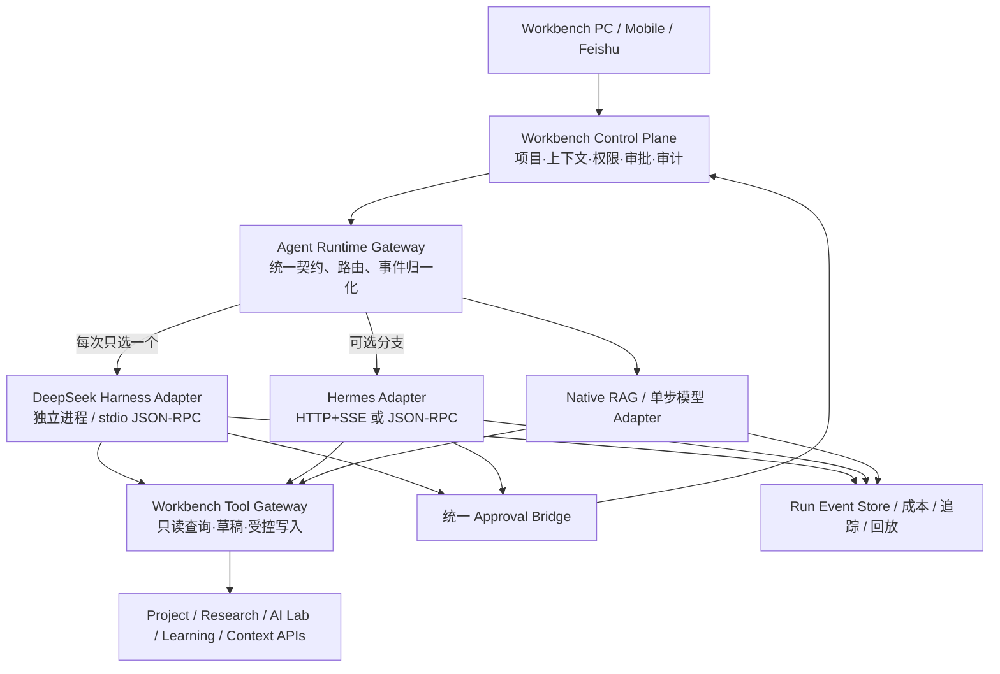

# 个人上下文智能工作台：Agent 运行时融合方案

> 版本：V1.0  
> 日期：2026-08-19  
> 评估对象：DeepSeek Harness、Nous Research Hermes Agent  
> 决策状态：Harness 进入隔离 POC；Hermes 进入可选运行时/移动网关对照评估，不做硬融合

## 0. 结论先行

本次方案更新不把工作台改造成某一个开源 Agent 的外壳，而是在产品后端新增一层稳定的 **Agent Runtime Gateway**。

- **Workbench** 继续拥有产品界面、项目对象、个人上下文知识库、权限、审批和业务数据真源。
- **DeepSeek Harness** 作为首个候选执行引擎，负责多步 Agent 循环、工具调用、任务续跑、子 Agent、沙箱与运行事件；只通过适配器接入。
- **Hermes Agent** 不嵌入 Harness，也不与 Harness 同时编排同一任务。它作为第二个可选运行时，以及“飞书/微信等移动消息网关”的候选方案进行对照 POC。
- **个人上下文知识库只有一个真源。** Harness 日志、Hermes 会话和 Hermes 自有记忆都不是业务知识真源；只有经过规则或用户确认的摘要、知识候选和结果才能回写。

最终建议：

| 对象 | 决策 | 实际定位 | 当前动作 |
|---|---|---|---|
| DeepSeek Harness | GO，有限采用 | 主候选 Agent 执行层 | 做只读、隔离、可回退 POC |
| Hermes Agent | BRANCH，条件评估 | 备选运行时 / 移动消息网关 / 专项执行器 | 做三项小规模对照测试，不进入 MVP 硬依赖 |
| 双运行时嵌套 | STOP | 不允许 Harness 调 Hermes Agent Loop，或反向嵌套 | 只允许一个任务一个主编排器 |
| 双重长期记忆 | STOP | 禁止 Hermes MEMORY/USER 与上下文知识库双向自动同步 | 仅生成待确认记忆候选 |

## 1. 评估口径

本文中的 “Hermes” 指 [NousResearch/hermes-agent](https://github.com/NousResearch/hermes-agent)，不是 Nous Research 的 Hermes 模型系列。两者需要分开理解：

- Hermes 模型可以只是模型供应商选项，接入模型路由层；
- Hermes Agent 是完整的自主智能体运行时，拥有 Agent Loop、工具、记忆、技能、调度、消息网关和会话存储。

本次只做架构与产品适用性评估，未安装 Hermes、未接入真实知识库，也没有给任何运行时开放个人或公司数据。

## 2. 两个项目各自解决什么

### 2.1 DeepSeek Harness

DeepSeek Harness 的核心价值是“可组装、可替换的 Agent Harness”。官方架构将模型适配、工具注册、会话日志和 Agent Loop 都设计为 Cordis 插件，并提供跨进程 TypeScript SDK，通过 stdio JSON-RPC 驱动独立运行时。

适合本项目的部分：

- 通过插件组装不同研究/开发 Profile；
- 运行多步工具任务、计划、后台 Job、Workflow 与子 Agent；
- 将审批、工具事件、运行历史映射到工作台；
- 作为 Node/TypeScript 生态中的独立执行进程接入。

限制：官方明确处于 Developer Preview，会发生破坏性兼容变更；Windows 沙箱能力需按目标环境单独验收。因此它适合作为候选执行内核，不适合作为当前业务与知识数据的宿主。

### 2.2 Hermes Agent

Hermes 是一个更完整、更“开箱即用”的个人 Agent 产品。官方文档显示，它包含统一 AIAgent 核心、70+ 工具、SQLite/FTS5 会话存储、持久记忆、技能自学习、Cron、子 Agent、MCP、桌面/网页/CLI，以及 20+ 消息平台网关。

它对本项目最有价值的不是再提供一套聊天 UI，而是：

1. **移动入口。** Hermes 网关已经覆盖飞书/Lark、企业微信、微信、钉钉、Telegram、Slack、Teams、邮件等，并处理会话、附件、流式回复、审批和定时任务。
2. **可编程接入。** 官方提供 TUI Gateway JSON-RPC、ACP，以及 HTTP + SSE 的 OpenAI 兼容 API；其中 `/v1/runs` 支持运行状态、事件、审批、steer 和 stop，适合接入统一 Runtime Adapter。
3. **个人技能演进。** 它能把复杂任务经验固化为 skills，并兼容 agentskills.io；这个机制适合做“候选技能—评测—发布”的灵感来源。
4. **多环境执行。** 本地、Docker、SSH 和云沙箱等后端对远程研究/开发任务有价值。

它与本产品冲突最大的部分是：

- 自带个人记忆和用户画像，会与个人上下文知识库争夺真源；
- 自带会话、项目、计划、Cron 与 Agent Loop，会和 Workbench/Harness 重叠；
- 自学习技能和自动记忆若直接启用，可能把错误或敏感信息长期固化；
- 本地终端模式隔离弱，生产用途必须使用容器/远程沙箱和严格白名单。

## 3. 能力重叠与互补矩阵

| 能力 | Workbench | Harness | Hermes | 处理原则 |
|---|---|---|---|---|
| 项目/科研/学习业务对象 | 主能力 | 非主能力 | 有部分项目/会话概念 | 只在 Workbench 建模 |
| 全局上下文知识库 | 唯一真源 | 读取上下文包 | 记忆/会话存储 | 运行时只拿最小上下文快照 |
| Agent Loop | 控制入口 | 强 | 强 | 一个 Run 只选择一个 Runtime |
| 工具与 MCP | 定义业务工具和权限 | 强 | 强 | 工具统一经过 Workbench Tool Gateway |
| 审批 | 权限与审计真源 | 有交互机制 | 有审批 API/消息命令 | 统一映射到 Workbench Approval |
| 长任务/子 Agent | 展示与治理 | 强 | 强 | 由所选 Runtime 执行，事件归一化 |
| 定时任务 | 业务订阅与计划 | 有 Jobs/Schedule | 有 Cron + 消息投递 | 计划真源在 Workbench，运行时只执行实例 |
| 移动消息入口 | 需要连接器 | 非核心 | 很强 | Hermes 可单独承担 Gateway POC |
| 个人长期记忆 | 候选—确认—复核 | 会话/日志 | 自动记忆和 USER/MEMORY | 禁止自动双写，仅回传候选 |
| 技能演进 | Skill/Agent 组件库 | 插件/扩展 | 自建/自改 skills | 先评测后发布，不允许生产自动改写 |
| 运行 UI | 产品主界面 | 自带 Web UI | 桌面/Web/TUI | 都不替换 Workbench UI |

## 4. 目标架构：控制面与执行面分离



### 4.1 稳定接口

Workbench 只依赖自己的契约，不依赖两个项目的内部类型：

```ts
interface AgentRuntime {
  capabilities(): Promise<RuntimeCapabilities>;
  start(input: StartRunInput): Promise<{ runId: string }>;
  events(runId: string, cursor?: string): AsyncIterable<RunEvent>;
  approve(runId: string, request: ApprovalDecision): Promise<void>;
  steer(runId: string, message: string): Promise<void>;
  cancel(runId: string): Promise<void>;
  resume?(runId: string): Promise<void>;
  health(): Promise<RuntimeHealth>;
}
```

统一事件至少包含：

- `run.started / run.completed / run.failed / run.cancelled`；
- `message.delta / message.completed`；
- `plan.created / step.started / step.completed`；
- `tool.requested / tool.started / tool.completed / tool.failed`；
- `approval.requested / approval.resolved`；
- `artifact.created / knowledge_candidate.created`；
- `usage.updated / checkpoint.created`。

### 4.2 运行路由

首期不做“AI 自动选择运行时”，只允许由经过评审的 Profile 明确绑定：

| Profile | 默认 Runtime | 理由 |
|---|---|---|
| 轻量问答、引用检索 | Native RAG | 延迟低、链路短、无需 Agent Loop |
| 项目深度研究、证据审计 | DeepSeek Harness | 插件边界清楚，适合受控多步执行 |
| AI 原型开发/评测 | DeepSeek Harness | 适合工具、Workflow、子 Agent 与运行日志 |
| 飞书/消息端连续对话 | Hermes 候选 | 网关、会话连续性和消息平台能力突出 |
| 远程个人执行器 | Hermes 候选 | 多终端后端、移动投递和 Cron 具备现成能力 |

失败切换不是直接把同一会话扔给另一个运行时继续。应保存 Workbench Checkpoint，重新生成最小上下文包，并由用户确认“以新运行继续”，避免两个运行时状态互相污染。

## 5. Hermes 的三种可用方式

### 5.1 推荐：作为可替换 Runtime Backend

Workbench 通过 Hermes 的 HTTP Run API 或 TUI Gateway JSON-RPC 发起运行，映射事件、审批、取消和 steer。Hermes 不直接读业务数据库，只能调用 Workbench 提供的受控工具。

优点：边界清楚、可停用、可对照 Harness、升级时影响局部。  
缺点：需要维护第二个适配器和协议回归测试。

### 5.2 推荐做 POC：作为消息网关

Hermes 只负责接收飞书/企业微信等消息、识别用户和会话、投递进度/结果；真正的任务请求转发到 Workbench Runtime Gateway。此模式甚至可以不启用 Hermes 的完整工具权限。

实际作用：快速验证“移动捕获、项目问答、审批、日报/周报”是否真正有使用价值，再决定自研飞书连接器。

### 5.3 谨慎：作为专项独立 Agent

可给 Hermes 建立完全隔离的 Profile，用于公开网络调研、个人低风险自动化或远程沙箱任务。输入只包含脱敏上下文包，输出以 Artifact/候选知识回传。

不允许它直接拥有全部上下文知识库、公司空间或自动写入权限。

## 6. 明确不做的硬融合

1. 不把 Hermes 的 AIAgent 注册成 Harness 子 Agent 后继续开放完整工具；
2. 不让 Hermes 调用 Harness，再由 Harness 调回 Hermes；
3. 不把两个运行时的 session ID 当成产品会话 ID；
4. 不同步两套内部计划、Todo、Cron 和记忆数据；
5. 不直接采用任一项目的 Web UI 作为产品主界面；
6. 不允许运行时动态安装第三方技能/插件后立即进入生产；
7. 不把运行日志全文默认写入个人上下文知识库。

这些限制能避免双重规划、重复工具调用、循环委派、重复收费、审批失焦和长期记忆污染。

## 7. 产品功能更新

新增“AI 运行中心”，不新增新的核心业务域。它属于设置与治理：

| ID | 功能 | 优先级 | 说明 |
|---|---|---|---|
| AR-01 | Agent Runtime 统一接口 | P0 | 业务层与 Harness/Hermes 解耦 |
| AR-02 | Runtime 注册与健康检查 | P0 | 版本、能力、在线状态和协议兼容性 |
| AR-03 | Profile 与项目绑定 | P1 | 研究、开发、问答、消息端使用不同受控配置 |
| AR-04 | 统一运行事件与时间线 | P0 | 步骤、工具、来源、审批、结果、错误和成本 |
| AR-05 | Workbench Tool Gateway | P0 | 只通过领域 API 读取或写入业务数据 |
| AR-06 | Approval Bridge | P0 | 将不同运行时审批映射为统一待确认项 |
| AR-07 | 沙箱与网络策略 | P0 | 文件范围、命令、域名、凭据和资源上限 |
| AR-08 | Checkpoint、取消与恢复 | P0 | 中断可恢复，跨运行时切换需生成新 Run |
| AR-09 | 子 Agent 与并行任务治理 | P1 | 限制数量、预算、数据范围和超时 |
| AR-10 | Runtime 成本与质量评测 | P1 | 同任务对照完成率、引用、延迟、成本和人工修正 |
| AR-11 | 插件/技能供应链治理 | P0 | 白名单、锁版本、扫描、评审、签名和回退 |
| AR-12 | Hermes 消息网关候选 | P1 | 飞书/企业微信等入口的隔离验证 |
| AR-13 | 记忆候选映射 | P0 | Runtime 记忆只能生成候选，不直接改知识真源 |
| AR-14 | Runtime 路由与降级 | P1 | 由 Profile 明确选择，失败降级到只读/草稿 |

## 8. UI 更新

### 8.1 AI 运行中心

页面展示：

- 当前运行时：DeepSeek Harness（POC）、Native RAG（可用）、Hermes（候选/未连接）；
- 松耦合链路：Workbench → Runtime Gateway → Adapter → Runtime；
- 当前 Profile 与数据范围；
- 正在运行、等待审批、失败和已完成任务；
- 安全护栏：只读、沙箱、网络、工具白名单、外部写确认；
- Hermes 评估卡：移动消息、远程执行、技能演进三个候选价值及是否启用。

### 8.2 AI 助手

助手顶部新增非技术化运行标签，例如“研究执行器 · 隔离运行”，点击后才显示具体实现名。每次运行展示：

- 当前模式、项目/空间范围和 Runtime Profile；
- 计划与进度；
- 使用的工具和来源；
- 待确认动作；
- 运行时、模型、耗时和成本；
- 取消、调整方向、从检查点重试。

移动端默认隐藏实现细节，只显示“只读/可写”“是否需要确认”“正在使用哪些项目”。

## 9. Hermes 对照 POC

### 9.1 测试 1：飞书移动闭环

链路：飞书提问 → Hermes Gateway → Workbench Runtime Gateway → 只读上下文工具 → 返回带引用回答 → 飞书确认任务草稿。

验收：

- 身份和空间权限映射正确；
- 进度、取消、审批能在消息端完成；
- 公司正文不落入 Hermes 长期记忆；
- 网关重启不重复执行工具动作；
- 与自研飞书连接器比较开发量、稳定性和可维护性。

### 9.2 测试 2：同任务 Runtime 对照

选取 10–20 个脱敏研究任务，同时由 Harness 与 Hermes 独立完成，不互相调用。比较：

- 任务完成率与人工接管次数；
- 引用正确率和无依据内容；
- 工具成功率、审批正确率、恢复能力；
- 延迟、模型/工具成本；
- 运行日志映射难度和升级影响。

### 9.3 测试 3：技能候选闭环

让 Hermes 从重复任务中提出一个候选 skill，但禁止自动发布；导入 AI Lab 后进行输入输出契约检查、安全扫描和固定样例评测，再由用户决定是否进入 Workbench Skill/Agent 库。

### 9.4 继续/停止条件

继续采用 Hermes 的条件：

- 消息网关明显减少接入工作量，且权限、审批、投递可靠性达标；或
- 在至少一个专项任务上稳定优于 Harness/Native，且适配维护成本可接受。

停止条件：

- 需要修改 Hermes 核心才能满足最小权限；
- 无法阻止长期记忆或会话存储写入受限正文；
- Windows/目标部署环境无法形成可信隔离；
- 两套 Runtime 的运维和回归成本高于实际收益；
- Hermes 只复制现有能力，没有形成移动入口或专项执行优势。

## 10. 决策记录

### DR-AR-01：采用统一 Runtime Gateway

- **Verdict：GO**
- **Action：** 新建稳定 `AgentRuntime` 契约和统一事件模型，任何 Agent 框架只能通过 Adapter 接入。
- **Reason：** 当前产品需要可审计的多步执行，但业务对象、知识和权限不能与快速变化的运行时绑定。
- **Evidence：** Harness 提供跨进程 SDK；Hermes 提供 ACP、JSON-RPC 和 HTTP/SSE 三类可编程入口，均支持外部控制。
- **Next：** 实现 Native Mock/Native RAG 作为第一个契约实现，再接 Harness POC。

### DR-AR-02：Harness 作为主候选

- **Verdict：GO WITH GUARDRAILS**
- **Action：** 固定版本、独立进程、白名单插件、只读上下文工具起步。
- **Reason：** 插件化和 SDK 边界适合做执行内核，但 Developer Preview 不适合承载业务真源。
- **Next：** 完成只读研究 + 待确认草稿闭环和协议回归样例。

### DR-AR-03：Hermes 不硬融合

- **Verdict：BRANCH**
- **Action：** 只做可选 Runtime Adapter、消息网关和技能候选三项对照 POC。
- **Reason：** Hermes 能力完整且消息入口突出，但 Agent Loop、记忆、技能、Cron 与现有设计和 Harness 高度重叠。
- **Next：** 先验证飞书移动闭环；没有明确收益则不进入产品依赖。

### DR-AR-04：禁止双主循环与双真源记忆

- **Verdict：STOP**
- **Action：** 一个 Run 只能有一个主 Runtime；个人上下文知识库是唯一长期知识真源。
- **Reason：** 双主循环会造成计划、工具、审批和成本重复；双记忆会导致来源不清和权限污染。
- **Next：** 在契约测试中加入循环委派阻断、记忆回写拦截和跨空间泄露测试。

## 11. 主要依据

- [DeepSeek Harness 官方仓库与 Developer Preview 说明](https://github.com/deepseek-ai/deepseek-harness)
- [DeepSeek Harness 架构：一切皆插件](https://github.com/deepseek-ai/deepseek-harness/blob/master/docs/architecture.md)
- [DeepSeek Harness 跨进程 SDK](https://github.com/deepseek-ai/deepseek-harness/blob/master/packages/sdk/README.md)
- [DeepSeek Harness 沙箱说明](https://github.com/deepseek-ai/deepseek-harness/blob/master/docs/subsystems/sandbox.md)
- [Hermes Agent 官方仓库](https://github.com/NousResearch/hermes-agent)
- [Hermes Agent 官方架构](https://hermes-agent.nousresearch.com/docs/developer-guide/architecture)
- [Hermes 可编程接入：ACP、JSON-RPC、HTTP/SSE](https://hermes-agent.nousresearch.com/docs/developer-guide/programmatic-integration)
- [Hermes 消息网关与飞书/企业微信等平台](https://hermes-agent.nousresearch.com/docs/user-guide/messaging)
- [Hermes 持久记忆边界](https://hermes-agent.nousresearch.com/docs/user-guide/features/memory)
- [Hermes 安全与隔离](https://hermes-agent.nousresearch.com/docs/user-guide/security)

---

本文件是架构和产品选型决策，不代表两个运行时已经安装或通过安全验收。任何真实数据接入必须在 POC 的权限、隔离、审计和删除能力验证通过后单独批准。
