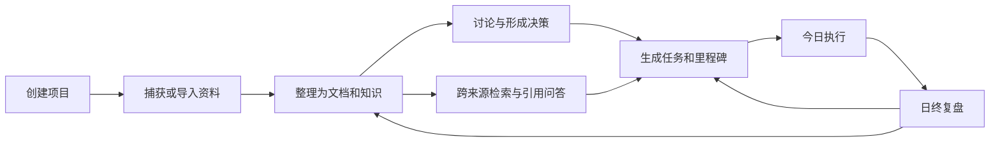

# 个人上下文智能工作台：MVP 范围与验收标准

> 版本：V1.0  
> 日期：2026-08-24  
> 状态：已确认（确认门 G1 通过）  
> 确认记录：2026-08-24，D1–D10 全部采用推荐默认项  
> 目标：冻结首个工程化版本的功能边界、优先场景和业务验收标准

## 0. G1 决策记录

以下决定已经确认，是后续架构、数据和开发工作的产品边界。

| 决策 ID | 需要确认 | 推荐默认项 | 主要影响 |
|---|---|---|---|
| D1 | MVP 使用模式 | **首版单用户；支持自己与 AI 的讨论，不做多人、@和成员协作** | 显著降低身份、通知和冲突复杂度；数据模型预留成员字段 |
| D2 | 首个垂直场景 | **通用个人研究/项目闭环**，可覆盖博士学习与个人 AI 项目 | 避免首版绑定公司审批或单一专业领域 |
| D3 | 首批项目模板 | **通用、博士科研、AI 应用探索**；学习和公司研发先保留模板入口 | 决定演示数据和专业字段投入顺序 |
| D4 | 公司科研 | **MVP 不接真实公司数据**；只完成受限空间模型和虚构场景测试 | 未明确公司政策前避免数据与合规风险 |
| D5 | 全局上下文默认范围 | **默认最近使用的个人空间与当前项目；“全部授权内容”由用户显式切换** | 降低意外召回和心理不安全感 |
| D6 | 学习提升首期 | **学术英语阅读与写作优先，口语保留文本/录音上传入口但不做发音评分** | 避免首版引入语音服务和音频治理 |
| D7 | 移动入口 | **先做响应式 Web/PWA；飞书列为 P1，微信暂缓** | 先保证平台无关的基础入口 |
| D8 | AI 运行时 | **MVP 使用 Native Mock/基础模型适配；Harness/Hermes 均不构成 MVP 依赖** | 先验证业务契约，再做隔离 POC |
| D9 | 数据部署 | **首版本机单用户、本地优先；不开放公网，不做多设备自动同步** | 架构简单、安全边界清楚 |
| D10 | 视觉与导航 | **沿用当前天蓝原型；AI 运行中心放入“设置与系统”，不作为高频一级业务入口** | 减少侧栏复杂度，保留治理能力 |

---

## 1. MVP 产品目标

MVP 要证明个人上下文工作台能把“资料与想法”转换成“有来源的判断与可执行行动”，而不是只增加静态仪表盘页面。

成功结果：

1. 用户可以创建并管理一个真实结构的项目；
2. 项目中的文档、知识、讨论、决策、任务和里程碑相互关联；
3. 全局上下文可以检索授权内容并生成带引用回答；
4. AI 建议可以转为待确认的知识、决策或任务，不直接污染真源；
5. 今日页能汇总行动，日终复盘能回写项目并影响下一步；
6. 数据保存在本地开放格式中，索引可以重建，核心内容可导入导出。

---

## 2. MVP 核心闭环

垂直切片演示项目使用完全虚构的“个人上下文智能工作台研究项目”，不接入真实论文库、公司系统或个人账号。

---

## 3. MVP 范围

### 3.1 P0：首版必须完成

| 领域 | 功能 | 首版边界 |
|---|---|---|
| 项目 | 项目创建、编辑、归档、状态和模板 | 单用户；通用项目为主，专业模板只增加字段/视图 |
| 项目内容 | 文档、知识、讨论、决策、任务、里程碑、活动 | 支持关联、来源和基本状态；不做实时多人编辑 |
| 捕获 | 文本、链接、Markdown/常见文件导入 | 首次只进入 Raw/收件箱；AI 分类结果为候选 |
| 今日 | 今日重点、截止任务、项目焦点、待确认 | 所有行动回链项目或来源 |
| 复盘 | 每日完成、阻塞、收获、明日第一步 | 可关联任务/项目，不做复杂健康诊断 |
| 知识 | 全文搜索、项目/类型/时间/空间过滤 | 先建立可验证的全文基线，再增加混合检索 |
| AI 问答 | 上下文范围、带引用回答、无依据拒答 | 先只读；不自动写长期知识 |
| 上下文 | 当前项目、最近使用范围、手动上下文篮 | 全部授权范围需显式切换并展示来源范围 |
| 待确认 | 知识候选、任务候选、决策候选 | 显示差异、来源、影响和撤销能力 |
| 数据治理 | 个人公开/个人本地/公司受限空间模型 | MVP 只接虚构和个人测试数据，公司受限仅做规则测试 |
| 审计 | 关键读取、AI 运行、审批和写入事件 | 能回答谁/何时/为何/读取和修改了什么 |
| 数据可控 | 本地持久化、Markdown/JSON 导入导出、备份恢复 | 索引和向量不是唯一真源，可删除重建 |
| UI | PC 完整核心闭环、移动响应式高频入口 | 天蓝设计；补齐加载、空、错误和无权限状态 |
| Runtime | 统一契约、Native Mock/基础适配、运行事件 | Harness/Hermes 不进入 MVP 必需依赖 |

### 3.2 P1：MVP 后的核心增强

- 混合检索、语义召回、重排和知识图谱增强；
- 博士科研的文献、问题/假设、实验和 Claim—Evidence；
- AI 应用的需求信号、机会卡、原型和评测门；
- 学习提升通用模型及学术英语模板；
- 前沿雷达的一手来源、事件聚类、技术卡和周报；
- PWA 离线草稿、飞书捕获/问答/任务卡片；
- Harness 只读隔离 POC；Hermes 消息网关/对照 POC；
- 成本统计、自动简报和更完整的可审计 Agent 能力。

### 3.3 明确不在 MVP

- 多人项目成员、@、实时协作、组织权限和复杂审批流；
- 真实公司科研资料接入或公网公司部署；
- 自动发送消息、自动发布内容、自动修改第三方系统；
- 个人微信非官方自动化；
- 多设备实时同步和原生移动 App；
- 自动保存 Runtime 长期记忆；
- Harness/Hermes 双主循环或互相嵌套；
- 自动安装未知插件/技能；
- 医疗建议、心理诊断或基于作息/健身数据的健康结论；
- 完整科研 LIMS、企业 PM、CRM、财务或人事系统替代能力。

---

## 4. 业务验收场景

| ID | 场景 | 前置 | 通过条件 |
|---|---|---|---|
| MVP-AC-01 | 创建项目 | 用户在项目组合页 | 选择模板、填写名称和目标后创建成功；重启后仍存在；活动记录可见 |
| MVP-AC-02 | 导入资料 | 已有项目 | 导入虚构 Markdown/文件后进入收件箱；来源、时间、空间和原文件可追踪 |
| MVP-AC-03 | 整理知识 | 收件箱有资料 | 摘录或 AI 摘要先成为候选；用户确认后生成知识条目并回链来源 |
| MVP-AC-04 | 讨论收口 | 项目有讨论 | 讨论可转为决策与任务；保留原讨论、决定、理由和负责人/日期 |
| MVP-AC-05 | 全局搜索 | 至少两个项目有资料 | 可按项目、对象、时间和空间筛选；结果打开到原文或对象 |
| MVP-AC-06 | 引用问答 | 已有可检索资料 | 回答的事实性结论带来源；点击能定位；无依据时明确说明不足 |
| MVP-AC-07 | 上下文范围 | 存在多个项目/空间 | 用户能看到纳入和排除范围；默认不静默扩大到全部授权内容 |
| MVP-AC-08 | 权限隔离 | 构造受限空间测试数据 | 无权或模型策略禁止时不读取标题、片段或正文；审计记录排除原因 |
| MVP-AC-09 | 待确认写入 | AI 生成任务/知识候选 | 未确认不改变业务数据；确认后显示差异和来源；可撤销低风险写入 |
| MVP-AC-10 | 今日执行 | 多项目有任务 | 今日页展示 1–3 个重点、截止和待确认；完成后同步原项目状态 |
| MVP-AC-11 | 日终复盘 | 今日有行动 | 保存完成、阻塞、收获和明日第一步；可回链项目并生成次日候选 |
| MVP-AC-12 | 异常与恢复 | 模拟解析/模型/写入失败 | UI 不伪装成功；显示可理解错误；安全重试不重复创建对象 |
| MVP-AC-13 | 备份恢复 | 已产生一组项目数据 | 完成备份、清空测试实例、恢复并核对核心对象与关系一致 |
| MVP-AC-14 | 移动响应式 | 手机尺寸访问 | 可查看今日、捕获、提问、处理任务和复盘；无横向溢出 |
| MVP-AC-15 | Runtime 解耦 | 切换 Mock/基础适配 | 页面和业务数据不随 Runtime 改变；运行事件结构保持一致 |

---

## 5. 非功能验收底线

| 类别 | MVP 底线 |
|---|---|
| 隐私 | 仓库、截图、日志和测试不含真实个人/公司资料或密钥；隐私扫描通过 |
| 权限 | 空间与模型策略在检索和工具调用前执行；默认拒绝不明确权限 |
| 可靠性 | 核心写操作幂等；失败不产生假成功；备份和恢复经过演练 |
| 性能 | 普通本地测试库中，页面交互无明显阻塞；搜索和首屏预算在架构阶段量化 |
| 可访问性 | 键盘可操作；Dialog 有焦点管理；正式正文不沿用已知过小字号 |
| 可移植性 | 核心内容使用开放格式；索引、向量和图谱可以从真源重建 |
| 可观测性 | 关键请求和 Agent Run 有 request/run ID、状态、错误、耗时和来源范围 |
| 可维护性 | 业务对象、存储、检索和 Runtime 有契约边界；新增模板不复制底座 |

---

## 6. MVP 发布判定

MVP 只有同时满足以下条件才可进入脱敏试运行：

1. `MVP-AC-01` 至 `MVP-AC-15` 通过或有用户批准的降级说明；
2. 没有已知高危权限绕过、敏感信息泄漏或静默外部写入；
3. 构建、测试和隐私扫描通过；
4. 首个垂直切片由用户实际走查并确认；
5. 数据备份、恢复和删除路径验证完成；
6. 原型/POC 能力和生产可用能力在 UI 与文档中清楚区分；
7. 真实数据接入另行授权，不因 MVP 通过自动获得权限。

---

## 7. G1 通过后的下一步

按顺序执行：

1. 生成工程现状与基线报告；
2. 建立需求追溯矩阵；
3. 生成系统架构与技术选型候选方案，进入确认门 G2；
4. 生成领域模型、数据字典和权限安全设计，进入确认门 G3；
5. 根据 G2/G3 结论开始项目垂直切片编码。

G1 已通过，可以生成系统架构与技术选型候选方案；在 G2/G3 未确认前，不安装新的生产依赖、不冻结数据库 Schema，也不开始大规模生产代码改造。
