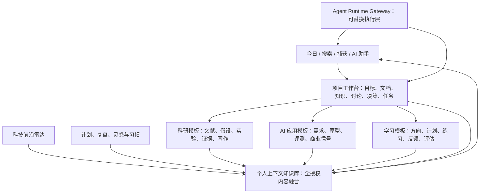
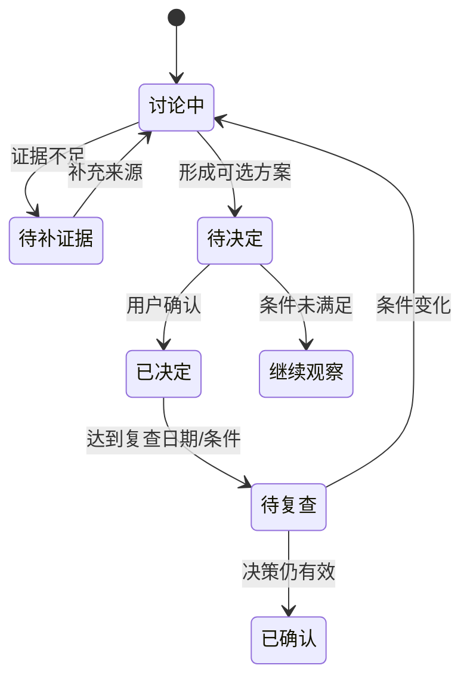
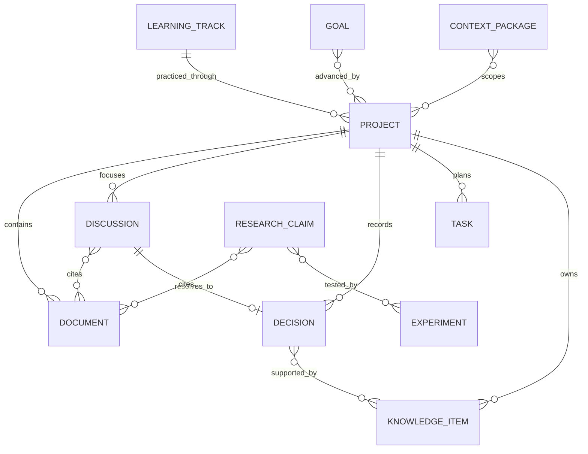

# 个人上下文智能工作台：UI 原型与功能 Spec

> 文档版本：V1.2  
> 原型版本：Prototype 0.2  
> 日期：2026-08-25  
> 文档状态：可进入产品评审与研发拆分  
> 上位文档：`个人上下文智能工作台_需求分析与产品设计.md`
> 运行时决策：`Agent运行时融合方案_DeepSeek_Harness与Hermes.md`

---

## 0. 文档目的

本文把需求分析转化为一套可点击的高保真 UI 原型及可实施的产品规格，供产品、设计、前端、后端、AI 工程、测试和项目负责人共同评审。

本次交付重点回答五个问题：

1. 用户在 PC 与移动端如何进入和使用核心能力；
2. 项目工作台、科研、AI 应用实验室、学习提升与个人上下文知识库如何归并；
3. 页面、组件、交互和状态应该如何表现；
4. 原型中的演示数据与正式产品能力边界如何区分；
5. 哪些条件满足后可判定 MVP 可用。

### 0.1 原型入口

- 本地运行地址：`http://127.0.0.1:5173/prototype`
- 原型代码：`person_dashboard-main/Workbench/src/prototype/PrototypeApp.jsx`
- 原型样式：`person_dashboard-main/Workbench/src/prototype/prototype.css`
- 运行基础：沿用 `person_dashboard` 的 React/Vite Workbench，不改变现有演示页面。

### 0.2 原型范围

本轮已覆盖：

- 今日工作台；
- 项目组合与项目详情；
- 个人上下文知识库；
- 科研工作台；
- AI 应用实验室；
- 科技前沿雷达；
- 学习提升；
- 计划与复盘；
- 全局搜索、快速捕获、新建项目和 AI 助手；
- AI 运行中心：Harness POC、Hermes 候选、松耦合链路与安全护栏；
- 项目讨论转决策；
- PC、平板和移动端响应式布局。

本轮不包含：

- 真实账号、组织和权限服务；
- 数据库存储、同步、全文/向量检索和知识图谱计算；
- 真实模型调用、Harness/Hermes 进程、Agent 工具调用及外部写操作；
- 飞书/微信连接器和通知推送；
- 音频录制、OCR、论文元数据抓取；
- 真实业务数据及个人隐私数据。

原型内的项目、任务、论文、指标、公司和讨论均为合成演示数据。

---

## 1. 产品定位与设计结论

### 1.1 一句话定位

以项目为执行骨架、以个人上下文知识库为统一认知层、以可引用 AI 助手为交互入口的个人研究与创新工作台。

### 1.2 核心产品结构

### 1.3 归并规则

- 项目工作台是通用执行底座，不重复建立科研任务、AI 项目任务或学习任务系统。
- 科研、AI 应用、学习提升是“专业项目视图 + 模板 + 专属对象”，共用项目文档、知识、讨论、决策、任务和里程碑。
- 英语不再是一级独立产品，而是学习提升的首个内置方向；后续可增加科研方法、编程与 AI、专业技术、表达写作等方向。
- 个人上下文知识库拥有对全部授权项目和模块的逻辑访问能力，但不复制原文，不绕过来源权限。
- 今日页只提供行动聚合，不成为新的任务真源。
- AI 输出默认可追溯到来源；写入记忆、创建任务或执行外部动作需用户确认。
- DeepSeek Harness 与 Hermes 均位于 Workbench 后方，通过统一 Runtime Adapter 接入；一个 Run 只允许一个主运行时，运行时内部记忆不得自动成为个人上下文真源。

---

## 2. 信息架构与导航

### 2.1 PC 一级导航

| 分组 | 一级入口 | 页面 ID | 主要目标 |
|---|---|---|---|
| 工作 | 今日 | P-TODAY | 聚合当日重点、提醒、项目焦点和复盘入口 |
| 工作 | 项目 | P-PROJECTS | 建立、筛选和推进不同类型项目 |
| 知识 | 上下文知识库 | P-CONTEXT | 融合全部授权内容，检索、问答、发现关系 |
| 专业 | 科研工作台 | P-RESEARCH | 支撑博士学习、学术研究和公司科研项目 |
| 专业 | AI 应用实验室 | P-AILAB | 从需求信号到原型评测和孵化决策 |
| 专业 | 科技前沿 | P-RADAR | 跟踪 AI、IT、电力能源和科研前沿 |
| 成长 | 学习提升 | P-LEARNING | 管理可扩展学习方向，英语为首个模板 |
| 成长 | 计划与复盘 | P-PLANNING | 目标、日计划、总结、灵感、健身与作息 |
| 输出 | 媒体数据 | P-MEDIA | 汇总不同媒体渠道的数据入口；抖音数据为首个子项 |
| 系统 | AI 运行中心 | P-RUNTIME | 查看执行引擎、任务、审批、安全护栏和候选能力 |

### 2.2 全局固定入口

| 入口 | PC 位置 | 移动位置 | 行为 |
|---|---|---|---|
| 全局搜索 | 顶栏左侧 | 顶栏图标 | 打开搜索对话框，支持项目/文档/知识/任务混合检索 |
| 快速捕获 | 顶栏主按钮 | 顶栏主按钮 | 打开捕获弹窗，保存想法、链接、文档、任务或灵感 |
| AI 助手 | 左栏底部/页面按钮 | 底栏入口 | 从右侧抽屉打开，继承当前页面或项目上下文 |
| 新建项目 | 项目页主按钮 | 项目页浮层 | 选择空白、科研、AI 应用或学习模板 |

### 2.3 路由建议

| 页面 | 建议正式路由 | 原型内部状态 |
|---|---|---|
| 今日 | `/today` | `today` |
| 项目组合 | `/projects` | `projects` |
| 项目详情 | `/projects/:projectId/:tab?` | `project` + `projectTab` |
| 上下文知识库 | `/context` | `context` |
| 科研工作台 | `/research` | `research` |
| AI 应用实验室 | `/ai-lab` | `ai-lab` |
| 科技前沿 | `/radar` | `radar` |
| 学习提升 | `/learning` | `learning` |
| 计划与复盘 | `/planning` | `planning` |
| 媒体数据 | `/media` | `media` |
| 抖音数据 | `/douyin` | `douyin` |
| AI 运行中心 | `/system/ai-runtime` | `runtime` |

正式版本应采用 URL 路由，使页面可刷新、收藏和分享；原型为了快速评审，使用单页内部状态切换。

---

## 3. UI 视觉规范

### 3.1 视觉方向

在 `person_dashboard` 的清晰分栏、卡片、渐变和数据密度基础上，将紫色主视觉改为天蓝色，并保留轻量玻璃、柔和渐变、细边框和低强度阴影。整体气质应兼顾“科研可信度”和“个人工作台亲和感”。

品牌名称统一使用 `DDUP`，副标题使用 `Good Good Study  Day Day Up`（`Study` 后保留两个空格，`Day Day` 与 `Up` 之间保留一个空格）。品牌标识采用天蓝渐变圆角方形中的双 D 线性结构，表达“数据/知识进入统一上下文并形成回路”；不使用复杂吉祥物、厚重 3D 或与具体渠道绑定的符号。桌面侧栏显示标识、DDUP 和副标题；移动顶栏显示标识与 DDUP，图形在 32 px 与 180 px 仍需清晰。

### 3.2 核心色彩令牌

| Token | 色值 | 用途 |
|---|---:|---|
| Paper | `#F8FCFF` | 页面背景 |
| Surface | `#FFFFFF` | 主卡片、弹窗、侧栏 |
| Surface Soft | `#F0F9FF` | 浅色区块、弱强调 |
| Ink | `#0B1220` | 主标题与正文 |
| Ink Soft | `#526174` | 次级正文 |
| Ink Faint | `#93A4B8` | 辅助信息、时间和提示 |
| Line | `#E2EBF3` | 常规分隔线 |
| Sky Primary | `#0EA5E9` | 主按钮、激活态、关键数据 |
| Sky Strong | `#0284C7` | 悬停、文字链接 |
| Sky Deep | `#0369A1` | 高对比蓝色文字 |
| Sky Soft | `#7DD3FC` | 渐变起点、边框强调 |
| Cyan | `#06B6D4` | 次级数据系列 |
| Indigo | `#4F6FE7` | 第三数据系列，控制使用面积 |
| Amber | `#D97706` | 风险、等待、需确认 |
| Red | `#DC2626` | 错误、阻塞、高风险 |
| Green | `#16A34A` | 完成、成功 |

### 3.3 渐变与背景

- 主按钮：`#0EA5E9 → #2563EB`，135°；
- 进度条：`#7DD3FC → #0EA5E9`；
- 页面背景：右上天蓝径向光晕 + 底部浅蓝光晕 + Paper 底色；
- Hero 区允许使用弱蓝渐变和几何光环，不在正文卡片中堆叠强装饰；
- 阴影透明度控制在 3%–18%，避免商务后台式厚重悬浮。

### 3.4 字体与层级

- 页面标题：Display 字体，PC 31–40 px，移动 26–31 px；
- 卡片标题：14–20 px；
- 正文：10–13 px（原型密度），正式实现建议不低于 12 px；
- 元信息与数据标签：Mono 字体 8–11 px；
- 中文正文行高建议 1.55–1.75。

### 3.5 组件规格

| 组件 | 视觉 | 交互要求 |
|---|---|---|
| Sidebar | 252 px、白色半透明、右边框 | 当前项显示蓝色浅底和左侧强调；支持收起 |
| Topbar | 固定高度、全局入口 | 搜索、捕获、通知和 AI 入口保持稳定位置 |
| Panel | 17 px 圆角、细边框、低阴影 | 可包含标题、操作和空状态 |
| Badge | 胶囊形、Mono 小字 | 状态不可只靠颜色表达 |
| Primary Button | 天蓝渐变或纯天蓝 | 悬停、按下、禁用、加载态齐全 |
| Tabs | 浅色容器 + 激活蓝色填充 | 支持横向滚动、键盘切换 |
| Modal | 居中、暗色毛玻璃遮罩 | Esc/遮罩关闭，危险操作不可误触 |
| Drawer | 右侧 420 px | 展示上下文范围和来源，移动端全屏 |
| Toast | 右下，移动端顶部/底部安全区 | 3–5 秒消失，关键失败需保留 |

---

## 4. 页面功能 Spec

### 4.1 P-TODAY 今日工作台

#### 页面目标

让用户在 30 秒内判断今天最重要的 1–3 件事、当前项目风险和下一步行动。

#### 页面结构

1. 欢迎 Hero：日期、工作状态、今日主目标；
2. 指标条：今日任务、活跃项目、待确认、连续复盘；
3. 今日行动：任务列表，显示来源项目和时间；
4. 项目焦点：活跃项目进度与下一节点；
5. 智能简报：前沿、科研、AI 机会的重点变化；
6. 待复核：高风险、待确认、过期内容；
7. 日终复盘入口。

#### 交互

- 点击任务跳转来源项目详情，而不是在今日页复制任务；
- 点击项目焦点打开该项目总览；
- 点击“快速记录”打开 G-CAPTURE；
- 点击“让 AI 帮我排今天”打开 G-ASSISTANT，范围为今日任务 + 活跃项目；
- 待确认项执行前必须展示影响范围。

#### 对应功能

`G-01`、`G-08`、`G-10`、`P-02`、`P-03`、`P-04`。

### 4.2 P-PROJECTS 项目组合

#### 页面目标

统一查看个人、科研、公司研发、AI 应用和学习项目，快速识别状态、风险与下一动作。

#### 页面结构

- 状态筛选：全部、进行中、等待、已归档；
- 组合筛选：领域、空间、优先级、时间；
- 项目卡：类型、状态、目标摘要、进度、下一里程碑、任务/文档数量；
- 新建项目卡。

#### 新建项目流程

1. 选择模板：空白、科研、AI 应用、学习提升；
2. 输入项目名称；
3. 正式版补充空间、目标、成功标准和时间范围；
4. 创建后进入项目总览；
5. 自动生成模板所需的专业视图，但不重复生成通用对象。

#### 对应功能

`PRJ-01`、`PRJ-02`、`PRJ-14`。

### 4.3 P-PROJECT-DETAIL 项目详情

#### 顶部摘要

- 项目名称、类型、空间与状态；
- 进度、更新时间和负责人；
- 快速打开项目 AI 助手；
- 六个主标签：总览、文档、知识、讨论、决策、任务。

#### 总览标签

| 区块 | 内容 | 主要操作 |
|---|---|---|
| 项目焦点 | 目标、范围、成功标准、关键问题 | 编辑、发起讨论 |
| 下一里程碑 | 日期、交付物、完成条件 | 查看计划、调整 |
| 近期讨论 | 主题、参与者、关联材料、状态 | 回复、转决策 |
| 风险与问题 | 概率、影响、负责人、应对 | 更新、升级 |
| 下一步 | 1–3 个明确动作 | 转任务、完成 |

#### 文档标签

- 类型：需求、方案、会议、报告、附件、外部链接；
- 字段：标题、类型、版本、作者、更新时间、空间、关联对象；
- 操作：预览、上传、建立新版本、引用到讨论/决策。

#### 知识标签

- 对象：概念、事实、结论、证据、术语、FAQ；
- 展示来源、可信度、更新时间、关联项目；
- 可进入项目内问答；
- 回写全局上下文时保留项目和空间归属。

#### 讨论标签

- 讨论围绕“问题”创建，而不是模拟即时聊天；
- 可引用文档、知识条目、实验和任务；
- 状态：讨论中、待补证据、待决定、已关闭；
- 结论出口：转决策、转任务、继续观察、关闭。

#### 决策标签

- 字段：决策题目、背景、选项、证据、反对意见、决定、负责人、日期、复查条件；
- 决策必须回链原讨论和引用来源；
- 高影响决策需二次确认。

#### 任务标签

- 列表/看板双视图；
- 字段：标题、来源、负责人、截止、优先级、状态、依赖、阻塞、里程碑；
- 今日页仅引用任务，不复制任务记录。

#### 讨论转决策状态机

#### 对应功能

`PRJ-03`–`PRJ-15`。

### 4.4 P-CONTEXT 个人上下文知识库

#### 当前实现状态（2026-08-27）

- 正式页面 `/context` 已落地，不再仅是 `/prototype` 中的静态演示；
- 当前支持受控虚构 Markdown 导入、Source/SourceVersion/Document 版本对象、来源列表和 Project/Task/Capture/Document 统一全文检索；
- 搜索先限定当前会话可访问的空间，再组合项目、对象类型和日期过滤；Document 命中固定到 `source_version_id + char_range`；
- 已实现显式 ContextPackage：用户先填写名称、用途和可选有效期，再从授权检索结果逐项加入；文档项锁定 SourceVersion 和字符范围，其他项只保存对象引用；
- 上下文篮创建、加入、移除和归档均有版本锁、幂等、Audit/Outbox；过期、归档、缺失或版本漂移项保持排除，不返回正文；
- PC 与 390 px 移动布局已经浏览器走查并保存合成数据截图；
- 知识网络、默认启用的混合/语义检索、重排和带引用回答仍未实现；上下文篮当前也不会触发模型运行。

#### 页面目标

在用户授权范围内融合全部项目、科研、AI 实验、前沿、学习和计划内容，支撑跨项目分析、第二大脑和带引用问答。

#### 页面结构

1. 上下文范围摘要：覆盖模块、项目和空间；
2. 全局提问入口；
3. 知识网络：项目、概念、文献、实验、决策和目标关系；
4. 动态专题与保存的检索；
5. 来源质量与待复核队列；
6. 最近进入上下文的对象。

#### 范围规则

- 默认：全部“当前用户有权且允许 AI 访问”的内容；
- 用户可以手动缩小到项目、模块、时间、空间或对象类型；
- 每次回答显示“已覆盖 / 已排除 / 命中”的范围；
- 权限过期、公司策略禁止或未批准模型的内容只显示排除原因，不读取正文；
- 全局知识库保存索引和关系，不改变源对象归属。

#### 回答结构

1. 直接结论；
2. 事实、推断、未知分层；
3. 来源引用与原文定位；
4. 命中范围说明；
5. 可选后续动作：加入上下文篮、转研究问题、转项目讨论、保存专题。

#### 对应功能

`K-01`–`K-13`、`G-04`–`G-06`。

### 4.5 P-RESEARCH 科研工作台

#### 页面目标

将文献、研究问题、假设、实验、证据和科研交付物放在同一项目链路中，支持博士学习及研究和公司科研项目。

#### 页面结构

- 研究项目组合与阶段；
- 研究问题与可证伪假设；
- Claim—Evidence 关系；
- 文献矩阵与阅读队列；
- 实验设计、运行日志、结果和失败分析；
- 科研雷达与阶段交付物。

#### 核心规则

- Claim 必须标记“已支持、部分支持、被反证、待验证”；
- 每条 Claim 至少关联一条来源或明确标记暂无证据；
- 实验保存变量、基线、数据、环境、版本、指标和结果；
- 公司科研资料受独立空间策略约束；
- 写作助手只基于已选证据生成，不虚构引用。

#### 对应功能

`R-01`–`R-12`。

### 4.6 P-AILAB AI 应用实验室

#### 页面目标

把 AI 应用探索从“收藏产品”升级为可验证的机会—需求—原型—评测—决策流程。

#### 阶段管道

`需求信号 → 机会卡 → 调研 → 原型 → 评测 → 孵化/观察/暂停/终止`

#### 页面结构

- 阶段统计与管道；
- 需求信号池；
- 机会卡；
- 活跃原型和最新版本；
- AI 评测摘要：质量、成本、延迟、人工评价；
- 竞品与创业跟踪；
- 探索决策门。

#### 决策门要求

- 继续：定义下一验证与预算；
- 孵化：转正式项目并生成交付计划；
- 观察：设置信号和复查日期；
- 暂停：记录阻塞条件；
- 终止：记录原因、可复用资产和反事实条件。

#### 对应功能

`A-01`–`A-10`。

### 4.7 P-RADAR 科技前沿雷达

#### 页面目标

以可核验、去重和影响评估的方式持续跟踪 AI、IT、电力能源和科研方法前沿。

#### 页面结构

- 领域标签：AI、IT、电力能源、科研、自定义；
- 信号流：来源等级、事件时间、热度、可信度；
- 事件聚类：同一事件合并展示不同观点；
- 技术卡：原理、进展、成熟度、限制、代表项目、时间线；
- 影响评估：对科研、公司、AI 应用和学习的影响；
- 日报/周报与专题档案。

#### 内容标记

每条信号必须区分：`一手事实`、`二手转述`、`观点`、`系统推断`。系统推断不可伪装成事实。

#### 对应功能

`T-01`–`T-09`。

### 4.8 P-LEARNING 学习提升

#### 页面目标

建立可扩展的个人学习系统，从目标和能力基线出发，经计划、实践、反馈和评估形成能力提升闭环。

#### 方向卡

- 英语：首个内置模板；
- 科研方法；
- 编程与 AI；
- 专业技术；
- 后续可创建任意自定义方向。

#### 通用学习结构

`方向 → 目标/基线 → 知识地图 → 资源 → 计划 → 练习/项目 → 反馈 → 阶段评估 → 成果沉淀`

#### 英语模板

- 日常口语、学术阅读、学术写作三个目标域；
- 听说读写和复习日计划；
- 会议、汇报、问答、讨论等场景对练；
- 论文精读、句法拆解、术语卡和摘要；
- 写作逻辑、语法和术语一致性反馈；
- 错误进入候选卡，用户确认后才保存；
- 音频保存必须单独授权。

#### 对应功能

`L-01`–`L-12`、`E-01`–`E-09`。

### 4.9 P-PLANNING 计划与复盘

#### 页面目标

把长期目标、每日行动、复盘、灵感和低敏健康习惯连接到项目与学习成果中。

#### 页面结构

- 年/季/月目标与路线图；
- 今日 1–3 个关键结果；
- 任务和日历聚合；
- 三分钟日终复盘；
- 灵感快记与发散/收敛；
- 健身、睡眠区间和习惯；
- 时间去向与周/月复盘。

#### 日终复盘字段

- 今天完成了什么；
- 最大阻塞；
- 新发现/灵感；
- 明日第一步；
- 未完成项处理：转明日、改期、放弃；
- 可选情绪字段，不用于医疗诊断。

#### 对应功能

`P-01`–`P-10`。

### 4.10 P-RUNTIME AI 运行中心

#### 页面目标

让用户确认“当前由谁执行、能读取什么、需要哪些审批、失败后如何恢复”，同时保持产品不绑定某一个 Agent 框架。

#### 页面结构

1. 运行时概览：Native RAG、DeepSeek Harness、Hermes 的状态、定位和能力；
2. 松耦合架构卡：Workbench → Runtime Gateway → Adapter → Runtime；
3. 当前 Profile：用途、项目/空间、工具、写入等级和预算；
4. 运行任务：执行中、等待审批、失败、完成，展示进度与运行时；
5. 安全护栏：沙箱、网络、文件、凭据、工具白名单、外部写确认；
6. Hermes 评估：消息网关、远程执行、技能候选三项价值及 POC 状态。

#### 状态文案

| Runtime | 原型状态 | 用户可见定位 | 操作 |
|---|---|---|---|
| Native RAG | 可用 | 轻量问答 | 查看能力 |
| DeepSeek Harness | 隔离 POC | 研究执行器 | 查看 POC 边界 |
| Hermes Agent | 候选，未连接 | 移动网关/备选执行器 | 查看评估，不提供启用 |

#### 交互规则

- 原型中的“暂停/查看详情”只给反馈，不启动真实运行时；
- 运行时选择由 Profile 配置，不在普通聊天中随意切换；
- 若从一个 Runtime 切换到另一个，必须创建新 Run 并显示新的上下文快照；
- Hermes 未通过评估前不得显示为可用或健康；
- 页面不展示密钥、完整提示词或受限日志正文。

#### 对应功能

`AR-01`–`AR-14`、`G-08`、`G-09`、`S-02`、`S-04`。

---

## 5. 全局组件与交互 Spec

### 5.1 G-SEARCH 全局搜索

#### 输入

关键词、自然语言问题、对象名称、项目名称、标签或命令。

#### 结果分组

项目、文档、知识、讨论、决策、任务、论文、实验、学习资源、前沿事件。

#### 状态

- 默认：最近访问和建议命令；
- 输入中：300 ms 防抖；
- 有结果：高亮命中词并显示来源项目/空间；
- 无结果：建议调整范围或转 AI 问答；
- 无权限：不返回标题和片段，只统计被排除范围；
- 错误：保留查询并支持重试。

### 5.2 G-CAPTURE 快速捕获

#### 类型

想法、链接、文档、任务、灵感；正式版增加图片/OCR 和语音转写。

#### 字段

- 内容或文件；
- 目标位置：收件箱或具体项目；
- 标签；
- 是否立即生成摘要/候选任务；
- 数据空间。

#### 保存规则

首次保存只创建 Raw 素材；AI 生成的标签、摘要、知识和任务均为候选，需确认或按用户已配置的低风险规则执行。

### 5.3 G-ASSISTANT AI 助手

#### 展示

- 右侧抽屉，PC 宽 420 px；移动端全屏；
- 顶部显示当前上下文范围；
- 顶部以“研究执行器 · 隔离运行”等非技术标签显示当前 Profile；详情中再显示 Harness/Hermes/Native 实现；
- 欢迎态提供场景建议；
- 回答态展示结论、来源、范围和可执行动作；
- 输入区支持添加附件、上下文篮和模式选择。

#### 模式

| 模式 | 输出 | 默认权限 |
|---|---|---|
| 问答 | 带引用回答 | 只读 |
| 深度研究 | 检索计划、综合报告、证据缺口 | 只读，长任务 |
| 生成 | 文档、计划、讨论草案 | 生成草稿，不自动回写 |
| 计划执行 | 多步计划与工具动作 | 每个高影响步骤确认 |

#### 上下文优先级

`用户手动选择 > 当前项目/页面 > 保存的上下文包 > 全局授权知识 > 通用模型知识`。

每个多步 Run 必须提供计划、进度、工具、来源、审批、运行时、模型、耗时、成本、取消和调整方向；移动端可折叠技术细节，但不能隐藏权限与外部写入状态。

### 5.4 G-NEW-PROJECT 新建项目

- 原型字段：模板、名称；
- 正式字段：空间、目标、成功标准、计划周期、负责人/成员、导入已有材料；
- 名称为空时主按钮禁用；
- 创建成功后生成项目对象并跳转总览；
- 创建失败保留输入，不重复创建。

### 5.5 通知与待确认

- 通知用于“知会”，待确认用于“需要决定或授权”；
- 高风险写操作不可只发通知后自动执行；
- 待确认卡显示：动作、原因、目标、读取数据、写入数据、影响、可撤销性；
- 用户可批准、编辑后批准、拒绝或延后。

---

## 6. 移动端与飞书/微信设计

### 6.1 移动端产品原则

移动端不追求全功能复制，核心是“看重点、快捕获、轻处理、可确认”。复杂知识编辑、实验设计、矩阵分析和系统治理保留在 PC。

### 6.2 响应式断点

| 断点 | 布局变化 |
|---:|---|
| `>1180 px` | 完整侧栏，多列工作区，完整顶栏操作 |
| `901–1180 px` | 内容列数减少，卡片自适应 |
| `621–900 px` | 隐藏侧栏，显示五项底部导航，主要页面单列 |
| `≤620 px` | 进一步压缩间距、卡片和按钮，弹窗接近全屏 |

### 6.3 移动底栏

固定五项：今日、项目、捕获、问 AI、知识。科研、AI Lab、雷达、学习和计划通过项目类型或顶部/侧滑“更多”入口进入。

### 6.4 移动端首期能力

| 能力 | 原生 Web | 飞书/微信 |
|---|---|---|
| 今日重点与提醒 | 完整 | 摘要卡片 |
| 快速捕获文本/链接/语音 | 完整 | 消息转发/机器人 |
| 查看项目焦点 | 完整 | 项目卡片 |
| 回复项目讨论 | 精简 | 卡片/消息线程 |
| 确认决策和待确认动作 | 完整 | 交互卡片 |
| 完成/延期任务 | 完整 | 交互卡片 |
| AI 问答 | 精简 | 机器人会话 |
| 日终复盘 | 完整 | 表单卡片 |
| 复杂文档与知识编辑 | 不作为首期重点 | 不支持 |

### 6.5 安全要求

- 飞书/微信只展示当前身份有权查看的内容；
- 公司空间默认不把正文推送到个人聊天；
- 卡片操作带短期有效签名，过期后重新确认；
- 敏感动作跳转到受控 Web 页面完成；
- 消息平台不作为唯一数据真源。

---

## 7. 数据对象与关系 Spec

### 7.1 核心对象

| 对象 | 必填字段 | 关键关系 |
|---|---|---|
| Project | id、name、type、space、status、goal | 文档、知识、讨论、决策、任务、里程碑 |
| Document | id、title、type、version、space、source | 项目、讨论、知识、引用 |
| KnowledgeItem | id、type、content、source、confidence | 项目、Claim、主题、其他知识 |
| Discussion | id、question、status、projectId | 文档、知识、参与者、决策、任务 |
| Decision | id、title、decision、owner、date | 讨论、证据、选项、复查条件 |
| Task | id、title、status、dueAt、sourceRef | 项目、目标、里程碑、阻塞 |
| ResearchClaim | id、statement、supportStatus | 文献、实验、反证、边界 |
| Experiment | id、hypothesis、variables、metrics、version | 项目、Claim、数据、结果 |
| Opportunity | id、user、job、pain、valueHypothesis | 信号、竞品、原型、评测、决策门 |
| RadarEvent | id、domain、eventTime、sourceLevel | 来源、观点、技术卡、影响 |
| LearningTrack | id、name、goal、baseline、status | 知识地图、计划、练习、反馈、评估 |
| Goal | id、level、title、period、status | 项目、学习方向、任务、复盘 |
| Capture | id、type、content、capturedAt、space | Raw、项目、候选知识/任务 |
| ContextPackage | id、name、scopeRules、expiresAt | 项目、对象、检索、AI 运行 |

### 7.2 统一关系

### 7.3 空间与权限字段

所有可检索对象必须包含：

- `space_id`：个人公开、个人本地、公司受限等；
- `owner_id`；
- `acl` 或权限策略引用；
- `ai_access_policy`：允许的模型、用途和正文范围；
- `source_ref`：原始对象定位；
- `created_at`、`updated_at`、`version`；
- `retention_policy`：保留与过期规则。

---

## 8. AI、检索与审计 Spec

### 8.1 检索链路

1. 解析用户问题和当前页面；
2. 计算上下文范围；
3. 应用身份、空间和模型权限过滤；
4. 执行全文、向量、标签、关系和时间混合召回；
5. 去重、聚类和重排；
6. 生成带来源回答；
7. 输出范围解释和未知项；
8. 记录运行审计。

### 8.2 引用要求

- 引用必须指向具体源对象和定位片段；
- 来源显示标题、类型、项目、空间、版本和访问时间；
- 原文更新后标记回答引用是否可能过期；
- 无来源生成内容必须标记为“建议/推断”；
- 任何自动回写均保存触发人、模型、输入范围和变更差异。

### 8.3 外部动作等级

| 等级 | 示例 | 策略 |
|---|---|---|
| L0 只读 | 搜索、总结、比较 | 可直接执行并记录 |
| L1 低风险草稿 | 生成计划、讨论草案 | 生成但不提交 |
| L2 内部写入 | 建任务、保存知识、修改状态 | 显示差异并确认，可撤销 |
| L3 外部写入 | 发消息、创建日程、发布内容 | 每次显式确认 |
| L4 高风险 | 删除、权限变更、公司系统关键操作 | 强确认、最小权限、完整审计 |

### 8.4 Agent Runtime 契约

- Workbench 只依赖统一 start、events、approve、steer、cancel、health 和可选 resume 能力；
- Harness 使用独立进程和 SDK/stdio JSON-RPC；Hermes 候选使用 HTTP + SSE 或 TUI Gateway JSON-RPC；
- Runtime 不直接读写项目数据库和 Vault，全部工具请求经过 Workbench Tool Gateway；
- 一个 Run 只能绑定一个 Runtime，禁止双主循环和循环委派；
- Runtime 的会话、日志、MEMORY/USER 或自建 skill 不自动回写个人上下文；
- 统一事件至少覆盖运行、消息、计划、步骤、工具、审批、产物、用量、检查点与错误。

---

## 9. 状态、空态与异常

### 9.1 通用页面状态

- Loading：优先骨架屏，超过 8 秒显示进度和取消；
- Empty：解释页面价值，提供一个主要开始动作；
- Error：说明影响范围、保留输入、支持重试；
- Offline：展示上次同步时间，允许安全的本地草稿；
- Permission Denied：说明缺少的权限和申请方式，不泄露内容；
- Partial Data：明确哪些来源失败，允许基于剩余数据继续；
- Archived：只读，并提供复制为新项目或恢复。

### 9.2 原型状态

原型主要演示默认态、激活态、弹窗态、抽屉态、搜索结果态、创建成功 Toast 和讨论转决策反馈。加载、错误、离线、权限申请和真实空态在研发阶段补齐。

---

## 10. 可用性与无障碍

- 所有操作按钮必须有可读标签；图标按钮提供 `aria-label`；
- 键盘可访问搜索、导航、标签、对话框和抽屉；
- 焦点进入弹窗后保持在弹窗内，关闭后返回触发控件；
- 文本与背景对比度满足 WCAG AA；
- 状态不可只依赖红/绿/蓝颜色，必须附文字或图标；
- 支持 `prefers-reduced-motion`，关闭不必要动画；
- 点击目标移动端不小于 44×44 px；
- 长列表支持搜索、筛选和分页/虚拟滚动；
- 时间、日期、单位和时区显示一致。

---

## 11. 埋点与产品指标

### 11.1 关键事件

| 事件 | 触发 | 关键属性 |
|---|---|---|
| `project_created` | 项目创建成功 | template、space、source |
| `project_opened` | 打开项目 | project_type、entry |
| `capture_saved` | 捕获成功 | capture_type、target、device |
| `discussion_resolved` | 讨论产生出口 | result_type、evidence_count |
| `context_query_completed` | 全局问答完成 | scope_count、source_count、latency |
| `source_opened` | 打开回答来源 | object_type、rank |
| `action_confirmed` | 用户批准 AI 动作 | action_level、edited |
| `action_rejected` | 用户拒绝 AI 动作 | reason、action_level |
| `runtime_run_started` | Runtime 开始运行 | runtime、profile、space_count |
| `runtime_approval_requested` | Runtime 请求审批 | runtime、tool、action_level |
| `runtime_run_completed` | Runtime 完成 | runtime、status、latency、cost、human_interventions |
| `learning_session_completed` | 完成学习练习 | track、practice_type、duration |
| `daily_review_completed` | 完成日终复盘 | duration、carryover_count |

### 11.2 MVP 指标

- 首次创建项目完成率；
- 每周活跃项目数；
- 捕获到被重新使用的比例；
- 带来源回答的来源打开率和“有帮助”率；
- 讨论形成决策/任务的比例；
- 日终复盘完成率；
- 学习计划完成率及实践成果数；
- AI 动作批准、编辑后批准和拒绝比例；
- 权限/来源失败率。

---

## 12. API 边界建议

`/prototype` 仍没有真实 API；正式页面已按 `/api/v1` 逐步落地。下表同时列出已实现契约与目标边界，接口返回统一包含 `request_id`、`status`、`data`、`errors` 和权限范围说明。

| 领域 | 代表接口 |
|---|---|
| Projects | `GET/POST /api/projects`、`GET/PATCH /api/projects/:id` |
| Project objects | `/api/projects/:id/documents|knowledge|discussions|decisions|tasks` |
| Capture | `POST /api/captures`、`POST /api/captures/:id/classify` |
| Context | 已实现受控来源、`POST /api/v1/context/search` 和 ContextPackage 创建/列表/详情/加入/移除/归档；目标 `POST /api/v1/context/answers` 尚未实现 |
| Assistant | `POST /api/assistant/runs`、`GET /api/assistant/runs/:id/events` |
| Research | `/api/research/claims`、`/api/research/experiments`、`/api/research/literature` |
| AI Lab | `/api/ai-lab/signals`、`opportunities`、`evaluations`、`gates` |
| Radar | `/api/radar/events`、`topics`、`briefs` |
| Learning | `/api/learning/tracks`、`plans`、`practices`、`assessments` |
| Planning | `/api/goals`、`/api/reviews`、`/api/habits` |
| Governance | `/api/spaces`、`/api/connectors`、`/api/audit-events` |
| Agent Runtime | `GET /api/runtimes`、`POST /api/runs`、`GET /api/runs/:id/events`、`POST /api/runs/:id/approve|steer|cancel` |

### 12.1 乐观更新

仅对可撤销、低冲突动作采用乐观更新，例如完成任务、切换关注。决策确认、权限修改、外部发送、删除和跨空间移动必须等待服务端成功。

---

## 13. 验收标准

### 13.1 UI 原型验收

| ID | 场景 | 通过条件 |
|---|---|---|
| UI-01 | 打开原型 | `/prototype` 可访问，默认进入今日页，无编译错误 |
| UI-02 | PC 导航 | 九个工作区（含系统级 AI 运行中心）均可切换，当前项明确 |
| UI-03 | 项目组合 | 项目卡显示类型、状态、进度和数量；可打开详情 |
| UI-04 | 项目详情 | 六个标签均可切换，内容与标签一致 |
| UI-05 | 讨论转决策 | 点击操作后出现成功反馈，讨论有明确收口出口 |
| UI-06 | 新建项目 | 模板可选，空名称不可提交，创建后进入新项目 |
| UI-07 | 全局搜索 | 可打开、输入、显示分组结果并跳转相关页面 |
| UI-08 | 快速捕获 | 可选类型、目标位置并保存，成功后有反馈 |
| UI-09 | AI 助手 | 抽屉可打开/关闭，显示当前项目或全局范围与引用示例 |
| UI-10 | 移动端 | 900 px 以下隐藏侧栏并显示底栏；主内容不横向溢出 |
| UI-11 | 视觉 | 主色为天蓝色，保留渐变，正文对比清晰 |
| UI-12 | 构建 | 生产构建完成，仅允许非阻塞的包体积提示 |
| UI-13 | AI 运行中心 | 显示 Harness 为隔离 POC、Hermes 为未连接候选，并明确 Workbench 真源和统一 Adapter 边界 |

### 13.2 MVP 业务验收

沿用上位需求文档 `AC-01`–`AC-15`，其中首期发布必须至少通过：`AC-02` 项目创建、`AC-03` 讨论收口、`AC-04` 跨模块检索、`AC-05` 结论引用、`AC-11` 日终复盘、`AC-13` 公司空间权限、`AC-14` 外部写确认。

---

## 14. 功能覆盖矩阵

| 原型页面/组件 | 已表现能力 | 研发需补充 |
|---|---|---|
| 今日 | 聚合布局、任务、项目焦点、简报、待复核 | 实时聚合、任务回链、简报生成 |
| 项目组合 | 卡片、筛选外观、新建模板 | 查询、权限、归档、真实筛选 |
| 项目详情 | 六标签、讨论转决策、风险和里程碑 | CRUD、版本、关联、协作 |
| 上下文知识库 | 正式页已实现受控 Markdown、权限优先全文索引、组合过滤、字符定位和显式上下文篮；PC/390 px E2E 已覆盖 | 图谱、重排、引用回答、默认启用的语义检索和更完整来源生命周期 |
| 科研 | Claim/证据、文献和实验视图 | DOI 导入、实验日志、写作校验 |
| AI Lab | 阶段管道、机会和评测布局 | 信号采集、评测运行、决策门持久化 |
| 雷达 | 领域筛选、来源/影响卡片 | 抓取、去重、聚类、订阅 |
| 学习提升 | 多方向、英语模板和学习闭环 | 计划引擎、练习、音频、评估 |
| 计划与复盘 | 目标、日计划、复盘、习惯、时间分布 | 日历同步、统计、提醒 |
| AI 助手 | 范围、建议、引用示例、操作按钮 | 模型编排、流式输出、审计与审批 |
| AI 运行中心 | Runtime 状态、松耦合链路、Profile、运行任务和护栏 | Adapter、事件流、审批桥、健康检查和契约回归 |
| 移动端 | 响应式侧栏/底栏/单列 | PWA、离线草稿、飞书/微信接入 |

---

## 15. 实施建议与版本拆分

### Sprint 0：原型评审与设计系统

- 评审八个业务入口是否需要继续精简，AI 运行中心保持系统级入口；
- 确认项目详情六标签和专业模板关系；
- 固化天蓝色设计令牌、组件和移动端底栏；
- 建立页面状态与空态规范。

### MVP-1：项目与今日闭环

- 项目、文档、讨论、决策、任务、里程碑；
- 今日聚合与快速捕获；
- 单用户个人空间；
- 基础全文搜索；
- Markdown 导入导出。

### MVP-2：融合上下文与科研/AI 模板

- 混合检索、引用问答、上下文范围解释；
- 科研 Claim—Evidence 和实验对象；
- AI 应用机会卡、原型与评测；
- 空间与 AI 访问策略。

### MVP-3：学习、雷达、计划与移动入口

- 学习提升通用模型和英语模板；
- 科技前沿订阅、聚类和周报；
- 复盘、灵感和习惯；
- 飞书机器人/卡片及移动 PWA。

### 增强版：可审计 Agent 与生态

- 建立统一 Runtime Gateway 和 Native Mock，冻结事件与 Tool Contract；
- DeepSeek Harness 只读隔离 POC，通过门槛后承载深度研究和计划执行；
- Hermes 只做消息网关、备选执行器和技能候选对照 POC，不与 Harness 嵌套；
- 待确认中心、运行历史、撤销；
- 连接器、模型路由、成本与审计；
- 团队/公司科研协作能力。

---

## 16. 原型评审问题

1. 八个业务导航是否符合使用频率，还是将“科研/AI Lab/学习”只作为项目模板入口？AI 运行中心是否应仅在设置中出现？
2. 今日页最重要的三块是否应固定为“今日行动、项目焦点、待确认”？
3. 项目详情六标签是否足够，风险/会议/交付物应作为总览区块还是独立标签？
4. 个人上下文默认覆盖“全部授权内容”是否符合心理预期，是否需要默认只覆盖最近使用范围？
5. 公司受限空间允许哪些模型和哪些跨空间摘要方式？
6. 英语学习首期更优先口语对练，还是论文阅读与学术写作？
7. 飞书与微信首期选择哪一个作为主要移动入口？
8. 原型中的高密度小字号是否需要在正式视觉稿中整体放大一级？

---

## 17. 可追溯性与交付结论

本 Spec 未新增与需求分析冲突的产品方向。页面和交互均从上位文档的 `G`、`PRJ`、`K`、`R`、`A`、`T`、`L/E`、`P`、`C/S`、`AR` 功能组归并而来。高保真原型优先展示 MVP 的核心认知与执行闭环；AI 运行中心只表达运行时边界与治理状态，不代表 Harness 或 Hermes 已安装。尚未在 UI 中完整展开的连接器、治理、创作与社媒能力仍保留在产品路线图中，不视为删除。

当前可进入下一步：原型评审 → 确认导航/范围/优先级 → 设计系统细化 → 研发架构与任务拆分。
