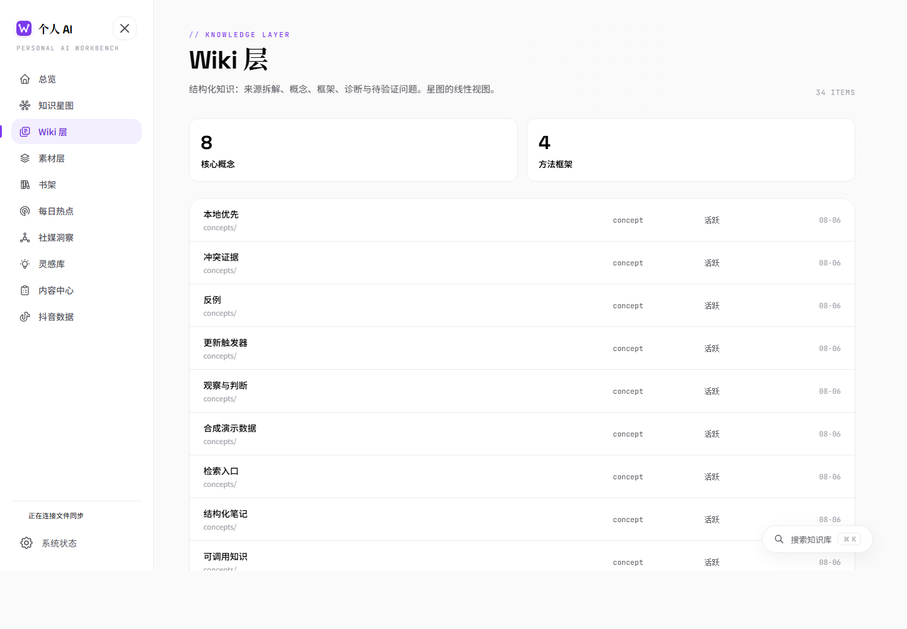
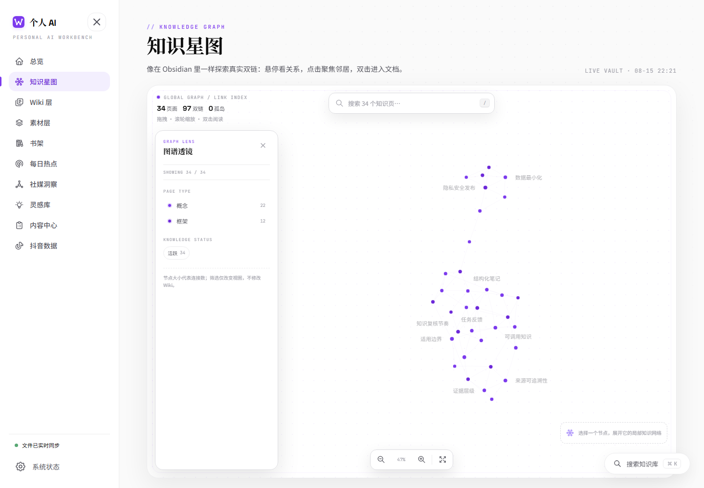
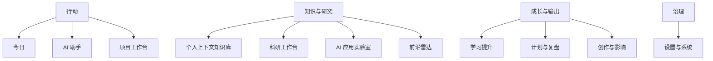
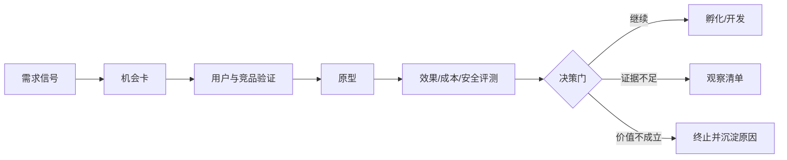
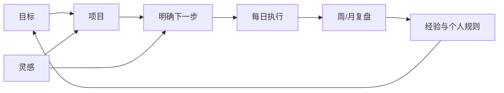
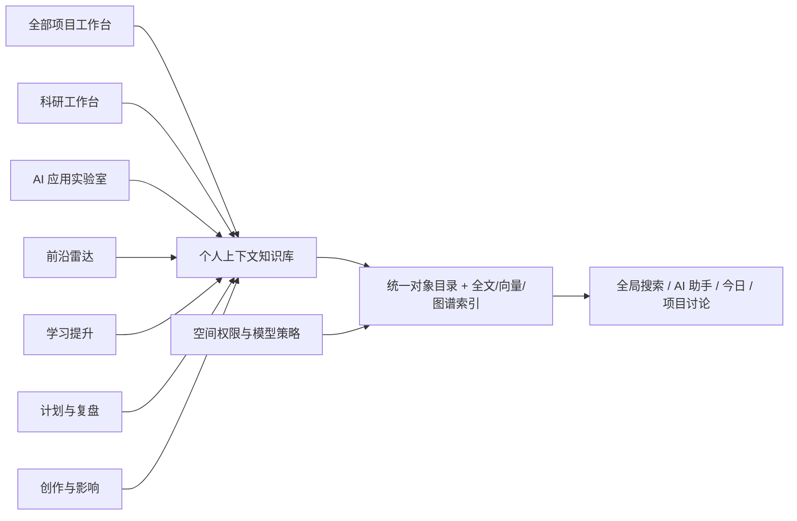
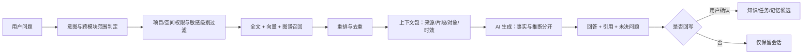

# 个人上下文智能工作台：需求分析与产品设计

> 版本：V1.3  
> 日期：2026-08-25  
> 状态：产品需求基线；G1–G4 已确认，当前进入 S4 上下文知识库  
> 基础原型：[`person_dashboard`](https://github.com/oyorf/person_dashboard)

## 0. 执行摘要

本产品不是再做一个“资料很多的仪表盘”，而是把 `person_dashboard` 升级为一个**本地优先、来源可追溯、上下文可管理、能形成下一步行动的个人 AI 工作台**。

核心设计决策如下：

1. **保留现有资产，不推倒重做。** 延续白底、细边框、点阵、知识图谱、技术标签和轻动效；将紫色主色替换为天蓝色，并优化为浅蓝—天空蓝—蔚蓝的渐变体系。
2. **把现有页面归并为稳定的工作域。** 总览升级为“今日”；星图、Wiki、素材、书架合并为“知识库”；热点与社媒洞察升级为“前沿雷达”；灵感、内容、抖音合并为“创作与影响”。
3. **新增“项目工作台”作为通用项目底座。** 用户可以建立科研、AI 应用、公司研发、学习提升、内容或个人行动项目；每个项目统一管理目标、文档、知识、讨论、决策、任务、里程碑、风险与交付物。
4. **统一 AI 助手是全局能力，不是一个孤立聊天页。** 助手支持问答、深度研究、生成、计划执行四种模式；所有事实性输出必须可回到来源，所有外部写操作必须审批。
5. **科研、AI 探索、学习提升等是专业工作台，也是项目组合视图。** 它们复用同一个项目对象与项目工作台，根据领域增加文献、实验、AI 评测、课程、练习等专业能力，避免同一项目产生两套数据。
6. **个人上下文知识库是全局融合层。** 它可访问用户有权访问的全部项目、科研平台、AI 应用实验室、前沿雷达、学习提升、计划复盘和创作内容，并通过结构化对象、全文检索、向量召回与知识图谱形成统一上下文。
7. **融合不等于取消权限。** 内容在逻辑上统一发现和关联，源文件、权限与模型使用策略仍按公开、个人本地、公司受限空间隔离；受限内容是否进入一次问答由用户权限和策略共同决定。
8. **“英语学习”扩展为“学习提升”。** 英语是首个内置方向，同时支持科研方法、编程与 AI、专业技术、表达写作、课程与认证等后续方向。
9. **PC 做完整工作，移动端做高频入口。** 移动端只承担捕获、提问、阅读、项目讨论与任务处理、提醒和简短复盘。首选“响应式轻应用 + 飞书机器人/卡片”，微信只考虑企业微信、小程序或服务号等合规渠道，不采用个人微信自动化。
10. **Agent 运行时松耦合。** Workbench 持有业务、知识、权限和审批真源，通过统一 `AgentRuntime` 接口接入执行引擎；DeepSeek Harness 进入隔离 POC，Hermes 仅作为备选运行时/移动消息网关评估，不允许双主循环或双重长期记忆。

一句话产品定位：

> 把分散的信息、研究、探索、学习与计划，转化为可追溯的个人上下文和明确的下一步行动。

### 0.1 当前落地快照（2026-08-25）

- 通用项目、里程碑/任务、人工讨论—决策—任务、通用捕获、今日与日终复盘已完成首个持久化闭环并通过 G4；
- 个人上下文知识库正式入口为 `/context`，已实现受控虚构 Markdown、Source/SourceVersion/Document 和权限优先的 Project/Task/Capture/Document 全文检索；
- 当前检索只是真实 FTS5 基线。混合/向量召回、重排、知识图谱、带引用回答和上下文篮仍属于后续设计/评测；
- Harness 仍为 `poc_not_connected`，Hermes 仍为 `candidate_not_connected`，不存在生产集成。

---

## 1. 背景与目标

### 1.1 当前问题

现有 `person_dashboard` 已经具备不错的本地知识展示与垂直数据看板能力，但仍存在四个断点：

- **信息有入口，行动缺闭环。** 页面能展示材料、Wiki、灵感与账号数据，但“今天该做什么、哪些问题待验证、AI 建议的下一步是什么”尚未统一。
- **知识可浏览，问答与上下文选择不足。** 已有全文索引、抽屉阅读与图谱，但缺少混合检索、可引用回答、上下文范围控制和显式长期记忆。
- **垂直功能并列，缺少通用项目主线。** 科研、AI 应用探索、学习和个人行动需要共享项目目标、文档、知识、讨论、决策、任务与交付物，而不是各自维护一套项目数据。
- **PC 能看，移动端捕获成本仍高。** 灵感、语音、图片、临时任务和每日复盘需要随手完成，不应要求每次打开完整工作台。

### 1.2 产品目标

| 目标 | 产品结果 | 核心衡量方式 |
|---|---|---|
| 建设通用项目工作台 | 不同类型项目共用文档、知识、讨论、决策、任务与里程碑 | 项目成员可在一个页面理解目标、依据、争议和下一步 |
| 建立融合个人上下文 | 全部可访问项目和专业模块可按对象、项目、主题与来源统一检索 | 跨项目问题可引用原始内容，且不越过空间权限 |
| 支撑博士与公司科研 | 从文献、问题、实验到写作与交付形成闭环 | 每个结论能关联证据、实验和版本 |
| 支撑 AI 应用探索 | 从需求信号到原型、评测和决策形成漏斗 | 每个探索项都有假设、实验、结果和决定 |
| 跟踪科技前沿 | 把新闻流升级为有证据、有成熟度、有影响判断的雷达 | 周报可解释“发生了什么、为什么重要、是否行动” |
| 建立学习提升体系 | 每个学习方向都有目标、知识地图、计划、练习、反馈和评估 | 英语先形成闭环，新增方向可复用同一学习模型 |
| 形成计划与复盘习惯 | 目标、任务、每日总结、灵感与习惯统一回顾 | 每日可收口、每周可复盘、未完成项可追踪 |
| 降低移动使用成本 | 随手捕获、提问、完成任务与接收简报 | 高频动作在 3 步内完成 |

### 1.3 非目标

- 不替代专业实验室信息管理系统、企业级项目管理系统或医院健康管理系统。
- 不自动采集个人通讯录、私信、财务、医疗、精确位置等敏感信息。
- 不在未经确认时自动发布内容、发送消息、修改公司系统或把内容写入长期记忆。
- 不以“接入越多应用越好”为目标；优先保证数据质量、来源、权限和退出机制。
- 不把个人知识、公司机密和公开研究材料混入同一个无边界索引。

---

## 2. `person_dashboard` 基线与功能归并

### 2.1 可继承的产品资产





应保留的关键资产：

- 本地 Markdown/Vault、实时索引与文件监听；
- 总览指标、卡片面板、最近更新和健康状态；
- Wiki、素材、书架、文档抽屉、全局搜索；
- 知识图谱与双向关系；
- 每日热点、社媒洞察；
- 灵感库、内容中心、抖音数据；
- 本地优先、缺失数据不虚构、系统状态与来源说明；
- 细边框、点阵、白底、等宽技术标签、轻量入场动画。

### 2.2 功能归并表

| 现有功能 | 目标归属 | 处理方式 | 设计说明 |
|---|---|---|---|
| 工作台总览 | 今日 | 升级 | 从“数据展示”升级为“今日重点、下一步行动、简报与待确认事项” |
| 知识星图 | 知识库 / 关系 | 保留增强 | 增加对象类型、时间范围、项目范围和关系过滤 |
| Wiki 层 | 知识库 / 知识 | 保留增强 | 增加状态、可信度、来源、适用范围与复核周期 |
| 素材层 | 知识库 / 收件箱与来源 | 归并 | Raw、网页剪藏、论文、语音、图片统一进入可处理收件箱 |
| 书架 | 知识库 / 阅读 | 保留增强 | 与论文、长文、学习任务共用阅读器与笔记模型 |
| 每日热点 | 前沿雷达 / 信号流 | 升级 | 从新闻列表升级为分类、去重、证据、影响和成熟度判断 |
| 社媒洞察 | 前沿雷达、AI 应用实验室 | 复用 | 同时服务技术舆情、需求调研、竞品反馈和创业信号 |
| 灵感库 | AI 应用实验室、计划与复盘 | 归并 | 灵感可转为研究问题、产品假设、内容选题或待办 |
| 内容中心 | 创作与影响 | 保留增强 | 继续承载内容生产流程，并接收研究/学习成果转化 |
| 抖音数据 | 创作与影响 / 渠道数据 | 保留 | 作为垂直渠道面板，不进入通用知识问答的默认上下文 |
| 全局搜索 | 全局命令与上下文检索 | 升级 | 增加全文 + 语义 + 图谱召回、范围选择、引用与保存检索 |
| 文档抽屉 | 通用阅读器 | 升级 | 增加 AI 解释、批注、摘录、关联、生成知识卡片 |
| 系统状态 | 设置与治理 | 升级 | 增加模型、连接器、权限、索引、备份、审计与成本 |

### 2.3 新增能力边界

| 新增工作域 | 与现有功能的关系 | 关键新增 |
|---|---|---|
| 统一 AI 助手 | 连接全部现有页面 | 上下文选择、引用问答、深度研究、生成、计划执行、审批 |
| 项目工作台 | 复用文档、Wiki、任务、灵感、内容与系统状态 | 多项目创建、项目知识库、讨论、决策、里程碑、风险、交付与项目助手 |
| 科研工作台 | 复用素材、阅读、Wiki、图谱、内容 | 研究项目、文献、问题/假设、实验、证据、写作、交付 |
| AI 应用实验室 | 复用社媒洞察、灵感、内容 | 需求调研、机会卡、原型、评测、竞品与创业跟踪 |
| 前沿雷达 | 扩展热点与社媒洞察 | 信号聚合、主题追踪、成熟度、影响、预警与专题档案 |
| 学习提升 | 复用书架、素材、项目工作台与 AI 助手 | 学习方向、知识地图、课程/资源、计划、实践、评估；英语为首个内置方向 |
| 计划与复盘 | 复用灵感和总览 | 目标、项目、任务、每日总结、周/月复盘、作息健身 |
| 个人上下文知识库 | 融合全部可访问项目与专业模块 | 跨项目/跨模块对象、混合检索、关系、来源、记忆审阅和权限感知上下文 |
| Agent 运行与治理 | 连接统一 AI 助手、项目助手和自动化 | Runtime Gateway、Harness 适配器、Hermes 候选适配器、运行事件、审批桥、沙箱和供应链治理 |

---

## 3. 用户模式与核心场景

产品服务的是同一个人，但允许在不同“工作模式”间切换，而不是建立多个割裂账号。

| 用户模式 | 主要任务 | 成功结果 |
|---|---|---|
| 项目负责人/参与者 | 建立项目、汇聚资料、发起讨论、沉淀决策、推进里程碑 | 项目始终聚焦目标、共识、风险与下一步 |
| 博士研究者 | 读论文、定位研究空白、维护假设、设计实验、写论文 | 研究结论可追溯，文献与实验不脱节 |
| 公司科研人员 | 追踪项目目标、技术路线、实验、里程碑和交付物 | 工作空间隔离，进度与证据清楚，可产出脱敏周报 |
| AI 应用探索者 | 发现需求、分析竞品、做原型、评测并决定继续/停止 | 少做“看起来有趣但没有需求”的应用 |
| 科技前沿观察者 | 跟踪 AI、IT、电力能源与科研动态 | 降低信息噪声，明确技术成熟度与个人影响 |
| 持续学习者 | 学习英语、科研方法、编程/AI、专业技术或其他主题 | 每个方向都有知识地图、实践反馈与能力进展；英语支持口语和学术场景 |
| 自我管理者 | 规划、每日总结、灵感、作息、健身与复盘 | 计划可执行，复盘能影响下一周期 |

### 3.1 七条主场景链路

1. **通用项目链路**：建立项目 → 明确目标与边界 → 汇聚文档/知识 → 讨论与决策 → 拆分任务/里程碑 → 交付 → 复盘归档。
2. **科研链路**：建立研究类项目 → 发现论文 → 结构化阅读 → 形成问题/假设 → 设计实验 → 证据支持结论 → 写作/汇报。
3. **AI 应用探索链路**：建立 AI 应用项目 → 收集需求信号 → 建立机会卡 → 竞品与用户调研 → 原型 → 评测 → 继续、暂停或终止。
4. **前沿跟踪链路**：订阅信号 → 去重聚类 → 一手来源核验 → 影响/成熟度判断 → 加入专题或项目 → 周报或行动。
5. **学习提升链路**：选择方向 → 建立目标与知识地图 → 学习/练习/项目实践 → AI 或人工反馈 → 周期评估 → 调整计划；英语方向包含口语与学术英语子路径。
6. **计划复盘链路**：目标 → 项目 → 今日行动 → 日终总结 → 周/月复盘 → 形成规则或下一步。
7. **融合上下文问答链路**：提出问题 → 检索全部授权项目和模块 → 权限过滤 → 带引用回答 → 保存结论/任务/知识卡片。

---

## 4. 产品原则

1. **来源先于结论。** 事实性回答、前沿判断和科研结论必须展示来源；推断与事实分开。
2. **一个项目对象，一套事实源。** 项目工作台管理通用数据；科研、AI 实验室、学习提升只增加专业视图和专业对象，不复制项目。
3. **项目先于文件夹。** 同一项目中的文档、知识、讨论、决策、任务、风险和交付物应在一个视图中串联。
4. **上下文全面但必须可见。** 个人上下文知识库可以访问所有授权模块；用户随时知道 AI 使用了哪些项目、空间、来源和记忆。
5. **AI 建议不等于事实。** 重要结论显示可信度、证据状态、适用边界和待验证项。
6. **写操作默认审批。** 新建任务、修改知识、发消息、发布内容、写入长期记忆均可预览和撤销。
7. **移动端只做最值钱的动作。** 不复制 PC 全部页面，优先捕获、问答、项目讨论、阅读、任务与提醒。
8. **本地优先，开放格式。** Markdown/JSON 为主数据；索引、向量和图谱均可重建。
9. **逻辑融合、权限隔离。** 没有权限边界的“大脑”不是能力；没有跨模块发现能力的知识库也不是完整上下文。

---

## 5. 信息架构

### 5.1 PC 一级导航

侧栏按三组组织，避免功能增长后变成长菜单：



### 5.2 页面与路由建议

| 一级模块 | 建议路由 | 二级页面 |
|---|---|---|
| 今日 | `/` | 今日重点、简报、待办、待确认、最近上下文 |
| AI 助手 | `/assistant` | 问答、深度研究、生成、计划执行、历史 |
| 项目工作台 | `/projects`、`/projects/:projectId` | 项目组合、总览、文档、知识、讨论、决策、任务、风险、交付与活动 |
| 个人上下文知识库 | `/context` | 全部上下文、收件箱、素材、Wiki、星图、阅读、专题、复核与来源范围 |
| 科研工作台 | `/research` | 研究项目组合、文献、问题/假设、实验、证据、写作、交付 |
| AI 应用实验室 | `/ai-lab` | AI 项目组合、需求、机会、原型、评测、应用库、创业跟踪 |
| 前沿雷达 | `/radar` | 信号流、关注主题、技术卡、专题档案、周报 |
| 学习提升 | `/learning`、`/learning/:trackId` | 学习方向、知识地图、计划、资源、实践、评估；英语口语/学术英语 |
| 计划与复盘 | `/planning` | 目标、项目、任务、每日、灵感、复盘、习惯 |
| 创作与影响 | `/creation` | 选题、内容、社媒洞察、抖音数据 |
| 设置与系统 | `/system` | 模型、数据空间、连接器、权限、备份、审计 |

### 5.3 全局固定入口

- 左侧：一级导航、空间切换、同步状态；
- 顶部：当前空间、面包屑、全局命令、快速新建；
- 右侧：可折叠的 AI 助手/上下文篮；
- 浮动入口：`⌘/Ctrl + K` 全局搜索，`⌘/Ctrl + J` 快速捕获；
- 全局对象操作：关联、转任务、加入项目、请求 AI、复制引用、归档。

---

## 6. 功能清单总表

优先级定义：`P0` 为 MVP 必需，`P1` 为核心增强，`P2` 为成熟期能力。

### 6.1 全局、今日与助手

| ID | 功能 | 说明 | 来源 | 优先级 | 移动端 |
|---|---|---|---|---|---|
| G-01 | 今日行动总览 | 聚合今日重点、截止项、项目动态、研究提醒、学习任务和待确认操作 | 总览升级 | P0 | 完整 |
| G-02 | 通用收件箱 | 文本、链接、文件、图片 OCR、语音转写统一捕获，后续再分类 | 新增/素材归并 | P0 | 完整 |
| G-03 | 全局命令 | 搜索、跳转、新建、执行快捷动作 | 搜索升级 | P0 | 精简 |
| G-04 | 混合检索 | 全文、向量、标签、关系和时间共同召回 | 新增 | P0 | 完整 |
| G-05 | 引用问答 | 回答逐条关联来源，可打开原文定位 | 新增 | P0 | 完整 |
| G-06 | 上下文篮 | 手动选择页面、项目、文件、搜索结果作为本次上下文 | 新增 | P0 | 精简 |
| G-07 | 助手模式 | 问答、深度研究、生成、计划执行四种模式 | 新增 | P1 | 问答/生成 |
| G-08 | 待确认中心 | 审核记忆、任务、知识回写与外部写操作 | 新增 | P0 | 完整 |
| G-09 | 运行历史 | 显示步骤、工具、来源、耗时、成本、失败与撤销 | 新增 | P1 | 查看 |
| G-10 | 主动简报 | 每日/每周按订阅生成，但不自动修改知识 | 新增 | P1 | 完整 |

### 6.2 项目工作台

项目工作台是科研、AI 应用、学习、内容和个人行动项目共用的底层能力。专业工作台只对项目增加领域字段与视图，不重复创建项目、文档、任务或讨论数据。

| ID | 功能 | 说明 | 优先级 | 移动端 |
|---|---|---|---|---|
| PRJ-01 | 项目创建与模板 | 新建空白、科研、AI 应用、公司研发、学习、内容和个人行动项目 | P0 | 新建简版 |
| PRJ-02 | 项目组合视图 | 按状态、领域、空间、优先级和时间查看全部项目 | P0 | 查看 |
| PRJ-03 | 项目聚焦页 | 目标、范围、成功标准、当前阶段、关键问题、下一里程碑和下一步 | P0 | 完整 |
| PRJ-04 | 项目文档中心 | 需求、方案、会议、报告、附件与外部链接按类型和版本管理 | P0 | 阅读/上传 |
| PRJ-05 | 项目知识库 | 项目内概念、事实、结论、证据、术语、FAQ 和知识关系 | P0 | 阅读/问答 |
| PRJ-06 | 讨论主题 | 围绕问题建立讨论串，关联文档、知识、任务和参与者 | P0 | 完整 |
| PRJ-07 | 决策记录 | 保存选项、证据、讨论、决定、负责人、日期与复查条件 | P0 | 查看/确认 |
| PRJ-08 | 任务与里程碑 | 看板/列表、负责人、截止、依赖、阻塞、里程碑和进展 | P0 | 完整 |
| PRJ-09 | 会议与纪要 | 议题、材料、纪要、决策和行动项自动回链项目 | P1 | 阅读/确认 |
| PRJ-10 | 风险与问题 | 风险、影响、概率、应对、Issue、阻塞与升级记录 | P1 | 查看/更新 |
| PRJ-11 | 成果与交付物 | 草稿、评审、版本、验收、发布/交付和成果沉淀 | P1 | 阅读/确认 |
| PRJ-12 | 项目 AI 助手 | 默认聚焦本项目全部授权内容，支持问答、汇总、讨论准备和计划 | P0 | 问答/简报 |
| PRJ-13 | 项目动态与订阅 | 文档、知识、讨论、决策、任务和风险的时间线与关注提醒 | P1 | 完整 |
| PRJ-14 | 项目权限与空间 | 项目继承数据空间策略，并可细化文档、讨论和成员范围 | P0 | 查看 |
| PRJ-15 | 归档与复盘 | 项目关闭时汇总成果、未决项、经验、可复用模板和知识迁移 | P1 | 填写/阅读 |

### 6.3 个人上下文知识库

| ID | 功能 | 说明 | 来源 | 优先级 | 移动端 |
|---|---|---|---|---|---|
| K-01 | Raw 素材层 | 保存原始网页、论文、文件、语音转写及抓取时间 | 保留增强 | P0 | 捕获/阅读 |
| K-02 | Wiki 知识层 | 概念、框架、方法、结论与待验证问题 | 保留增强 | P0 | 阅读 |
| K-03 | 融合知识星图 | 覆盖全部授权项目和专业模块，可按对象、项目、领域、时间、空间和关系过滤 | 保留增强 | P1 | 只读简版 |
| K-04 | 统一阅读器 | 论文、书籍、网页和 Markdown 共用批注、摘录、AI 解释 | 书架/抽屉升级 | P0 | 精简 |
| K-05 | 来源与引用 | 保存出处、版本、访问时间、定位片段和引用格式 | 新增 | P0 | 查看 |
| K-06 | 全局上下文对象库 | 统一管理所有项目、论文、技术、应用、实验、课程、目标、任务和产出对象 | 新增 | P0 | 查看 |
| K-07 | 知识复核 | 过期、矛盾、低可信和无来源内容进入复核队列 | Wiki 健康度升级 | P1 | 处理 |
| K-08 | 记忆审阅台 | AI 只产生候选记忆，用户可确认、修改、删除和设置期限 | 新增 | P0 | 处理 |
| K-09 | 导入与导出 | Markdown、PDF、网页、BibTeX/DOI、JSON；可全量导出 | 新增 | P1 | 上传 |
| K-10 | 保存的检索与专题 | 将查询、过滤条件和结果保存为动态专题 | 新增 | P1 | 查看 |
| K-11 | 全模块上下文网关 | 在权限范围内统一访问项目工作台、科研、AI Lab、前沿、学习、计划和创作 | 新增 | P0 | 问答/查看 |
| K-12 | 跨项目关联与聚合 | 识别同一概念、方法、问题、人员角色或成果在不同项目中的关系 | 新增 | P1 | 查看 |
| K-13 | 上下文范围解释 | 显示本次检索覆盖、排除和命中的项目/模块及排除原因 | 新增 | P0 | 查看 |

### 6.4 科研工作台

| ID | 功能 | 说明 | 优先级 | 移动端 |
|---|---|---|---|---|
| R-01 | 研究项目模板与组合 | 复用项目工作台通用能力，并增加文献、问题/假设、实验、证据与写作视图 | P0 | 查看/简报 |
| R-02 | 文献收集与去重 | DOI、arXiv、网页、PDF 导入；元数据校验和重复识别 | P0 | 捕获 |
| R-03 | 结构化论文阅读 | 研究问题、方法、数据、实验、结论、局限、可复现性 | P0 | 阅读/批注 |
| R-04 | 文献矩阵 | 按方法、数据集、指标、结论与局限横向比较 | P1 | 查看 |
| R-05 | 研究问题与假设 | 记录问题、假设、机制、可证伪条件和优先级 | P0 | 记录/查看 |
| R-06 | 实验设计与日志 | 变量、基线、数据、环境、步骤、指标、结果和版本 | P0 | 查看/记录结果 |
| R-07 | 结论—证据图 | Claim 与论文、数据、实验、反证和适用边界关联 | P1 | 查看 |
| R-08 | 复现与失败分析 | 复现清单、异常、失败原因、修复与经验沉淀 | P1 | 记录 |
| R-09 | 学术写作助手 | 大纲、段落证据检查、引用占位、术语一致性和审阅清单 | P1 | 批注 |
| R-10 | 科研交付物 | 开题、周报、会议纪要、阶段报告、论文与公司汇报模板 | P1 | 阅读/确认 |
| R-11 | 科研雷达 | 按研究问题订阅论文、专利、标准与重要会议动态 | P1 | 简报 |
| R-12 | 公司空间权限感知融合 | 公司资料保持独立 Vault/索引/模型策略；仅在授权和项目策略允许时进入融合检索 | P0 | 受策略限制 |

### 6.5 AI 应用实验室

| ID | 功能 | 说明 | 优先级 | 移动端 |
|---|---|---|---|---|
| A-01 | AI 应用库 | 按场景、用户、模型、工具、商业模式和成熟度建档 | P0 | 浏览 |
| A-02 | 需求信号池 | 汇总访谈、社媒、搜索、竞品评论与个人痛点 | P0 | 捕获 |
| A-03 | 机会卡 | 用户、任务、痛点、替代方案、价值假设、证据与风险 | P0 | 查看/补充 |
| A-04 | 调研计划 | 明确对象、问题、样本、证据标准和停止条件 | P1 | 查看 |
| A-05 | AI 项目开发视图 | 复用项目文档/任务/讨论/交付，并增加 PRD、架构、提示词/Agent 流程、代码仓库、测试、演示、部署和版本 | P0 | 体验/反馈 |
| A-06 | AI 评测实验室 | 数据集、任务、模型、提示词、指标、成本、延迟与人工评价 | P1 | 查看 |
| A-07 | Prompt/Skill/Agent 库 | 可复用组件、输入输出契约、权限、测试和版本 | P1 | 调用 |
| A-08 | 竞品对比 | 功能、体验、定价、技术路线、用户反馈和更新历史 | P1 | 浏览 |
| A-09 | AI 创业跟踪 | 公司、产品、融资/商业信号、招聘、增长、风险与关键假设 | P1 | 简报 |
| A-10 | 探索决策门 | 继续、孵化、观察、暂停、终止；记录理由与下一验证 | P0 | 确认 |

### 6.6 科技前沿雷达

| ID | 功能 | 说明 | 优先级 | 移动端 |
|---|---|---|---|---|
| T-01 | 多源信号订阅 | 官方、一手论文/标准、权威媒体、社区和社媒分层 | P0 | 简报 |
| T-02 | 领域分类 | AI、IT、电力能源、科研方法及自定义子领域 | P0 | 筛选 |
| T-03 | 去重与事件聚类 | 多篇报道归并为一个事件，保留不同观点 | P0 | 查看 |
| T-04 | 一手来源核验 | 区分事实、转述、观点和推断 | P0 | 查看 |
| T-05 | 技术卡片 | 原理、关键进展、成熟度、限制、代表项目和时间线 | P1 | 阅读 |
| T-06 | 影响评估 | 对科研、公司、AI 应用、个人学习的影响与时间尺度 | P1 | 查看 |
| T-07 | 关注与预警 | 主题、关键词、机构、论文作者、标准和产品更新提醒 | P1 | 完整 |
| T-08 | 日报/周报 | 新信号、重要变化、反方证据、建议动作和未决问题 | P0 | 完整 |
| T-09 | 专题档案 | 把连续事件沉淀为可更新的主题研究，而非一次性摘要 | P1 | 阅读 |

### 6.7 学习提升

学习提升采用“学习方向（Track）—目标—知识地图—资源—计划—实践—反馈—评估”的通用模型。英语是首个内置方向，后续增加科研方法、编程与 AI、专业技术、表达写作、课程/认证时无需重做底层功能。

#### 6.7.1 通用学习能力

| ID | 功能 | 说明 | 优先级 | 移动端 |
|---|---|---|---|---|
| L-01 | 学习方向管理 | 创建英语、科研方法、编程/AI、专业技术、表达写作、课程/认证或自定义方向 | P0 | 查看/新建 |
| L-02 | 目标与能力基线 | 为每个方向设置目标、当前水平、时间预算、完成标准和阶段日期 | P0 | 设置 |
| L-03 | 知识与能力地图 | 展示主题、技能、先修关系、掌握状态和知识缺口 | P1 | 查看 |
| L-04 | 课程与资源库 | 统一管理书籍、课程、论文、视频、网页、练习和导师反馈 | P0 | 阅读/捕获 |
| L-05 | 学习项目 | 将课程、认证、能力提升或专题研究建立为项目，复用项目工作台 | P0 | 查看/任务 |
| L-06 | 学习计划 | 根据目标、知识缺口和时间预算生成周/月/日计划 | P0 | 完整 |
| L-07 | 练习与项目实践 | 题目、代码、写作、口语、案例、作品和真实项目实践 | P0 | 精简/完整按类型 |
| L-08 | 反馈与错题/错误库 | 保存 AI、导师、测验和实践反馈，形成可复习条目 | P0 | 完整 |
| L-09 | 阶段评估 | 测验、作品评审、口述解释、实践任务和自评组合判断掌握度 | P1 | 参与/查看 |
| L-10 | 学习分析与复盘 | 有效时长、完成率、掌握变化、遗忘、应用次数和计划调整 | P1 | 查看/填写 |
| L-11 | 学习成果沉淀 | 将笔记、作品、证书、方法和经验写入项目及个人上下文知识库 | P1 | 查看/确认 |
| L-12 | 新方向模板 | 复用通用模型配置字段、练习类型、评估方式和推荐工作流 | P2 | 查看 |

#### 6.7.2 英语方向（首个内置模板）

| ID | 功能 | 说明 | 优先级 | 移动端 |
|---|---|---|---|---|
| E-01 | 目标与基线 | 日常口语、学术阅读、学术写作分别设目标和当前水平 | P0 | 设置 |
| E-02 | 英语日计划 | 根据学习提升中的时间预算自动安排听说读写与复习 | P0 | 完整 |
| E-03 | 场景口语对练 | 日常、会议、汇报、问答、学术讨论与面试 | P1 | 完整 |
| E-04 | 发音反馈 | 音素、重音、节奏、连读和可理解度；保留音频需显式同意 | P2 | 完整 |
| E-05 | 学术阅读 | 论文精读、句法拆解、术语卡、摘要与问题生成 | P0 | 阅读 |
| E-06 | 学术写作 | 摘要、段落逻辑、学术表达、语法与术语一致性反馈 | P1 | 批注 |
| E-07 | 词汇与表达复习 | 从阅读、口语和写作错误中自动生成候选卡片 | P0 | 完整 |
| E-08 | 错误档案 | 按语法、发音、用词、逻辑和场景记录高频错误 | P1 | 查看 |
| E-09 | 英语专项分析 | 复习表现、口语主题覆盖、发音/表达错误和学术任务完成情况 | P1 | 查看 |

### 6.8 计划、总结、灵感与健康习惯

| ID | 功能 | 说明 | 优先级 | 移动端 |
|---|---|---|---|---|
| P-01 | 目标与路线图 | 年/季/月目标，关联研究、学习、探索与个人项目 | P0 | 查看 |
| P-02 | 任务与日历聚合 | 汇总项目工作台任务与个人临时任务，展示截止、下一步、等待、日历和来源回链；不另建项目 | P0 | 完整 |
| P-03 | 今日计划 | 聚焦 1–3 个关键结果，控制过量计划 | P0 | 完整 |
| P-04 | 每日总结 | 完成、阻塞、收获、情绪可选、明日第一步 | P0 | 完整 |
| P-05 | 周/月复盘 | 目标进展、时间去向、成果、问题、停止项和调整 | P1 | 填写/阅读 |
| P-06 | 灵感快记 | 文本、语音、图片；可继续发散、聚类和转项目 | P0 | 完整 |
| P-07 | 发散与收敛 | AI 生成视角、反例和问题树，用户选择后形成行动 | P1 | 精简 |
| P-08 | 健身与作息 | 仅记录时长、完成、睡眠区间等低敏指标，不做医疗判断 | P1 | 完整 |
| P-09 | 习惯规则 | 频率、最小动作、提醒、连续性和中断原因 | P1 | 完整 |
| P-10 | 个人规则库 | 将复盘中稳定有效的做法确认为可复用原则 | P1 | 查看/确认 |

### 6.9 创作、渠道与系统治理

| ID | 功能 | 说明 | 来源 | 优先级 |
|---|---|---|---|---|
| C-01 | 选题池 | 研究、前沿、AI 探索和灵感均可转选题 | 灵感库升级 | P0 |
| C-02 | 内容生产流 | 大纲、脚本、素材、审核、发布和复盘 | 内容中心保留 | P0 |
| C-03 | 社媒洞察 | 需求、观点、反方声音与来源边界 | 保留增强 | P1 |
| C-04 | 抖音数据 | 作品、趋势、留存、来源与受众维度 | 保留 | P1 |
| C-05 | 成果回写 | 研究/学习/项目成果可转文章、汇报或内容 | 新增 | P1 |
| S-01 | 空间与权限 | 个人公开、个人本地、公司受限空间 | 系统升级 | P0 |
| S-02 | 模型管理 | 云端/本地模型、用途、成本与禁用空间 | 新增 | P0 |
| S-03 | 连接器管理 | 授权、范围、最后同步、错误、停用与删除 | 新增 | P1 |
| S-04 | 审计日志 | 数据读取、AI 运行、外部写入和审批记录 | 新增 | P0 |
| S-05 | 备份与恢复 | Vault、索引配置、对象关系与密钥配置分别恢复 | 新增 | P0 |
| S-06 | 数据质量 | 缺字段、失效链接、重复、矛盾、低可信与过期提醒 | 健康度升级 | P1 |

### 6.10 Agent 运行时与智能体治理

该能力组是统一 AI 助手、项目助手和自动化的执行基础，不建立第二套项目、知识、计划或权限数据。一个运行实例只能选择一个主 Runtime。

| ID | 功能 | 说明 | 优先级 | 移动端 |
|---|---|---|---|---|
| AR-01 | Agent Runtime 统一接口 | 以稳定契约隔离 Workbench 与 Harness、Hermes 或未来运行时 | P0 | 不展示实现 |
| AR-02 | Runtime 注册与健康检查 | 记录类型、版本、能力、协议、在线状态与兼容性 | P0 | 查看摘要 |
| AR-03 | Profile 与项目绑定 | 为轻量问答、深度研究、开发、消息端配置受控执行档案 | P1 | 查看 |
| AR-04 | 统一运行事件 | 归一化步骤、工具、来源、审批、产物、错误、耗时和成本 | P0 | 进度摘要 |
| AR-05 | Workbench Tool Gateway | Runtime 只通过领域 API 访问项目与知识，不直连业务存储 | P0 | 不展示 |
| AR-06 | Approval Bridge | 将不同运行时的审批映射为统一待确认项和审计记录 | P0 | 完整 |
| AR-07 | 沙箱与网络策略 | 控制文件、命令、域名、凭据、资源和执行期限 | P0 | 状态提示 |
| AR-08 | Checkpoint、取消与恢复 | 中断可恢复；跨运行时切换生成新 Run，避免状态污染 | P0 | 取消/查看 |
| AR-09 | 子 Agent 与并行治理 | 限制子任务数量、预算、数据范围、工具和超时 | P1 | 查看摘要 |
| AR-10 | 成本与质量评测 | 记录任务完成率、引用、延迟、成本和人工修正 | P1 | 查看 |
| AR-11 | 插件/技能供应链治理 | 白名单、锁版本、安全扫描、样例评测、签名和回退 | P0 | 不展示 |
| AR-12 | Hermes 消息网关候选 | 隔离验证飞书/企业微信等消息入口，不成为知识真源 | P1 | 入口能力 |
| AR-13 | 记忆候选映射 | 运行时记忆只生成候选，经确认后写入个人上下文 | P0 | 审核 |
| AR-14 | Runtime 路由与降级 | Profile 显式选择运行时；失败降级为只读、草稿或人工接管 | P1 | 状态提示 |

---

## 7. 关键页面产品设计

### 7.1 PC 全局框架

```text
┌──────────────┬──────────────────────────────────────────┬─────────────────────┐
│ 个人 AI      │ 空间 / 面包屑        全局搜索   + 新建  │ AI 助手 / 上下文篮  │
│              ├──────────────────────────────────────────┤                     │
│ 行动         │                                          │ 当前上下文          │
│ · 今日       │              主工作区                    │ · 项目 / 页面       │
│ · AI 助手    │                                          │ · 选中来源          │
│ · 项目工作台 │   列表 / 看板 / 阅读 / 图谱 / 编辑器    │ · 记忆候选          │
│ 知识与研究   │                                          │                     │
│ · 上下文库   │                                          │ [提问或执行]        │
│ · 科研       │                                          │                     │
│ · AI 探索    │                                          │                     │
│ · 前沿       │                                          │                     │
│              │                                          │                     │
│ 成长与输出   │                                          │                     │
│ · 学习提升   │                                          │                     │
│ · 计划复盘   │                                          │                     │
│ · 创作数据   │                                          │                     │
├──────────────┴──────────────────────────────────────────┴─────────────────────┤
│ 文件同步 · 当前空间 · 索引状态                 Ctrl+K 搜索 · Ctrl+J 捕获    │
└──────────────────────────────────────────────────────────────────────────────┘
```

设计要点：

- 默认双栏，右侧助手按需展开；研究、阅读和编辑场景可进入专注模式。
- 右侧不是永久聊天记录，而是“当前任务的上下文与操作面板”。
- 所有对象打开后拥有统一标题区：类型、状态、空间、来源、最近更新、关联项目。
- 搜索结果先显示“为什么命中”和来源，再提供 AI 总结。

### 7.2 今日页

```text
┌────────────────────────────────────────────────────────────────────┐
│ PERSONAL CONTEXT WORKBENCH · 8月17日 星期一                        │
│ 早上好。今天建议聚焦 3 件事。      [快速捕获] [问 AI]              │
├──────────────────┬──────────────────┬──────────────────────────────┤
│ 今日关键结果     │ 待确认           │ 今日简报                     │
│ 1. 完成实验…     │ 3 条记忆候选     │ · AI Agent 新标准…           │
│ 2. 论文精读…     │ 1 个外部写操作   │ · 电力大模型进展…            │
│ 3. 今日学习…     │ 2 个延期任务     │ [查看前沿雷达]               │
├──────────────────┴──────────────────┼──────────────────────────────┤
│ 项目与下一步                        │ 最近上下文 / 等待处理         │
│ 科研项目 A  68%  下一步：…          │ 新论文、灵感、收件箱、复核项  │
│ AI 应用 B   验证中 下一步：…        │                              │
├─────────────────────────────────────┴──────────────────────────────┤
│ 日终入口：完成情况 · 今日收获 · 阻塞 · 明日第一步                 │
└────────────────────────────────────────────────────────────────────┘
```

首页只呈现可以行动的信息，不用大量虚荣指标占据首屏。指标进入对应模块分析页。

### 7.3 AI 助手页

```text
┌───────────────────────────────────────┬──────────────────────────────┐
│ [问答] [深度研究] [生成] [计划执行]  │ 上下文范围                   │
│                                       │ ☑ 当前研究项目               │
│ 用户问题                              │ ☑ 选中的 6 个来源            │
│                                       │ ☐ 公开网络                   │
│ AI 回答                               │ ☐ 个人计划空间               │
│ 结论… [1][2]                          │                              │
│ 推断…（明确标记）                     │ 来源                         │
│ 未决问题…                             │ [1] 论文原文 p.8             │
│                                       │ [2] 实验 EXP-014             │
│ [保存为知识] [转任务] [继续验证]      │                              │
├───────────────────────────────────────┴──────────────────────────────┤
│ 输入问题…                  工具：只读检索  模型：Local/Cloud [发送] │
└──────────────────────────────────────────────────────────────────────┘
```

四种模式：

| 模式 | 适用任务 | 默认权限 | 输出 |
|---|---|---|---|
| 问答 | 已有知识快速查询 | 只读 | 带引用回答、缺口 |
| 深度研究 | 跨来源调研、争议分析 | 只读网络 + 只读知识库 | 研究计划、证据表、报告 |
| 生成 | 大纲、摘要、学习材料、汇报 | 只读 + 草稿写入 | 可编辑草稿 |
| 计划执行 | 多步任务、连接器、定时流程 | 按步骤审批 | 计划、运行记录、结果与回滚 |

### 7.4 项目工作台与项目详情页

项目组合页用于建立和查看不同类型项目；进入项目后，通用信息始终采用同一结构，领域模板只增加专业标签页。

```text
项目：个人 AI 助手建设   类型：AI 应用   阶段：需求与原型   空间：个人本地
[总览] [文档] [知识] [讨论] [决策] [任务] [里程碑] [风险] [交付] [活动]

┌──────────────────────────────┬───────────────────────────────────┐
│ 项目焦点                     │ 下一里程碑                        │
│ 目标：完成 MVP 闭环          │ 8月30日：完成关键页原型           │
│ 成功标准：引用问答可验证     │ [更新进展] [发起讨论]             │
├──────────────────────────────┼───────────────────────────────────┤
│ 待讨论 / 待决策              │ 项目知识                          │
│ · 是否优先接入飞书？         │ 128 文档 · 46 知识卡 · 12 决策   │
│ · 公司空间部署边界           │ [在本项目中问 AI]                │
├──────────────────────────────┼───────────────────────────────────┤
│ 任务与阻塞                   │ 最近动态                          │
│ 7 进行中 · 2 阻塞            │ 文档、讨论、决策、任务时间线      │
└──────────────────────────────┴───────────────────────────────────┘
```

项目讨论不是独立聊天记录。每个讨论主题必须能够关联问题、项目文档、知识对象和候选决策；讨论收口后形成决策记录、任务或“继续观察”，避免结论沉没在消息流中。

### 7.5 科研项目详情页

```text
项目：面向××的智能方法研究   阶段：实验验证   空间：博士研究
[总览] [文献] [问题与假设] [实验] [证据] [写作] [交付]

┌──────────────────────────────┬───────────────────────────────────┐
│ 核心研究问题                 │ 下一里程碑                        │
│ RQ1 …                        │ 8月25日：完成基线与消融            │
│ RQ2 …                        │ [创建实验] [生成周报]              │
├──────────────────────────────┼───────────────────────────────────┤
│ Claim—Evidence 状态          │ 最近实验                          │
│ 4 已支持 / 2 部分 / 1 无证据 │ EXP-014 失败：数据泄漏风险…       │
├──────────────────────────────┴───────────────────────────────────┤
│ 文献矩阵 / 实验矩阵 / 风险 / 写作缺口                            │
└──────────────────────────────────────────────────────────────────┘
```

科研项目是项目工作台的专业模板：通用的文档、知识、讨论、决策、任务和风险仍来自项目工作台，科研页只增加文献、研究问题、假设、实验、Claim—Evidence 与写作能力。

### 7.6 AI 应用实验室

探索对象通过固定漏斗推进：



机会卡必须包含：目标用户、具体任务、当前替代方案、痛点频率、价值假设、已有证据、未知项、最快验证、停止条件。这样可避免把“模型能做”误判为“用户需要”。

AI 应用实验室是全部 AI 应用项目的组合视图；进入具体探索项后仍打开同一个项目详情页，并增加需求、机会卡、原型、评测和决策门标签页。

### 7.7 前沿雷达

前沿条目不只是标题列表，每个“信号”至少包含：

- 发生了什么；
- 一手来源与发布日期；
- 当前证据等级；
- 技术成熟度与主要限制；
- 与项目、科研、公司、AI 应用和学习提升的关联；
- 需要关注、验证还是忽略；
- 下次复查时间。

分类采用四个主域：`AI`、`IT`、`电力能源`、`科研方法`，用户可建立交叉专题，例如“AI for Power Systems”“Agent 评测”“科研自动化”。

### 7.8 学习提升页

学习提升首页先显示各学习方向、当前目标、知识缺口、本周计划与下一项练习。用户可以从模板建立：

- 英语：日常口语、学术阅读、学术写作与词汇表达；
- 科研方法：研究设计、统计、论文阅读、实验与学术写作；
- 编程与 AI：语言、框架、模型、Agent、工程与评测；
- 专业技术：例如电力能源、IT 架构或其他领域知识；
- 表达与通用能力：写作、汇报、沟通、管理；
- 课程与认证：按课程大纲、作业、考试和证书管理；
- 自定义方向：配置自己的知识地图、练习与评估方式。

每个学习方向可以包含多个学习项目，例如“12 周学术英语提升”“完成某 AI 课程”“掌握电力市场基础”。学习项目复用项目工作台的文档、知识、讨论、任务和里程碑。

英语是第一版重点模板。进入英语方向后，首屏展示“今天练什么”，而不是复杂课程目录：

- 10 分钟日常口语；
- 15 分钟学术阅读；
- 5 分钟高频错误/词汇复习；
- 本周一次 5–10 分钟学术汇报模拟。

学术英语可直接使用科研项目中的公开论文或用户指定材料，但公司受限内容默认禁止发送给云端语音/语言模型。

### 7.9 计划与复盘页

采用“目标—项目—下一步—复盘—规则”五层模型：



健身与作息只承担习惯跟踪，不采集诊断、病历或生物识别信息；AI 可以帮助复盘一致性，不能给出医疗结论。

### 7.10 AI 运行中心

AI 运行中心位于“设置与系统”，面向需要理解或治理 Agent 执行的用户，不增加新的业务一级工作域。

页面分为四区：

1. **运行时状态**：Native RAG、DeepSeek Harness POC、Hermes 候选的版本、健康与能力；
2. **松耦合链路**：Workbench → Runtime Gateway → Adapter → Runtime，明确业务与知识真源不在运行时；
3. **运行任务**：执行中、等待审批、失败和完成任务，支持取消、调整和从检查点重试；
4. **安全护栏**：当前 Profile、数据范围、工具白名单、沙箱、网络、凭据和外部写确认策略。

产品界面优先显示“研究执行器”“轻量问答”等非技术化名称；具体运行时实现仅在详情中显示。Hermes 在 POC 通过前标记为“候选，未连接”，不提供误导性的启用开关。

---

## 8. 个人上下文知识库设计

个人上下文知识库是系统的**全局融合层**，不是与项目、科研、AI Lab、学习或计划并列的另一个孤立资料库。所有模块都把对象、来源、关系与权限注册到统一上下文目录；AI 助手和全局搜索可在用户授权范围内跨项目、跨模块检索。源文档仍保留在各自项目和空间，融合层保存可重建的索引、关系和上下文视图。



### 8.1 三类数据空间

| 空间 | 示例 | 是否进入融合上下文 | 默认使用策略 |
|---|---|---:|---|
| 公开/可共享知识空间 | 公开论文、技术资料、AI 应用、学习材料、公开研究笔记 | 是，默认可检索 | 可按用户配置使用本地或云模型 |
| 个人本地工作空间 | 项目、计划、总结、低敏习惯、未发布灵感 | 是，仅当前用户可访问 | 默认可用于个人助手；可按问题或对象关闭，优先本地模型 |
| 公司/受限科研空间 | 公司项目、内部数据、会议、未公开结果 | 是，但仅在权限与项目策略允许时可检索 | 需要有效授权；默认仅本地或公司批准模型 |

跨空间规则：

- 融合上下文目录覆盖当前用户有权访问的全部项目和模块，包括个人计划与学习内容；
- 全局检索默认可以检索全部个人授权内容，并在结果中显示来源项目、模块和空间；
- 公司/受限空间只有在用户具备有效权限且项目策略允许时才能被召回；可以要求进入项目或显式勾选后使用；
- 融合层不复制受限原文，只保存符合策略的元数据、索引和关系；撤销权限后相关索引立即失效并可重建；
- 需要把公司受限内容形成跨空间复用知识时，只允许人工确认的脱敏摘要；
- 每条对象保存空间、敏感级别、来源、有效期和允许的模型范围。

### 8.2 统一对象模型

底层继续使用 Markdown/JSON，但每个可复用信息具有统一元数据。

项目知识库与个人上下文知识库使用同一份对象数据：

- **项目知识库**是按 `project_ids` 过滤的聚焦视图，默认只展示本项目文档、知识、讨论、决策与任务；
- **个人上下文知识库**是全部授权对象的融合视图，可以跨项目、跨模块检索与关联；
- 一个知识对象可以关联多个项目，但只保存一份正文与来源；
- 从项目沉淀为全局知识时只调整对象类型、适用范围和关系，不复制文件；
- 讨论和决策保留项目归属，但可被全局上下文发现并作为回答来源。

| 对象族 | 对象类型 |
|---|---|
| 项目 | 项目、阶段、里程碑、文档、讨论、决策、任务、会议、风险、交付物、动态 |
| 来源 | 网页、论文、书籍、文件、会议、语音、图片、数据集 |
| 知识 | 概念、框架、方法、Claim、Evidence、问题、反例、术语 |
| 研究 | 研究项目、文献条目、假设、实验、指标、结果、风险、交付物 |
| AI 探索 | 需求信号、机会卡、应用、竞品、Prompt、Skill、Agent、评测 |
| 前沿 | 技术、事件、组织、标准、产品、专题、预测、观察项 |
| 学习 | 学习方向、知识地图、学习项目、目标、课程/材料、练习、词汇、错误、反馈、评估 |
| 行动 | 目标、项目、任务、日程、每日记录、复盘、习惯、个人规则 |
| 输出 | 灵感、选题、草稿、内容、发布物、渠道指标 |

统一字段建议：

```yaml
id: object-type-unique-id
type: paper | claim | experiment | technology | task | ...
title: 可读标题
space: public | personal-local | company-restricted
project_ids: []
source_refs: []
status: inbox | active | review | archived
confidence: confirmed | probable | uncertain
valid_from: 2026-08-17
review_after: 2026-11-17
tags: []
relations: []
allowed_models: [local]
created_at: ...
updated_at: ...
```

### 8.3 检索与回答链路



### 8.4 上下文包

每次 AI 调用都生成可查看的 Context Package：

- 用户问题与模式；
- 当前空间、授权范围及覆盖的项目/模块；
- 手动选择的对象；
- 自动检索到的来源片段及命中理由；
- 使用的记忆与有效期；
- 被排除的空间或来源；
- 模型、工具、时间、成本；
- 最终输出与回写动作。

这使“第二大脑”可以解释自己用了什么，而不是把所有资料无差别塞进模型。

### 8.5 记忆策略

长期记忆只保存稳定且可复用的信息，例如用户确认的研究方向、输出格式偏好、正在进行的项目和学习目标。记忆可以被全局发现，但继续继承其来源项目和空间权限。默认流程为：

`AI 提议 → 用户审阅 → 设置范围/期限 → 写入 → 可纠正/删除`。

不自动记忆：聊天中的临时想法、个人情绪、身份信息、公司受限内容、敏感健康数据、访问凭据。

---

## 9. 移动端设计与飞书/微信接入

### 9.1 移动端范围

移动端不复制 PC 全功能，只提供六类高频动作：

1. 快速捕获：文字、链接、图片、文件、语音；
2. 问 AI：在全部授权上下文、当前项目或用户选择的范围中提问；
3. 今日：关键结果、项目动态、任务、学习练习和简报；
4. 项目处理：查看项目焦点、参与讨论、确认决策、完成/延期任务；
5. 阅读与确认：打开来源、摘要、引用、批注，确认记忆和知识回写；
6. 复盘：简短日终总结、项目进展、灵感与习惯打卡。

移动 Web/PWA 建议采用底部五入口：`今日`、`捕获`、`问 AI`、`项目`、`我的`；任务在今日和项目中均可直接处理。

### 9.2 接入策略

| 方案 | 定位 | 优点 | 限制 | 建议 |
|---|---|---|---|---|
| 响应式 Web/PWA | 官方移动界面 | 品牌与数据控制完整，可离线排队 | 首次打开与通知能力弱于原生客户端 | P0，必须有 |
| 飞书机器人 + 消息卡片 | 高频交互入口 | 支持单聊/群聊、消息、卡片按钮和主动简报；适合任务确认 | 需要自建应用、权限与服务端 | P1，首选客户端接入 |
| 飞书小程序/网页应用 | 更完整的嵌入页面 | 可承载列表、表单与详情 | 开发和发布成本更高 | P2，需求验证后 |
| 企业微信/微信小程序/服务号 | 微信生态入口 | 用户触达方便 | 账号资质、审核、接口和会话限制需单独评估 | P2，可选 |
| 个人微信自动化 | 非官方自动化 | 表面使用方便 | 稳定性、账号与合规风险高 | 不采用 |

飞书官方开放平台明确支持机器人接收/发送消息、消息卡片和卡片交互，可用于提醒、待办与信息收集，因此适合作为移动高频入口，而不是承载完整工作台。参考：[卡片交互机器人](https://open.feishu.cn/document/develop-a-card-interactive-bot/introduction?lang=zh-CN)、[机器人与消息卡片最佳实践](https://open.feishu.cn/document/best-practices/best-practices-of-bot-and-message-card)。

### 9.3 飞书机器人命令与卡片

| 用户输入/事件 | 系统动作 | 返回 |
|---|---|---|
| `记录：...` 或转发链接/文件 | 写入通用收件箱，保留消息来源 | “已收录”卡片，可选项目/类型 |
| `问：...` | 在授权空间检索并回答 | 摘要、引用、打开原文按钮 |
| `今日` | 汇总今日关键结果与提醒 | 可完成/延期的交互卡片 |
| `项目 项目A` | 汇总目标、讨论、决策、里程碑、阻塞与下一步 | 项目焦点卡片，可发起讨论或打开详情 |
| 在项目讨论卡片回复 | 写入对应讨论主题，保留消息来源 | 更新后的讨论摘要和“形成决策/任务”按钮 |
| `研究周报 项目A` | 生成只读草稿 | 来源、进展、问题、下一步、确认保存 |
| 语音消息 | 转写为收件箱候选 | 转写预览、修正、保存/删除 |
| 日终提醒 | 发起三问复盘 | 完成、收获、明日第一步 |

### 9.4 移动安全

- 不把本地服务端口直接暴露到公网；使用带身份认证、TLS、速率限制和设备撤销的网关。
- 机器人只返回最小必要内容，受限空间默认不回传正文。
- 链接、文件和语音进入收件箱前进行类型、大小与恶意内容检查。
- 丢失设备后可撤销会话；本地缓存设置有效期并支持一键清除。

---

## 10. 视觉与交互规范

### 10.1 视觉方向

保留现有的“理性研究工作台”气质：白色纸张感、黑灰正文、细分隔线、点阵与图谱；用天蓝色表达清晰、开放、可信与科技感。渐变只用于 Hero、主行动、选中图谱节点和少量数据强调，避免整页发光。

### 10.2 色彩令牌

| 令牌 | 建议值 | 用途 |
|---|---|---|
| `--paper` | `#F8FCFF` | 页面底色，略带冷白 |
| `--surface` | `#FFFFFF` | 面板、抽屉、卡片 |
| `--surface-sunken` | `#F0F9FF` | 输入区、选中背景、弱分区 |
| `--ink` | `#0B1220` | 主文字 |
| `--ink-soft` | `#475569` | 次级文字 |
| `--ink-faint` | `#94A3B8` | 辅助文字 |
| `--line` | `#E2E8F0` | 常规边框 |
| `--line-strong` | `#CBD5E1` | 强分隔线 |
| `--accent` | `#0EA5E9` | 天空蓝主色 |
| `--accent-strong` | `#0284C7` | Hover、深色文字与关键节点 |
| `--accent-deep` | `#0369A1` | 高对比选中状态 |
| `--accent-soft` | `#7DD3FC` | 图谱、柔和高亮 |
| `--accent-wash` | `#EAF8FF` | 选中行、标签背景 |
| `--accent-glow` | `rgba(14,165,233,.18)` | 克制的阴影/光晕 |
| `--ok / --warn / --danger` | 保留绿/橙/红 | 状态语义不能全部染成蓝色 |

推荐主渐变：

```css
linear-gradient(135deg, #38BDF8 0%, #0EA5E9 48%, #2563EB 100%)
```

推荐背景氛围：

```css
radial-gradient(circle at 78% 8%, rgba(56,189,248,.16), transparent 34%)
```

### 10.3 组件规范

- 卡片圆角保持克制（10–14px），边框优先于重阴影；
- 主按钮采用天蓝渐变，次按钮白底细边框，危险操作使用红色；
- 标签用浅蓝底 + 深蓝字，状态标签仍使用绿/橙/红；
- 图谱节点用蓝色明度、大小和描边组合表达重要性，不能只靠颜色；
- 表格支持固定表头、列显示、筛选与来源展开；
- 阅读器正文宽度控制在 720–840px，右侧为目录/批注/AI；
- 空状态必须给下一步，例如“导入论文”“创建第一个研究问题”；
- 动效 160–240ms，支持 `prefers-reduced-motion`；入场动画只运行一次。

### 10.4 响应式

| 宽度 | 规则 |
|---|---|
| `≥1280px` | 左侧栏 + 主区 + 可展开右侧助手 |
| `768–1279px` | 左侧栏可折叠，助手以抽屉出现 |
| `<768px` | 顶部轻导航 + 底部五入口；图谱、复杂表格切换为列表摘要 |

---

## 11. AI、自动化与权限

### 11.1 权限等级

| 等级 | 行为 | 默认策略 |
|---|---|---|
| L0 | 查看当前页面、搜索公开空间 | 自动允许 |
| L1 | 读取用户本次显式选择的个人空间 | 会话内允许，可随时移除 |
| L2 | 创建草稿、任务候选、记忆候选 | 生成后确认 |
| L3 | 修改知识、日历、任务状态 | 每次或规则审批，可撤销 |
| L4 | 发消息、发布、调用公司系统、删除数据 | 强制逐步审批与二次确认 |

### 11.2 自动化模板

- 每日早报：今日任务 + 项目动态 + 前沿信号 + 研究提醒 + 学习计划；
- 项目周报：项目目标、文档/知识变化、讨论、决策、里程碑、风险和下一步；
- 研究周报：本周文献、实验、结论变化、风险与下周计划；
- 前沿周报：重大信号、证据变化、成熟度、影响与观察项；
- AI 应用观察：竞品更新、需求信号、评测变化与决策建议；
- 日终复盘：完成、阻塞、收获、明日第一步；
- 学习复习：各方向到期复习、知识缺口、近期错误、实践任务；英语方向增加词汇、口语与学术阅读。

自动化输出默认为草稿或简报，不自动改变项目结论。

### 11.3 可审计运行

每次 Agent 运行记录：触发者、计划、数据空间、读取来源、工具、模型、权限、输出、回写、耗时、成本和错误。失败任务不得生成“看起来成功”的假数据；重试需要幂等键或补偿步骤。

### 11.4 Agent Runtime 松耦合架构

- Workbench 控制面拥有产品会话、项目、个人上下文、权限、审批和审计真源；
- `AgentRuntime` 统一接口负责 start、events、approve、steer、cancel、health 和可选 resume；
- DeepSeek Harness 通过独立进程与官方 SDK/stdio JSON-RPC 接入，首期固定版本并只开放白名单插件；
- Hermes 通过 HTTP + SSE 或 TUI Gateway JSON-RPC 作为可选 Adapter，不与 Harness 嵌套编排；
- Runtime 不直连业务存储，只能调用 Workbench Tool Gateway 的最小权限领域工具；
- Runtime 内部记忆、会话和日志不自动进入个人上下文，只能产生带来源的待确认候选；
- 一个 Run 只有一个主 Runtime。故障切换创建新 Run 和新上下文快照，不继承另一运行时的隐藏状态。

完整契约、POC 与决策见 [`Agent运行时融合方案_DeepSeek_Harness与Hermes.md`](./Agent运行时融合方案_DeepSeek_Harness与Hermes.md)。

---

## 12. 非功能需求

| 类别 | 要求 |
|---|---|
| 可用性 | PC 常用操作键盘可达；移动高频操作 ≤3 步；错误信息可恢复 |
| 性能 | 1 万篇 Markdown 的本地搜索 P95 <800ms；常用页面首屏目标 <2s（本地数据已索引） |
| 检索质量 | 建立 100–200 条个人评测问题；统计可回答率、引用正确率、无依据拒答与跨空间误召回 |
| 数据一致性 | Markdown/JSON 为事实源；索引和向量库可完全重建；缺失值不以 0 代替 |
| 隐私与安全 | 最小权限、空间隔离、密钥不入 Vault、敏感操作审计、备份加密策略可配置 |
| 可靠性 | 索引中断可恢复；导入可重试；所有批量写入有预览、备份和回滚 |
| 可迁移性 | 可导出 Markdown、JSON、BibTeX/CSV；关系与元数据有公开数据字典 |
| 可访问性 | 颜色对比符合 WCAG AA；焦点可见；不只依赖颜色表达状态；支持减少动效 |
| 可观测性 | 同步状态、索引版本、失败来源、模型调用、成本和连接器健康可见 |
| 兼容性 | PC 优先支持最新两版 Chromium/Edge；移动优先 iOS/Android 主流浏览器与飞书客户端 |
| Runtime 可替换性 | 业务代码不得依赖 Harness/Hermes 内部对象；Adapter 契约回归可在固定样例上发现破坏性升级 |
| Agent 隔离 | 生产执行默认使用容器/远程沙箱；工具、网络、文件、凭据、子 Agent 数和预算均可限制 |
| 运行恢复 | 长任务产生检查点；取消、失败、审批超时和进程重启不产生重复外部副作用 |

---

## 13. 验收场景

| 编号 | 场景 | 通过标准 |
|---|---|---|
| AC-01 | 移动端转发一篇文章 | 10 秒内进入收件箱，保留标题、链接、时间和来源；可稍后分类 |
| AC-02 | 新建一个通用项目 | 可选择模板，形成目标、文档、知识、讨论、决策、任务、里程碑和交付区域 |
| AC-03 | 项目讨论收口 | 讨论能引用文档/知识，并转为有依据的决策、任务或继续观察，不停留在消息流 |
| AC-04 | 跨模块询问“这个问题过去在哪些项目出现过” | 在全部授权项目、科研、AI Lab、学习和计划中检索，按项目显示来源并避免重复 |
| AC-05 | 询问“某研究结论依据是什么” | 回答引用到具体论文/实验；事实、推断、未知明确分开 |
| AC-06 | 新建科研项目并形成实验 | 通用项目数据只保存一份，问题、假设、实验、指标、结果、Claim 可互相关联 |
| AC-07 | 跟踪一个 AI 应用机会 | 项目文档/讨论/任务与需求证据、原型、评测和继续/停止决定完整关联 |
| AC-08 | 生成前沿周报 | 同一事件不重复；至少包含一手来源、反方证据、影响和建议动作 |
| AC-09 | 新建非英语学习方向 | 可复用目标、知识地图、资源、计划、实践、反馈与评估，不需要新开发一套流程 |
| AC-10 | 完成英语学习日 | 口语/阅读/复习有记录，错误可进入候选卡并能拒绝保存 |
| AC-11 | 日终复盘 | 3 分钟内完成；未完成项可转明日、改期或放弃，并记录原因 |
| AC-12 | 飞书卡片参与项目 | 可查看项目焦点、回复讨论、确认决策、完成/延期任务，PC 与移动状态一致 |
| AC-13 | 公司空间权限 | 有权用户可在策略允许时纳入融合检索；无权、过期或未批准模型不能读取正文 |
| AC-14 | AI 外部写操作 | 执行前展示计划、目标、数据和影响；拒绝后不得产生副作用 |
| AC-15 | 数据恢复 | 从备份恢复 Vault 后可重建项目、上下文索引、关系和主要视图 |
| AC-16 | Harness 只读研究 POC | 能通过 Adapter 完成检索—综合—带引用报告，Runtime 无法绕过 Tool Gateway 读取其他空间 |
| AC-17 | Runtime 可替换 | 同一脱敏任务可分别由 Native/Harness/Hermes 候选运行；Workbench 页面、项目对象和审批模型不改动 |
| AC-18 | Hermes 消息入口 POC | 飞书端身份、会话、引用、取消和审批闭环可用，受限正文不进入 Hermes 自动记忆 |

---

## 14. 版本优先级与建设路线

### Phase 0：基线重构与视觉升级（1–2 周）

- 紫色令牌替换为天蓝色体系，完成主要页面视觉回归；
- 侧栏按“行动 / 知识与研究 / 成长与输出”重组，加入项目工作台和学习提升；
- 合并知识库入口并升级为个人上下文知识库，保留原有路由兼容；
- 建立统一项目对象、对象 ID、空间、来源和敏感级别字段；
- 固化现有测试、构建、隐私扫描与截图基线。
- 冻结 `AgentRuntime`、统一事件和 Tool Contract 草案，先用 Mock/Native 实现验证产品不依赖具体运行时。

### Phase 1：MVP——项目、融合上下文与今日闭环（5–7 周）

- 项目组合、项目焦点、文档、知识、讨论、决策、任务与里程碑；
- 通用收件箱、混合检索、引用问答、上下文篮；
- 全模块上下文目录、跨项目检索和上下文范围解释；
- 今日行动总览、任务、每日总结、灵感快记；
- 记忆候选与待确认中心；
- 移动响应式页面：今日、捕获、问答、任务、复盘；
- 建立个人检索评测集与跨空间安全测试。

### Phase 2：专业项目模板——科研、AI 探索与前沿（6–8 周）

- 科研项目模板、论文阅读、问题/假设、实验与 Claim—Evidence；
- AI 应用项目模板、机会卡、原型档案、评测与决策门；
- 前沿信号聚类、一手来源、技术卡与周报；
- 公司受限空间与脱敏导出机制。

### Phase 3：学习提升与飞书移动入口（5–7 周）

- 通用学习方向、目标/基线、知识地图、资源、计划、实践、反馈和评估；
- 英语内置模板：日计划、学术阅读、词汇与错误档案、场景口语；发音分析作为可选增强；
- 飞书机器人：捕获、问答、今日卡片、项目讨论/决策、任务确认、日终复盘；
- 设备撤销、缓存期限和移动审计。

### Phase 4：可审计 Agent 与生态（6–8 周）

- DeepSeek Harness 的只读隔离 POC；通过门槛后再承载深度研究、计划执行、多步审批、失败恢复与成本记录；
- Hermes 的飞书消息网关、同任务对照与技能候选 POC；没有明确增益则停止，不进入硬依赖；
- 日报/周报自动化、研究与 AI 应用观察模板；
- Prompt/Skill/Agent 组件库和评测；
- 根据真实使用频率决定是否建设飞书小程序或微信合规入口。

建议把 Phase 0–1 作为第一版，先证明“建项目—汇聚文档/知识—讨论/决策—跨模块检索—行动—复盘”闭环；科研、AI 探索与前沿在 Phase 2 形成专业差异化，学习提升在 Phase 3 验证可扩展方向模型。

---

## 15. 风险与产品决策

| 风险 | 影响 | 设计应对 |
|---|---|---|
| 功能过多导致侧栏和首页失控 | 用户不知道从哪里开始 | 一级工作域固定；首页只放行动；复杂功能进入项目详情 |
| 项目工作台与专业工作台重复 | 同一项目产生两套文档、任务和状态 | 只保留一个项目对象；专业工作台是项目组合视图与专业标签页 |
| 大知识库召回噪声高 | AI 回答似是而非 | 空间过滤、混合检索、重排、来源、评测集与无依据拒答 |
| 公司/个人资料混用 | 泄露与合规风险 | 独立 Vault/索引/模型策略；跨空间仅脱敏摘要 + 人工批准 |
| AI 自动写入污染知识 | 错误长期放大 | 候选—确认—期限—复核—删除全生命周期 |
| 前沿信息变成新闻搬运 | 信息多但无决策价值 | 强制事件聚类、一手来源、成熟度、影响与下一动作 |
| 科研模块做成表单堆砌 | 研究逻辑被割裂 | 以项目、研究问题与 Claim—Evidence 为主线 |
| 学习提升变成资源收藏夹 | 没有能力提升证据 | 强制目标、知识地图、实践、反馈和阶段评估；英语专项关注错误与口语/学术任务 |
| 移动端追求全功能 | 维护成本高、体验差 | 只做六类高频动作，复杂编辑回到 PC |
| 平台接口或政策变化 | 机器人不可用 | PWA 为基础入口；平台接入为可替换连接器 |
| Harness 预览版破坏性升级 | 执行层不可用或协议变化 | 固定版本、独立进程、Adapter 契约回归、可回退 Native |
| Hermes 与 Harness 能力重叠 | 双重计划、工具、审批、记忆和运维成本 | 一个 Run 一个主 Runtime；Hermes 只作为备选/网关对照，不嵌套 |
| Runtime 自动记忆污染上下文 | 错误或受限信息长期固化 | 禁止自动双写；只生成候选，经来源、权限和人工确认后入库 |
| Agent 插件/技能供应链 | 恶意代码、凭据泄露或运行时自修改 | 白名单、锁版本、扫描、评测、签名、沙箱；生产禁止即时动态安装 |
| 项目许可证描述冲突 | 发布与复用不确定 | 开发前统一根目录与 Workbench 许可证声明 |

---

## 16. 需要在原型评审中确认的问题

以下问题不阻塞本版产品方案，但会影响下一阶段详细设计：

1. 公司科研是否允许本地保存、允许使用哪些模型、是否需要完全独立部署？
2. 首批项目模板优先级如何排序：通用、博士科研、公司研发、AI 应用、学习、内容？
3. 项目讨论首版是单用户“与 AI/自己讨论”，还是需要多人参与、@、评论与成员权限？
4. 首版最重要的科研场景是“博士论文研究”还是“公司研发项目”，两者的专业字段和权限优先级不同。
5. 用户现有任务与日历主要在哪个平台；是否确实以飞书为移动主入口？
6. 英语口语是否需要保存音频；如果需要，保存周期与云端语音服务边界是什么？
7. 学习提升除英语外，第二个优先方向是什么，以验证通用模型？
8. 前沿跟踪的首批关键词、机构、会议、标准与信息源清单是什么？

---

## 17. 原型与开发交付建议

下一步建议按以下顺序进入详细原型：

1. 先做 8 个 PC 高保真页面：今日、AI 助手、项目组合、项目详情、个人上下文知识库、科研项目、AI 应用实验室、学习提升；
2. 再做 5 个移动页面：今日、快速捕获、问 AI、项目讨论/任务、日终复盘；
3. 补充前沿雷达、英语方向与计划复盘的关键状态，不必一开始覆盖所有管理页；
4. 为每个页面准备空状态、加载状态、错误状态、无权限状态和 AI 待确认状态；
5. 使用现有 synthetic demo 扩充通用项目、研究、AI 应用、前沿、英语与其他学习方向和计划数据，不使用真实个人或公司资料。

开发切分建议：

- **前端层**：路由与导航、统一对象组件、响应式、天蓝主题；
- **项目层**：统一项目对象、文档、知识、讨论、决策、任务、里程碑、风险和交付；
- **知识层**：全模块对象注册、全文/向量/图谱索引、来源与上下文包；
- **助手层**：模型适配、RAG、模式、工具、审批与运行历史；
- **领域层**：科研、AI Lab、前沿、学习提升（含英语）、计划复盘；
- **接入层**：网页剪藏、飞书、日历/任务、可选微信合规入口；
- **治理层**：空间、密钥、审计、评测、备份与恢复。

---

## 18. 依据

- 本地项目代码：`person_dashboard-main/Workbench/src/`
- 本地运行与竞品调研：[`个人 AI 助手与个人知识库调研报告`](../research/个人AI助手与知识库调研报告.md)
- 上游项目：[`oyorf/person_dashboard`](https://github.com/oyorf/person_dashboard)
- Agent 运行时融合决策：[`DeepSeek Harness 与 Hermes 松耦合方案`](./Agent运行时融合方案_DeepSeek_Harness与Hermes.md)
- Harness 专项评估：[`DeepSeek Harness 项目适用性评估`](../research/DeepSeek_Harness_项目适用性评估.md)
- Hermes 官方资料：[仓库](https://github.com/NousResearch/hermes-agent)、[架构](https://hermes-agent.nousresearch.com/docs/developer-guide/architecture)、[可编程接入](https://hermes-agent.nousresearch.com/docs/developer-guide/programmatic-integration)
- 飞书移动接入依据：[卡片交互机器人](https://open.feishu.cn/document/develop-a-card-interactive-bot/introduction?lang=zh-CN)、[机器人与消息卡片最佳实践](https://open.feishu.cn/document/best-practices/best-practices-of-bot-and-message-card)

本文件是产品需求与设计基线，不代表已完成技术选型、平台合规评估或 UI 高保真实现；时间为规划估算，需要在团队、模型、数据规模和公司安全要求明确后重新校准。
