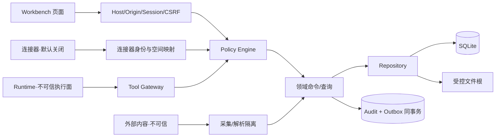

# 个人上下文智能工作台：权限、安全与审计设计

> 版本：V1.5  
> 日期：2026-08-25  
> 状态：已确认（确认门 G3 通过）  
> 确认记录：2026-08-24，C1–C14 全部采用推荐方案  
> 前置：G1、G2、G3 已通过  
> 范围：MVP 本机单用户、回环访问、合成数据验证  
> 重要边界：本文是设计与验收基线，不代表现有原型已实现这些安全能力，也不构成 ASVS 合规声明

## 0. G3 安全决策清单

| 决策 ID | 决策主题 | 已确认方案 | 被放弃方案与影响 |
|---|---|---|---|
| C1 | 首版身份 | **一个安装级本地 owner + 短期页面会话；不做账号密码/多用户登录** | 完全无会话不能防恶意网页；多用户会显著扩大 MVP |
| C2 | 授权原则 | **默认拒绝、最小权限、每请求/每对象/每动作检查** | 只在 UI 隐藏按钮无法阻止直接 API 调用 |
| C3 | 数据空间 | **同一实例仅个人本地与公开演示逻辑分区；未来公司受限数据使用独立实例/存储并重新评审** | 在当前单用户库混入真实公司数据会扩大泄漏和合规风险 |
| C4 | AI 数据策略 | **`deny_ai`、`local_only`、`approved_cloud_metadata`、`approved_cloud_content` 四级** | 单一“允许 AI”开关不能表达内容、元数据和模型位置差异 |
| C5 | 动作等级 | **L0 读取、L1 草稿、L2 本地写入、L3 外部动作、L4 删除/权限/不可逆动作** | 每次都确认会造成疲劳；完全自动化不可控 |
| C6 | 外部内容 | **网页、论文、消息和 Runtime 输出一律是不可信数据；其中指令不能获得工具权限** | 把检索内容当系统指令会导致间接提示注入 |
| C7 | 网络访问 | **默认关闭；启用后按工具配置 HTTPS 域名 allowlist、DNS/IP 复核、禁私网与自动跳转** | 任意 URL 抓取有 SSRF 和本地服务探测风险 |
| C8 | 文件访问 | **只传对象 ID/相对引用；realpath 根目录校验、符号链接防逃逸、类型/大小限制** | 直接传绝对路径会泄露私人路径并扩大文件访问范围 |
| C9 | 密钥 | **环境变量或操作系统凭据存储；不进入 SQLite、Vault 内容、日志、导出或备份** | 自建明文 secrets 表不可接受；OS 凭据适配可在接连接器时实现 |
| C10 | 保留期 | **审计元数据 180 天；Run 原始消息/工具载荷默认 30 天；被拒候选 30 天；业务知识按生命周期保留** | 更长保留利于回溯但扩大隐私暴露；更短影响故障调查 |
| C11 | 审计防篡改 | **追加写 + 哈希链 + 备份校验，定位为防意外篡改，不声称抵抗本机管理员** | 外部不可变日志对个人本地 MVP 过重 |
| C12 | 备份保护 | **备份不虚称应用层加密；要求放在 OS 加密卷或用户提供的加密目标，且永不含密钥** | 自研加密/密钥管理会新增高风险实现 |
| C13 | 连接器 | **默认禁用；逐个安装、最小 scope、显式绑定空间、可撤销，所有外部写入保留确认** | 一次授权全部连接器会扩大第三方访问面 |
| C14 | 安全升级门 | **真实公司数据、局域网/公网、多用户、持续自动外发任一出现时重新安全评审** | 直接沿用本机设计不具备身份、租户和传输安全保证 |

确认结果：C1–C14 全部按推荐项生效。保留期、数据空间、AI 策略、外部动作或远程访问边界发生变化时必须重新安全评审。

---

## 1. 安全目标与非目标

### 1.1 安全目标

1. 未经授权的网页、进程、Runtime 或连接器不能读取/修改 Workbench 数据。
2. 权限过滤发生在正文进入检索结果、模型上下文和日志之前。
3. AI 不能凭模型输出自行提高权限；高影响动作有确定性策略与人类确认。
4. 写操作可审计、可幂等、可失败恢复；没有“界面成功、实际未写”或重复写。
5. 本地路径、密钥、令牌、私人正文和受限对象标题不进入错误、日志、截图和演示数据。
6. 删除、导出、备份、连接器和 Runtime 都有清晰边界与撤销路径。

### 1.2 非目标

- 首版不实现企业 IAM、多人协作、租户管理员、远程设备信任或公网部署。
- 不声称防御已控制本机管理员账户、内核或磁盘的攻击者。
- 不把哈希链表述为法律级不可抵赖审计。
- 不承诺 Harness/Hermes 已安全集成；它们仍是隔离 POC/候选。
- 不把系统提示词、模型拒答或 UI 隐藏当成权限控制。

## 2. 威胁模型

| 威胁主体/入口 | 典型风险 | MVP 控制 |
|---|---|---|
| 恶意网页 | 探测本地端口、伪造写请求、读取宽松 CORS 响应 | 回环绑定、会话 Cookie、严格 Origin/Host、CSRF、无宽松 CORS |
| 外部网页/论文/消息 | 间接提示注入、诱导泄密或工具调用 | 标记不可信、内容/指令分离、Tool Gateway 确定性授权 |
| 文件导入 | 路径穿越、符号链接逃逸、压缩炸弹、恶意格式 | 相对引用、realpath、类型/大小/层级限制、暂存解析 |
| URL 抓取 | SSRF、DNS rebinding、跳转到本机/私网、超大响应 | allowlist、解析前后 IP 校验、禁私网、禁自动跨域跳转、预算 |
| Runtime/插件/技能 | 过宽工具、供应链变化、内部记忆污染 | 独立进程、锁版本、能力白名单、唯一 Tool Gateway、候选回写 |
| 连接器 | scope 过宽、令牌泄漏、身份映射错误、重复外发 | 默认关闭、最小 scope、OS 凭据、幂等、显式审批、撤销 |
| 本地误操作 | 错删、覆盖、重复提交、旧版本写入 | 软删除、diff、乐观锁、幂等、备份恢复 |
| 日志/截图/备份 | 私人内容和密钥二次泄漏 | 字段白名单、脱敏、保留期、隐私扫描、加密卷建议 |

## 3. 信任边界与请求链路



强制规则：

- UI、Runtime、连接器都不是授权真源。
- `Policy Engine` 输入为经过身份解析的 principal、space、object、action 和运行上下文。
- 领域命令不能绕过 Policy 直接调用写 Repository。
- 搜索返回前对每个候选对象复核权限；禁止“先召回正文，再让模型忽略”。
- Runtime 不持有数据库和内容目录权限；只调用注册 Tool。

## 4. 身份、会话与本地 HTTP 防护

### 4.1 本地身份

- 首次初始化生成不可猜测的 `principal.id` 和一个默认 Space。
- `local_owner` 只表示当前安装的本机拥有者，不映射真实姓名、邮箱或公司账号。
- 后台 Job、连接器、Runtime 使用独立 principal kind，便于审计和权限收敛。

### 4.2 页面会话

1. 服务每次启动生成高熵 bootstrap secret，不写入仓库、数据库或 URL 查询串。
2. 受控启动页面交换短期会话，使用 `HttpOnly`、`SameSite=Strict` Cookie；生产页面要求同源。
3. 写请求要求受支持 Content-Type、匹配 Origin、CSRF token/nonce；缺失或不匹配即拒绝。
4. SSE 使用同源会话；事件只含已授权、脱敏数据，并支持过期与断线恢复。
5. 只接受明确 Host/端口组合，拒绝未知 Host；不启用 `Access-Control-Allow-Origin: *`。

Origin/Referer 与 Fetch Metadata 作为纵深防御而不是唯一 CSRF 控制；该组合与 OWASP CSRF 指南一致。[OWASP CSRF Prevention Cheat Sheet](https://cheatsheetseries.owasp.org/cheatsheets/Cross-Site_Request_Forgery_Prevention_Cheat_Sheet.html)

### 4.3 错误返回

统一返回 `request_id`、稳定错误码、用户可执行建议。禁止返回堆栈、SQL、绝对路径、密钥、会话令牌、越权对象标题/片段或完整工具参数。

## 5. 授权模型

### 5.1 决策输入

```text
authorize(principal, action, objectType, objectId, spaceId, purpose, runtimeProfile)
  → allow | deny | approval_required
```

判断顺序：

1. principal 是否 active，当前会话/连接器是否有效；
2. space 是否存在且允许当前主体；
3. action 是否被角色和运行 Profile 允许；
4. 对象是否属于同一 space 且未越权；
5. 数据分级和 AI policy 是否允许当前目标；
6. 动作等级是否要求确认；
7. 参数范围是否落在批准的 scope digest 内。

最小权限、默认拒绝以及每请求校验，是本设计的授权基线。[OWASP Authorization Cheat Sheet](https://cheatsheetseries.owasp.org/cheatsheets/Authorization_Cheat_Sheet.html)

### 5.2 首版主体能力

| 主体 | 默认能力 | 明确禁止 |
|---|---|---|
| `local_owner` | 当前 Space 内读、创建草稿、确认本地写；L3/L4 逐次确认 | 静默外发、绕过删除确认 |
| `system_job` | 固定 Job 的索引、备份、到期清理 | 任意浏览正文、发外部消息 |
| `runtime` | Profile 指定的只读查询和候选生成 | 直连 DB/文件、批准自身动作、自动长期记忆 |
| `connector` | 绑定 Space 与特定命令/通知 | 跨空间读取、使用其他连接器令牌 |

### 5.3 空间与数据分级

| 分级 | 示例 | 模型/连接器默认策略 |
|---|---|---|
| `public` | 明确公开论文、虚构演示数据 | 可按已启用 Profile 处理，仍记录来源和用途 |
| `personal_local` | 个人项目与学习资料 | 本地处理；外部模型须用户批准对应 policy |
| `restricted` | 未来公司科研/受限资料 | 当前实例禁止真实接入；未来独立实例与重新评审 |

对象分级不能低于其来源和父项目的有效最高限制；导出、摘要和引用继承最严格分级，不能通过改标题降级。

## 6. AI 数据访问与动作等级

### 6.1 模型访问策略

| 策略 | 本地模型 | 云模型元数据 | 云模型正文 | 适用 |
|---|---:|---:|---:|---|
| `deny_ai` | 否 | 否 | 否 | 不允许 AI 处理 |
| `local_only` | 是 | 否 | 否 | 仅受控本地运行 |
| `approved_cloud_metadata` | 是 | 经批准 | 否 | 只发送标题、Schema、脱敏摘要等明确字段 |
| `approved_cloud_content` | 是 | 经批准 | 经逐项/规则批准 | 允许最小正文片段，记录范围和模型目标 |

- Space 提供上限，Project/Source 可进一步收紧，不能放宽。
- ContextPackage 使用允许对象/版本清单和用途，不以“全部知识库”作为默认输入。
- 模型供应商、模型 ID、发送字段、时间、Run ID 进入审计元数据；密钥和完整提示默认不进入审计。

### 6.2 动作等级与确认矩阵

| 等级 | 动作 | 默认处理 | 例子 |
|---|---|---|---|
| L0 | 已授权只读 | 可自动执行并审计摘要 | 搜索项目、读取允许来源片段 |
| L1 | 生成本地草稿/候选 | 可自动生成，不改变真源 | 任务草稿、知识候选、回复草稿 |
| L2 | 可恢复的本地写入 | 展示 diff；按会话/规则确认，支持撤销或补偿 | 创建任务、更新计划、保存知识条目 |
| L3 | 对外写入或产生外部影响 | 每次显式确认目标、内容、连接器与影响 | 发飞书消息、创建外部日程、提交表单 |
| L4 | 删除、权限、密钥、不可逆/高影响 | 强确认；必要时二次输入；执行前备份/影响清单 | 永久清空、扩大空间权限、批量覆盖 |

运行时请求的 ToolCall 必须在模型之外进行参数校验、权限判定和确认；外部内容中的指令不能改变上述等级。OWASP 的 LLM 提示注入指南也建议把外部内容视为不可信，并在工具执行前验证用户意图与权限。[OWASP LLM Prompt Injection Prevention Cheat Sheet](https://cheatsheetseries.owasp.org/cheatsheets/LLM_Prompt_Injection_Prevention_Cheat_Sheet.html)

## 7. Prompt Injection、Tool Gateway 与 Runtime

### 7.1 内容/指令隔离

- 系统指令、用户目标、工具 Schema、检索内容和 Runtime 输出使用结构化不同通道。
- 网页/论文中的“忽略规则、读取文件、发送密钥”等只作为被分析文本，不提升优先级。
- 模型输出永远是建议或 ToolCall 请求，不是授权结果。
- 引用回答只允许引用已授权 SourceVersion；拒绝隐藏来源或跨范围补全。
- 对可疑内容记录风险标记，不把原始攻击文本复制到普通日志。

授权必须由确定性系统在模型之外实现，不能依赖隐藏系统提示或模型遵守。[OWASP System Prompt Leakage](https://genai.owasp.org/llmrisk/llm072025-system-prompt-leakage/)

### 7.2 Tool 注册契约

每个 Tool 必须声明：

- `tool_key`、版本、输入/输出 Schema；
- 允许的 principal/runtime Profile；
- action level、是否幂等、补偿方式；
- 允许的 space/object 类型与最大批量；
- 文件、网络、时间、成本和输出大小预算；
- 审计字段白名单与敏感字段掩码；
- 超时、取消、重试和失败语义。

未注册工具、动态下载工具、运行时自建 MCP 服务、Schema 外参数一律拒绝。MCP/插件接入时实施固定版本、能力 allowlist、来源评审与撤销；参考 OWASP MCP Security Cheat Sheet 的最小 scope、输入校验和隔离原则。[OWASP MCP Security Cheat Sheet](https://cheatsheetseries.owasp.org/cheatsheets/MCP_Security_Cheat_Sheet.html)

### 7.3 Harness/Hermes 边界

- Harness：隔离只读 POC，不能直接读取 Workbench 数据目录。
- Hermes：可选 Runtime/消息网关候选，不启用自动长期记忆回写。
- 一个 Run 只有一个主 Runtime；跨 Runtime 重试创建新 Run 和新 ContextPackage。
- Runtime 日志、session、memory、cron、skills 都不是 Workbench 真源。

## 8. 文件与网络安全

### 8.1 文件

1. API 只接受对象 ID、上传流或应用相对引用，不接受任意绝对路径。
2. Windows 与 Linux 均规范化路径；检查设备路径、UNC、保留名、大小写和替代分隔符。
3. 创建/打开前后执行 `realpath` 与允许根比较；拒绝符号链接/联接点逃逸。
4. 上传进入随机暂存名；校验 MIME、扩展、魔数、大小、文件数和压缩展开预算。
5. 解析器使用最低文件权限、超时与资源限制；失败不发布为 ready。
6. 下载强制对象权限、固定 Content-Type/Disposition，不回显物理路径。

### 8.2 网络

- 默认所有 Runtime/Tool 无网络。
- 启用抓取时，按具体工具设置 `https` 域名和端口 allowlist；拒绝 URL 用户信息、非标准 scheme 和混淆主机。
- DNS 解析后及连接前检查所有 IP，拒绝 loopback、link-local、私网、组播、保留和云元数据地址。
- 跳转默认关闭；允许时每跳重新执行 scheme/域名/IP 校验，并限制跳数。
- 响应限制字节、时间、内容类型和解压比例；不把 Cookie、Authorization 自动转发到新域。

这些控制采用 OWASP SSRF 指南推荐的 allowlist 优先和 URL/IP 双重校验思路。[OWASP SSRF Prevention Cheat Sheet](https://cheatsheetseries.owasp.org/cheatsheets/Server_Side_Request_Forgery_Prevention_Cheat_Sheet.html)

## 9. 密钥、日志与隐私

### 9.1 密钥

- 开发环境使用不入库的环境变量；接入真实连接器前实现操作系统凭据适配。
- 数据库只保存 `credential_ref`、提供方和最后验证时间，不保存 token 值。
- 前端永远拿不到模型/连接器长期密钥；Runtime 只获得当前操作所需最小临时能力。
- 错误、诊断包、导出、备份和测试 fixture 必须扫描密钥模式。

### 9.2 结构化日志字段

允许：时间、级别、request/run/tool ID、principal kind、action、object type、结果、稳定错误码、耗时、计数、版本。  
默认禁止：会话/CSRF/token/API key、Authorization/Cookie、完整 Prompt/回复、文档正文、引用全文、工具原始参数、绝对路径、真实账号身份。

确需故障诊断时，用户在本机显式开启短期 debug，并展示采集字段与自动到期；关闭后清理诊断正文。OWASP 日志指南同样要求排除访问令牌、认证数据、密钥和敏感个人数据，并保护日志的访问与完整性。[OWASP Logging Cheat Sheet](https://cheatsheetseries.owasp.org/cheatsheets/Logging_Cheat_Sheet.html)

### 9.3 合成数据与截图

- 仓库、自动化测试、演示截图只使用标记为虚构的项目、人员、组织、消息和研究内容。
- 截图前检查浏览器地址、文件路径、通知、系统托盘、最近文件和调试面板。
- 隐私扫描规则与样例由测试固定；缺失数据保持缺失，不制造看似真实的统计结果。

## 10. 审计设计

### 10.1 必审计事件

- 会话创建/失效和拒绝的 Host/Origin/CSRF 请求；
- Space、Project、Task、Decision、KnowledgeItem 的创建、修改、删除、恢复；
- Source 导入、解析、下载、导出和物理清理；
- 搜索/上下文包的范围摘要和越权拒绝（不记录查询全文）；
- Agent Run 生命周期、ToolCall、审批、候选应用和失败恢复；
- 连接器启停、scope/credential_ref 变化、所有外部写入；
- 备份、验证、恢复、迁移、完整性失败；
- 策略、保留期和 Runtime Profile 变化。

### 10.2 事件最小字段

`occurred_at, event_id, request_id, actor_id/kind, space_id, action, object_type/id, outcome, reason_code, run_id, approval_id, change_digest, previous_hash, event_hash`。

- Audit 与业务变更在同一事务写入；对外通知使用 Outbox。
- 拒绝事件可以没有 object ID，但不得因此泄露目标是否存在。
- `change_digest` 是字段名、数量、哈希和安全摘要，不默认保存旧/新正文。
- 哈希链在启动/备份时校验，发现断链进入只读告警或受控修复流程。

### 10.3 查询与导出

审计 UI 支持按时间、动作、对象、结果、Run/Request ID 过滤。审计导出属于 L2；若包含受限范围或用于外发则升为 L3，并生成脱敏预览和导出 manifest。

## 11. 保留、删除和备份

| 数据 | 推荐保留 | 到期处理 |
|---|---|---|
| 核心业务对象 | 按生命周期；软删除 30 天 | 到期物理清理，受引用保护 |
| 审计元数据 | 180 天 | 保留汇总或物理清理并记录清理事件 |
| Run 原始消息/工具载荷 | 30 天 | 清正文，保留必要状态/计数/哈希元数据 |
| Run 事件元数据 | 180 天 | 与审计策略一致 |
| rejected/expired Candidate | 30 天 | 清 proposal/diff，保留审批结果摘要 |
| 临时上传/解析文件 | 失败后 24 小时内 | 修复 Job 清理 |
| 导出包 | 默认 7 天或用户手工删除 | 本地删除并留事件 |
| 备份 | 默认最近 7 个成功备份 | 删除旧包前验证至少一个可恢复备份 |

- 用户可缩短保留期；延长应显示磁盘和隐私影响。
- 删除请求同时覆盖业务行、文件、派生索引、缓存和待投递事件；审计只保留无正文的删除证明。
- 备份 manifest 不含密钥。应用只校验完整性；机密性依赖 OS 加密卷或用户选择的加密目标，除非未来单独评审成熟加密方案。

## 12. 安全测试与发布门

采用 OWASP ASVS 5.0.0 作为验证项参考，不宣称未经审计的完整合规。[OWASP ASVS](https://owasp.org/www-project-application-security-verification-standard/)

| 类别 | 正常 | 错误/攻击 | 重放/恢复 |
|---|---|---|---|
| 会话/CSRF | 同源有效写入 | 缺 Cookie、错误 Origin/Host、simple request 被拒 | 会话过期后重建，不复用旧 nonce |
| 权限 | owner 读允许对象 | 伪造 space/object ID、已删对象、不同主体被拒且不泄露存在性 | 策略变更立即生效 |
| 搜索 | 仅返回允许正文与引用 | 跨空间索引命中不返回标题/片段/计数 | 索引重建后权限结果一致 |
| 文件 | 合法上传/下载 | `..`、绝对/UNC、symlink/junction、超大/压缩炸弹被拒 | 中断导入无假 ready，可清理暂存 |
| 网络 | allowlist HTTPS 抓取 | localhost、私网、IPv6 映射、DNS rebinding、跳转逃逸被拒 | 超时/重试不重复写 SourceVersion |
| ToolCall | L0 读取、L1 候选 | 越权工具、Schema 外参数、自批准、Prompt 注入被拒 | 相同幂等键不重复执行；失败可安全重试 |
| 审批 | 精确 scope 批准后执行 | 参数变化、过期/拒绝批准、重复点击不执行 | approved 未应用可恢复，已应用重放返回原结果 |
| 日志 | 可按 request/run 追踪 | 密钥、Cookie、正文、绝对路径扫描为零 | 哈希断链可检测 |
| 备份/迁移 | 备份并恢复一致 | 损坏 manifest、未知 Schema、迁移中断停止写入 | 在新目录恢复，通过后受控切换 |
| 删除 | 30 天内恢复 | 被引用 SourceVersion 不被普通清理 | 到期 Job 幂等，部分失败可补偿 |

G3 后需把这些场景落到 Node Test、Repository 合约测试、API 集成测试和 Playwright；Windows/Linux 各自覆盖路径语义。真实数据、远程访问或连接器上线前还需威胁建模复审和依赖安全审查。

## 13. 实施顺序

1. 建立 `Principal/Space/PolicyDecision` 契约和拒绝优先的测试矩阵；
2. 实现应用工厂、回环绑定、Host/Origin/Session/CSRF 中间件；
3. 建立统一错误、结构化脱敏日志和 request ID；
4. 建立 Repository 层的 space 强制过滤、乐观锁和事务审计；
5. 实现 Tool Registry、动作等级、幂等键、Candidate/Approval；
6. 实现受控文件存储、导入暂存、网络默认关闭；
7. 完成备份/恢复、保留与删除 Job；
8. 通过固定安全测试后再开展 Harness/Hermes/飞书 POC。

## 14. G3 确认结果

- 确认日期：2026-08-24；
- 最终决定：C1–C14 全部采用本文推荐方案；
- 生效范围：本地身份、默认拒绝、数据空间、AI 策略、L0–L4、提示注入、网络/文件、密钥、保留、审计、备份、连接器和安全升级门；
- 当前落地：回环绑定、Host/Origin/JSON/Session/CSRF、默认本地 owner、空间强制过滤、乐观锁、写入幂等，以及 Project/Milestone/Task/Discussion/Decision/Capture/DailyPlan/DailyReview 的事务写入、审计哈希链与 Outbox 已实现；
- Capture 只允许显式文本或 HTTP(S) 链接，不抓取链接、不接受本地路径、不调用 AI、不自动晋升长期知识；DailyPlan 只引用既有 Task，DailyReview 只保存用户明确输入；
- 已验证：跨来源 bootstrap 被拒、真实外部空间与未知对象不泄露、跨项目关联被拒、讨论转换失败无部分写入、不安全链接协议和未知项目关联被拒、每日计划重复/陈旧写入受控、30 天恢复窗口和 checksum 篡改停止启动；
- S5-02 已落地固定 Tool Registry、Task Candidate L1、L2 Approval/apply、scope digest、防替换、过期、幂等和 ToolCall denied 审计；尚未落地通用 PolicyDecision、全域被拒访问审计、其他 Candidate/L2 动作、L3/L4、密钥存储、备份恢复、到期清理和连接器安全；
- G4 后落地：Markdown 导入只接受文件名与正文，拒绝路径/控制字符/非 Markdown/空投影/超限正文；原文写入服务端计算的哈希路径，API 不返回存储引用；相同内容去重，数据库失败补偿未引用新 blob；
- 检索落地：会话、Space、Project、对象类型与日期条件在单一数据库查询中约束，之后才生成标题、片段和字符定位；未知空间/错配项目统一 404，不返回标题、列表或计数；搜索请求正文不进入 URL，Fastify 请求日志保持关闭；
- 下一步：在 G5a 确认后实现独立 Embedding/Rerank Adapter；正文进入本地模型或任何云端模型前仍必须由 Policy/ContextPackage 决定。文件、图片、语音与 XLSX 不得经现有 Capture 或 Markdown 端点绕过类型边界。
