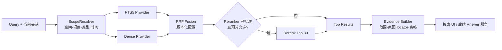

# 个人上下文智能工作台：知识库检索与引用设计

> 文档版本：V1.2
> 日期：2026-08-26
> 状态：已确认  
> 确认门：G5a 已通过  
> 确认记录：2026-08-25，G5a-1–G5a-11 全部采用推荐项  
> 上位基线：G1–G4 已确认；ADR-003、ADR-008、ADR-011 已接受  
> 当前真实状态：受控 Markdown、权限优先 FTS5 和默认关闭的受保护混合检索实验路径已实现；短集合盲测和 SourceVersion 精确 chunk 定位通过，但扩展边界 Top-1 仅 70%、sidecar 10 次短样本有 6 次超时，故 BGE-M3 路径维持 Stop 与默认关闭；重排与引用回答未实现

## 0. 需要确认的决策

| ID | 决策 | 推荐默认项 | 主要替代方案 | 不确认的影响 |
|---|---|---|---|---|
| G5a-1 | 全文基线地位 | **保留现有 FTS5 为默认回退、评测对照和精确词召回通道** | 直接替换为向量检索：失去稳定对照和低成本回退 | 不进入混合检索 POC |
| G5a-2 | 检索流水线 | **授权范围解析 → 全文/稠密并行召回 → RRF 融合 → 可选重排 → 证据与范围解释** | 单路向量；先全库召回再过滤 | 无法冻结安全顺序与组件边界 |
| G5a-3 | 索引对象与引用资格 | **Project/Task/Capture/Document 均可召回；只有固定 SourceVersion 的 Document 片段可成为正文 Citation** | 所有对象都包装成 Citation | 会混淆业务对象定位与原始证据引用 |
| G5a-4 | 稠密模型候选 | **隔离评测 BGE-M3，多语言本地模型，仅通过 EmbeddingAdapter 使用** | 云端 embedding；立即自训；只做全文 | 无法开展中文/英文语义召回对照 |
| G5a-5 | 重排模型候选 | **隔离评测 bge-reranker-v2-m3；仅在固定评测集证明收益后启用** | 始终启用；不做重排；LLM 重排 | 无法判断质量收益是否值得时延和资源成本 |
| G5a-6 | POC 向量存储 | **SQLite BLOB + 授权候选集内精确余弦，先不加载 SQLite 扩展** | sqlite-vec；独立向量数据库 | 不能在最小供应链面下验证检索增益 |
| G5a-7 | 分块与定位 | **结构感知分块，目标 300–700 tokens、硬上限 1000，有限重叠；保存版本、字符范围、正文哈希和处理版本** | 固定字符切块；整篇向量 | 引用无法稳定回到原文，重建不可复现 |
| G5a-8 | 融合默认参数 | **版本化配置；RRF `k=60`，全文/稠密等权起步，候选 Top 30 可重排到 Top 10** | 手工打分直接相加；不可追踪在线调参 | 无统一可复现实验起点 |
| G5a-9 | Go/Stop 评测门 | **固定合成评测集；零越权、定位完整率 100%，且混合方案相对 FTS 的 nDCG@10 提升至少 10%，Recall@20 下降不超过 2 个百分点** | 凭主观演示上线；只看单一准确率 | 无法证明收益，也无法安全停止 |
| G5a-10 | 回答能力边界 | **G5a 只授权适配器与离线 POC；G5b 前不开放生成式回答，不写 Citation/Knowledge 真源** | 检索完成即开放问答 | 会在引用、拒答和泄漏评测前暴露不可靠能力 |
| G5a-11 | 依赖与模型授权 | **架构确认不等于安装授权；下载模型或新增生产依赖前，再提交精确版本、许可证、体积、维护、安全与替代方案清单** | G5a 后自动安装全部候选 | 会绕过供应链和持续成本确认 |

### 确认结果

用户已于 2026-08-25 回复 `G5a全部按推荐项确认。`。本确认授权进入“离线适配器 + 合成评测集”垂直 POC；**不自动授权下载模型、启用 SQLite 扩展、连接云端服务或开放生成式问答。**

---

## 1. 目标与非目标

### 1.1 目标

1. 在当前用户获授权的全部项目与模块中，提高中文、英文、术语变体和语义改写查询的召回质量；
2. 保留精确词检索的稳定性、离线可用性和低成本回退；
3. 让每个命中都能解释“检索了什么范围、命中哪个对象、为什么排序、能否作为引用”；
4. 用固定评测决定是否引入向量与重排，不以演示观感替代证据；
5. 保持模型、向量存储和重排器可替换，不改变 Workbench 的项目、知识、权限和审计真源。

### 1.2 非目标

- 本阶段不接真实个人、公司或科研资料；
- 不建设云端向量库，不向外部模型发送正文；
- 不把 Runtime memory、embedding 或索引当作长期知识；
- G5b 已确认后仍不实现“看似有引用”的生成式回答；必须通过后续独立盲测与回答安全门；
- 不因选定候选模型就承诺生产可用、移动端本地运行或商业分发。

---

## 2. 当前基线与问题

### 2.1 已实现

- migration 006：Source、不可变 SourceVersion、Document 与 `context_search` FTS5；
- 受控 Markdown 导入：扩展名、大小、空解析、路径输入、去重、幂等和失败补偿；
- 统一全文检索：Project、Task、Capture、Document；
- 范围过滤：会话空间、项目、对象类型、日期；
- 定位：Document 返回固定 `source_version_id + char_range`，其他对象返回对象 locator；
- 正式 `/context` 页面、全局搜索接入、PC/移动布局和合成数据截图；
- 2026-08-26 最新验证：207/207 测试、独立生产构建和隐私扫描通过；最近一次 Playwright 1/1。

### 2.2 现有不足

- FTS5 擅长显式词项和子串，但对概念改写、同义表达和跨语言查询的召回有限；
- 搜索结果只有文本命中片段，还没有统一 Chunk、证据资格和排序原因对象；
- 字符范围能固定版本，但还缺少结构标题、页码/段落等格式特定 locator；
- 没有固定 qrels、离线检索指标、性能预算和无答案/对抗评测；
- 没有 Answer/Citation 服务，也没有验证逐句声明与证据之间的蕴含关系。

---

## 3. 推荐架构



### 3.1 不变量

1. `ScopeResolver` 先得到允许的 `space_id/project_id/object_type/time`，Provider 只能在该范围读取正文；
2. 检索适配器只读业务真源，索引均可删除重建；
3. 一个结果必须携带对象 ID、版本、范围、provider 分数/名次和最终融合版本；
4. “可召回”不等于“可引用”：只有可解析到固定 SourceVersion 原文片段的结果才能形成正文 Citation；
5. 无许可模型、模型不可用或索引失效时自动回退 FTS5，不阻塞本地基本搜索；
6. 查询、索引和评测日志不记录真实正文；正式启用前另行确定脱敏与保留策略。

### 3.2 适配器契约

```text
SearchProvider.search(query, authorizedScope, filters, limit) -> Candidate[]
EmbeddingAdapter.embedQuery(text, modelVersion) -> Vector
EmbeddingAdapter.embedChunks(chunks, modelVersion) -> Vector[]
FusionPolicy.fuse(candidateLists, configVersion) -> FusedCandidate[]
RerankAdapter.rerank(query, candidates, modelVersion) -> RankedCandidate[]
EvidenceBuilder.build(result, scopeDecision) -> SearchEvidence
```

候选模型只存在于 Adapter 后方。切换模型、存储或执行方式不能修改业务对象主键、权限策略、SourceVersion 和 Citation 契约。

---

## 4. 模型与存储候选评估

### 4.1 稠密模型：BGE-M3

推荐把 BGE-M3 作为首个隔离 POC 候选，而不是唯一模型。官方模型卡标注其为多语言模型，稠密向量维度 1024、最长序列 8192，并同时支持 dense、sparse 和 multi-vector 能力，适合用同一语料比较多种召回方式。[BAAI BGE-M3 官方模型卡](https://huggingface.co/BAAI/bge-m3)

采用理由：

- 中文、英文及跨语言方向与本产品科研/学习场景一致；
- 本地可运行，正文无需默认发送云端；
- 能作为统一候选测试 dense 与更复杂召回，但首轮只启用最小 dense 能力，避免一次引入多种变量。

主要风险：模型文件、推理运行时、CPU/内存时延和分发许可证需按实际版本复核；模型卡能力不等于在本项目语料上有效，因此必须通过 G5b 数据决定。

### 4.2 重排模型：bge-reranker-v2-m3

官方模型卡将 bge-reranker-v2-m3 描述为多语言轻量重排模型，通过 query 与 document 直接输出相关性分数。[BAAI bge-reranker-v2-m3 官方模型卡](https://huggingface.co/BAAI/bge-reranker-v2-m3)

推荐只重排融合后的 Top 30，并以 Top 10 返回。若 nDCG、MRR 或人工错误分析没有稳定提升，或 p95 时延/内存超预算，则关闭重排，不让其成为基本搜索的硬依赖。

### 4.3 POC 向量存储

首轮推荐在 SQLite 中保存 `float32` 向量 BLOB、模型版本、chunk 哈希和维度，只对**已授权且经结构过滤后的有界候选集**执行精确余弦比较。它不是最终大规模 ANN 方案，但最适合验证“语义召回是否值得增加依赖”。

sqlite-vec 是后续候选：官方仓库提供 Node/SQLite 向量扩展能力，但当前仍标注 pre-v1、可能发生破坏性变化。[sqlite-vec 官方仓库](https://github.com/asg017/sqlite-vec) 其 Node 示例需要为 SQLite 连接开启扩展加载，而 Workbench 当前明确使用 `allowExtension: false`；因此 G5a 不建议直接启用。[sqlite-vec Node 示例](https://github.com/asg017/sqlite-vec/blob/main/examples/simple-node2/demo.mjs)

仅在以下任一条件出现时再审查 sqlite-vec 或独立向量服务：

- 授权候选规模使精确比较持续超出性能门；
- 索引构建或查询内存无法受控；
- G5b 已证明语义召回有显著增益，值得承担扩展加载与供应链成本。

---

## 5. Chunk、索引与引用定位

### 5.1 Chunk 结构

| 字段 | 含义 |
|---|---|
| `chunk_id` | 稳定派生 ID，由文档版本、字符范围和处理版本决定 |
| `space_id/project_id` | 授权与范围过滤字段 |
| `object_type/object_id` | 来源对象 |
| `source_id/source_version_id/document_id` | 原始证据链；业务对象可为空 |
| `heading_path` | Markdown 标题路径或格式等价结构 |
| `start_char/end_char` | 版本内字符范围，半开区间 |
| `text_sha256` | 规范化片段哈希，用于漂移检测 |
| `parser_version/chunker_version` | 可复现重建版本 |
| `embedding_model/version/dimension` | 向量兼容性与重建依据 |

### 5.2 分块规则

- 优先按 Markdown 标题、段落、列表和代码块边界切分；
- 目标 300–700 tokens，硬上限 1000；仅在相邻语义被截断时保留有限重叠；
- 标题路径作为上下文加入 embedding 输入，但字符 locator 只指向真实正文；
- 表格、图片 alt、代码与引用块保留类型标记，后续可按查询意图降权；
- 新 SourceVersion 产生新 chunks；旧版本不原位覆盖，以保证历史 Citation 可解析；
- parser/chunker/model 版本改变时建立新索引代次，原代次在验证完成前可回退。

### 5.3 Citation 与对象 Locator

```text
Citation = source_id + source_version_id + document_id
         + locator_type + start_char + end_char + text_sha256

ObjectLocator = object_type + object_id + route + optional field
```

二者必须分别展示。Project、Task、Capture 命中可以帮助导航和回答上下文，但没有固定来源原文时只能叫“相关对象”，不能显示为“证据引用”。

---

## 6. 融合、重排与可解释性

### 6.1 默认融合

首个可复现实验使用 Reciprocal Rank Fusion：

```text
score(d) = Σ provider_weight / (60 + rank_provider(d))
```

- 全文与 dense 初始等权；
- 权重、`k`、召回数和去重策略写入 `fusion_config_version`；
- 不直接相加 BM25、cosine 和 reranker 原始分数，因为量纲与校准不同；
- 相同 SourceVersion 的高度重叠片段先去重，保留最高名次并合并命中原因。

### 6.2 结果解释

每个结果至少展示：

- 搜索范围：空间、项目、类型、时间以及被排除范围；
- 命中原因：全文词项、语义召回、两路共同命中、是否经过重排；
- 来源资格：可引用原文 / 仅相关对象 / 来源不可用；
- 固定定位：标题路径、字符范围和 SourceVersion；
- 配置版本：检索、融合、重排和索引代次。

不向普通用户暴露难以解释的浮点分数作为“可信度”。界面使用来源质量、命中方式和证据资格等可验证信息。

---

## 7. G5b 评测设计草案

### 7.1 合成评测集

首轮至少 60 条查询，全部来自明确标注的虚构资料，覆盖：

| 类别 | 最低覆盖 | 目的 |
|---|---:|---|
| 中文精确词、术语和短查询 | 10 | 保证不损失全文优势 |
| 中文改写、同义与概念查询 | 12 | 测试语义召回增益 |
| 英文与中英跨语言 | 10 | 覆盖学习与科研场景 |
| 跨项目综合发现 | 8 | 验证统一上下文价值 |
| 项目/类型/日期过滤 | 8 | 验证范围先于正文 |
| 无答案与近似干扰 | 6 | 避免强行命中 |
| 越权、未知空间和对抗内容 | 6 | 验证零泄漏与内容/指令隔离 |

每条查询保存相关性等级、允许范围、期望证据、不可返回对象和理由；评测数据不复用真实用户内容。

### 7.2 指标与硬门

| 维度 | 推荐 Go 条件 |
|---|---|
| 权限 | 未授权标题、正文、片段、数量和存在性泄漏为 0 |
| 定位 | 返回的可引用结果 locator 可解析且哈希一致率 100% |
| 排序 | 混合方案相对 FTS 基线 nDCG@10 提升至少 10% |
| 召回 | Recall@20 相对 FTS 下降不超过 2 个百分点，并在语义/跨语言子集有净提升 |
| 无答案 | 不得以“最接近结果”伪装为已找到证据；误命中率单独报告 |
| 性能 | 在记录配置的参考机器上 p95 检索不超过 1.5 秒，并同时报告相对 FTS 倍数、峰值内存和索引耗时 |
| 可恢复 | 模型不可用、索引损坏或版本不兼容时可回退 FTS；索引可由真源重建 |

性能阈值是本地交互 POC 门，不宣称适用于所有硬件。若质量门不通过，则结论为 **Stop：保留 FTS，记录失败分析**；不得通过调低门槛把候选包装成成功。

### 7.3 对照与消融

至少比较：

1. FTS5 当前基线；
2. dense only；
3. FTS + dense RRF；
4. FTS + dense RRF + reranker；
5. 去掉标题上下文、改变 chunk 尺寸后的关键消融。

报告按查询类别给出 nDCG@10、Recall@20、MRR@10、失败案例、时延、内存和索引成本，不能只报汇总平均值。

---

## 8. 安全、隐私与供应链

- 所有正文在授权过滤后才进入 embedding/rerank 调用；首轮只允许本地隔离进程；
- 不把查询或正文发送到云端；未来如评估云模型，必须单独确认数据分级、供应商、地域、保留和退出；
- 模型输出仅用于派生排序，不直接写入 KnowledgeItem；
- embedding 与索引目录不对局域网或公网暴露；服务继续只监听 `127.0.0.1`；
- 模型和运行时安装前生成精确 manifest：名称、commit/version、下载源、哈希、许可证、体积、内存、维护状态、漏洞面、替代和卸载方式；
- 当前 Workbench `node:sqlite` 禁止加载扩展。任何启用 `allowExtension` 的提案必须重新做路径、签名、权限、崩溃和供应链审查；
- 测试日志只保存合成 ID、排名和指标；失败样本正文进入仓库前须通过隐私扫描。

---

## 9. 实施顺序与停止点

G5a 确认后按小型垂直切片推进：

1. 冻结 `Chunk`、`SearchCandidate`、`SearchEvidence` 与 Adapter 契约；**已完成**；
2. 生成独立的“模型与运行时依赖审查”清单；**G5a-D 与 G5a-DL 已确认，隔离下载、安装和 synthetic-only CPU POC 已完成**；
3. 建立至少 60 条合成 qrels 和 FTS 基线报告；**已完成 60 条**；
4. 经依赖确认后，在隔离适配器内运行 BGE-M3 dense POC；**已完成**；
5. 比较 FTS、dense、RRF；只有融合达门后才评估 reranker；**评测已完成，G5b 决定暂不下载 reranker**；
6. 完成越权、错误、重复、模型不可用和回退测试；**受保护实验切片已覆盖，含派生 chunk 投影损坏回退**；
7. 生成并确认 G5b《AI 评测方案与检索评测报告》；**2026-08-26 已完成**；
8. 继续补独立盲测、阈值校准和真实 SourceVersion 字符定位合成验证；**已完成，实验阈值 0.50，盲测安全门通过但分数间隔仅 0.0112**；
9. 扩展长文档、噪声、混合语言和提示注入边界集；**已完成但未通过：回答召回 90%、Top-1 70%，10 次 sidecar 短样本 6 次超时**；
10. 诊断相邻主题错排、英文长尾漏召回、重复 passage 编码和持续调用退化；只有边界、资源与背压门通过后才另设 Answer/Citation 启用门。

### G5a 后仍需单独确认的事项

- 任何模型文件和推理运行时下载；
- 新增生产依赖或启用 SQLite 扩展；
- 云端模型、远程向量库或真实数据接入；
- 生成式 Answer/Citation 的后续安全门；
- 旧版 XLSX 依赖处置（独立确认门，与本设计无关）。

---

## 10. 验收清单

- [x] 用户确认 G5a-1–G5a-11；
- [x] 文件移除 `_待确认` 并记录确认日期；
- [x] Adapter 与数据契约不绑定具体模型或向量库；
- [x] 权限过滤发生在任何正文召回、embedding 和 rerank 之前；
- [x] Citation 与 ObjectLocator 已在契约中明确区分；UI 等待引用回答阶段；
- [x] 固定 60 条合成评测集、FTS 对照和 Stop 路径可执行；
- [x] 模型下载已按 G5a-DL 精确授权完成；未新增生产依赖、未启用 SQLite 扩展；
- [x] G5b 已确认，受保护实验路径的能力状态与默认关闭边界已明确；
- [x] 正常、越权、拒绝、无合格证据、重复、模型故障和恢复路径已验证；
- [x] 独立合成盲测、阈值校准和精确 SourceVersion locator 已完成并保存证据；
- [x] 校准后仍保持总开关 `disabled`，不因合成盲测通过自动开放默认混合检索；
- [x] 扩展边界与短时稳定性失败已记录为 Stop，不通过降阈值或省略超时改变结论；
- [ ] 后续安全门前不宣称重排或引用问答可用。
