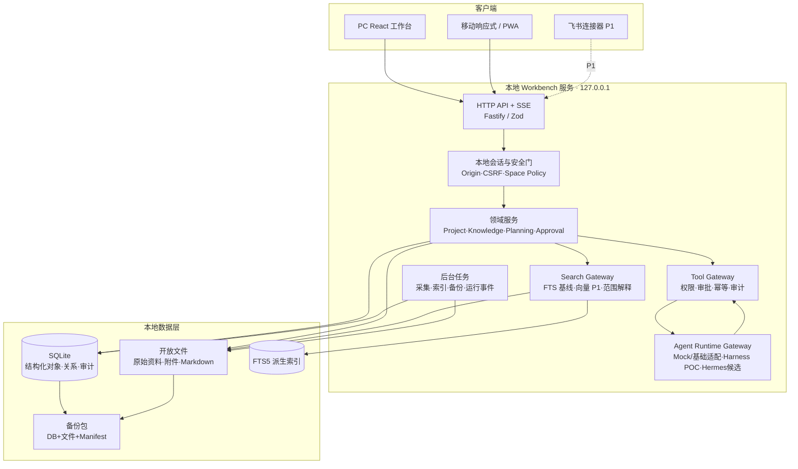

# 个人上下文智能工作台：系统架构与技术选型

> 版本：V1.2  
> 日期：2026-08-25  
> 状态：已确认（确认门 G2 通过）  
> 确认记录：2026-08-24，A1–A15 全部采用推荐方案  
> 前置：G1 已通过；首版为本机单用户、本地优先，不接真实公司数据，不依赖 Harness/Hermes  
> 当前进展：G5b 已通过；Project/Task/Discussion/Decision/Capture/Today 与受控 Source/Document 已按垂直切片落地；FTS5 是默认基线，受保护混合检索以默认关闭的 feature flag 和仓库外回环 sidecar 落地

## 0. G2 架构决策记录

| 决策 ID | 需要确认 | 推荐方案 | 主要替代方案与影响 |
|---|---|---|---|
| A1 | Node 运行基线 | **Node 24 LTS，最低 24.15；开发/CI锁定同一大版本** | 继续 Node 22：内置 SQLite 稳定性更低；当前系统 Node 16 已 EOL 且无法构建 |
| A2 | 前端技术 | **保留 React 19 + Vite 6，按路由渐进迁移原型，不重写** | 切换 Next/Electron：增加迁移范围，首个闭环收益不足 |
| A3 | 本地后端 | **从 Vite 插件抽离为独立 Node 服务，推荐引入 Fastify 当前受支持主版本** | 原生 `node:http`：少依赖但会自建路由/校验；继续堆 Vite 插件：不推荐 |
| A4 | 语言和契约 | **MVP 保持 ESM JavaScript；使用现有 Zod + JSDoc 类型，不做全量 TypeScript 迁移** | 新模块全用 TypeScript：类型更强，但新增编译链和混合迁移成本 |
| A5 | 结构化存储 | **使用 Node 24 内置 `node:sqlite`，通过 Repository 隔离；G3 前完成可靠性 Spike** | `better-sqlite3`：成熟但增加原生二进制/安装风险；纯文件：关系和事务复杂 |
| A6 | 数据真源划分 | **文件负责原始资料/附件；SQLite 负责项目等结构化对象；索引/向量/图谱均为派生数据** | 全部文件优先：开放但事务弱；全部数据库：管理简单但降低文件可读性 |
| A7 | 全文检索 | **SQLite FTS5 + trigram 作为正式全文基线；现有 MiniSearch 保留迁移对照** | 仅 MiniSearch：重启重建简单但持久查询/过滤能力弱；独立搜索服务：过重 |
| A8 | 向量检索 | **不进入首个垂直切片；P1 通过 SearchAdapter 接入，先用评测证明增益** | MVP 直接引入向量扩展/服务：增加供应链、模型和数据治理复杂度 |
| A9 | API 与实时事件 | **REST JSON + SSE；Zod 校验；命令使用幂等键和乐观版本** | GraphQL/WebSocket：当前交互没有足够收益，不纳入 MVP |
| A10 | 本地安全 | **只监听 `127.0.0.1`，启动时生成会话令牌；校验 Origin/Content-Type/CSRF；默认拒绝未知范围** | 只依赖回环：恶意网页仍可能探测本地接口，不足以保护写操作 |
| A11 | 部署形态 | **一个本地 Node 服务同时提供静态前端与 API；PWA 是移动基础入口；托管演示与本地完整版分离** | Docker/Electron/公网部署均暂缓；不阻塞后续封装 |
| A12 | 测试体系 | **保留 Node Test；新增 Playwright 作为开发测试依赖；Windows+Linux CI** | 只做单元测试：无法证明浏览器闭环、移动断点和真实焦点行为 |
| A13 | 包与代码组织 | **继续一个 Workbench 包和 npm lock；按 domain/repository/search/runtime/http 分层** | 立即改 monorepo：当前规模收益不足，增加工具和发布复杂度 |
| A14 | 迁移策略 | **绞杀式迁移：先新服务/项目垂直切片，再逐步接管现有 API；原页面保持可用** | 一次性重构：回归面太大，不推荐 |
| A15 | 外部分发 | **许可证统一前仅作为本地内部开发/演示，不发布新的公开制品** | 直接外发：现有 LICENSE 与 README 表述不一致，有法律风险 |

---

## 1. 架构目标

目标不是把所有能力放进同一个服务器文件，而是建立五条稳定边界：

1. UI 不知道 SQLite、Vault 或具体 Runtime；
2. 领域逻辑不依赖 HTTP、React 或某个 Agent 框架；
3. Repository 明确每类对象的唯一真源；
4. 检索、图谱和向量可从真源重建；
5. 所有 AI 工具和写操作经过权限、审批、审计与幂等控制。

---

## 2. 推荐目标架构



### 2.1 依赖方向

```text
UI / Connectors
      ↓
HTTP / SSE Adapters
      ↓
Application Commands & Queries
      ↓
Domain + Policy
      ↓
Repository / Search / Runtime Ports
      ↓
SQLite / Files / Model / Harness / Hermes Adapters
```

下层适配器可以依赖上层定义的接口；领域层不得反向导入 Fastify、SQLite、React 或具体模型 SDK。

---

## 3. 技术选型说明

### 3.1 Node 24 LTS

推荐将运行环境从“Node 22+”收敛为 Node 24 LTS，并在 `.nvmrc`/版本文件、`package.json engines` 和 CI 中固定大版本。

理由：

- 当前官方发布表中 Node 24 为 LTS，Node 16 已 EOL；
- 工作区已使用 Node 24.19 完成构建验证；
- Node 24.15 起 `node:sqlite` 标记为 release candidate；
- G3 推荐的 UUIDv7 将通过独立 ID 端口实现并做格式/单调性测试，不把 ID 语义绑定到数据库驱动；
- 统一版本可消除当前“系统默认 Node 16、项目要求 Node 22+”的环境漂移。

风险：`node:sqlite` 尚不是 Stability 2 稳定模块，所以必须通过 Repository 隔离并在 G3 前设置退出条件。

### 3.2 前端保留 React/Vite

现有页面、图表、阅读器、图谱和高保真原型均已基于 React/Vite。MVP 采用渐进迁移：

- 保留 `src/App.jsx` 和现有页面；
- 新目标页面按路由懒加载；
- 把原型组件逐步拆为正式 feature，而不是复制一套；
- API 数据使用 Query/Command hooks，页面不直接拼接存储结构；
- AI 运行中心移动到“设置与系统”。

首阶段不引入 SSR。产品是本地登录后工作台，没有搜索引擎收录诉求。

### 3.3 独立本地服务与 Fastify

现有 `server/vite-plugin-workbench.mjs` 同时承担开发插件、API 路由和服务组装，已接近 60 KB。推荐：

- 新建可独立启动的应用工厂；
- Fastify 只作为 HTTP 适配层；
- 路由按领域注册；
- 请求/响应继续由 Zod Schema 作为业务契约真源；
- 开发时 Vite 代理 `/api` 到本地服务；
- 生产时本地服务提供构建后的静态文件和 `/api`。

Fastify 是新的生产依赖。G2 已授权采用，落地前审查建议精确锁定 `5.12.1`；在 G3 通过后与最小应用骨架一并安装和验收。若依赖审查或安装审计不通过，可用原生 `node:http` 实现相同应用端口，领域层不受影响。详见《Fastify 与 Playwright 依赖审查》。

### 3.4 SQLite 与 Repository

推荐 `node:sqlite` 的原因：

- 本地单用户无需独立数据库进程；
- 支持事务、外键、prepared statement、备份等本地应用能力；
- 不引入额外原生 npm 二进制；
- 可通过数据库文件 + 文件目录完成本地备份。

必须完成的 Spike：

1. Windows/Linux 创建、迁移、事务、崩溃恢复；
2. WAL、busy timeout、checkpoint 和安全备份；
3. FTS5 trigram 中文检索、过滤和重建；
4. 10万对象/100万关系以内的本地性能基准；
5. 数据库损坏检测和从备份恢复；
6. `node:sqlite` API 变化时 Repository 替换验证。

停止条件：若 Node LTS 更新导致 API 不兼容、备份/恢复不可靠、FTS5 能力缺失，或 Windows 运行出现不可接受的阻塞，则改用锁定版本的 `better-sqlite3`，不改变领域/API。

### 3.5 数据真源

每类数据只指定一个权威位置：

| 数据类别 | 权威真源 | 派生/导出 |
|---|---|---|
| 原始网页、论文、Markdown、图片、附件 | 受控文件目录 | Source 元数据、全文索引、预览 |
| 项目、任务、讨论、决策、里程碑 | SQLite | JSON/Markdown 导出 |
| 知识条目和候选 | SQLite（保留 SourceRef/Span） | Markdown 知识包导出 |
| 空间策略、审批、审计、运行事件 | SQLite | 脱敏 JSONL/报告 |
| 全文、向量、图谱布局 | 可重建派生存储 | 不作为业务真源 |
| 密钥/访问令牌 | 环境或后续系统凭据存储 | 不进入 Vault/DB/备份正文 |

不做“同一个项目对象同时写 JSON 和 SQLite”的实时双真源。开放性通过完整 Schema、导出、备份和迁移工具保证。

### 3.6 搜索与引用

首个垂直切片只做可验证全文基线：

- FTS5 使用 trigram tokenizer 支持中文连续文本的子串检索；
- `space_id/project_id/object_type/time` 等结构化过滤先于正文返回；
- Source/Object 统一 ID，命中保存具体字符/块定位；
- 现有 MiniSearch 保留为迁移对照和回退，不作为第二真源；
- 向量召回通过 `SearchProvider` 插口在 P1 接入；
- 没有固定评测集证明增益前，不引入向量扩展或远程向量库。

本地环境已用 Node 24.19 完成 Windows 阶段可靠性 Spike：事务/外键、WAL、FTS5 trigram 中文检索、异常进程退出、10 万对象/100 万关系、在线备份恢复、损坏检测和 checkpoint 均通过。Linux/CI、正式 Repository 与真实工作负载仍待验证，详见《Node SQLite 可靠性 Spike 报告》。

#### 3.6.1 S4 当前落地边界（2026-08-25）

- migration 006 已建立 `sources`、`source_versions`、`documents` 和可重建的 `context_search` FTS5 索引；
- 受控导入仅接受 API 正文中的虚构 Markdown，不接受客户端本地路径；原始字节按 SHA-256 内容寻址保存，结构化版本和审计/Outbox 在事务中提交；
- 统一全文检索覆盖 Project、Task、Capture、Document，授权空间和显式过滤条件先于正文片段返回；
- Document 命中保存固定来源版本和字符范围；Project/Task/Capture 使用对象定位，不伪装成原文引用；
- 当前 `SearchProvider` 有全文默认实现，以及 G5b 授权的受保护混合实验实现：授权范围先行、只向 token 保护的 `127.0.0.1` sidecar 发送已授权稳定 chunks、模型身份固定、证据不足或运行时/派生投影失败自动回退 FTS。sidecar 以候选 ID 与正文哈希为键临时缓存最多 512 个派生向量，不保存正文；单 CPU 模型槽忙时快速返回 busy，避免无界排队。chunk 身份绑定 SourceVersion、字符范围、处理版本与正文哈希；实验阈值 `0.50` 来自独立合成 calibration/blind，但扩展边界 Top-1 仅 70%，总开关继续默认关闭。重排和回答服务仍不是现有能力。
- migration 007 已建立 ContextPackage 及显式对象/字符范围引用。解析时再次执行空间权限、对象可用性、SourceVersion 和过期/归档检查；包内不持久化正文或摘录，也不直接触发 Runtime/Answer。

#### 3.6.2 S5 Native Runtime 当前落地边界（2026-08-28）

- migration 008 建立 `agent_runs/run_events`；Runtime Registry 与业务存储通过适配器边界解耦。
- `native-v1` 是进程内确定性生命周期执行器，只接收 ContextPackage digest 与纳入/排除计数，不调用模型、Tool 或外部网络，也不产生 Answer。
- 事件当前以有界 JSON 按序回放并可重启恢复；SSE、Checkpoint、Tool/Approval 和运行中心正式 UI 在 S5-02/S5-03 完成。
- DeepSeek Harness/Hermes 只作为 `connected=false` 的 POC/candidate 描述符存在，不参与 Run 创建或健康伪探测。

### 3.7 REST + SSE

- REST：对象查询、命令、审批、取消和配置；
- SSE：索引变化、Agent Run、后台导入和备份进度；
- 所有响应含 `request_id/status/data/errors/meta`；
- 创建/高影响命令要求 `Idempotency-Key`；
- 修改要求对象 `version`，冲突返回 409 和当前版本；
- SSE 事件含递增序号，客户端断线后可从最后序号恢复；
- WebSocket 只在未来出现真正双向高频需求时评估。

### 3.8 本地安全

首版虽然单用户，也不能把“只在本机”视为完整鉴权：

- API 只监听 `127.0.0.1`；
- 启动时生成高熵会话令牌，通过 `HttpOnly`、`SameSite=Strict` Cookie 或等价机制绑定页面会话；
- 写请求校验 Origin、Content-Type、CSRF/nonce；
- 文件工具继续使用 realpath、白名单和符号链接逃逸检查；
- 权限过滤在搜索、对象读取和 Tool Gateway 三层强制执行；
- 错误、日志和 SSE 不返回绝对私人路径、密钥和越权标题/片段；
- 外部模型只接收 ContextPackage 中显式允许的最小内容。

### 3.9 测试与 CI

保留现有 Node Test，并新增：

- Repository/迁移测试；
- API Schema 与幂等测试；
- 权限矩阵与跨空间泄漏测试；
- Playwright Chromium E2E，覆盖 PC、移动断点和键盘焦点；
- Linux CI 执行符号链接逃逸测试，Windows CI 验证本机路径/安装/构建；
- 固定脱敏的检索与 AI 评测集；
- 发布前备份、恢复和回滚演练。

Playwright 为开发依赖。G2 已确认引入，落地前审查建议精确锁定 `@playwright/test` `1.62.1`；MVP 只安装 Chromium headless shell，浏览器二进制与 npm 依赖分开缓存。详见《Fastify 与 Playwright 依赖审查》。

---

## 4. 目录与模块建议

保持一个 `Workbench` 包，逐步形成以下结构：

```text
Workbench/
├── src/
│   ├── app/                 # 路由、应用壳、全局状态
│   ├── features/            # projects、today、context、planning...
│   ├── components/          # 通用视觉组件
│   └── prototype/           # 迁移完成前保留的原型参考
├── server/
│   ├── app.mjs              # 应用工厂，不绑定监听端口
│   ├── start.mjs            # 127.0.0.1 启动入口
│   ├── http/                # Fastify 路由/SSE/错误适配
│   ├── application/         # 命令、查询和用例编排
│   ├── domain/              # 领域对象、状态机和策略
│   ├── repositories/        # Port 与 SQLite/File Adapter
│   ├── search/              # FTS、范围、引用和后续向量
│   ├── runtime/             # Gateway、Mock、Adapters
│   ├── security/            # 会话、Origin、路径、权限
│   └── jobs/                # 索引、导入、备份
├── shared/
│   ├── contracts/           # Zod Schema、事件和错误码
│   └── ids/                 # ID、时间、版本工具
├── migrations/              # 顺序 SQL 与校验信息
├── tests/                   # Node 单元/集成/契约测试
└── e2e/                     # Playwright 流程
```

不一次移动现有所有文件。每次迁移一个闭环，并保持旧路由测试通过。

---

## 5. 运行与部署模式

| 模式 | 数据能力 | AI/工具 | 用途 |
|---|---|---|---|
| 本地完整版 | 本地 SQLite + 授权文件 | 可按策略调用模型和本地工具 | MVP 主模式 |
| 静态托管演示 | 仅合成数据/公开静态资源 | 不访问本地 Vault，不执行写工具 | 产品展示 |
| PWA | 访问本地服务或后续受控远程服务 | 同服务策略 | 移动高频入口 |
| Harness 隔离 POC | 只通过 Tool Gateway 读取脱敏测试数据 | 独立进程/容器 | G6 评估，不是 MVP 依赖 |
| Hermes 候选 | 消息网关/专项对照 | 不拥有知识真源 | G6/G7 评估 |

首版不提供公网监听参数。未来远程访问必须重新设计 TLS、身份、设备、密钥和撤销，不能简单把 host 改为 `0.0.0.0`。

---

## 6. 迁移步骤

### M1 架构骨架

1. 固定 Node 24、npm、环境检查；
2. 创建独立本地服务应用工厂与 `/api/health`；
3. Vite 开发代理，生产由本地服务提供静态文件；
4. 建立统一错误、请求 ID、日志脱敏和安全中间件；
5. 保持现有页面和 API 可用。

### M2 数据与契约

1. 完成 G3 领域模型、数据字典和权限设计；
2. 完成 `node:sqlite` 可靠性 Spike；
3. 建立 migration runner 和 Repository contract tests；
4. 创建 Space、Project、Task、Discussion、Decision、Activity/Audit 基础表；
5. 建立导出/备份最小闭环。

### M3 项目垂直切片

1. 正式项目组合和创建；
2. 文档/知识来源关联；
3. 讨论转决策/任务事务；
4. 今日聚合与日终复盘；
5. Playwright 走通 MVP-AC-01/04/10/11/12。

### M4 上下文与 Runtime

1. FTS5 索引和上下文范围；
2. 引用定位和无依据拒答；
3. Runtime Mock、事件流和 Tool Gateway；
4. 待确认中心与审计；
5. 固定评测集后再决定向量和外部 Runtime。

---

## 7. 风险与退出策略

| 风险 | 观察信号 | 应对/退出 |
|---|---|---|
| `node:sqlite` RC 变化 | Node 补丁升级后契约失败 | 锁 Node 补丁；Repository 切到 better-sqlite3 |
| 同步 SQLite 阻塞事件循环 | 大查询影响 UI/SSE | 查询预算、分页；重任务移 Worker；必要时换驱动 |
| FTS5 中文效果不足 | 固定评测集低于 MiniSearch/人工预期 | tokenizer/字段权重优化；保留 SearchAdapter |
| Fastify 增加维护面 | 依赖审查或安全支持不满足 | 领域层不变，替换原生 HTTP Adapter |
| 文件与 DB 一致性 | 导入中断出现悬挂记录 | staged import、事务状态、内容哈希、修复任务 |
| 原型迁移长期双轨 | 同一功能两套组件持续变化 | 每个正式 feature 完成后移除对应原型分支 |
| 单机方案未来难扩展 | 多人/远程需求提前出现 | G1 明确不做；进入团队版前重新做架构门 |
| 包体继续增长 | 主包超过预算、移动加载慢 | 路由拆包、字体裁剪、图表/原型懒加载 |

---

## 8. G2 确认结果与后续

用户已确认 A1–A15，包括：

1. 是否接受 Node 24 LTS 作为唯一开发/运行基线；
2. 是否允许新增 Fastify 生产依赖；
3. 是否接受 `node:sqlite` 作为有退出策略的 MVP 技术；
4. 是否接受“文件资料 + SQLite 结构化对象”的真源划分；
5. 是否允许新增 Playwright 开发依赖及浏览器下载；
6. 是否同意许可证未统一前只做本地内部版本。

后续按以下顺序执行：

- 生成对应 ADR；
- 进入 G3《领域模型与数据字典》《权限安全与审计设计》；
- 同时只执行不依赖最终 Schema 的架构骨架 Spike，不创建正式业务迁移。

---

## 9. 依据与本地证据

官方技术依据：

- [Node.js 发布状态](https://nodejs.org/en/about/previous-releases)：Node 24 为 LTS，生产应用应使用受支持 LTS；
- [Node.js SQLite API](https://nodejs.org/download/release/latest-v24.x/docs/api/sqlite.html)：`node:sqlite` 在 Node 24.15 起为 release candidate，支持 prepared statements、外键、防御模式和备份 API；
- [SQLite FTS5](https://www.sqlite.org/fts5.html)：FTS5 提供全文虚拟表和 trigram tokenizer；
- [SQLite WAL](https://www.sqlite.org/wal.html)：WAL 提供本机读写并发，但数据库及 WAL/SHM 必须作为一致状态管理；
- [Fastify LTS](https://fastify.dev/docs/latest/Reference/LTS/) 与 [Reference](https://fastify.dev/docs/latest/Reference/)：说明受支持 Node 范围、路由、生命周期、验证和插件边界；
- [Vite Backend Integration](https://vite.dev/guide/backend-integration.html)：支持把 Vite 作为前端资产开发/构建层并与独立后端集成；
- [Playwright 浏览器测试](https://playwright.dev/docs/browsers)：支持 Chromium/Firefox/WebKit、品牌浏览器和移动设备模拟。

本地证据：

- Node 24.19 生产构建通过，7,415 个模块；
- `node:sqlite` Windows 可靠性 Spike 通过 9 类检查，完整规模为 10 万对象/100 万关系；
- 2026-08-28 Node 24.19 完整测试与生产构建 219/219 通过，隐私扫描通过；Native Runtime 专项 5/5；本次无 UI 变更，沿用 ContextPackage Playwright Chromium 1/1 证据；
- 隐私扫描通过；
- 现有服务已验证 REST/SSE、本地路径防护、受控写入、领域持久化、权限优先全文检索，以及默认关闭的受保护混合检索实验切片；引用回答、重排和 Agent Runtime 仍未实现。
