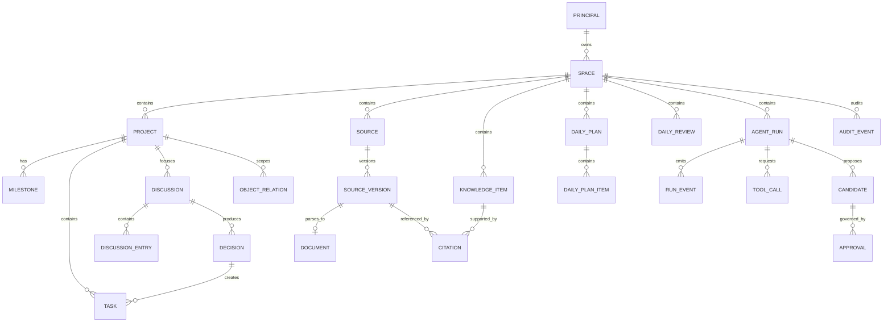

# 个人上下文智能工作台：领域模型与数据字典

> 版本：V1.5  
> 日期：2026-08-25  
> 状态：已确认（确认门 G3 通过）  
> 确认记录：2026-08-24，B1–B12 全部采用推荐方案  
> 前置：G1、G2、G3 已通过  
> 适用范围：MVP 本机单用户、合成数据验证  
> 后续：以本文为核心对象语义真源，生成正式 Schema、迁移、Repository 与 API 契约

## 0. G3 数据决策清单

| 决策 ID | 决策主题 | 已确认方案 | 被放弃方案与影响 |
|---|---|---|---|
| B1 | 对象 ID | **UUIDv7 文本，创建后不可变；外部来源 ID 另存** | UUIDv4 可用但缺少时间有序性；不确认会阻塞主键与事件游标 |
| B2 | 时间与并发 | **持久化 UTC ISO 8601 毫秒；显示用用户时区；对象 `version` 整数乐观锁** | Unix 整数更紧凑但可读性低；不确认会阻塞冲突协议 |
| B3 | 数据真源 | **原始资料/附件以文件为真源；结构化对象以 SQLite 为真源；索引均可重建** | 全文件或全数据库均扩大迁移范围；G2 已原则确认，本次固化到对象级 |
| B4 | 删除与恢复 | **业务对象软删除并保留 30 天；显式清空为 L4；审计保留删除事件** | 立即物理删除不可恢复；永久软删持续占用空间 |
| B5 | 关系建模 | **核心从属关系用外键；跨域关联用统一 `object_relations` 并限定类型** | 每类关系单独表更严格但扩展慢；纯图关系不利于事务约束 |
| B6 | 来源与知识 | **Source、SourceVersion、Document、KnowledgeItem、Citation 分离** | 合并成 Note 会丢失版本、证据和定位语义 |
| B7 | AI 产物回写 | **KnowledgeCandidate 与 Approval 分离；候选获批后创建/更新知识条目** | 直接写入会污染知识真源；把审批当候选会混淆治理和内容 |
| B8 | 事件一致性 | **领域写入、审计事件、Outbox 事件在同一事务提交** | 直接异步发事件可能出现“数据已写、事件丢失” |
| B9 | 迁移策略 | **顺序号 + checksum、升级前备份、默认只前向迁移；回退用恢复备份** | 可逆 down migration 对真实数据不一定安全 |
| B10 | 专业领域首版 | **科研/AI探索/前沿/学习以项目模板与少量扩展对象进入 P1，MVP 不复制 Project/Task/Knowledge** | MVP 同时建全量专业表会拖慢垂直切片 |
| B11 | 导出一致性 | **JSON/Markdown 为带 manifest 的只读快照，不做文件与 DB 实时双写** | 双写会造成冲突和修复成本 |
| B12 | 身份预留 | **首版建立一个本地 owner principal 和默认 space，所有对象显式带 `space_id`** | 完全不建身份字段会阻塞权限与未来导入；首版不实现多用户登录 |

确认结果：B1–B12 全部按推荐项生效。后续改变保留期、ID、真源或迁移策略时必须新建 ADR 并同步上位文档。

---

## 1. 建模原则

1. **一个概念一个真源。** 项目对象不同时以 JSON 与 SQLite 作为权威数据。
2. **项目是通用业务底座。** 科研、AI 应用、前沿技术、学习提升使用 Project、Task、Source、KnowledgeItem，再附加专业对象。
3. **全局上下文是授权后的融合视图。** 它通过关系、检索和引用访问所有允许空间，不复制项目正文。
4. **来源与结论分开。** 来源版本可变化，知识结论必须记录引用和适用范围。
5. **AI 只生成候选。** 任何长期知识、任务、决策或外部动作都按策略走确认/审批。
6. **事件可追溯但不泄密。** 审计记录谁在何时对什么对象执行什么动作，不默认保存完整敏感正文。
7. **派生数据可重建。** 全文、向量、图谱布局、摘要缓存损坏时不影响业务真源。

## 2. 统一术语与聚合边界

| 聚合 | 根对象 | 聚合内负责 | 不负责 |
|---|---|---|---|
| 空间 | `Space` | 数据分区、默认策略、归档状态 | 用户登录、远程租户 |
| 项目 | `Project` | 项目元信息、阶段、里程碑、成员视图 | 复制知识正文 |
| 工作执行 | `Task` | 状态、优先级、截止、项目关联、完成记录 | 日历服务真源 |
| 讨论决策 | `Discussion` / `Decision` | 讨论条目、结论、依据、后续任务 | Agent 私有会话 |
| 内容来源 | `Source` | 来源身份、版本、文件/URL 元数据、解析状态 | 经确认的知识结论 |
| 知识 | `KnowledgeItem` | 规范标题、正文、类型、状态、引用 | 原始附件字节 |
| 计划复盘 | `DailyPlan` / `DailyReview` | 当日重点、执行快照、复盘与下一步 | 长期项目真源 |
| AI 治理 | `AgentRun` / `Candidate` / `Approval` | 运行、工具、候选、审批与检查点 | Runtime 内部状态真源 |
| 审计与交付 | `AuditEvent` / `OutboxEvent` | 可追溯写事件、可靠事件投递 | 业务正文备份替代品 |

### 2.1 关系总览



## 3. 全局字段约定

除纯连接表和追加事件外，结构化对象默认包含：

| 字段 | 类型 | 必填 | 规则 |
|---|---|---:|---|
| `id` | TEXT | 是 | UUIDv7，小写规范形式；不可修改 |
| `space_id` | TEXT | 是 | 所属空间；所有查询必须显式限定 |
| `created_at` | TEXT | 是 | UTC ISO 8601，毫秒精度 |
| `created_by` | TEXT | 是 | `principal.id`；系统任务用保留主体 |
| `updated_at` | TEXT | 是 | 每次有效修改更新 |
| `updated_by` | TEXT | 是 | 最后修改主体 |
| `version` | INTEGER | 是 | 从 1 开始；写入时携带期望版本 |
| `deleted_at` | TEXT/NULL | 否 | 软删除时间；正常查询默认排除 |
| `deleted_by` | TEXT/NULL | 否 | 执行删除主体 |

通用限制：

- 时间比较使用 UTC；UI 默认按 `Asia/Shanghai` 显示，后续可由个人设置覆盖。
- API 不接受客户端指定 `created_by/updated_by`。
- 用户可编辑字段与系统字段分离；未知字段拒绝而非静默保存。
- 标题去除首尾空白，正文保留原始换行；字段长度由契约限定。
- `metadata_json` 只用于低风险扩展，必须有大小上限和 JSON Schema；不得代替核心字段。

## 4. 核心数据字典

### 4.1 身份与空间

#### `principals`

| 字段 | 类型 | 约束/含义 |
|---|---|---|
| `id` | TEXT PK | 首版本地 owner 为安装时生成 ID |
| `kind` | TEXT | `local_owner`、`system_job`、`connector`、`runtime` |
| `display_name` | TEXT | 合成/本地显示名；不默认采集真实账号信息 |
| `status` | TEXT | `active`、`disabled` |
| `created_at` | TEXT | UTC |

#### `spaces`

| 字段 | 类型 | 约束/含义 |
|---|---|---|
| `id` | TEXT PK | UUIDv7 |
| `owner_id` | TEXT FK | 指向 `principals` |
| `name` | TEXT | 默认“个人工作台”；1–80 字符 |
| `classification` | TEXT | `personal_local`、`public_demo`；`company_restricted` 仅预留且默认禁用 |
| `default_ai_policy` | TEXT | 见安全设计中的模型访问策略 |
| `status` | TEXT | `active`、`archived` |
| 通用字段 | — | 不含 `space_id`，它本身是分区根 |

### 4.2 项目、任务、讨论与决策

#### `projects`

| 字段 | 类型 | 约束/含义 |
|---|---|---|
| `id` / `space_id` | TEXT | PK / FK |
| `name` | TEXT | 1–120 字符 |
| `summary` | TEXT | 0–2000 字符 |
| `template_type` | TEXT | `general`、`research`、`ai_exploration`、`frontier_tracking`、`learning` |
| `status` | TEXT | `draft`、`active`、`paused`、`completed`、`archived` |
| `start_date` / `target_date` | TEXT/NULL | 本地日期 `YYYY-MM-DD` |
| `context_policy` | TEXT | `project_only`、`space_allowed`；不能扩大空间权限 |
| `color_token` | TEXT | 设计令牌名，不存任意 CSS |
| 通用字段 | — | 含版本与软删除 |

#### `milestones`

| 字段 | 类型 | 约束/含义 |
|---|---|---|
| `project_id` | TEXT FK | 必须与自身 `space_id` 一致 |
| `title` | TEXT | 1–160 字符 |
| `status` | TEXT | `planned`、`active`、`completed`、`cancelled` |
| `target_date` | TEXT/NULL | 日期 |
| `sort_order` | INTEGER | 同项目内排序 |

#### `tasks`

| 字段 | 类型 | 约束/含义 |
|---|---|---|
| `project_id` | TEXT/NULL FK | 允许个人任务；关联时同空间 |
| `milestone_id` | TEXT/NULL FK | 所属里程碑 |
| `parent_task_id` | TEXT/NULL FK | 仅一层或通过查询限制深度；禁止环 |
| `title` | TEXT | 1–240 字符 |
| `description` | TEXT | Markdown，大小受限 |
| `status` | TEXT | `inbox`、`planned`、`in_progress`、`blocked`、`done`、`cancelled` |
| `priority` | TEXT | `low`、`normal`、`high`、`urgent` |
| `due_at` | TEXT/NULL | UTC；仅日期任务另设 `due_date` |
| `source_kind` | TEXT | `manual`、`discussion`、`decision`、`ai_candidate`、`import` |
| `completed_at` | TEXT/NULL | 进入 `done` 时写入 |

#### `discussions` 与 `discussion_entries`

| 表.字段 | 类型 | 约束/含义 |
|---|---|---|
| `discussions.project_id` | TEXT FK | 讨论必须聚焦项目 |
| `discussions.title` | TEXT | 1–200 字符 |
| `discussions.status` | TEXT | `open`、`resolved`、`archived` |
| `discussion_entries.discussion_id` | TEXT FK | 级联软删除视图，不物理级联正文 |
| `discussion_entries.author_kind` | TEXT | `principal`、`assistant`、`runtime` |
| `discussion_entries.body` | TEXT | Markdown；AI 内容标识 provenance |
| `discussion_entries.run_id` | TEXT/NULL FK | AI 生成时关联 Run |

#### `decisions`

| 字段 | 类型 | 约束/含义 |
|---|---|---|
| `project_id` / `discussion_id` | TEXT FK | 必须同空间；讨论可为空 |
| `title` | TEXT | 1–200 字符 |
| `statement` | TEXT | 已采用的决定，不写成未证实事实 |
| `rationale` | TEXT | 原因、证据和取舍 |
| `status` | TEXT | `proposed`、`accepted`、`superseded`、`withdrawn` |
| `supersedes_id` | TEXT/NULL FK | 替代链；禁止环 |
| `decided_at` | TEXT/NULL | 接受时写入 |

### 4.3 来源、文档、知识与引用

#### `sources`

来源是一个稳定逻辑身份，例如“某论文”“某网页”“某本地 Markdown”，不是解析后的正文。

| 字段 | 类型 | 约束/含义 |
|---|---|---|
| `kind` | TEXT | `file`、`web`、`paper`、`note`、`connector_item` |
| `title` | TEXT | 展示标题 |
| `canonical_uri` | TEXT/NULL | URL 或受控资源标识；本地不存绝对私人路径 |
| `origin` | TEXT | `manual`、`capture`、`import`、`connector` |
| `trust_level` | TEXT | `user_authored`、`trusted_source`、`external_untrusted` |
| `classification` | TEXT | `public`、`personal_local`、`restricted`；首版真实 restricted 不启用 |
| `latest_version_id` | TEXT/NULL | 指向成功版本；更新时同事务维护 |
| `status` | TEXT | `pending`、`ready`、`failed`、`archived` |

#### `source_versions`

| 字段 | 类型 | 约束/含义 |
|---|---|---|
| `source_id` | TEXT FK | 稳定来源 |
| `version_no` | INTEGER | 同来源唯一、递增 |
| `content_hash` | TEXT | SHA-256，校验字节与去重 |
| `storage_ref` | TEXT | 相对受控根目录的对象引用 |
| `mime_type` | TEXT | 允许列表 |
| `byte_size` | INTEGER | 非负并受导入上限限制 |
| `captured_at` | TEXT | 获取/导入时间 |
| `source_modified_at` | TEXT/NULL | 外部来源声明时间，不替代本地时间 |
| `parse_status` | TEXT | `pending`、`processing`、`ready`、`failed` |
| `error_code` | TEXT/NULL | 稳定错误码，不保存敏感正文 |

#### `documents`

Document 是某个 SourceVersion 的规范化可检索表示。

| 字段 | 类型 | 约束/含义 |
|---|---|---|
| `source_version_id` | TEXT UNIQUE FK | 一个版本最多一个规范文档 |
| `format` | TEXT | `markdown`、`plain_text`、`html_normalized` |
| `body_ref` | TEXT | 大正文使用相对文件引用；短正文是否内联由实现 Spike 决定 |
| `language` | TEXT/NULL | BCP 47，如 `zh-CN`、`en` |
| `parser_version` | TEXT | 用于重建和比较 |
| `block_map_json` | TEXT | 块 ID、字符偏移映射；有大小上限 |

#### migration 006 当前落地差异

首个受控切片只实现 `kind=markdown_upload`：`sources` 使用稳定逻辑 ID、可选同空间 Project、`current_version_number` 和 `ready` 状态；`source_versions` 保存 SHA-256、原始文件名、字节数、相对内容哈希引用与 `text/markdown`；`documents` 内联最多 1,000,000 字符的规范化可检索文本，并记录语言、哈希和索引时间。原始 Markdown 字节以哈希文件为真源，API 不返回 `storage_ref` 或绝对路径。

当前尚未实现同一 Source 的第二版本、`canonical_uri/origin/trust_level/classification`、解析 Job、block map 与 KnowledgeItem/Citation。设计字段继续保留，但不能描述为 migration 006 已存在。`context_search` 是可重建派生索引，通过触发器覆盖 Project、Task、Capture 与 Document；删除业务对象会同步移除检索投影。

#### migration 007 显式 ContextPackage 当前落地

`context_packages` 保存名称、明确用途、`active/archived` 持久状态、可选有效期、审计主体和乐观版本。`expired` 是根据 `expires_at` 计算的有效状态，不反向改写历史。`context_package_items` 只保存 `project/task/capture/document` 对象引用；Document 必须额外固定 `source_version_id + start_char + end_char`，非 Document 不允许伪造 locator。包内不保存 title、quote 或 body，读取时重新解析并将缺失、版本漂移、过期和归档项标记为排除。创建、加入、移除和归档均使用幂等键、版本锁、AuditEvent 和 OutboxEvent。

#### `knowledge_items`

| 字段 | 类型 | 约束/含义 |
|---|---|---|
| `kind` | TEXT | `note`、`claim`、`insight`、`summary`、`method`、`concept` |
| `title` | TEXT | 1–200 字符 |
| `body` | TEXT | Markdown |
| `status` | TEXT | `draft`、`verified`、`deprecated`、`archived` |
| `confidence` | TEXT | `unknown`、`low`、`medium`、`high`；不是统计概率 |
| `provenance` | TEXT | `user`、`imported`、`ai_approved` |
| `valid_from` / `valid_to` | TEXT/NULL | 有时效结论使用 |

#### `citations`

| 字段 | 类型 | 约束/含义 |
|---|---|---|
| `knowledge_item_id` | TEXT FK | 被支持的知识条目 |
| `source_version_id` | TEXT FK | 固定到版本，避免网页更新后漂移 |
| `locator_type` | TEXT | `page`、`block`、`char_range`、`section`、`timestamp` |
| `locator_json` | TEXT | 页码/块 ID/偏移等；Schema 校验 |
| `quote` | TEXT/NULL | 只保存必要短摘录，受版权和长度上限约束 |
| `relation` | TEXT | `supports`、`contradicts`、`context` |
| `verified_at` | TEXT/NULL | 人工或规则复核时间 |

#### `object_relations`

| 字段 | 类型 | 约束/含义 |
|---|---|---|
| `from_type` / `from_id` | TEXT | 允许类型白名单 |
| `relation_type` | TEXT | `references`、`supports`、`contradicts`、`derived_from`、`related_to`、`applies_to_project` |
| `to_type` / `to_id` | TEXT | 目标必须存在且同空间，除非未来显式跨空间授权 |
| `created_by_run_id` | TEXT/NULL | AI 提议关系的溯源 |
| 唯一约束 | — | `(space_id, from_type, from_id, relation_type, to_type, to_id)` |

### 4.4 计划与复盘

#### `daily_plans`、`daily_plan_items`、`daily_reviews`

| 表.字段 | 类型 | 约束/含义 |
|---|---|---|
| `daily_plans.plan_date` | TEXT | `YYYY-MM-DD`；同空间同日唯一 |
| `daily_plans.theme` | TEXT | 当日主题，可空 |
| `daily_plans.status` | TEXT | `draft`、`active`、`closed` |
| `daily_plan_items.task_id` | TEXT/NULL FK | 可引用任务，不复制任务状态真源 |
| `daily_plan_items.snapshot_title` | TEXT | 保留当日语境；任务标题变化不改历史 |
| `daily_plan_items.intent` | TEXT | 当日具体动作 |
| `daily_plan_items.result` | TEXT/NULL | 完成/阻塞摘要 |
| `daily_reviews.review_date` | TEXT | 同空间同日唯一 |
| `daily_reviews.summary` | TEXT | 用户确认的日终总结 |
| `daily_reviews.wins` / `blockers` / `next_focus` | TEXT | 结构化 Markdown 段落 |
| `daily_reviews.generated_from_run_id` | TEXT/NULL | AI 草稿来源；保存不等于自动确认 |

MVP migration 005 的当前落地范围更窄：`daily_plans` 只保存日期、版本和审计主体，`daily_plan_items` 只保存最多三条现有 Task 引用及顺序，`daily_reviews` 只保存用户明确填写的 `summary/wins/blockers/next_focus`。`theme/status/snapshot_title/intent/result/generated_from_run_id` 保留为后续设计字段，当前数据库中不存在，页面也不模拟这些能力。

### 4.4.1 Capture 收件箱落地边界

MVP migration 004 已建立 `captures`，仅接受 `text` 与 `link`：文本必须包含正文；链接必须是 HTTP(S) URI，且服务不发起网络请求。Capture 可选关联同空间 Project，状态为 `inbox/processed/archived`，使用版本锁、幂等键及 Audit/Outbox。Capture 不是 Source、Document 或 KnowledgeItem；“处理完成”不代表已导入、已验证或已成为长期知识。

### 4.5 Agent 运行、候选与审批

#### `agent_runs`

| 字段 | 类型 | 约束/含义 |
|---|---|---|
| `project_id` | TEXT/NULL FK | 可限定项目 |
| `runtime_key` | TEXT | `native`、`harness_poc`、`hermes_candidate` 等注册键 |
| `profile_key` | TEXT | 经评审的运行 Profile |
| `status` | TEXT | `queued`、`running`、`waiting_approval`、`succeeded`、`failed`、`cancelled` |
| `context_manifest_json` | TEXT | 只记录允许对象、版本、范围和策略；避免默认复制全文 |
| `started_at` / `ended_at` | TEXT/NULL | 生命周期时间 |
| `parent_run_id` | TEXT/NULL FK | 子运行；所有 Run 仍只有一个主 Runtime |
| `checkpoint_ref` | TEXT/NULL | 受控检查点引用；不成为业务真源 |
| `error_code` | TEXT/NULL | 稳定错误码 |

Migration 008 的当前落地范围比上述目标模型更窄：`agent_runs` 绑定 `space_id + context_package_id + context_package_version + context_digest`，记录固定 Runtime/Profile 版本、目标、`max_steps`、`max_tool_calls=0/1`、生命周期时间、主体、乐观锁版本和安全错误码。状态暂不含 `waiting_approval`；`project_id/context_manifest_json/parent_run_id/checkpoint_ref` 尚未入库。`goal` 保存在 Run 主记录用于用户查看，但不复制进 `run_events`。ContextPackage 正文、用途和引用摘录不写入 Runtime 事件。

#### `run_events` 与 `tool_calls`

| 表.字段 | 类型 | 约束/含义 |
|---|---|---|
| `run_events.run_id` | TEXT FK | 所属运行 |
| `run_events.seq` | INTEGER | 同 Run 单调递增，支持 SSE 恢复 |
| `run_events.event_type` | TEXT | 统一事件白名单 |
| `run_events.payload_json` | TEXT | 脱敏、大小上限、版本化 |
| `tool_calls.tool_key` | TEXT | Tool Gateway 注册键 |
| `tool_calls.action_level` | TEXT | `L0`–`L4` |
| `tool_calls.arguments_digest` | TEXT | 默认保存摘要；必要参数单独受控 |
| `tool_calls.status` | TEXT | `requested`、`approved`、`running`、`succeeded`、`failed`、`cancelled` |
| `tool_calls.idempotency_key` | TEXT | 写工具必填并唯一 |
| `tool_calls.approval_id` | TEXT/NULL FK | 需要确认时关联 |

Migration 009 已建立 `tool_calls/candidates/approvals`。ToolCall 只保存参数 digest、状态、稳定错误码及 Candidate/Approval 引用，不保存候选正文；Task Candidate proposal 只在 Candidate 中保存，批准范围用 SHA-256 digest 绑定。当前 Candidate 仅支持 task，Approval 仅支持 L2 且同一 Candidate 一个审批；应用后创建的 Task 标记 `source_kind=ai_candidate`。

Migration 010 已建立 `run_checkpoints` 并为 `agent_runs` 增加 `retry_of_run_id`。Checkpoint 只保存事件序号、Run 版本/状态、Context digest、已完成 ToolCall ID、Candidate ID 与可选 opaque runtime ref，不复制 Prompt、来源正文或密钥。服务重启后遗留 queued/running Run 收敛为 `RUNTIME_RECOVERY_REQUIRED`，安全重试创建新 Run 并保留谱系，不改写原失败记录。

#### `candidates`

| 字段 | 类型 | 约束/含义 |
|---|---|---|
| `run_id` | TEXT/NULL FK | 生成来源；手工草稿可空 |
| `candidate_type` | TEXT | `knowledge`、`task`、`decision`、`memory`、`relation`、`external_action` |
| `target_type` / `target_id` | TEXT/NULL | 更新已有对象时使用 |
| `proposal_json` | TEXT | 经过 Schema 校验的拟议变更 |
| `diff_json` | TEXT | 面向用户的字段级差异 |
| `status` | TEXT | `pending`、`approved`、`rejected`、`expired`、`applied`、`failed` |
| `expires_at` | TEXT/NULL | 高时效候选可过期 |

#### `approvals`

| 字段 | 类型 | 约束/含义 |
|---|---|---|
| `subject_type` / `subject_id` | TEXT | Candidate、ToolCall 或其他受控动作 |
| `action_level` | TEXT | `L1`–`L4` |
| `requested_by` | TEXT | principal/runtime |
| `reason` | TEXT | 为什么需要动作及影响范围 |
| `status` | TEXT | `pending`、`approved`、`rejected`、`expired`、`cancelled` |
| `resolved_by` / `resolved_at` | TEXT/NULL | 仅 owner 可批准首版高风险动作 |
| `decision_note` | TEXT/NULL | 可选说明 |
| `scope_digest` | TEXT | 防止批准后参数被替换 |

### 4.6 审计、可靠投递和幂等

#### `audit_events`

| 字段 | 类型 | 约束/含义 |
|---|---|---|
| `id` / `space_id` | TEXT | UUIDv7 / 分区 |
| `occurred_at` | TEXT | UTC，不允许业务代码修改 |
| `actor_id` / `actor_kind` | TEXT | 谁执行 |
| `action` | TEXT | 稳定动作名，如 `task.update` |
| `object_type` / `object_id` | TEXT | 目标 |
| `request_id` / `run_id` | TEXT/NULL | 调用关联 |
| `outcome` | TEXT | `allowed`、`denied`、`failed`、`succeeded` |
| `reason_code` | TEXT/NULL | 权限/错误原因 |
| `change_digest` | TEXT/NULL | 脱敏差异摘要，不默认存正文 |
| `previous_hash` / `event_hash` | TEXT | 本地防意外篡改链，不声称抵抗本机管理员 |

#### `outbox_events`

| 字段 | 类型 | 约束/含义 |
|---|---|---|
| `aggregate_type` / `aggregate_id` | TEXT | 来源聚合 |
| `event_type` / `event_version` | TEXT/INTEGER | 版本化领域事件 |
| `payload_json` | TEXT | 最小事件数据 |
| `status` | TEXT | `pending`、`delivering`、`delivered`、`failed` |
| `attempt_count` / `next_attempt_at` | INTEGER/TEXT | 重试 |
| `created_at` / `delivered_at` | TEXT | 时间 |

#### `idempotency_keys`

保存 `principal + route/command + key`、请求摘要、响应摘要、状态和过期时间。相同键不同请求摘要必须返回冲突；失败重试不得重复创建对象。

## 5. 状态机与不变量

### 5.1 项目与任务

```text
Project: draft → active ↔ paused → completed → archived
                         └────────→ archived

Task: inbox → planned → in_progress → done
                ↘          ↕
                 cancelled  blocked
```

- `completed/archived` 项目仍可读；新增任务前需重新激活。
- `done` 任务可重新打开到 `in_progress`，必须记录审计和清空 `completed_at`。
- 删除父任务不能静默删除未完成子任务；需先迁移、取消或显式确认级联影响。

### 5.2 Candidate 与 Approval

```text
Candidate: pending → approved → applied
                    ↘ rejected
                    ↘ expired
                    ↘ failed（可修复后生成新候选）

Approval: pending → approved | rejected | expired | cancelled
```

- Approval 只批准 `scope_digest` 对应的精确动作。
- 候选内容变化后必须创建新审批，旧批准不可复用。
- `approved` 不代表已应用；应用失败必须保留失败状态并允许安全重试。

### 5.3 Source 导入

```text
pending → processing → ready
                    ↘ failed → processing（显式重试）
```

- 文件先进入暂存目录，校验类型、大小、哈希后再原子发布并提交元数据。
- 数据库提交失败不得留下可见的“ready”文件；孤儿暂存由修复任务清理。

## 6. 专业工作台扩展（P1）

专业模块不复制核心表，只补充不可用通用对象清晰表达的字段：

| 专业对象 | 关联核心对象 | 用途 |
|---|---|---|
| `research_questions` | Project、KnowledgeItem | 研究问题、假设、评价标准 |
| `experiments` | Project、Task、Source | 实验方案、变量、运行与结果引用 |
| `research_claims` | KnowledgeItem、Citation | 主张、支持/反证、证据强度 |
| `ai_opportunities` | Project、Source | AI 需求、用户痛点、价值/可行性假设 |
| `ai_experiments` | Project、Experiment | Prompt/模型/工具版本及评测结果 |
| `radar_items` | Source、KnowledgeItem | 前沿主题、信号、成熟度和复核日期 |
| `learning_tracks` | Project | 英语等学习方向、目标与能力框架 |
| `learning_sessions` | Task、Source | 学习记录、练习类型、反馈与复习计划 |
| `habit_logs` | DailyPlan/Review | 健身、作息等最小打卡；首版不采集医疗数据 |

表结构在核心垂直切片稳定后单独评审；首期页面可使用项目模板和 KnowledgeItem 类型演示，但必须标注为“设计/原型”，不能声称上述表已实现。

## 7. 本地存储布局

以下均为应用数据根目录下的相对路径，不将真实绝对私人路径写入数据库、日志或文档：

```text
.workbench/
├── data/
│   └── workbench.db
├── content/<space_id>/sources/<source_id>/<version_id>/...
├── attachments/<space_id>/<object_type>/<object_id>/...
├── derived/fts/                 # 如需外置，可重建
├── staging/                     # 导入中间态，不进入备份正式清单
├── exports/<export_id>/
└── backups/<backup_id>/
```

- 业务只持有对象 ID 和相对 `storage_ref`。
- `storage_ref` 解析后必须仍位于允许根目录，拒绝 `..`、绝对路径、设备路径和符号链接逃逸。
- 数据库、内容文件和 manifest 构成一致备份；密钥、会话令牌、缓存和暂存目录不进入备份。

## 8. 迁移、备份与恢复

### 8.1 迁移记录

`schema_migrations` 至少包含 `version`、`name`、`checksum`、`applied_at`、`app_version`。启动时：

1. 检查数据库完整性和 migration checksum；
2. 发现未知新版本时拒绝以旧应用写入；
3. 升级前创建一致备份并验证 manifest；
4. 在事务允许范围内执行顺序迁移；
5. 失败后停止启动并给出恢复入口，不伪装成功。

### 8.2 备份 manifest

至少记录 Schema 版本、应用版本、创建时间、数据库文件、内容文件清单、大小、SHA-256、完成状态。恢复先到新目录验证，再通过受控切换启用；不在原目录上覆盖式试恢复。

### 8.3 删除与保留

- 普通删除进入回收状态，默认 30 天可恢复。
- 到期物理清理由本地 Job 执行并写审计；文件与行均需处理。
- SourceVersion 被 Citation 引用时，普通清理不得删除；先解除/迁移引用或执行带影响清单的 L4 清除。
- AuditEvent 不因业务对象删除而删除对象标识，但应避免保存已删除正文。

## 9. G3 后需生成的契约

确认后按本文件生成而不是手工分叉维护：

1. SQLite migration 001 与约束/索引；
2. Repository 接口与契约测试；
3. Zod Command/Query/Event Schema；
4. OpenAPI 与错误码表；
5. Type/Status 常量和状态机测试；
6. 合成 fixture、备份/恢复 fixture；
7. 数据字典版本化导出。

## 10. 验收标准

| 编号 | 验收内容 |
|---|---|
| DM-01 | 任一核心对象有唯一 ID、空间、版本、生命周期和真源 |
| DM-02 | 项目模板不复制 Task、Source、KnowledgeItem 等核心对象 |
| DM-03 | 来源版本和引用可定位到固定内容版本 |
| DM-04 | AI 候选未获批不能改变长期知识或业务对象 |
| DM-05 | 同一写命令重放不产生重复对象，冲突返回可解释错误 |
| DM-06 | 跨空间外键/关系、环形父任务和无效状态迁移被拒绝 |
| DM-07 | 导入失败无可见假成功，可修复暂存与悬挂元数据 |
| DM-08 | 备份恢复后对象数、文件哈希、Schema 和引用一致 |
| DM-09 | 删除可在 30 天内恢复；到期清理不破坏仍被引用来源 |
| DM-10 | FTS/向量/布局删除后可由真源重建 |

## 11. G3 确认结果

- 确认日期：2026-08-24；
- 最终决定：B1–B12 全部采用本文推荐方案；
- 生效范围：核心对象、ID、时间/版本、数据真源、删除、关系、来源/引用、AI 候选、Outbox、迁移、专业扩展、导出和首版本地身份；
- 当前实现：migration 001–010 已落地基础身份/空间、项目工作流、Capture、DailyPlan/Review、Source/SourceVersion/Document/索引、ContextPackage、AgentRun/RunEvent、ToolCall/Candidate/Approval、RunCheckpoint 与重试谱系；所有写切片共用 AuditEvent、OutboxEvent 和 IdempotencyKey；
- 已证明：UUIDv7、空间过滤、版本冲突、同项目复合外键、一层父任务、人工讨论转换的多对象原子事务、事务回滚、幂等重放/冲突/到期复用、软删除/恢复、重启持久化和 migration checksum；
- 尚未实现：KnowledgeItem/Citation/Answer、其他 Candidate/Tool、Runtime 私有 resume/steer，以及完整备份/恢复工具；
- 下一步：在不改变 Workbench 真源与审批边界的前提下，准备 Harness 只读隔离 POC 证据。
