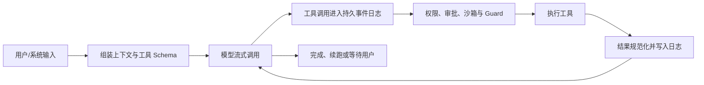
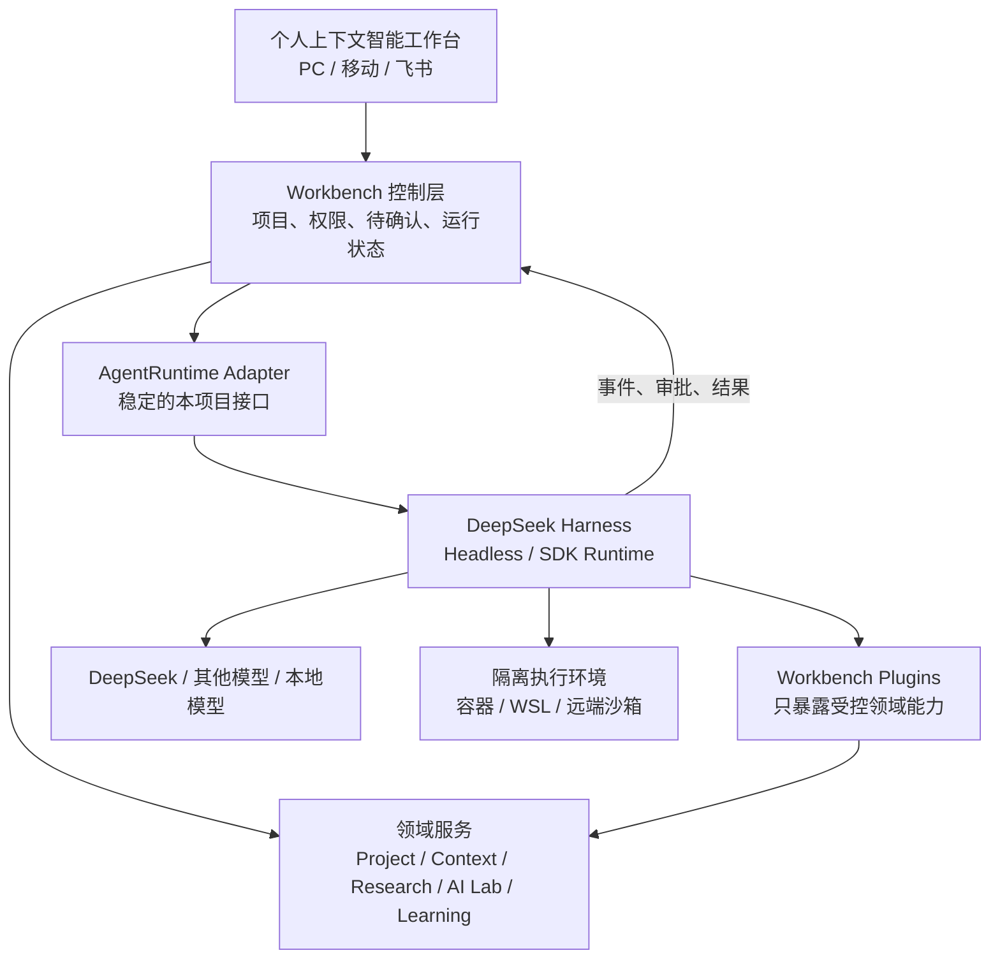

# DeepSeek Harness 对个人上下文智能工作台的适用性评估

> 评估日期：2026-08-18  
> 评估对象：DeepSeek 官方 `deepseek-ai/deepseek-harness`  
> 评估类型：架构与产品适配性预研，未安装、未运行、未接入真实数据  
> 决策建议：**有条件采用——作为可替换的 Agent 执行层开展隔离 POC，不替换现有产品、项目数据与知识库。**

## 1. 执行结论

DeepSeek Harness 与当前方案高度互补，但不是同一类产品。

- 当前“个人上下文智能工作台”负责用户界面、项目管理、知识组织、科研/AI/学习业务模型、权限空间与移动入口；
- DeepSeek Harness 负责 Agent 的会话循环、模型调用、工具执行、沙箱、审批、任务续跑、子 Agent、工作流和运行日志；
- 因此它适合被放在系统的“AI 执行层”，不适合直接替换 Workbench 前端、个人知识库或项目管理域。

推荐采用方式：

1. 保留现有天蓝色 Workbench UI 和全部产品对象；
2. 在后端定义稳定的 `AgentRuntime` 适配接口；
3. 将 DeepSeek Harness 作为首个可选实现，通过 TypeScript SDK/stdio JSON-RPC 驱动；
4. 只暴露少量受控 Workbench 插件工具；
5. 先做只读研究和低风险草稿 POC，通过安全、可恢复和可追溯验收后再扩大范围。

不建议：直接 fork DeepSeek Harness 并把业务代码写入其核心、用它的 Web UI 替换现有产品、或在当前开发者预览阶段让其直接访问全部个人/公司资料。

## 2. 项目身份与成熟度

### 2.1 已核实事实

| 项目 | 状态 |
|---|---|
| 官方仓库 | `deepseek-ai/deepseek-harness` |
| 官方定位 | 开源 Agent Harness；“Everything is a Plugin” |
| 底层框架 | Cordis，可逆副作用与动态插件组合 |
| 技术栈 | TypeScript monorepo；Node `^22.19.0` 或 `>=24`；pnpm 11 |
| 当前版本 | 根包 `0.1.0-rc.7` |
| 许可证 | MIT |
| 产品形态 | Web UI、Headless、SDK、ACP、插件包 |
| 官方状态 | Developer Preview，明确提示存在破坏性兼容变更 |
| 首次公开时间 | GitHub 元数据为 2026-08-13 |

截至 2026-08-18，GitHub API 显示约 15.8 万 Star 和 1.6 万 Fork，传播速度很快，但项目公开时间不足一周。热度证明关注度，不证明 API 稳定性、长期维护质量或生产安全性。

### 2.2 成熟度判断

优势：

- 仓库模块化程度高，文档、类型、测试、生成目录和插件边界较完整；
- 核心能力不是 Demo 拼装，已形成会话、工具、审批、沙箱、工作流、SDK 等成体系包；
- 官方对失败关闭、事件重放、资源清理和 Windows ACL 边界有明确技术说明；
- MIT 许可证便于内部试验和商业项目评估。

风险：

- Developer Preview + RC 版本，接口和配置可能频繁变化；
- 公开仓库时间过短，缺少足够的长期故障、升级和生态兼容证据；
- GitHub Issues 和 Pull Requests 当前未开放，主要通过 Discussions 反馈，常规工程治理可见度有限；
- 大型 monorepo 和 Cordis 元框架有明显学习与维护成本；
- “动态安装/运行模型编写插件”能力很强，也放大了供应链和运行时自修改风险。

## 3. 核心架构

### 3.1 一切皆插件

模型适配器、工具注册、Agent Loop、会话日志、沙箱、审批和 UI 均通过 Cordis 插件挂载。配置以 Profile、Bundle 和 Patch 分层组合；插件卸载时，框架会撤销其注册的副作用。

这意味着项目不是一个固定 Agent，而是“组装 Agent 运行时的元框架”。

### 3.2 Agent 执行闭环

其工具流水线在执行前经过 hooks、权限、审批、沙箱与单调 Guard；拒绝或审批不可用时跳过工具体。执行结果被规范化后再生成唯一模型可见结果。

### 3.3 事件溯源式会话

会话使用追加式事件日志，保存用户消息、模型消息、流式 chunk、工具调用/结果、审批、目标、计划和状态等。模型历史、UI 回放、Fork、Resume 和遥测由日志投影产生。

这一点与本产品的“可审计运行历史”高度匹配，也比目前 Workbench 中分散的 Vite API 状态更适合作为长任务运行记录。

### 3.4 主要能力包

| 能力 | DeepSeek Harness 包/机制 | 对本项目的价值 |
|---|---|---|
| 模型抽象 | LLM seam、DeepSeek 与多供应商适配器 | 支撑模型管理和按空间路由 |
| 工具执行 | scoped tool registry、前后置流水线 | 将知识检索、项目与科研能力变成受控工具 |
| 会话与回放 | JSONL/SQLite、事件投影、Fork/Resume | 对应运行历史和任务续跑 |
| 用户审批 | Approval、permission presets、questions | 对应待确认中心和人机协作 |
| 沙箱 | Linux/macOS/Windows 后端 | 限制代码与命令写入范围 |
| 计划与目标 | plan、goal、todo | 支撑长任务分解和可见进度 |
| 后台任务 | jobs、schedule、workflow | 支撑深度研究、批处理和定期简报 |
| 子 Agent | subagent provider | 分派文献、代码、竞品等独立子任务 |
| Skills/MCP | skill registry、MCP client | 复用外部工具生态 |
| 外部驱动 | TypeScript SDK + stdio JSON-RPC | 允许 Workbench 独立控制运行时 |
| Web UI | 自带浏览器界面 | 适合调试，不建议作为最终产品 UI |
| 运行时扩展 | 动态插件检查、挂载与撤销 | 适合实验室，不应在首期生产开放 |

## 4. 与现有项目的关系

### 4.1 当前项目已有能力

当前 Workbench 以 React/Vite 为前端，通过本地 Vite 插件提供 Vault 索引、Markdown/图书/素材阅读、阅读批注、Wiki 导入、搜索、知识图谱、社媒洞察与工作流任务等 API。原型又增加了项目、科研、AI Lab、前沿、学习和计划页面。

它的优势是产品模型和个人知识体验；不足是缺少一个统一、持久、可替换、可审批的 Agent 运行时。

### 4.2 适配矩阵

| 领域 | 适配度 | 判断 |
|---|---|---|
| 多步 Agent Loop | 高 | 可直接补齐当前项目的执行引擎空缺 |
| 工具/插件体系 | 高 | 可把本项目 API 以插件方式暴露给 Agent |
| 审批与运行日志 | 高 | 能支撑 Spec 中 `G-08/G-09/S-04` |
| 长任务、续跑与子 Agent | 高 | 适合深度研究、AI 开发和批量调研 |
| 沙箱与文件执行 | 中高 | 架构完整；Windows 仅 partial enforcement，需要加强隔离 |
| 多模型管理 | 中高 | 有 DeepSeek 和多供应商适配器，但仍需本项目空间策略 |
| 项目管理 | 低 | Harness 只有运行目标/计划，不是业务项目管理系统 |
| 个人上下文知识库 | 低 | 有会话和检索能力，但不提供本项目的统一业务知识模型 |
| 科研/AI/学习业务对象 | 低 | 需由本项目定义并作为插件工具提供 |
| 移动端/飞书/微信 | 低 | 不是现成能力，仍需连接器和产品层 |
| 现有 UI 复用 | 中 | 可通过 SDK/事件接入，但不能直接复用其内部 UI 组件 |

### 4.3 工程兼容性

- 当前 Workbench 与 Harness 都运行在 Node/TypeScript 生态；本地已使用 Node 24，满足 Harness 的 Node 版本要求；
- 当前 Workbench 是 React 19 + Vite 6，Harness 也提供 Web 客户端，但两者不应合并构建；
- Harness 使用 pnpm 11 和大型 monorepo，直接加入现有 `node_modules` 会增加依赖冲突和构建负担；
- 最稳妥的边界是把 Harness 当作独立进程，通过官方 TypeScript SDK/stdio JSON-RPC 通信；
- 当前 `server/vite-plugin-workbench.mjs` 只适合本地开发 API，进入 POC 时应增加独立的 Runtime Gateway，不继续把 Agent 生命周期堆入 Vite 插件。

## 5. 推荐目标架构

### 5.1 必须保留在 Workbench 的能力

- 项目、目标、里程碑、讨论、决策和任务的业务真源；
- 个人上下文知识库及空间/权限；
- 科研 Claim—Evidence、AI 机会卡、学习方向等专业对象；
- 最终 UI、移动端、飞书/微信入口；
- 跨运行审计、数据保留、成本预算和连接器管理。

### 5.2 可交给 Harness 的能力

- 模型请求、流式消息和工具循环；
- 单次/长任务会话及 Fork/Resume；
- 工具调用审批和执行状态；
- 计划、Todo、后台 Job、子 Agent 和 Workflow；
- 沙箱中的代码、命令、文件和评测运行；
- 模型/工具错误重试和运行诊断。

### 5.3 Workbench 插件建议

首期只提供以下最小工具集：

| 插件 | 工具 | 权限 |
|---|---|---|
| `workbench-context-read` | 搜索上下文、读取对象、读取来源片段 | 只读 |
| `workbench-project-read` | 获取项目焦点、文档、讨论、任务 | 只读 |
| `workbench-research-read` | 读取文献、Claim、实验和证据 | 只读 |
| `workbench-draft-write` | 保存报告/计划/决策草稿 | L1 草稿 |
| `workbench-proposal` | 提议创建任务、知识或决策 | L2，必须确认 |
| `workbench-artifact` | 保存可追溯运行产物 | 受控写入 |

不在首期开放：删除、跨空间移动、外部发布、发消息、改权限、动态安装第三方插件和 Agent 自修改运行时。

## 6. 最适合落地的五个场景

### 6.1 项目深度研究

从项目焦点出发，检索个人上下文、论文和前沿资料，分派子任务，形成带引用报告和证据缺口。适配度最高。

### 6.2 科研证据审计

读取研究 Claim、文献和实验，检查每个结论的证据、反证和适用边界，只生成审阅意见和补充实验计划，不自动修改结论。

### 6.3 AI 应用原型与评测

在隔离工作区生成原型、运行测试、比较模型/提示词的质量、成本和延迟，并把结果回写为评测产物和决策草稿。

### 6.4 科技前沿周报

由外部调度触发 Harness Job，进行检索、事件聚类、来源核验和影响分析，最终由用户确认后发布到 Workbench 或飞书。

### 6.5 项目讨论收口

Agent 汇总讨论、证据和未决问题，输出选项、风险和推荐，但最终决策保持人为确认。

学习计划、日终复盘和习惯记录可以使用 Harness，但首期收益低于上述五个场景。

## 7. 主要风险与控制

### 7.1 兼容性风险

风险：开发者预览明确允许破坏性变更。

控制：

- 不依赖其 Web UI 内部组件；
- 通过本项目 `AgentRuntime` 接口隔离；
- 固定精确版本并保存协议回归样例；
- 不修改 Harness 核心，业务只写独立插件；
- 升级前运行录制回放和工具契约测试。

### 7.2 Windows 沙箱风险

官方 Windows ACL backend 明确报告 `partial`：它限制写入，但读取、网络和进程可见性不在该机制内；Everyone ACL 与硬链接也存在边界。

控制：

- Windows POC 仅使用无敏感信息的独立目录；
- 正式执行优先 WSL2 容器、Linux 远端沙箱或微虚拟机；
- 文件、网络和进程权限分别控制，不能把 `workspace-write` 当作完整安全边界；
- 公司资料运行时与个人资料运行时物理/逻辑隔离。

### 7.3 动态插件与供应链风险

风险：Harness 可以让模型检查并编写动态插件；第三方 `dsh-plugin` 也可能获得工具权限。

控制：

- 生产 Profile 移除 `extensions/tool-cordis` 等运行时自修改工具；
- 插件采用白名单、锁版本、代码审查和制品签名；
- 插件只能依赖稳定 Service Definition，禁止直接访问数据库凭据；
- 未识别工具一律拒绝。

### 7.4 事件日志的数据风险

风险：追加日志可能保存用户消息、工具参数、结果片段和审批信息。

控制：

- 日志按空间、项目和身份分区；
- 写入前进行密钥/隐私字段清洗；
- 工具大结果使用受控对象存储，日志保存引用；
- 定义保留期、导出、删除和审计策略；
- 公司空间禁止跨个人空间 Fork/Resume。

### 7.5 架构复杂度风险

风险：Cordis、插件树、事件瀑布和多包结构学习成本较高。

控制：只允许少数平台工程模块直接依赖 Harness；产品和领域服务只面向 `AgentRuntime` 与 Tool Contract。

## 8. POC 建议

### 8.1 阶段 A：独立冒烟验证（2–3 天）

- 在独立、无敏感数据目录运行官方 Web UI；
- 配置 DeepSeek 模型和一个测试工作区；
- 验证会话、文件读取、命令审批、Sandbox、Plan、Resume；
- 验证 Windows 上的实际 enforcement 报告和越界行为；
- 不连接当前 Workbench 数据。

### 8.2 阶段 B：只读集成（约 1 周）

- 实现 `AgentRuntime` 适配器；
- 通过 TypeScript SDK/stdio JSON-RPC 启动 Headless runtime；
- 注册三个只读 Workbench 工具；
- 在现有 AI 助手抽屉展示消息、工具步骤、引用和审批事件；
- 保存 Harness Session ID 与 Workbench Run ID 映射。

### 8.3 阶段 C：受控写入（约 1 周）

- 增加保存草稿和提议创建任务两个工具；
- L2 写入进入 Workbench 待确认中心；
- 增加撤销、幂等键、超时和失败恢复；
- 形成科研审阅和 AI 原型评测两个端到端案例。

### 8.4 POC 验收门槛

| 维度 | 通过条件 |
|---|---|
| 安全 | 20 个对抗性测试中无未授权文件/网络/空间访问 |
| 审批 | 所有 L2 以上动作都有可理解的确认记录；拒绝后无副作用 |
| 可恢复 | 进程重启后能恢复会话、计划和最终状态，不重复写入 |
| 可追溯 | 每条回答/草稿能关联输入范围、工具、来源和运行 ID |
| 可替换 | Workbench 业务代码不直接依赖 Cordis/DSH 类型 |
| 性能 | UI 流式反馈可接受，长任务可后台运行且可取消 |
| 升级 | 固定版本升级时契约回归测试能发现破坏性变化 |

停止条件：必须修改 Harness 核心才能接入、Windows/目标部署环境无法形成可信隔离、事件和权限无法映射、或两周内无法跑通“只读研究 + 待确认草稿”闭环。

## 9. 对现有 Spec 的建议调整

在用户确认采用 POC 后，再向产品 Spec 增加“Agent Runtime”能力组：

| ID | 功能 | 优先级 |
|---|---|---|
| AR-01 | 可替换 Agent Runtime 接口 | P0 |
| AR-02 | Profile/Agent Preset 与项目绑定 | P1 |
| AR-03 | 插件与工具白名单 | P0 |
| AR-04 | 持久运行事件与回放 | P0 |
| AR-05 | 工具审批与待确认映射 | P0 |
| AR-06 | 沙箱、网络和文件策略 | P0 |
| AR-07 | 后台 Job、取消与恢复 | P1 |
| AR-08 | 子 Agent 和 Workflow | P1 |
| AR-09 | 模型、Token、成本和错误诊断 | P1 |
| AR-10 | 插件版本、签名和供应链治理 | P0 |

它们增强已有 `G-07`、`G-08`、`G-09`、`G-10`、`S-02`、`S-03` 和 `S-04`，不新增一级导航。

## 10. 最终决策

### 建议：GO，但限定为隔离 POC

理由：

- 它补齐了当前项目最明显的技术空缺——统一 Agent 执行、审批、沙箱、任务续跑和事件审计；
- SDK 与插件边界允许保留现有产品和领域模型；
- 正式接入的主要风险可以通过 Adapter、固定版本、白名单插件和隔离运行时控制；
- 当前成熟度不足以支持直接成为不可替换的生产核心。

推荐决策表述：

> 将 DeepSeek Harness 列为个人上下文智能工作台的候选 Agent 执行引擎，先完成只读、隔离、可回退的技术 POC。Workbench 继续持有用户体验、业务对象、知识与权限真源。POC 通过安全、可恢复、可追溯和可替换验收后，再决定是否进入 MVP 技术基线。

## 11. 主要依据

- [DeepSeek Harness 官方仓库与 Developer Preview 说明](https://github.com/deepseek-ai/deepseek-harness)
- [官方架构文档：Cordis、Profile、事件和扩展点](https://github.com/deepseek-ai/deepseek-harness/blob/master/docs/architecture.md)
- [官方 Packages 目录：完整能力分组](https://github.com/deepseek-ai/deepseek-harness/blob/master/packages/README.md)
- [官方 Web UI 指南：工作区、工具、计划与审批](https://github.com/deepseek-ai/deepseek-harness/blob/master/docs/user/guide/index.md)
- [官方工具执行流水线](https://github.com/deepseek-ai/deepseek-harness/blob/master/docs/tool-execution-pipeline.md)
- [官方会话持久化事件目录](https://github.com/deepseek-ai/deepseek-harness/blob/master/docs/persistence-catalog.md)
- [官方 Sandbox 规范](https://github.com/deepseek-ai/deepseek-harness/blob/master/docs/subsystems/sandbox.md)
- [官方 Windows ACL Sandbox 边界](https://github.com/deepseek-ai/deepseek-harness/blob/master/packages/sandbox/sandbox-windows-acl/README.md)
- [官方外部进程 SDK 说明](https://github.com/deepseek-ai/deepseek-harness/blob/master/packages/sdk/README.md)
- [官方运行时自修改扩展说明](https://github.com/deepseek-ai/deepseek-harness/blob/master/packages/extensions/README.md)
- [Cordis 设计论文（预印本）](https://github.com/cordiverse/paper)

## 12. 2026-09-01 复核补充

- npm 当前 `@deepseek-ai/dsh` 为 `0.1.1-rc.2`，此前记录的 `0.1.0-rc.7` 仅代表 2026-08-18 的评估快照；
- 官方仍明确标记 Developer Preview 和兼容性破坏风险；
- 当前 SDK 使用换行分隔 stdio JSON-RPC，线协议为 `0.0.1`，且没有协议版本协商、单会话 cancel/close 或服务端审批请求；
- Workbench 已完成零依赖协议预检，但未下载/安装官方运行时；后续外部变更受 G6a 文档约束。

补充来源：[官方首页](https://deepseek.com/harness/en/)、[SDK Protocol](https://github.com/deepseek-ai/deepseek-harness/blob/master/packages/sdk/protocol/README.md)、[npm 包](https://www.npmjs.com/package/@deepseek-ai/dsh)。
