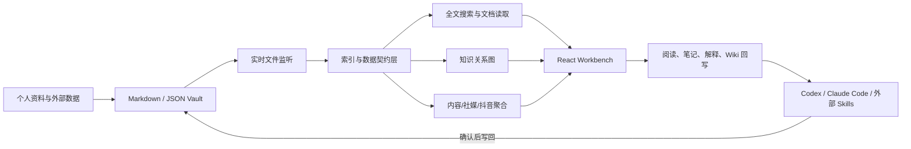
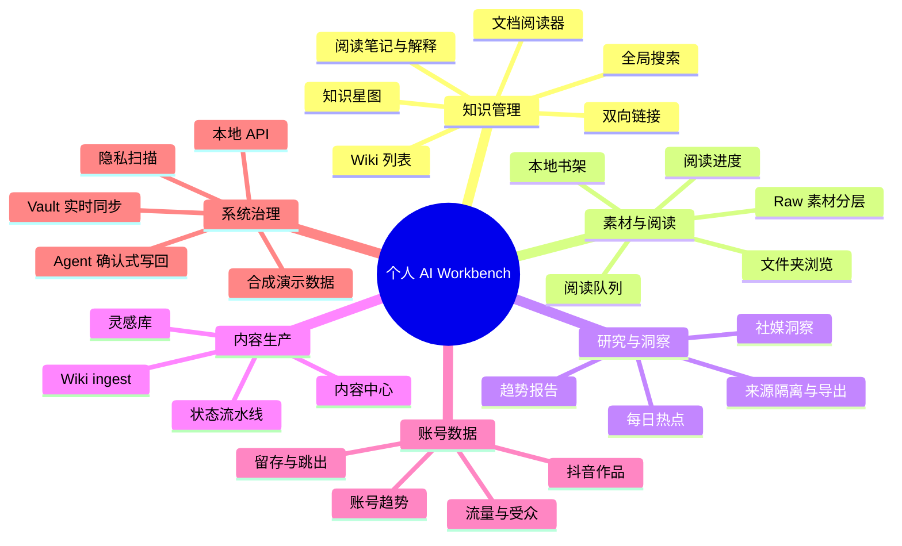
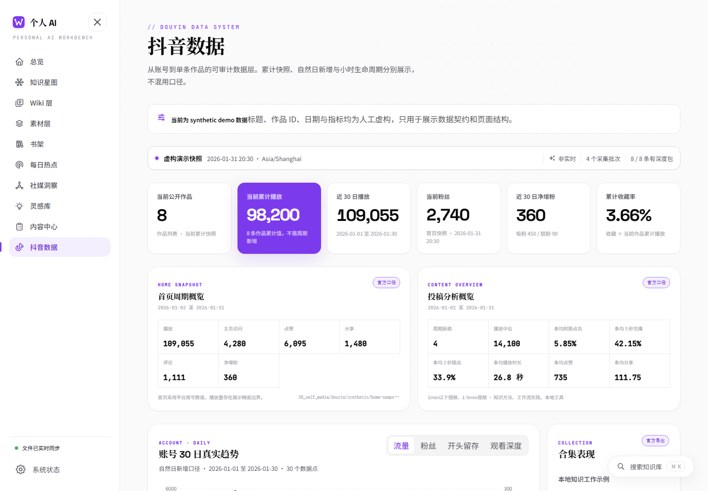
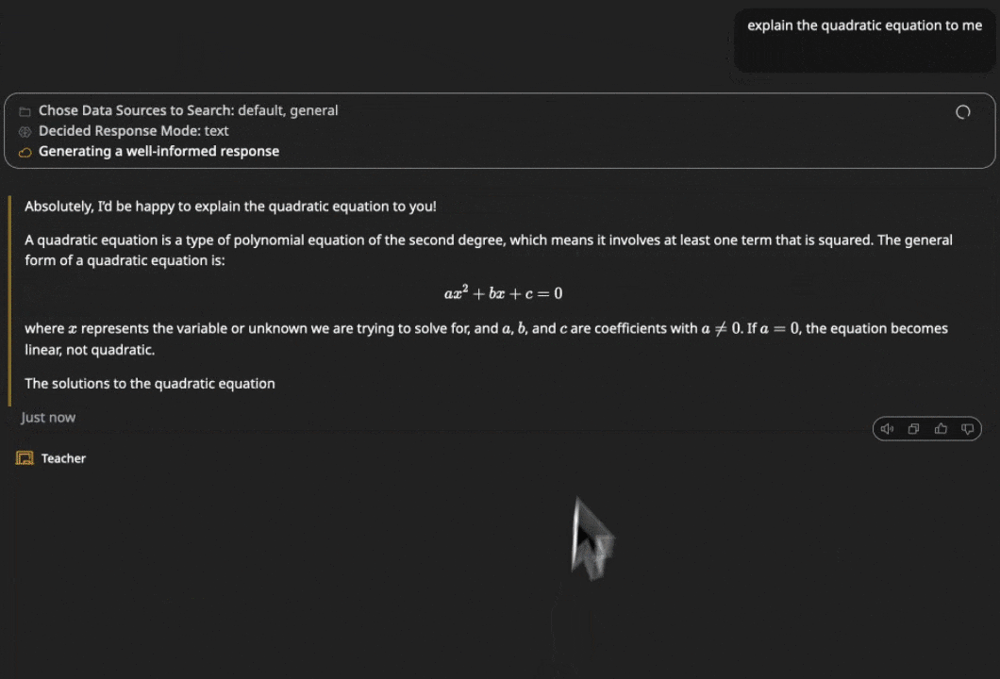
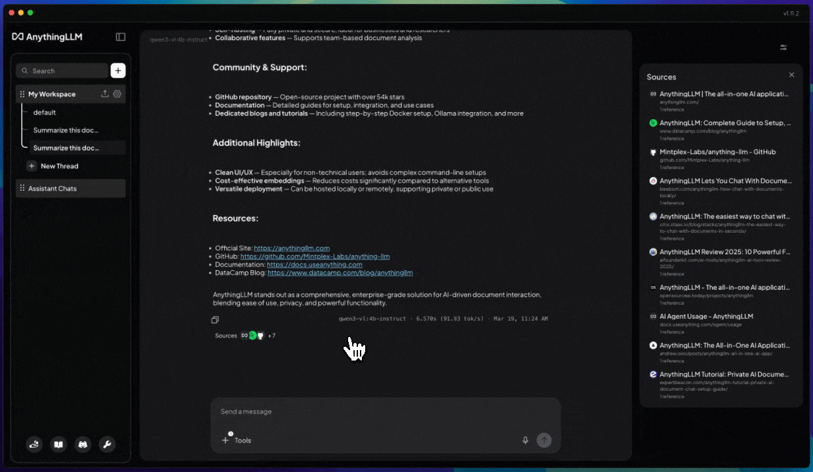
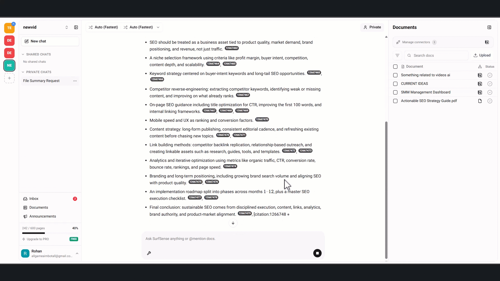
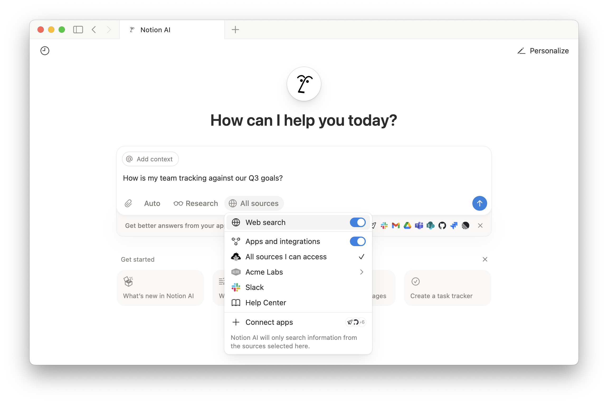
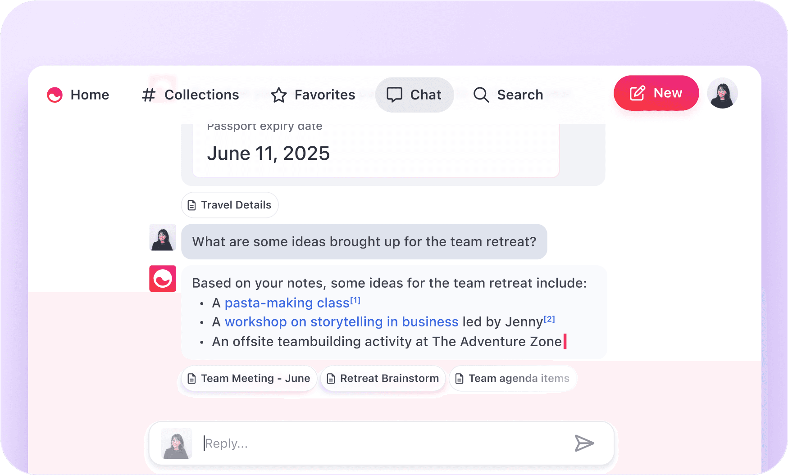
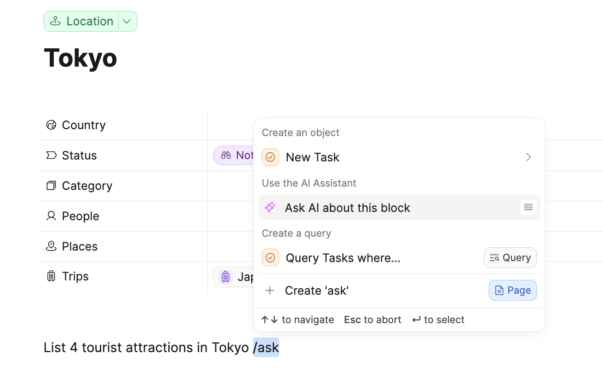
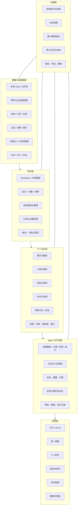

# 个人 AI 助手与个人知识库调研报告

> 研究与界面核验日期：2026-08-15（Asia/Shanghai）  
> 目标原型：[oyorf/person_dashboard](https://github.com/oyorf/person_dashboard)  
> 结论基于本地运行、源码审计、官方仓库、官方文档及官方产品页面。

## 一、结论先行

`person_dashboard` 已经是一个质量较高的“个人知识工作台前台”，但还不是完整的“个人 AI 助手”。它的优势是本地优先、Markdown 可移植、知识/素材/阅读/内容/社媒数据被放进同一视觉工作台，并且对真实数据、合成演示数据和隐私边界有清晰约束。它的主要缺口是：缺少统一助手入口、显式长期记忆、跨来源连接器、任务/提醒闭环、通用 Agent 工具权限模型和自动化编排。

最合理的建设方向不是推倒重做，也不是照搬一个开源聊天 UI，而是：

1. 保留 `person_dashboard` 的本地 Markdown Vault、实时索引、阅读器、知识星图与垂直仪表盘。
2. 借鉴 AnythingLLM 的本地 RAG/工作区/记忆/MCP，Khoj 的个人 Agent 与定时任务，SurfSense 的外部研究和引用链。
3. 借鉴 Notion AI 的“搜—研—做”统一入口、Mem 的主动召回、Capacities/Tana 的对象化知识和结构化行动。
4. 新增一层“可审计的个人记忆与 Agent 运行时”，让 AI 不仅能读，还能在明确授权后回写、建任务、提醒和调用工具。

一句话产品定位建议：

> 一个本地优先、证据可追溯、能记住个人上下文并在授权范围内行动的个人 AI 操作台。

## 二、评价框架

本报告用六个维度评价所有产品：

| 维度 | 核心问题 |
|---|---|
| 数据接入 | 能否接本地文件、网页、第三方应用、会议、多媒体与实时数据？ |
| 知识能力 | 是否支持全文/语义检索、引用溯源、图谱、结构化对象、阅读和回写？ |
| 记忆能力 | 是否区分对话、事实、偏好、人物、项目、任务和时效？能否查看、纠正、遗忘？ |
| Agent 能力 | 能否规划、调用工具、执行多步任务、定时运行、等待审批并写回结果？ |
| 产品体验 | 捕获、搜索、阅读、问答、创作、回顾、移动端是否连成一条工作流？ |
| 治理能力 | 是否本地优先、权限隔离、可审计、可备份、可导出，许可证是否适合复用？ |

## 三、目标项目 `person_dashboard` 分析

### 3.1 产品定位

仓库将自身定义为“本地优先、可被 AI Agent 调用并持续维护的个人知识库，以及它的可视化 Workbench”。公开仓库只含 synthetic demo，不含作者真实知识或账号数据。默认读取同级 `个人知识库/` Markdown Vault，也可通过 `PERSONAL_DASHBOARD_VAULT_ROOT` 指向外部 Vault。

它更接近“个人知识 OS 的可视化控制台”，而非聊天机器人：主导航直接呈现总览、知识星图、Wiki、素材、书架、每日热点、社媒洞察、灵感、内容生产、抖音数据与系统状态。

### 3.2 技术与数据架构

- 前端：React 19 + Vite 6，路由由 React Router 管理。
- 服务端：Vite 插件内嵌本地 API；`vault-index.mjs` 解析 Vault，`vault-sync.mjs` 监听文件变化并增量刷新。
- 数据：Markdown/JSON/本地图片为主，MiniSearch、gray-matter、Markdown AST 用于索引和渲染。
- 可视化：D3-force 知识图谱、Recharts 数据图表、GSAP/Motion 动效。
- AI 交接：阅读器可发起解释、笔记与 Wiki ingest；需要推理或登录态的任务交给 Codex/Claude Code/其他 Agent。
- 安全：默认只监听 `127.0.0.1`；本地写 API 做来源和路径校验；公开版隐藏 Brainstorm、运行档案和公众号等私有模块。

### 3.3 公开功能图

### 3.4 本地运行界面原型

#### Wiki 层：结构化知识的线性入口

界面直接展示概念/框架数量、条目类型、状态和更新时间，适合做知识清理、复核和进入文档阅读器的入口。

#### 知识星图：关系检索与邻域探索

图谱支持搜索、筛选、缩放、节点选择和邻域聚焦。优势是把 Wiki 双向链接变成可浏览结构；风险是图谱目前更适合探索，不适合作为唯一检索入口。

#### 抖音数据：个人外部账号的垂直仪表盘

页面区分累计快照、自然日新增和小时生命周期，明确标注 synthetic demo，避免把缺失值伪装成 0。这种“数据契约 + 来源口径 + 页面声明”非常值得保留。

### 3.5 运行与验证结果

| 检查 | 结果 |
|---|---|
| Node 环境 | 使用 Node 24.19.0，满足 Node 22+ 要求 |
| 依赖安装 | 成功，274 个包 |
| 生产构建 | 成功，7,408 个模块完成转换 |
| 自动化测试 | 142 项：139 通过、3 未通过 |
| 3 项原因 | Windows 当前权限不允许创建符号链接，测试在环境准备阶段报 `EPERM`；不是业务断言失败 |
| 隐私扫描 | 通过，未发现被拦截的个人标识或凭据赋值 |
| 本地监听 | `http://127.0.0.1:5173/`，符合 loopback-only 设计 |

构建还有一个非阻断提示：主 JavaScript 包约 1.48 MB（gzip 约 450 KB），后续可按路由做代码分割。

### 3.6 优势、缺口与风险

| 类型 | 判断 |
|---|---|
| 核心优势 | 本地优先；Markdown 可读可迁移；垂直页面丰富；来源/隐私边界清晰；能与代码型 Agent 协作 |
| 产品缺口 | 没有统一 AI 助手主页；缺显式长期记忆、任务中心、提醒和常驻 Agent；第三方连接器依赖外部 Skills |
| 技术缺口 | 检索以本地索引为主，缺通用 embedding/rerank；Agent 运行、权限和审计尚未成为统一平台层 |
| 体验缺口 | 总览偏展示，尚未把“今天该关注什么、AI 建议做什么、哪些等待确认”聚合成行动面板 |
| 许可证风险 | 根 LICENSE/README 为 MIT，但 `Workbench/README.md` 写“许可证尚未确认”，发布/复用前必须消除冲突 |

## 四、开源与 GitHub 项目调研

### 4.1 代表项目对比

GitHub 指标为 2026-08-15 实时核验值，仅作为社区成熟度信号。

| 项目 | 社区/许可 | 核心能力 | 最值得借鉴 | 主要局限 |
|---|---|---|---|---|
| [Khoj](https://github.com/khoj-ai/khoj) | 36.5k Stars；AGPL-3.0 | 私有文档+互联网问答、语义搜索、自定义 Agent、定时研究、通知、语音/图片、多端 | “第二大脑 + Agent + 自动化”一体化产品形态 | AGPL 对网络服务改造的开源义务较强；直接复用需法律评估 |
| [AnythingLLM](https://github.com/Mintplex-Labs/anything-llm) | 64.7k Stars；MIT | 桌面/自托管、文档 RAG、引用、工作区、记忆、定时任务、Agent Builder、MCP、多模型 | 本地 AI 运行时、模型/向量库抽象、工作区隔离、低门槛部署 | 知识组织较弱，核心体验仍以聊天和工作区为中心 |
| [SurfSense](https://github.com/MODSetter/SurfSense) | 15.9k Stars；Apache-2.0 + 部分 BSL-1.1 | 外部数据连接器、知识库、混合检索与引用、研究 Agent、报告/播客/幻灯片、自动化、MCP | “公开网络研究 → 引用证据 → 多格式交付物”完整链路 | 项目方向快速变化；许可证混合；自称尚未完全 production-ready |
| [Open WebUI](https://github.com/open-webui/open-webui) | 148.8k Stars；仓库自定义许可 | 模型中立聊天、Knowledge、Notes、Memory、Web Search、工具与管线、代码解释器 | 可扩展的自托管 AI 门户与权限化工具面 | 更像通用 AI 前端；个人知识生命周期与主动提醒不是核心 |

### 4.2 开源系统界面取证（3 页）

#### Khoj：来源选择 + 角色 Agent + 生成状态

来源：Khoj 官方仓库 README 演示。它把数据源、响应模式和 Agent 角色显式呈现，适合借鉴为“答案为何这样生成”的可解释状态栏。

#### AnythingLLM：工作区 + 引用侧栏

来源：AnythingLLM 官方发布演示。左侧隔离工作区/线程，右侧列出来源，主区保持对话，体现 RAG 产品的经典三栏布局。

#### SurfSense：聊天 + 文档集合 + 行内引用

来源：SurfSense 官方仓库演示。文档库与生成答案并置，行内引用保持证据链，适合研究和资料汇总。

### 4.3 对目标项目的开源复用建议

- 代码复用优先级：AnythingLLM（MIT）> Open WebUI（需逐条核对自定义许可）> SurfSense（混合许可）> Khoj（AGPL）。
- 产品借鉴优先级不等于代码复用优先级：Khoj 的定时 Agent、SurfSense 的研究交付链、Open WebUI 的工具系统都值得按接口重新实现。
- 不建议把 `person_dashboard` 替换为上述任一项目；它们的知识表现层和个人数据仪表盘都弱于当前原型。

## 五、商业软件调研

### 5.1 代表产品对比

| 产品 | 定位与商业形态 | 核心能力 | 最值得借鉴 | 主要局限 |
|---|---|---|---|---|
| [Notion AI](https://www.notion.com/help/notion-ai-faqs) | 云端协作工作区；AI 完整能力主要在 Business/Enterprise | Agent 可创建/编辑页面和数据库；企业搜索；连接器；Research Mode；会议转录与总结；文件生成 | 把“搜索、研究、创建、执行”放在一个入口；来源范围和模型可选择 | 云端依赖强；个人本地文件与隐私控制弱于本地方案；Business 官网当前为 $20/成员/月 |
| [Mem](https://mem.ai/) | AI 原生笔记与主动助理；个人订阅 | 语音/会议/网页捕获、自动组织、Collections、相关内容 Heads Up、自然语言搜索、Agent 主动检查与提醒 | 几乎不要求用户维护文件夹；把“该想起什么”做成产品能力 | 数据结构和可移植性不如 Markdown；主动 Agent 计划价格高，控制面需谨慎 |
| [Capacities](https://docs.capacities.io/reference/ai-assistant) | 对象化个人知识管理；基础免费、AI 属于 Pro | 自定义对象、属性/模板、多视图、Daily Notes、AI Chat、自动标签/集合/属性、图片分析、BYOK | 对象化知识、上下文 `@` 引用、AI 结果回写和对话本身也成为对象 | 主要是云同步产品；自动化与主动 Agent 能力弱于 Notion/Tana/Mem |
| [Tana](https://tana.inc/help/working-with-ai) | 图谱化 Outliner + AI 会议与工作流；订阅/额度制 | Supertags、知识图谱、搜索节点、会议转录、结构化总结/任务/决策、AI 命令与 MCP | 会议结束即生成结构化对象和行动项；类型系统强 | 学习成本高；额度与多产品线定价较复杂；本地优先性不足 |

### 5.2 商业系统界面取证（3 页）

#### Notion AI：统一 Agent 入口与来源范围

来源：[Notion 官方 AI 帮助中心](https://www.notion.com/help/notion-ai-faqs)。关键不是聊天框本身，而是 `Auto / Research / All sources` 与应用连接器共同构成意图和权限边界。

#### Mem：从个人笔记召回答案

来源：[Mem 官方产品页](https://mem.ai/)。界面把回答和被引用的相关笔记放在同一上下文中，突出“无需记住关键词”的个人召回体验。

#### Capacities：在结构化对象内直接调用 AI

来源：[Capacities 官方 AI Assistant 文档](https://docs.capacities.io/reference/ai-assistant)。AI 是对象编辑器中的动作，而不是孤立页面；这对个人知识库的“读—问—写回”非常关键。

## 六、统一能力矩阵

评分：● 强；◐ 有但非核心/需配置；○ 弱或缺失。该表评价产品默认重点，不代表理论可扩展上限。

| 能力 | person_dashboard | Khoj | AnythingLLM | SurfSense | Open WebUI | Notion AI | Mem | Capacities | Tana |
|---|:---:|:---:|:---:|:---:|:---:|:---:|:---:|:---:|:---:|
| 本地优先/自托管 | ● | ● | ● | ● | ● | ○ | ○ | ◐ | ○ |
| Markdown 可移植 | ● | ◐ | ◐ | ◐ | ◐ | ◐ | ◐ | ● | ● |
| 全文/语义检索 | ◐ | ● | ● | ● | ● | ● | ● | ● | ● |
| 引用与来源追溯 | ● | ● | ● | ● | ● | ● | ◐ | ◐ | ◐ |
| 知识图谱/关系 | ● | ◐ | ○ | ○ | ○ | ◐ | ◐ | ● | ● |
| 显式长期记忆 | ○ | ● | ● | ● | ● | ◐ | ● | ◐ | ◐ |
| 自定义 Agent | ◐ | ● | ● | ● | ● | ● | ● | ◐ | ● |
| 定时/事件自动化 | ◐ | ● | ● | ● | ◐ | ● | ● | ○ | ● |
| 任务与提醒闭环 | ◐ | ◐ | ◐ | ● | ◐ | ● | ● | ◐ | ● |
| 外部应用连接器 | ◐ | ◐ | ● | ● | ● | ● | ◐ | ◐ | ● |
| 阅读/知识回写 | ● | ◐ | ◐ | ● | ● | ● | ● | ● | ● |
| 垂直数据仪表盘 | ● | ○ | ○ | ◐ | ○ | ● | ○ | ◐ | ● |
| 隐私/审计可控 | ● | ● | ● | ◐ | ● | ◐ | ◐ | ◐ | ◐ |

## 七、建议的目标产品功能图

### 7.1 首页应从“展示总览”升级为“行动总览”

建议首页固定六块：

1. 今日承诺：日程、任务、会议准备和到期提醒。
2. AI 提醒：从笔记/会议中识别的未闭环承诺，显示证据来源。
3. 最近知识变化：新资料、待复核 Wiki、冲突信息和过期记忆。
4. 继续工作：上次阅读、研究、草稿、Agent 运行的恢复入口。
5. 主动简报：用户订阅的主题、账号与项目变化。
6. 等待确认：任何写文件、发消息、创建日程、删除或外发动作必须在这里批准。

### 7.2 统一助手入口

助手输入框至少提供三种显式模式：

- `问答`：只读检索个人知识，默认给引用。
- `研究`：允许检索个人知识与公开网络，输出来源、分歧和报告。
- `执行`：允许生成计划并调用工具，但外部写操作必须确认。

同时提供来源范围选择：当前文档、当前集合、整个 Vault、指定应用、公开网络。用户应能看到“这次用了哪些内容”，并一键排除敏感空间。

### 7.3 可管理的长期记忆

记忆不能只是不可见的 embedding。每条记忆至少需要：类型、原文/摘要、来源、创建时间、最后验证时间、置信度、敏感级别、适用范围、过期策略和删除入口。建议默认“候选记忆 → 用户确认 → 生效”，低风险偏好可自动写入但必须可回看。

## 八、分阶段建设路线

### Phase 0：固化当前基线（1–2 周）

- 统一许可证表述；记录仓库版本与数据契约。
- 修复/适配 Windows 符号链接测试策略。
- 按路由分包，减少首屏体积。
- 把现有 API、页面字段和 Vault 目录契约生成一份机器可读清单。

验收：构建、隐私扫描、核心跨平台测试全部绿；个人数据可在仓库外接入。

### Phase 1：可引用的个人知识助手（3–5 周）

- 新增统一助手页与全局浮层。
- 建立混合检索：MiniSearch 全文 + embedding + rerank。
- 回答展示块级引用，可直接打开原文位置。
- 支持当前文档/集合/Vault/公开网络的来源范围开关。
- 增加 Web Clipper/收件箱，先解决低摩擦捕获。

验收：针对 50–100 个个人问题建立评测集，引用正确率、可回答率和无依据拒答可量化。

### Phase 2：记忆、任务与今日闭环（4–6 周）

- 建立显式记忆对象及审阅台。
- 从会议/笔记提取人物、项目、承诺、日期和任务候选。
- 首页升级为行动总览；任务可完成、延期、忽略并回写来源。
- 接入一个日历和一个任务系统，保留本地任务兜底。

验收：用户能回答“我答应了谁什么、依据在哪、何时到期”，且能纠错和删除记忆。

### Phase 3：可审计 Agent 与自动化（5–8 周）

- 工具注册表采用 MCP/Skills；每个工具声明读写范围和风险级别。
- 支持计划、审批、运行、撤销/补偿、失败恢复和成本记录。
- 增加定时简报、项目周报、会前准备、会后回写等模板。
- 将社媒/抖音 Skills 统一纳入同一运行历史与数据质量门禁。

验收：所有外部写操作可追溯；失败不会制造假数据；重复执行具备幂等或补偿策略。

### Phase 4：多端与生态（后续）

- 移动快速捕获、语音、图片和离线队列。
- 加密同步或用户自托管同步。
- 插件/Skill 市场、模板和导入器。
- 可选团队空间，但个人空间与共享空间必须物理/逻辑隔离。

## 九、最终取舍建议

| 决策 | 建议 |
|---|---|
| 是否继续使用 person_dashboard | 是。保留为前台和本地知识层基线 |
| 是否直接 fork Khoj | 不建议；先借鉴产品能力，AGPL 复用需法律评估 |
| 是否复用 AnythingLLM | 建议优先评估其 MIT 许可下的模型/向量库/MCP/记忆抽象，不必替换 UI |
| 是否引入向量数据库 | Phase 1 引入轻量本地方案；先保留全文检索并做混合召回 |
| 是否先做更多仪表盘 | 否。当前仪表盘已足够证明展示能力，优先补“问答—记忆—行动”闭环 |
| 是否自动写入长期记忆 | 默认候选+确认；低风险偏好可自动但必须可查看、纠正、遗忘 |
| 是否第一版就接很多应用 | 否。先接浏览器剪藏、日历、任务三类高频入口，再扩展邮件和协作工具 |

## 十、主要官方来源

- [person_dashboard GitHub](https://github.com/oyorf/person_dashboard)
- [Khoj 官方文档](https://docs.khoj.dev/) 与 [GitHub](https://github.com/khoj-ai/khoj)
- [AnythingLLM 官方产品页](https://anythingllm.com/)、[文档](https://docs.anythingllm.com/) 与 [GitHub](https://github.com/Mintplex-Labs/anything-llm)
- [SurfSense 官方文档](https://www.surfsense.com/docs) 与 [GitHub](https://github.com/MODSetter/SurfSense)
- [Open WebUI Knowledge](https://docs.openwebui.com/features/workspace/knowledge/) 与 [Essentials](https://docs.openwebui.com/getting-started/essentials/)
- [Notion AI 官方说明](https://www.notion.com/help/notion-ai-faqs)、[Enterprise Search](https://www.notion.com/help/enterprise-search) 与 [定价](https://www.notion.com/pricing)
- [Mem 官方产品页](https://mem.ai/)、[Collections](https://help.mem.ai/features/collections) 与 [定价](https://get.mem.ai/pricing)
- [Capacities 产品说明](https://capacities.io/product)、[AI Assistant](https://docs.capacities.io/reference/ai-assistant) 与 [定价](https://capacities.io/pricing)
- [Tana AI](https://tana.inc/help/working-with-ai)、[Meetings](https://tana.inc/help/meetings) 与 [定价](https://tana.inc/pricing)

---

本报告中的目标项目截图来自本机运行的 synthetic demo；竞品截图来自各项目官方仓库演示或官方产品/文档页面。所有价格、功能和 GitHub 指标均可能变化，实际采用前应再次核验。
